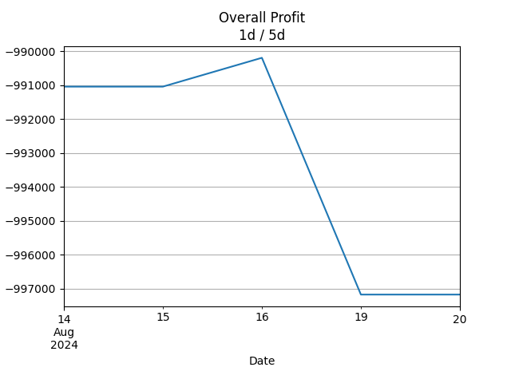
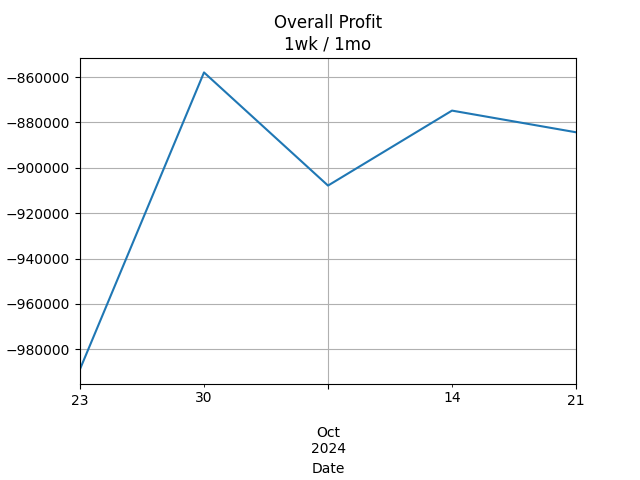
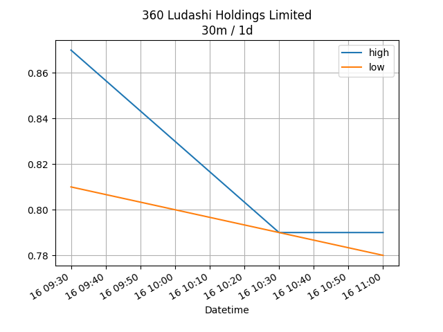
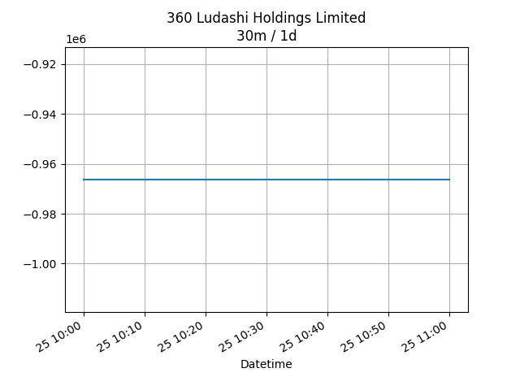
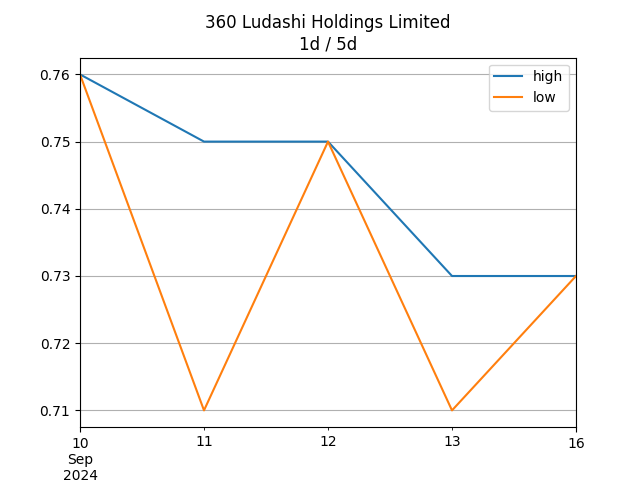
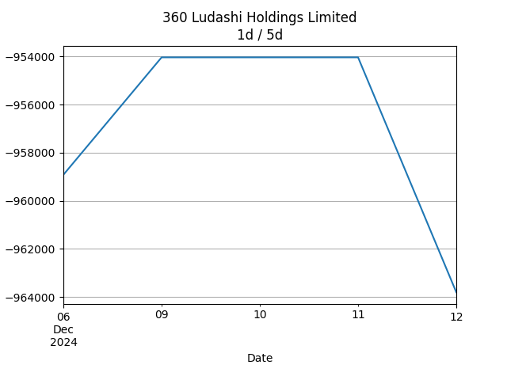
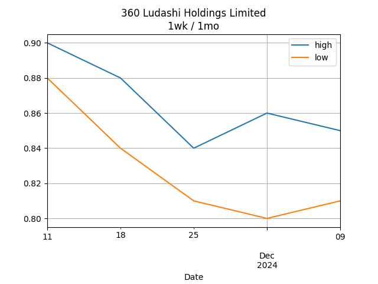
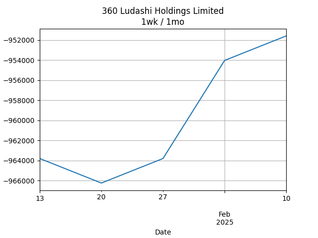

## Net Profit [📉]:
### $-897919.99
|type|graph|data|
|:---:|:---:|:---:|
|30m / 1d||<table border="1" class="dataframe"> <thead> <tr style="text-align: center;"> <th>Datetime</th> <th>profit</th> </tr> </thead> <tbody> <tr> <td>09:30</td> <td>-897919.99</td> </tr> </tbody></table>|
|1d / 5d||<table border="1" class="dataframe"> <thead> <tr style="text-align: center;"> <th>Date</th> <th>profit</th> </tr> </thead> <tbody> <tr> <td>2025-08-15</td> <td>-900359.99</td> </tr> <tr> <td>2025-08-18</td> <td>-900359.99</td> </tr> <tr> <td>2025-08-19</td> <td>-900359.99</td> </tr> <tr> <td>2025-08-20</td> <td>-900359.99</td> </tr> <tr> <td>2025-08-21</td> <td>-897919.99</td> </tr> </tbody></table>|
|1wk / 1mo||<table border="1" class="dataframe"> <thead> <tr style="text-align: center;"> <th>Date</th> <th>profit</th> </tr> </thead> <tbody> <tr> <td>2025-07-21</td> <td>-922320.00</td> </tr> <tr> <td>2025-07-28</td> <td>-917440.00</td> </tr> <tr> <td>2025-08-04</td> <td>-871079.99</td> </tr> <tr> <td>2025-08-11</td> <td>-900359.99</td> </tr> <tr> <td>2025-08-18</td> <td>-897919.99</td> </tr> </tbody></table>|
---
## 3601.HK [📉] [$-897919.99] [-77.31%]:
#### 360 Ludashi Holdings Limited
|price|profit|data|
|:---:|:---:|:---:|
|||<table border="1" class="dataframe"> <thead> <tr style="text-align: center;"> <th>Datetime</th> <th>profit</th> </tr> </thead> <tbody> <tr> <td>09:30</td> <td>-897919.99</td> </tr> </tbody></table>|
|||<table border="1" class="dataframe"> <thead> <tr style="text-align: center;"> <th>Date</th> <th>profit</th> </tr> </thead> <tbody> <tr> <td>2025-08-15</td> <td>-900359.99</td> </tr> <tr> <td>2025-08-18</td> <td>-900359.99</td> </tr> <tr> <td>2025-08-19</td> <td>-900359.99</td> </tr> <tr> <td>2025-08-20</td> <td>-900359.99</td> </tr> <tr> <td>2025-08-21</td> <td>-897919.99</td> </tr> </tbody></table>|
|||<table border="1" class="dataframe"> <thead> <tr style="text-align: center;"> <th>Date</th> <th>profit</th> </tr> </thead> <tbody> <tr> <td>2025-07-21</td> <td>-922320.00</td> </tr> <tr> <td>2025-07-28</td> <td>-917440.00</td> </tr> <tr> <td>2025-08-04</td> <td>-871079.99</td> </tr> <tr> <td>2025-08-11</td> <td>-900359.99</td> </tr> <tr> <td>2025-08-18</td> <td>-897919.99</td> </tr> </tbody></table>|
---
