## Net Profit [📉]:
### $-877649.99
|type|graph|data|
|:---:|:---:|:---:|
|30m / 1d|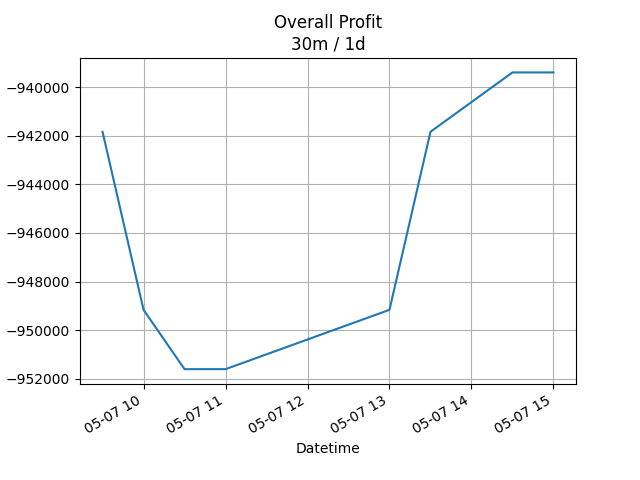|<table border="1" class="dataframe"> <thead> <tr style="text-align: center;"> <th>Datetime</th> <th>profit</th> </tr> </thead> <tbody> <tr> <td>09:30</td> <td>-866095.00</td> </tr> <tr> <td>10:00</td> <td>-883490.00</td> </tr> <tr> <td>10:30</td> <td>-883914.99</td> </tr> <tr> <td>11:00</td> <td>-883914.99</td> </tr> <tr> <td>11:30</td> <td>-878075.00</td> </tr> <tr> <td>13:00</td> <td>-878075.00</td> </tr> </tbody></table>|
|1d / 5d|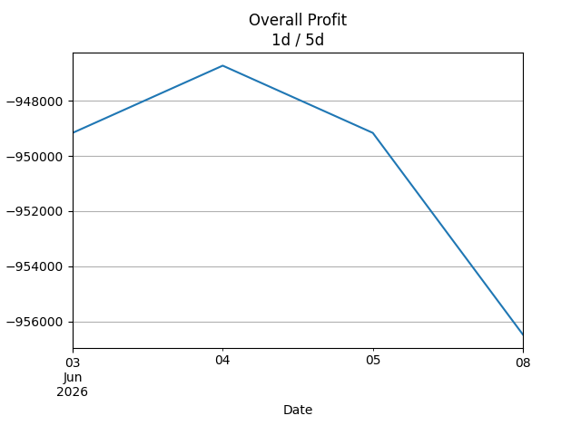|<table border="1" class="dataframe"> <thead> <tr style="text-align: center;"> <th>Date</th> <th>profit</th> </tr> </thead> <tbody> <tr> <td>2024-10-17</td> <td>-920670.00</td> </tr> <tr> <td>2024-10-18</td> <td>-874785.00</td> </tr> <tr> <td>2024-10-21</td> <td>-880310.00</td> </tr> <tr> <td>2024-10-23</td> <td>-877649.99</td> </tr> </tbody></table>|
|1wk / 1mo|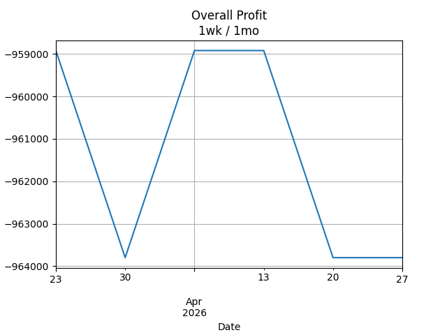|<table border="1" class="dataframe"> <thead> <tr style="text-align: center;"> <th>Date</th> <th>profit</th> </tr> </thead> <tbody> <tr> <td>2024-09-23</td> <td>-988790.00</td> </tr> <tr> <td>2024-09-30</td> <td>-857955.01</td> </tr> <tr> <td>2024-10-07</td> <td>-907840.01</td> </tr> <tr> <td>2024-10-14</td> <td>-874785.00</td> </tr> <tr> <td>2024-10-21</td> <td>-877649.99</td> </tr> </tbody></table>|
---
## 3601.HK [📉] [$-951600.00] [-81.93%]:
#### 360 Ludashi Holdings Limited
|price|profit|data|
|:---:|:---:|:---:|
|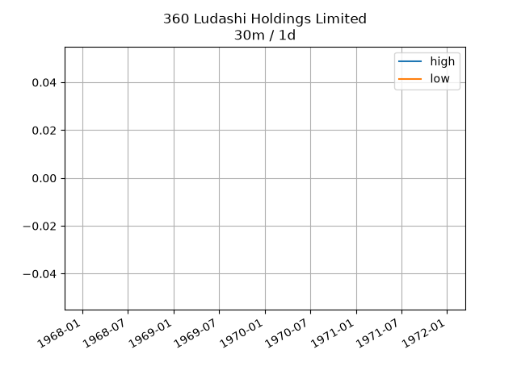|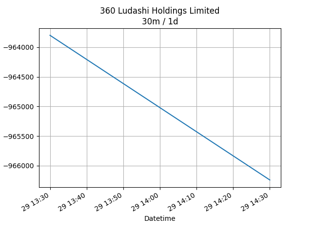|<table border="1" class="dataframe"> <thead> <tr style="text-align: center;"> <th>Datetime</th> <th>profit</th> </tr> </thead> <tbody> <tr> <td>09:30</td> <td>-934520.00</td> </tr> <tr> <td>10:00</td> <td>-954039.99</td> </tr> <tr> <td>10:30</td> <td>-954039.99</td> </tr> <tr> <td>11:30</td> <td>-951600.00</td> </tr> </tbody></table>|
|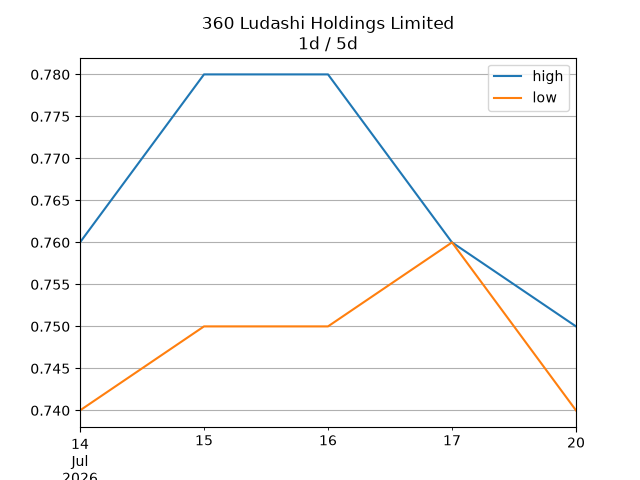|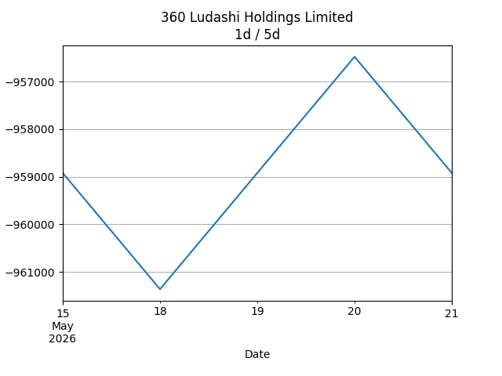|<table border="1" class="dataframe"> <thead> <tr style="text-align: center;"> <th>Date</th> <th>profit</th> </tr> </thead> <tbody> <tr> <td>2024-10-17</td> <td>-958920.0</td> </tr> <tr> <td>2024-10-18</td> <td>-949160.0</td> </tr> <tr> <td>2024-10-21</td> <td>-949160.0</td> </tr> <tr> <td>2024-10-23</td> <td>-951600.0</td> </tr> </tbody></table>|
|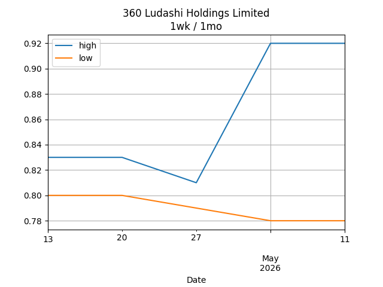|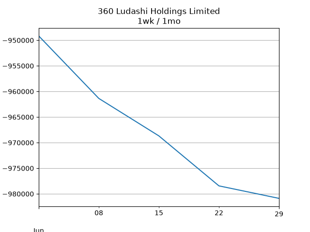|<table border="1" class="dataframe"> <thead> <tr style="text-align: center;"> <th>Date</th> <th>profit</th> </tr> </thead> <tbody> <tr> <td>2024-09-23</td> <td>-963800.00</td> </tr> <tr> <td>2024-09-30</td> <td>-907680.01</td> </tr> <tr> <td>2024-10-07</td> <td>-941840.01</td> </tr> <tr> <td>2024-10-14</td> <td>-949160.00</td> </tr> <tr> <td>2024-10-21</td> <td>-951600.00</td> </tr> </tbody></table>|
---
## 0981.HK [📈] [$73950.01] [40.47%]:
#### Semiconductor Manufacturing International Corporation
|price|profit|data|
|:---:|:---:|:---:|
|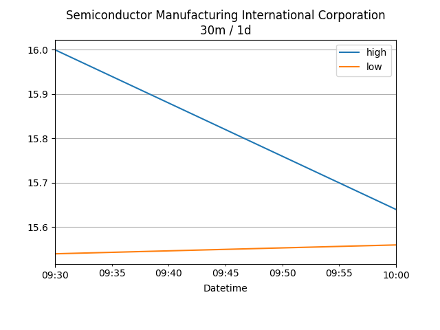|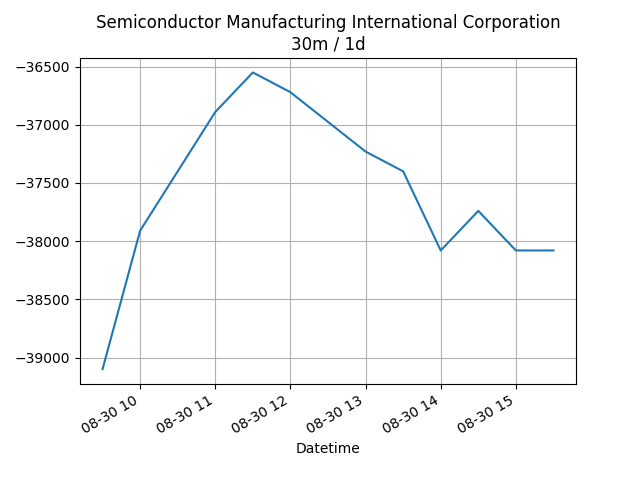|<table border="1" class="dataframe"> <thead> <tr style="text-align: center;"> <th>Datetime</th> <th>profit</th> </tr> </thead> <tbody> <tr> <td>09:30</td> <td>68424.99</td> </tr> <tr> <td>10:00</td> <td>70549.99</td> </tr> <tr> <td>10:30</td> <td>70125.00</td> </tr> <tr> <td>11:00</td> <td>70549.99</td> </tr> <tr> <td>11:30</td> <td>73525.00</td> </tr> <tr> <td>13:00</td> <td>73950.01</td> </tr> </tbody></table>|
|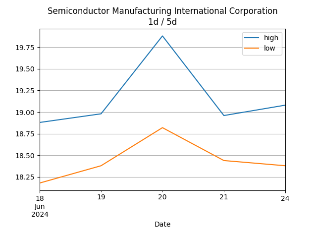|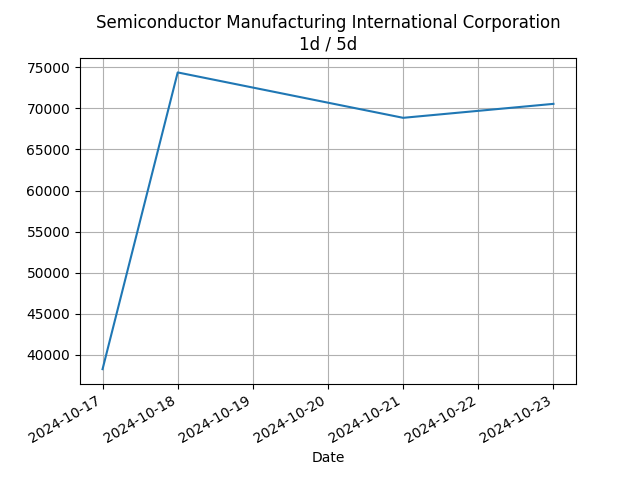|<table border="1" class="dataframe"> <thead> <tr style="text-align: center;"> <th>Date</th> <th>profit</th> </tr> </thead> <tbody> <tr> <td>2024-10-17</td> <td>38250.00</td> </tr> <tr> <td>2024-10-18</td> <td>74375.00</td> </tr> <tr> <td>2024-10-21</td> <td>68850.00</td> </tr> <tr> <td>2024-10-23</td> <td>73950.01</td> </tr> </tbody></table>|
|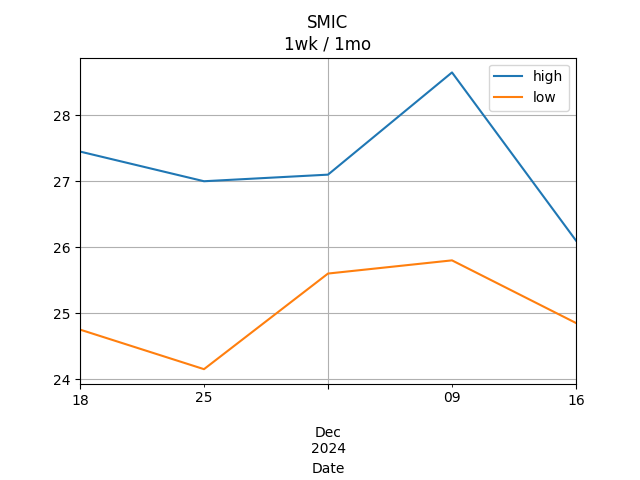|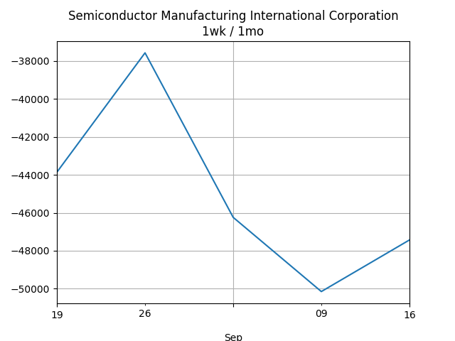|<table border="1" class="dataframe"> <thead> <tr style="text-align: center;"> <th>Date</th> <th>profit</th> </tr> </thead> <tbody> <tr> <td>2024-09-23</td> <td>-24990.00</td> </tr> <tr> <td>2024-09-30</td> <td>49725.00</td> </tr> <tr> <td>2024-10-07</td> <td>34000.00</td> </tr> <tr> <td>2024-10-14</td> <td>74375.00</td> </tr> <tr> <td>2024-10-21</td> <td>73950.01</td> </tr> </tbody></table>|
---
