## Net Profit [📉]:
### $-998190.01
|type|graph|data|
|:---:|:---:|:---:|
|1d / 30m|No Data|No Data|
|7d / 1d|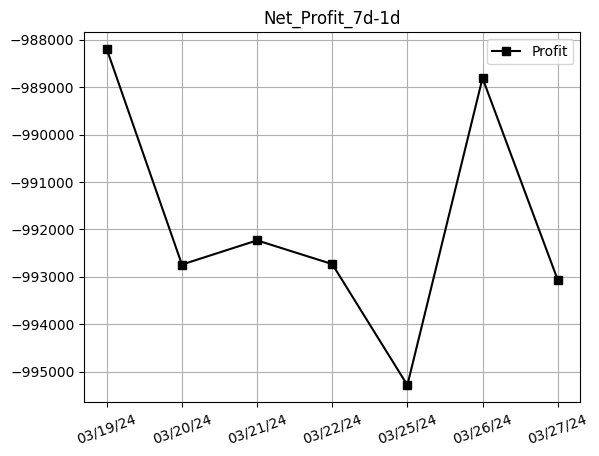|<table border="1" class="dataframe"> <thead> <tr style="text-align: right;"> <th>Date</th> <th>Profit</th> </tr> </thead> <tbody> <tr> <td>02/21/24</td> <td>-1021150.00</td> </tr> <tr> <td>02/22/24</td> <td>-1010370.01</td> </tr> <tr> <td>02/23/24</td> <td>-1014340.01</td> </tr> <tr> <td>02/26/24</td> <td>-1013490.00</td> </tr> <tr> <td>02/27/24</td> <td>-997960.00</td> </tr> <tr> <td>02/28/24</td> <td>-1007030.00</td> </tr> <tr> <td>02/29/24</td> <td>-1007030.00</td> </tr> </tbody></table>
|1mo / 1wk|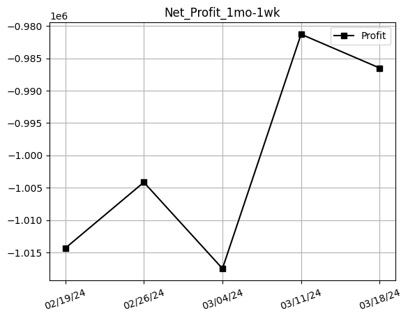|<table border="1" class="dataframe"> <thead> <tr style="text-align: right;"> <th>Date</th> <th>Profit</th> </tr> </thead> <tbody> <tr> <td>01/29/24</td> <td>-1043950.00</td> </tr> <tr> <td>02/05/24</td> <td>-1042930.00</td> </tr> <tr> <td>02/12/24</td> <td>-1030230.00</td> </tr> <tr> <td>02/19/24</td> <td>-1014340.01</td> </tr> <tr> <td>02/26/24</td> <td>-998190.01</td> </tr> </tbody></table>
---
## 3601.HK [📉] [$-958920.00] [-82.56%]:
#### 360 Ludashi Holdings Limited
|price|profit|data|
|:---:|:---:|:---:|
|No Data|No Data|No Data|
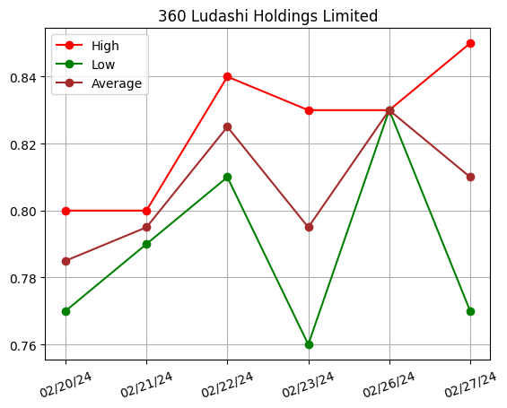|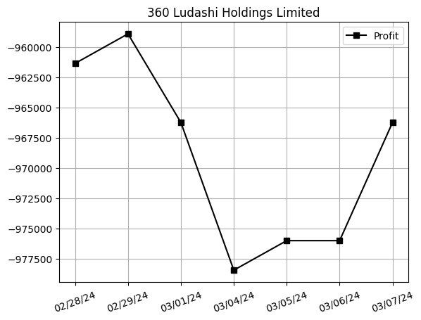|<table border="1" class="dataframe"> <thead> <tr style="text-align: right;"> <th>Date</th> <th>Profit</th> </tr> </thead> <tbody> <tr> <td>02/21/24</td> <td>-966240.00</td> </tr> <tr> <td>02/22/24</td> <td>-956480.01</td> </tr> <tr> <td>02/23/24</td> <td>-958920.00</td> </tr> <tr> <td>02/26/24</td> <td>-958920.00</td> </tr> <tr> <td>02/27/24</td> <td>-956480.01</td> </tr> <tr> <td>02/28/24</td> <td>-958920.00</td> </tr> </tbody></table>|
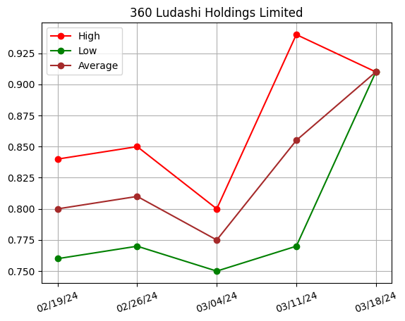|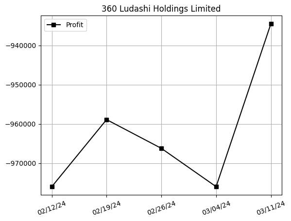|<table border="1" class="dataframe"> <thead> <tr style="text-align: right;"> <th>Date</th> <th>Profit</th> </tr> </thead> <tbody> <tr> <td>01/29/24</td> <td>-980880.00</td> </tr> <tr> <td>02/05/24</td> <td>-980880.00</td> </tr> <tr> <td>02/12/24</td> <td>-976000.00</td> </tr> <tr> <td>02/19/24</td> <td>-958920.00</td> </tr> <tr> <td>02/26/24</td> <td>-958920.00</td> </tr> </tbody></table>|
---
## 0981.HK [📉] [$-39270.01] [-21.49%]:
#### Semiconductor Manufacturing International Corporation
|price|profit|data|
|:---:|:---:|:---:|
|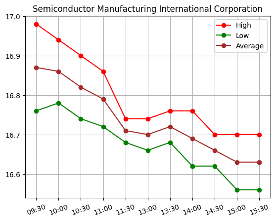|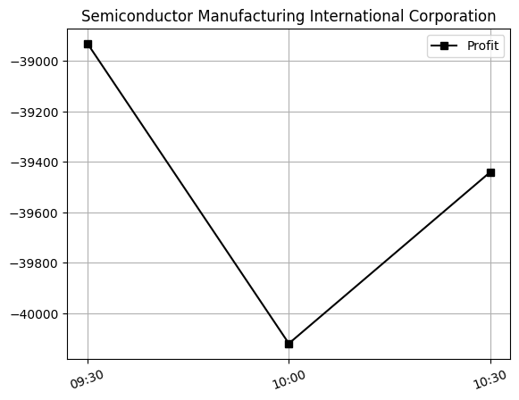|<table border="1" class="dataframe"> <thead> <tr style="text-align: right;"> <th>Datetime</th> <th>Profit</th> </tr> </thead> <tbody> <tr> <td>09:30</td> <td>-41310.01</td> </tr> <tr> <td>10:00</td> <td>-39780.00</td> </tr> <tr> <td>10:30</td> <td>-37400.00</td> </tr> <tr> <td>11:00</td> <td>-39780.00</td> </tr> <tr> <td>11:30</td> <td>-39270.01</td> </tr> </tbody></table>|
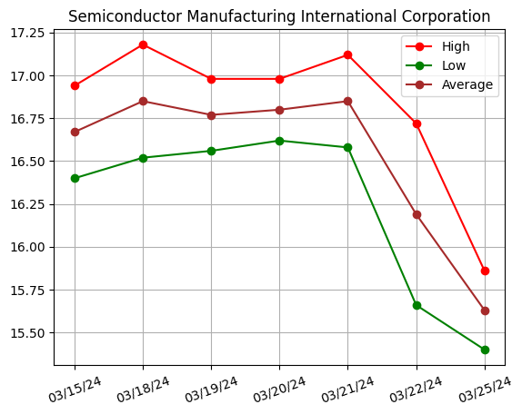|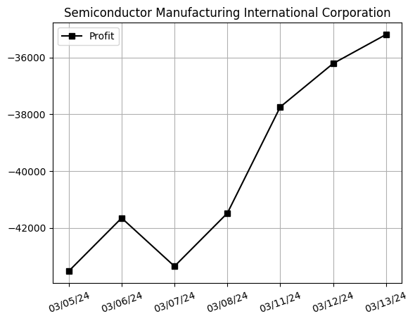|<table border="1" class="dataframe"> <thead> <tr style="text-align: right;"> <th>Date</th> <th>Profit</th> </tr> </thead> <tbody> <tr> <td>02/21/24</td> <td>-54910.00</td> </tr> <tr> <td>02/22/24</td> <td>-53890.00</td> </tr> <tr> <td>02/23/24</td> <td>-55420.00</td> </tr> <tr> <td>02/26/24</td> <td>-54570.00</td> </tr> <tr> <td>02/27/24</td> <td>-41479.99</td> </tr> <tr> <td>02/28/24</td> <td>-48110.00</td> </tr> <tr> <td>02/29/24</td> <td>-39270.01</td> </tr> </tbody></table>|
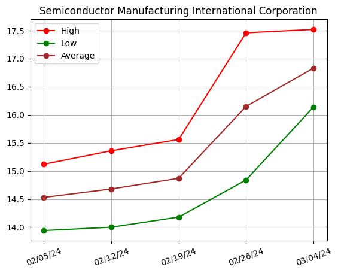|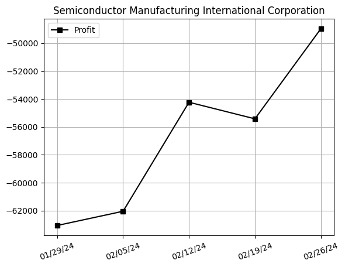|<table border="1" class="dataframe"> <thead> <tr style="text-align: right;"> <th>Date</th> <th>Profit</th> </tr> </thead> <tbody> <tr> <td>01/29/24</td> <td>-63070.00</td> </tr> <tr> <td>02/05/24</td> <td>-62050.00</td> </tr> <tr> <td>02/12/24</td> <td>-54230.00</td> </tr> <tr> <td>02/19/24</td> <td>-55420.00</td> </tr> <tr> <td>02/26/24</td> <td>-39270.01</td> </tr> </tbody></table>|
---
