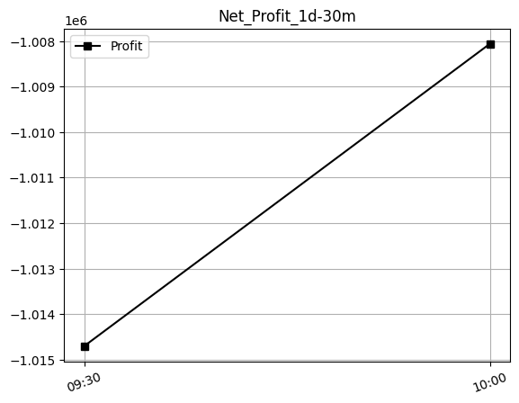
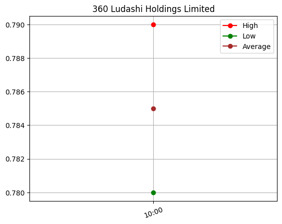
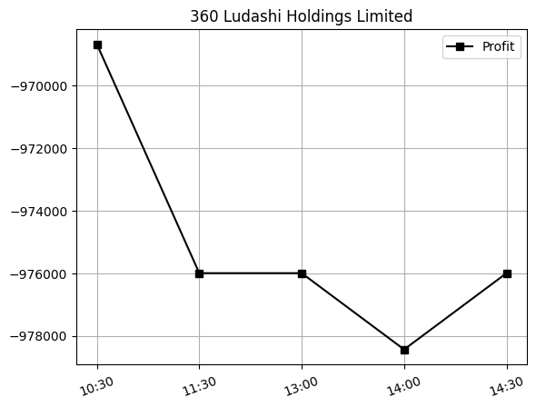

## Net Profit [📉]:
### $-995280.00
|type|graph|data|
|:---:|:---:|:---:|
|1d / 30m||<table border="1" class="dataframe"> <thead> <tr style="text-align: right;"> <th>Datetime</th> <th>Profit</th> </tr> </thead> <tbody> <tr> <td>09:30</td> <td>-999310.00</td> </tr> <tr> <td>10:00</td> <td>-999310.00</td> </tr> <tr> <td>10:30</td> <td>-999310.00</td> </tr> <tr> <td>11:00</td> <td>-999310.00</td> </tr> <tr> <td>11:30</td> <td>-999310.00</td> </tr> <tr> <td>13:00</td> <td>-999480.00</td> </tr> <tr> <td>13:30</td> <td>-995960.00</td> </tr> <tr> <td>14:00</td> <td>-995960.00</td> </tr> <tr> <td>14:30</td> <td>-995960.00</td> </tr> <tr> <td>15:00</td> <td>-995790.01</td> </tr> <tr> <td>15:30</td> <td>-995790.01</td> </tr> </tbody></table>
|7d / 1d||<table border="1" class="dataframe"> <thead> <tr style="text-align: right;"> <th>Date</th> <th>Profit</th> </tr> </thead> <tbody> <tr> <td>03/15/24</td> <td>-981280.00</td> </tr> <tr> <td>03/18/24</td> <td>-972599.99</td> </tr> <tr> <td>03/19/24</td> <td>-988199.99</td> </tr> <tr> <td>03/20/24</td> <td>-992740.00</td> </tr> <tr> <td>03/21/24</td> <td>-992230.00</td> </tr> <tr> <td>03/22/24</td> <td>-992730.00</td> </tr> <tr> <td>03/25/24</td> <td>-995280.00</td> </tr> </tbody></table>
|1mo / 1wk||<table border="1" class="dataframe"> <thead> <tr style="text-align: right;"> <th>Date</th> <th>Profit</th> </tr> </thead> <tbody> <tr> <td>02/26/24</td> <td>-1004149.99</td> </tr> <tr> <td>03/04/24</td> <td>-1017480.00</td> </tr> <tr> <td>03/11/24</td> <td>-981280.00</td> </tr> <tr> <td>03/18/24</td> <td>-992730.00</td> </tr> <tr> <td>03/25/24</td> <td>-995280.00</td> </tr> </tbody></table>
---
## 3601.HK [📉] [$-944280.00] [-81.30%]:
#### 360 Ludashi Holdings Limited
|price|profit|data|
|:---:|:---:|:---:|
|||<table border="1" class="dataframe"> <thead> <tr style="text-align: right;"> <th>Datetime</th> <th>Profit</th> </tr> </thead> <tbody> <tr> <td>09:30</td> <td>-949160.00</td> </tr> <tr> <td>13:00</td> <td>-949160.00</td> </tr> <tr> <td>13:30</td> <td>-944280.00</td> </tr> <tr> <td>15:00</td> <td>-944280.00</td> </tr> </tbody></table>|
||<table border="1" class="dataframe"> <thead> <tr style="text-align: right;"> <th>Date</th> <th>Profit</th> </tr> </thead> <tbody> <tr> <td>03/15/24</td> <td>-941840.01</td> </tr> <tr> <td>03/18/24</td> <td>-934520.00</td> </tr> <tr> <td>03/19/24</td> <td>-946720.00</td> </tr> <tr> <td>03/20/24</td> <td>-951600.00</td> </tr> <tr> <td>03/21/24</td> <td>-951600.00</td> </tr> <tr> <td>03/22/24</td> <td>-944280.00</td> </tr> <tr> <td>03/25/24</td> <td>-944280.00</td> </tr> </tbody></table>|
||<table border="1" class="dataframe"> <thead> <tr style="text-align: right;"> <th>Date</th> <th>Profit</th> </tr> </thead> <tbody> <tr> <td>02/26/24</td> <td>-966240.00</td> </tr> <tr> <td>03/04/24</td> <td>-976000.00</td> </tr> <tr> <td>03/11/24</td> <td>-941840.01</td> </tr> <tr> <td>03/18/24</td> <td>-944280.00</td> </tr> <tr> <td>03/25/24</td> <td>-944280.00</td> </tr> </tbody></table>|
---
## 0981.HK [📉] [$-51000.00] [-27.91%]:
#### Semiconductor Manufacturing International Corporation
|price|profit|data|
|:---:|:---:|:---:|
|||<table border="1" class="dataframe"> <thead> <tr style="text-align: right;"> <th>Datetime</th> <th>Profit</th> </tr> </thead> <tbody> <tr> <td>09:30</td> <td>-50150.00</td> </tr> <tr> <td>10:00</td> <td>-49470.00</td> </tr> <tr> <td>10:30</td> <td>-50320.00</td> </tr> <tr> <td>11:00</td> <td>-50150.00</td> </tr> <tr> <td>11:30</td> <td>-50320.00</td> </tr> <tr> <td>13:00</td> <td>-50320.00</td> </tr> <tr> <td>13:30</td> <td>-51680.00</td> </tr> <tr> <td>14:00</td> <td>-51510.00</td> </tr> <tr> <td>14:30</td> <td>-51850.00</td> </tr> <tr> <td>15:00</td> <td>-51510.00</td> </tr> <tr> <td>15:30</td> <td>-51000.00</td> </tr> </tbody></table>|
||<table border="1" class="dataframe"> <thead> <tr style="text-align: right;"> <th>Date</th> <th>Profit</th> </tr> </thead> <tbody> <tr> <td>03/15/24</td> <td>-39439.99</td> </tr> <tr> <td>03/18/24</td> <td>-38080.00</td> </tr> <tr> <td>03/19/24</td> <td>-41479.99</td> </tr> <tr> <td>03/20/24</td> <td>-41140.00</td> </tr> <tr> <td>03/21/24</td> <td>-40630.01</td> </tr> <tr> <td>03/22/24</td> <td>-48450.00</td> </tr> <tr> <td>03/25/24</td> <td>-51000.00</td> </tr> </tbody></table>|
||<table border="1" class="dataframe"> <thead> <tr style="text-align: right;"> <th>Date</th> <th>Profit</th> </tr> </thead> <tbody> <tr> <td>02/26/24</td> <td>-37909.99</td> </tr> <tr> <td>03/04/24</td> <td>-41479.99</td> </tr> <tr> <td>03/11/24</td> <td>-39439.99</td> </tr> <tr> <td>03/18/24</td> <td>-48450.00</td> </tr> <tr> <td>03/25/24</td> <td>-51000.00</td> </tr> </tbody></table>|
---
