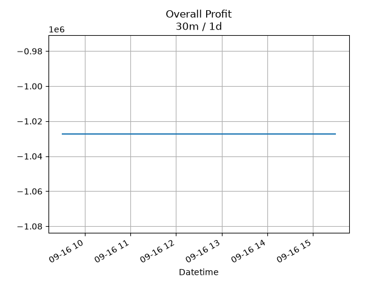
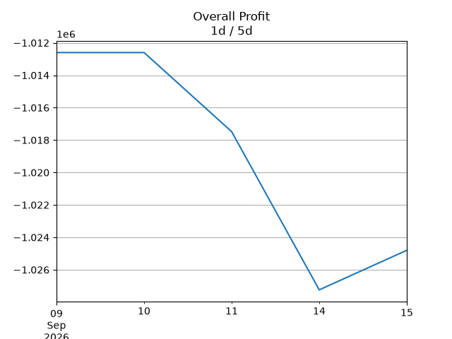
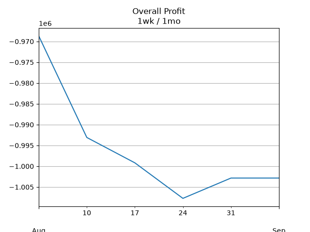
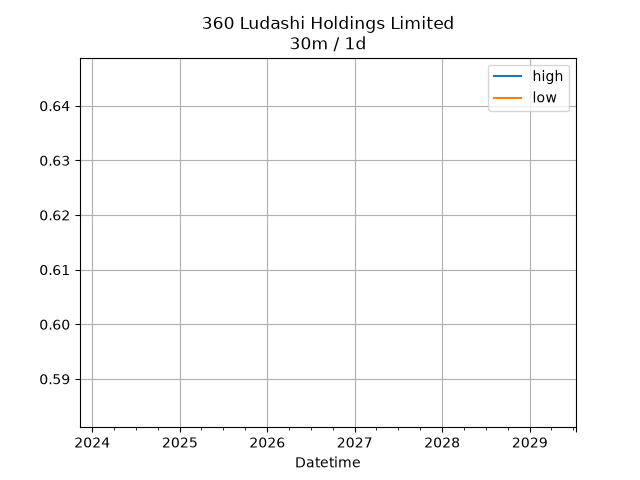
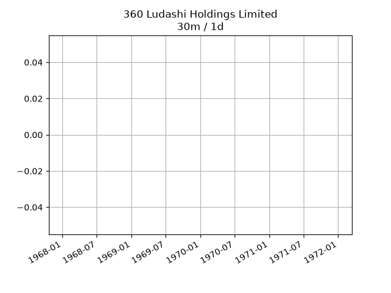
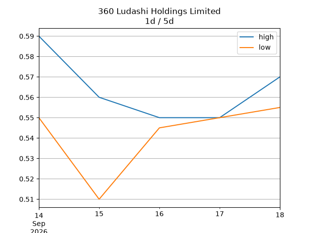
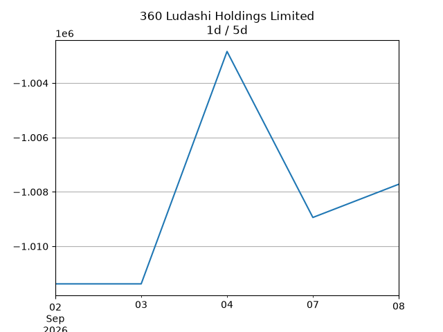
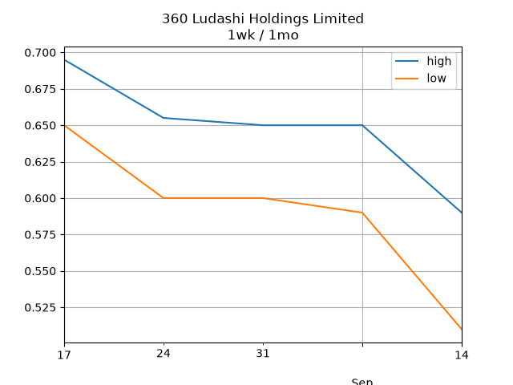
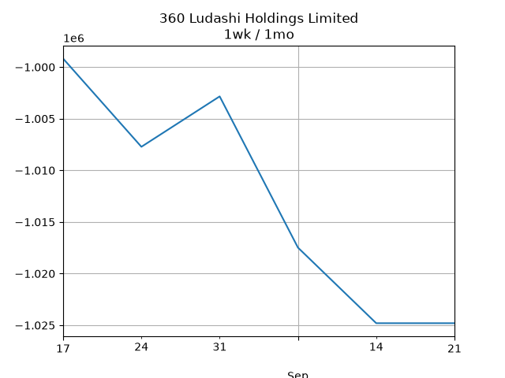

## Net Profit [📉]:
### $-982100.00
|type|graph|data|
|:---:|:---:|:---:|
|30m / 1d||<table border="1" class="dataframe"> <thead> <tr style="text-align: center;"> <th>Datetime</th> <th>profit</th> </tr> </thead> <tbody> <tr> <td>09:30</td> <td>-980880.0</td> </tr> <tr> <td>10:30</td> <td>-982100.0</td> </tr> </tbody></table>|
|1d / 5d||<table border="1" class="dataframe"> <thead> <tr style="text-align: center;"> <th>Date</th> <th>profit</th> </tr> </thead> <tbody> <tr> <td>2026-08-04</td> <td>-971120.01</td> </tr> <tr> <td>2026-08-05</td> <td>-968679.99</td> </tr> <tr> <td>2026-08-06</td> <td>-969899.99</td> </tr> <tr> <td>2026-08-07</td> <td>-968679.99</td> </tr> <tr> <td>2026-08-10</td> <td>-982100.00</td> </tr> </tbody></table>|
|1wk / 1mo||<table border="1" class="dataframe"> <thead> <tr style="text-align: center;"> <th>Date</th> <th>profit</th> </tr> </thead> <tbody> <tr> <td>2026-07-06</td> <td>-973560.00</td> </tr> <tr> <td>2026-07-13</td> <td>-976000.00</td> </tr> <tr> <td>2026-07-20</td> <td>-976000.00</td> </tr> <tr> <td>2026-07-27</td> <td>-978440.00</td> </tr> <tr> <td>2026-08-03</td> <td>-968679.99</td> </tr> <tr> <td>2026-08-10</td> <td>-968679.99</td> </tr> </tbody></table>|
---
## 3601.HK [📉] [$-982100.00] [-84.56%]:
#### 360 Ludashi Holdings Limited
|price|profit|data|
|:---:|:---:|:---:|
|||<table border="1" class="dataframe"> <thead> <tr style="text-align: center;"> <th>Datetime</th> <th>profit</th> </tr> </thead> <tbody> <tr> <td>09:30</td> <td>-980880.0</td> </tr> <tr> <td>10:30</td> <td>-982100.0</td> </tr> </tbody></table>|
|||<table border="1" class="dataframe"> <thead> <tr style="text-align: center;"> <th>Date</th> <th>profit</th> </tr> </thead> <tbody> <tr> <td>2026-08-04</td> <td>-971120.01</td> </tr> <tr> <td>2026-08-05</td> <td>-968679.99</td> </tr> <tr> <td>2026-08-06</td> <td>-969899.99</td> </tr> <tr> <td>2026-08-07</td> <td>-968679.99</td> </tr> <tr> <td>2026-08-10</td> <td>-982100.00</td> </tr> </tbody></table>|
|||<table border="1" class="dataframe"> <thead> <tr style="text-align: center;"> <th>Date</th> <th>profit</th> </tr> </thead> <tbody> <tr> <td>2026-07-06</td> <td>-973560.00</td> </tr> <tr> <td>2026-07-13</td> <td>-976000.00</td> </tr> <tr> <td>2026-07-20</td> <td>-976000.00</td> </tr> <tr> <td>2026-07-27</td> <td>-978440.00</td> </tr> <tr> <td>2026-08-03</td> <td>-968679.99</td> </tr> <tr> <td>2026-08-10</td> <td>-968679.99</td> </tr> </tbody></table>|
---
