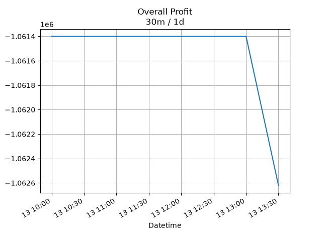
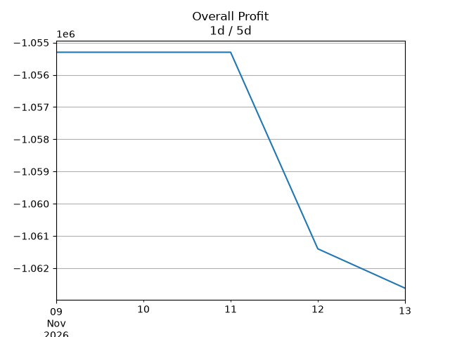
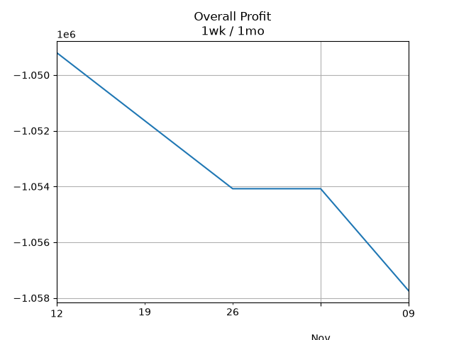
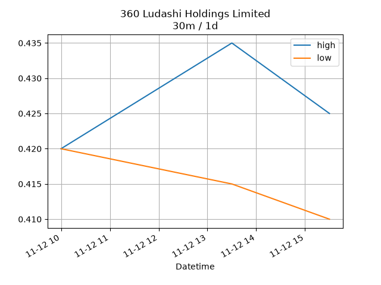
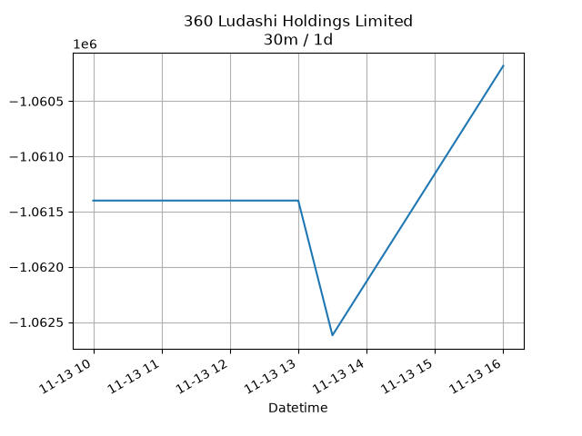
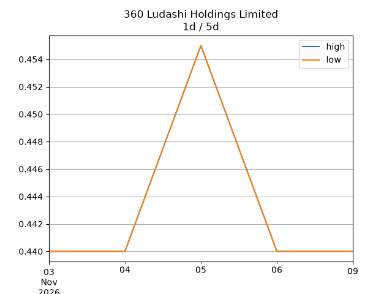
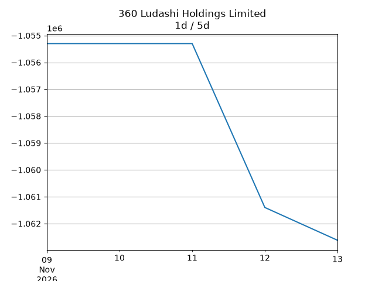
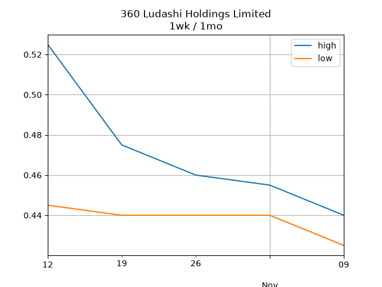
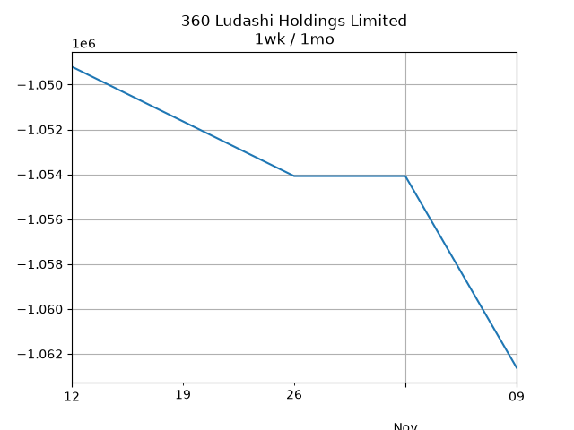

## Net Profit [📉]:
### $-1060180.00
|type|graph|data|
|:---:|:---:|:---:|
|30m / 1d||<table border="1" class="dataframe"> <thead> <tr style="text-align: center;"> <th>Datetime</th> <th>profit</th> </tr> </thead> <tbody> <tr> <td>10:00</td> <td>-1061400.0</td> </tr> <tr> <td>11:00</td> <td>-1061400.0</td> </tr> <tr> <td>13:00</td> <td>-1061400.0</td> </tr> <tr> <td>13:30</td> <td>-1062620.0</td> </tr> <tr> <td>16:00</td> <td>-1060180.0</td> </tr> </tbody></table>|
|1d / 5d||<table border="1" class="dataframe"> <thead> <tr style="text-align: center;"> <th>Date</th> <th>profit</th> </tr> </thead> <tbody> <tr> <td>2026-11-09</td> <td>-1055300.0</td> </tr> <tr> <td>2026-11-10</td> <td>-1055300.0</td> </tr> <tr> <td>2026-11-11</td> <td>-1055300.0</td> </tr> <tr> <td>2026-11-12</td> <td>-1061400.0</td> </tr> <tr> <td>2026-11-13</td> <td>-1061400.0</td> </tr> </tbody></table>|
|1wk / 1mo||<table border="1" class="dataframe"> <thead> <tr style="text-align: center;"> <th>Date</th> <th>profit</th> </tr> </thead> <tbody> <tr> <td>2026-10-12</td> <td>-1049200.0</td> </tr> <tr> <td>2026-10-19</td> <td>-1051640.0</td> </tr> <tr> <td>2026-10-26</td> <td>-1054080.0</td> </tr> <tr> <td>2026-11-02</td> <td>-1054080.0</td> </tr> <tr> <td>2026-11-09</td> <td>-1060180.0</td> </tr> </tbody></table>|
---
## 3601.HK [📉] [$-1060180.00] [-91.28%]:
#### 360 Ludashi Holdings Limited
|price|profit|data|
|:---:|:---:|:---:|
|||<table border="1" class="dataframe"> <thead> <tr style="text-align: center;"> <th>Datetime</th> <th>profit</th> </tr> </thead> <tbody> <tr> <td>10:00</td> <td>-1061400.0</td> </tr> <tr> <td>11:00</td> <td>-1061400.0</td> </tr> <tr> <td>13:00</td> <td>-1061400.0</td> </tr> <tr> <td>13:30</td> <td>-1062620.0</td> </tr> <tr> <td>16:00</td> <td>-1060180.0</td> </tr> </tbody></table>|
|||<table border="1" class="dataframe"> <thead> <tr style="text-align: center;"> <th>Date</th> <th>profit</th> </tr> </thead> <tbody> <tr> <td>2026-11-09</td> <td>-1055300.0</td> </tr> <tr> <td>2026-11-10</td> <td>-1055300.0</td> </tr> <tr> <td>2026-11-11</td> <td>-1055300.0</td> </tr> <tr> <td>2026-11-12</td> <td>-1061400.0</td> </tr> <tr> <td>2026-11-13</td> <td>-1061400.0</td> </tr> </tbody></table>|
|||<table border="1" class="dataframe"> <thead> <tr style="text-align: center;"> <th>Date</th> <th>profit</th> </tr> </thead> <tbody> <tr> <td>2026-10-12</td> <td>-1049200.0</td> </tr> <tr> <td>2026-10-19</td> <td>-1051640.0</td> </tr> <tr> <td>2026-10-26</td> <td>-1054080.0</td> </tr> <tr> <td>2026-11-02</td> <td>-1054080.0</td> </tr> <tr> <td>2026-11-09</td> <td>-1060180.0</td> </tr> </tbody></table>|
---
