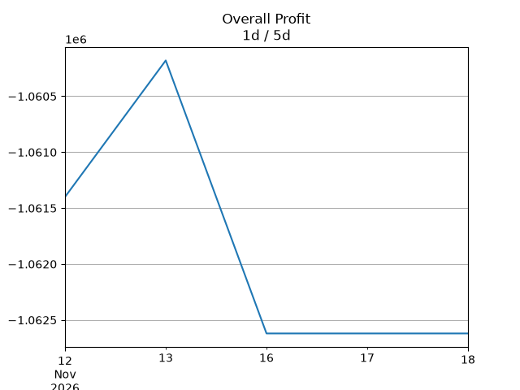
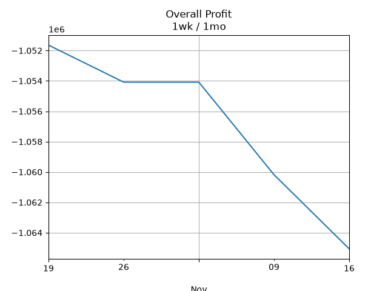
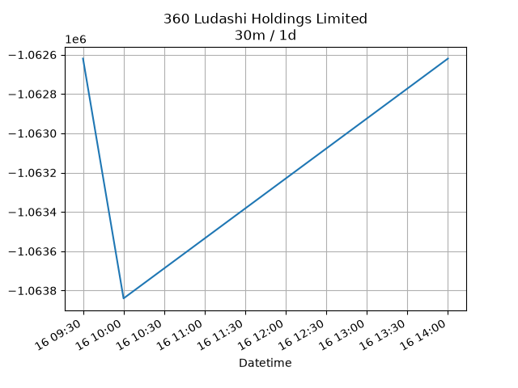
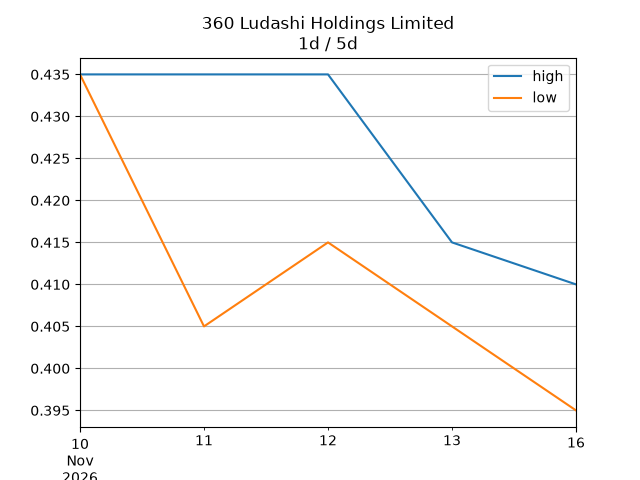

## Net Profit [📉]:
### $-1054080.00
|type|graph|data|
|:---:|:---:|:---:|
|30m / 1d||<table border="1" class="dataframe"> <thead> <tr style="text-align: center;"> <th>Datetime</th> <th>profit</th> </tr> </thead> <tbody> <tr> <td>10:30</td> <td>-1056520.0</td> </tr> <tr> <td>11:00</td> <td>-1041880.0</td> </tr> <tr> <td>11:30</td> <td>-1044320.0</td> </tr> <tr> <td>13:00</td> <td>-1054080.0</td> </tr> <tr> <td>14:00</td> <td>-1054080.0</td> </tr> </tbody></table>|
|1d / 5d||<table border="1" class="dataframe"> <thead> <tr style="text-align: center;"> <th>Date</th> <th>profit</th> </tr> </thead> <tbody> <tr> <td>2026-11-23</td> <td>-1068720.0</td> </tr> <tr> <td>2026-11-24</td> <td>-1069940.0</td> </tr> <tr> <td>2026-11-25</td> <td>-1071160.0</td> </tr> <tr> <td>2026-11-26</td> <td>-1068720.0</td> </tr> <tr> <td>2026-11-27</td> <td>-1054080.0</td> </tr> </tbody></table>|
|1wk / 1mo||<table border="1" class="dataframe"> <thead> <tr style="text-align: center;"> <th>Date</th> <th>profit</th> </tr> </thead> <tbody> <tr> <td>2026-10-26</td> <td>-1054080.0</td> </tr> <tr> <td>2026-11-02</td> <td>-1054080.0</td> </tr> <tr> <td>2026-11-09</td> <td>-1060180.0</td> </tr> <tr> <td>2026-11-16</td> <td>-1065060.0</td> </tr> <tr> <td>2026-11-23</td> <td>-1054080.0</td> </tr> </tbody></table>|
---
## 3601.HK [📉] [$-1054080.00] [-90.76%]:
#### 360 Ludashi Holdings Limited
|price|profit|data|
|:---:|:---:|:---:|
|||<table border="1" class="dataframe"> <thead> <tr style="text-align: center;"> <th>Datetime</th> <th>profit</th> </tr> </thead> <tbody> <tr> <td>10:30</td> <td>-1056520.0</td> </tr> <tr> <td>11:00</td> <td>-1041880.0</td> </tr> <tr> <td>11:30</td> <td>-1044320.0</td> </tr> <tr> <td>13:00</td> <td>-1054080.0</td> </tr> <tr> <td>14:00</td> <td>-1054080.0</td> </tr> </tbody></table>|
|||<table border="1" class="dataframe"> <thead> <tr style="text-align: center;"> <th>Date</th> <th>profit</th> </tr> </thead> <tbody> <tr> <td>2026-11-23</td> <td>-1068720.0</td> </tr> <tr> <td>2026-11-24</td> <td>-1069940.0</td> </tr> <tr> <td>2026-11-25</td> <td>-1071160.0</td> </tr> <tr> <td>2026-11-26</td> <td>-1068720.0</td> </tr> <tr> <td>2026-11-27</td> <td>-1054080.0</td> </tr> </tbody></table>|
|||<table border="1" class="dataframe"> <thead> <tr style="text-align: center;"> <th>Date</th> <th>profit</th> </tr> </thead> <tbody> <tr> <td>2026-10-26</td> <td>-1054080.0</td> </tr> <tr> <td>2026-11-02</td> <td>-1054080.0</td> </tr> <tr> <td>2026-11-09</td> <td>-1060180.0</td> </tr> <tr> <td>2026-11-16</td> <td>-1065060.0</td> </tr> <tr> <td>2026-11-23</td> <td>-1054080.0</td> </tr> </tbody></table>|
---
