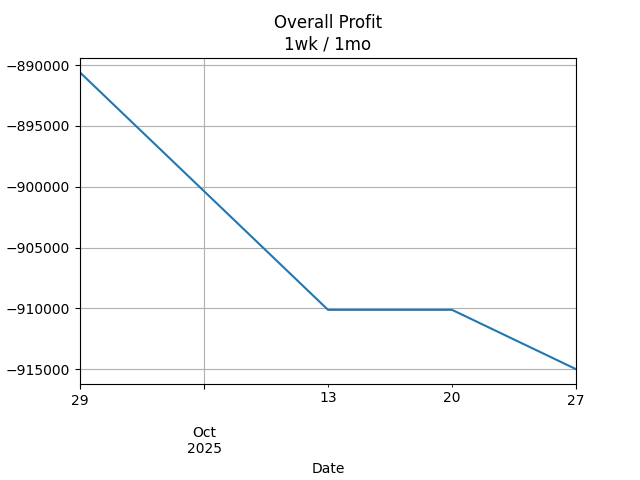

## Net Profit [📈]:
### $0.00
|type|graph|data|
|:---:|:---:|:---:|
|30m / 1d||<table border="1" class="dataframe"> <thead> <tr style="text-align: center;"> <th>index</th> <th>profit</th> </tr> </thead> <tbody> <tr> <td>00:00</td> <td>0</td> </tr> </tbody></table>|
|1d / 5d||<table border="1" class="dataframe"> <thead> <tr style="text-align: center;"> <th>Date</th> <th>profit</th> </tr> </thead> <tbody> <tr> <td>2025-06-17</td> <td>-917440.00</td> </tr> <tr> <td>2025-06-18</td> <td>-927200.01</td> </tr> <tr> <td>2025-06-19</td> <td>-927200.01</td> </tr> <tr> <td>2025-06-20</td> <td>-929640.00</td> </tr> <tr> <td>2025-06-23</td> <td>-932080.00</td> </tr> </tbody></table>|
|1wk / 1mo||<table border="1" class="dataframe"> <thead> <tr style="text-align: center;"> <th>Date</th> <th>profit</th> </tr> </thead> <tbody> <tr> <td>2025-05-19</td> <td>-908115.73</td> </tr> <tr> <td>2025-05-26</td> <td>-937003.58</td> </tr> <tr> <td>2025-06-02</td> <td>-932080.00</td> </tr> <tr> <td>2025-06-09</td> <td>-915000.00</td> </tr> <tr> <td>2025-06-16</td> <td>-929640.00</td> </tr> </tbody></table>|
---
## 3601.HK [📈] [$0.00] [0.00%]:
#### 360 Ludashi Holdings Limited
|price|profit|data|
|:---:|:---:|:---:|
|||<table border="1" class="dataframe"> <thead> <tr style="text-align: center;"> <th>index</th> <th>profit</th> </tr> </thead> <tbody> <tr> <td>00:00</td> <td>0</td> </tr> </tbody></table>|
|||<table border="1" class="dataframe"> <thead> <tr style="text-align: center;"> <th>Date</th> <th>profit</th> </tr> </thead> <tbody> <tr> <td>2025-06-17</td> <td>-917440.00</td> </tr> <tr> <td>2025-06-18</td> <td>-927200.01</td> </tr> <tr> <td>2025-06-19</td> <td>-927200.01</td> </tr> <tr> <td>2025-06-20</td> <td>-929640.00</td> </tr> <tr> <td>2025-06-23</td> <td>-932080.00</td> </tr> </tbody></table>|
|||<table border="1" class="dataframe"> <thead> <tr style="text-align: center;"> <th>Date</th> <th>profit</th> </tr> </thead> <tbody> <tr> <td>2025-05-19</td> <td>-908115.73</td> </tr> <tr> <td>2025-05-26</td> <td>-937003.58</td> </tr> <tr> <td>2025-06-02</td> <td>-932080.00</td> </tr> <tr> <td>2025-06-09</td> <td>-915000.00</td> </tr> <tr> <td>2025-06-16</td> <td>-929640.00</td> </tr> </tbody></table>|
---
