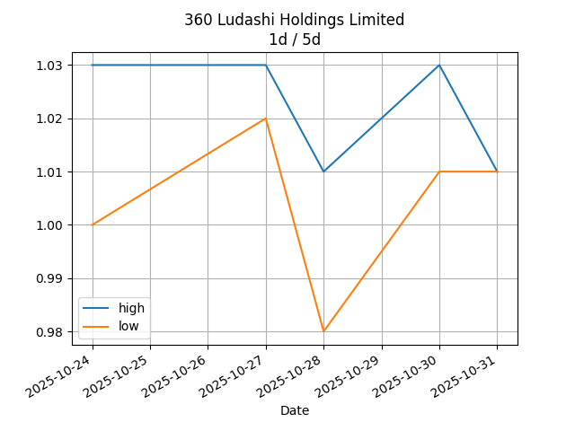
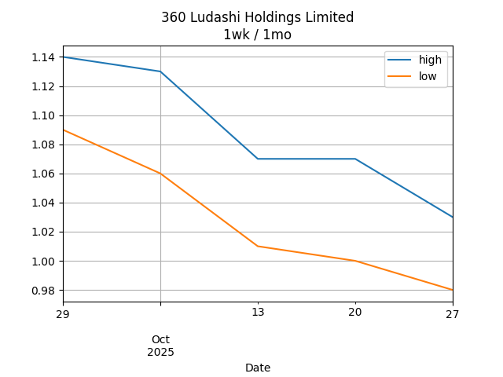

## Net Profit [📉]:
### $-912560.00
|type|graph|data|
|:---:|:---:|:---:|
|30m / 1d||<table border="1" class="dataframe"> <thead> <tr style="text-align: center;"> <th>Datetime</th> <th>profit</th> </tr> </thead> <tbody> <tr> <td>09:30</td> <td>-919880.0</td> </tr> <tr> <td>10:00</td> <td>-922320.0</td> </tr> <tr> <td>10:30</td> <td>-912560.0</td> </tr> <tr> <td>11:00</td> <td>-912560.0</td> </tr> <tr> <td>11:30</td> <td>-912560.0</td> </tr> </tbody></table>|
|1d / 5d||<table border="1" class="dataframe"> <thead> <tr style="text-align: center;"> <th>Date</th> <th>profit</th> </tr> </thead> <tbody> <tr> <td>2025-07-24</td> <td>-910120.01</td> </tr> <tr> <td>2025-07-25</td> <td>-922320.00</td> </tr> <tr> <td>2025-07-28</td> <td>-912560.00</td> </tr> <tr> <td>2025-07-29</td> <td>-919880.00</td> </tr> <tr> <td>2025-07-30</td> <td>-912560.00</td> </tr> </tbody></table>|
|1wk / 1mo||<table border="1" class="dataframe"> <thead> <tr style="text-align: center;"> <th>Date</th> <th>profit</th> </tr> </thead> <tbody> <tr> <td>2025-06-30</td> <td>-915000.00</td> </tr> <tr> <td>2025-07-07</td> <td>-915000.00</td> </tr> <tr> <td>2025-07-14</td> <td>-910120.01</td> </tr> <tr> <td>2025-07-21</td> <td>-922320.00</td> </tr> <tr> <td>2025-07-28</td> <td>-912560.00</td> </tr> </tbody></table>|
---
## 3601.HK [📉] [$-912560.00] [-78.57%]:
#### 360 Ludashi Holdings Limited
|price|profit|data|
|:---:|:---:|:---:|
|||<table border="1" class="dataframe"> <thead> <tr style="text-align: center;"> <th>Datetime</th> <th>profit</th> </tr> </thead> <tbody> <tr> <td>09:30</td> <td>-919880.0</td> </tr> <tr> <td>10:00</td> <td>-922320.0</td> </tr> <tr> <td>10:30</td> <td>-912560.0</td> </tr> <tr> <td>11:00</td> <td>-912560.0</td> </tr> <tr> <td>11:30</td> <td>-912560.0</td> </tr> </tbody></table>|
|||<table border="1" class="dataframe"> <thead> <tr style="text-align: center;"> <th>Date</th> <th>profit</th> </tr> </thead> <tbody> <tr> <td>2025-07-24</td> <td>-910120.01</td> </tr> <tr> <td>2025-07-25</td> <td>-922320.00</td> </tr> <tr> <td>2025-07-28</td> <td>-912560.00</td> </tr> <tr> <td>2025-07-29</td> <td>-919880.00</td> </tr> <tr> <td>2025-07-30</td> <td>-912560.00</td> </tr> </tbody></table>|
|||<table border="1" class="dataframe"> <thead> <tr style="text-align: center;"> <th>Date</th> <th>profit</th> </tr> </thead> <tbody> <tr> <td>2025-06-30</td> <td>-915000.00</td> </tr> <tr> <td>2025-07-07</td> <td>-915000.00</td> </tr> <tr> <td>2025-07-14</td> <td>-910120.01</td> </tr> <tr> <td>2025-07-21</td> <td>-922320.00</td> </tr> <tr> <td>2025-07-28</td> <td>-912560.00</td> </tr> </tbody></table>|
---
