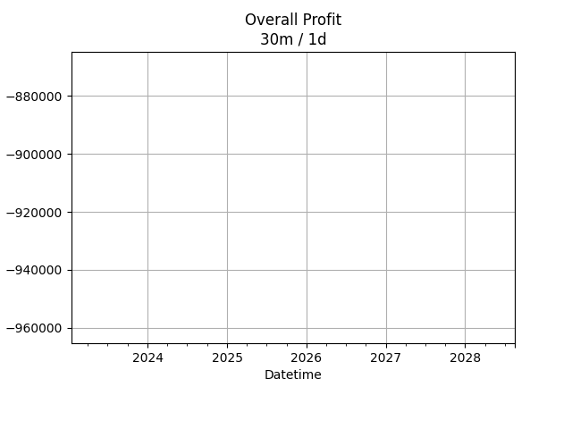

## Net Profit [📉]:
### $-944280.00
|type|graph|data|
|:---:|:---:|:---:|
|30m / 1d||<table border="1" class="dataframe"> <thead> <tr style="text-align: center;"> <th>Datetime</th> <th>profit</th> </tr> </thead> <tbody> <tr> <td>10:00</td> <td>-949160.0</td> </tr> <tr> <td>10:30</td> <td>-936960.0</td> </tr> <tr> <td>13:00</td> <td>-944280.0</td> </tr> </tbody></table>|
|1d / 5d||<table border="1" class="dataframe"> <thead> <tr style="text-align: center;"> <th>Date</th> <th>profit</th> </tr> </thead> <tbody> <tr> <td>2025-12-29</td> <td>-941840.01</td> </tr> <tr> <td>2025-12-30</td> <td>-946720.00</td> </tr> <tr> <td>2025-12-31</td> <td>-946720.00</td> </tr> <tr> <td>2026-01-02</td> <td>-941840.01</td> </tr> <tr> <td>2026-01-05</td> <td>-944280.00</td> </tr> </tbody></table>|
|1wk / 1mo||<table border="1" class="dataframe"> <thead> <tr style="text-align: center;"> <th>Date</th> <th>profit</th> </tr> </thead> <tbody> <tr> <td>2025-12-01</td> <td>-936960.00</td> </tr> <tr> <td>2025-12-08</td> <td>-941840.01</td> </tr> <tr> <td>2025-12-15</td> <td>-946720.00</td> </tr> <tr> <td>2025-12-22</td> <td>-934520.00</td> </tr> <tr> <td>2025-12-29</td> <td>-941840.01</td> </tr> </tbody></table>|
---
## 3601.HK [📉] [$-944280.00] [-81.30%]:
#### 360 Ludashi Holdings Limited
|price|profit|data|
|:---:|:---:|:---:|
|||<table border="1" class="dataframe"> <thead> <tr style="text-align: center;"> <th>Datetime</th> <th>profit</th> </tr> </thead> <tbody> <tr> <td>10:00</td> <td>-949160.0</td> </tr> <tr> <td>10:30</td> <td>-936960.0</td> </tr> <tr> <td>13:00</td> <td>-944280.0</td> </tr> </tbody></table>|
|||<table border="1" class="dataframe"> <thead> <tr style="text-align: center;"> <th>Date</th> <th>profit</th> </tr> </thead> <tbody> <tr> <td>2025-12-29</td> <td>-941840.01</td> </tr> <tr> <td>2025-12-30</td> <td>-946720.00</td> </tr> <tr> <td>2025-12-31</td> <td>-946720.00</td> </tr> <tr> <td>2026-01-02</td> <td>-941840.01</td> </tr> <tr> <td>2026-01-05</td> <td>-944280.00</td> </tr> </tbody></table>|
|||<table border="1" class="dataframe"> <thead> <tr style="text-align: center;"> <th>Date</th> <th>profit</th> </tr> </thead> <tbody> <tr> <td>2025-12-01</td> <td>-936960.00</td> </tr> <tr> <td>2025-12-08</td> <td>-941840.01</td> </tr> <tr> <td>2025-12-15</td> <td>-946720.00</td> </tr> <tr> <td>2025-12-22</td> <td>-934520.00</td> </tr> <tr> <td>2025-12-29</td> <td>-941840.01</td> </tr> </tbody></table>|
---
