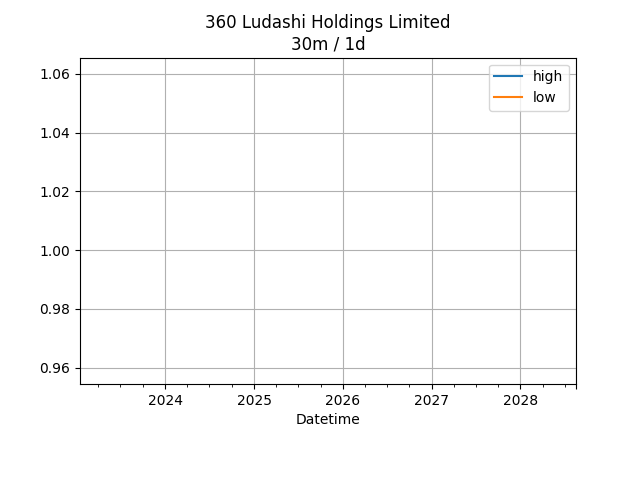

## Net Profit [📈]:
### $0.00
|type|graph|data|
|:---:|:---:|:---:|
|30m / 1d||<table border="1" class="dataframe"> <thead> <tr style="text-align: center;"> <th>index</th> <th>profit</th> </tr> </thead> <tbody> <tr> <td>00:00</td> <td>0</td> </tr> </tbody></table>|
|1d / 5d||<table border="1" class="dataframe"> <thead> <tr style="text-align: center;"> <th>Date</th> <th>profit</th> </tr> </thead> <tbody> <tr> <td>2025-08-27</td> <td>-895479.99</td> </tr> <tr> <td>2025-08-28</td> <td>-902800.01</td> </tr> <tr> <td>2025-08-29</td> <td>-897919.99</td> </tr> <tr> <td>2025-09-01</td> <td>-902800.01</td> </tr> <tr> <td>2025-09-02</td> <td>-905240.01</td> </tr> </tbody></table>|
|1wk / 1mo||<table border="1" class="dataframe"> <thead> <tr style="text-align: center;"> <th>Date</th> <th>profit</th> </tr> </thead> <tbody> <tr> <td>2025-08-04</td> <td>-871079.99</td> </tr> <tr> <td>2025-08-11</td> <td>-900359.99</td> </tr> <tr> <td>2025-08-18</td> <td>-888160.00</td> </tr> <tr> <td>2025-08-25</td> <td>-897919.99</td> </tr> <tr> <td>2025-09-01</td> <td>-905240.01</td> </tr> </tbody></table>|
---
## 3601.HK [📈] [$0.00] [0.00%]:
#### 360 Ludashi Holdings Limited
|price|profit|data|
|:---:|:---:|:---:|
|||<table border="1" class="dataframe"> <thead> <tr style="text-align: center;"> <th>index</th> <th>profit</th> </tr> </thead> <tbody> <tr> <td>00:00</td> <td>0</td> </tr> </tbody></table>|
|||<table border="1" class="dataframe"> <thead> <tr style="text-align: center;"> <th>Date</th> <th>profit</th> </tr> </thead> <tbody> <tr> <td>2025-08-27</td> <td>-895479.99</td> </tr> <tr> <td>2025-08-28</td> <td>-902800.01</td> </tr> <tr> <td>2025-08-29</td> <td>-897919.99</td> </tr> <tr> <td>2025-09-01</td> <td>-902800.01</td> </tr> <tr> <td>2025-09-02</td> <td>-905240.01</td> </tr> </tbody></table>|
|||<table border="1" class="dataframe"> <thead> <tr style="text-align: center;"> <th>Date</th> <th>profit</th> </tr> </thead> <tbody> <tr> <td>2025-08-04</td> <td>-871079.99</td> </tr> <tr> <td>2025-08-11</td> <td>-900359.99</td> </tr> <tr> <td>2025-08-18</td> <td>-888160.00</td> </tr> <tr> <td>2025-08-25</td> <td>-897919.99</td> </tr> <tr> <td>2025-09-01</td> <td>-905240.01</td> </tr> </tbody></table>|
---
