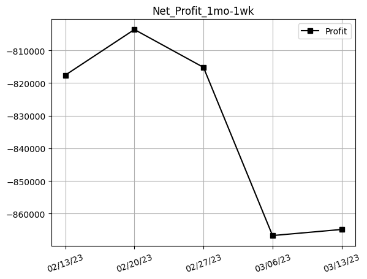
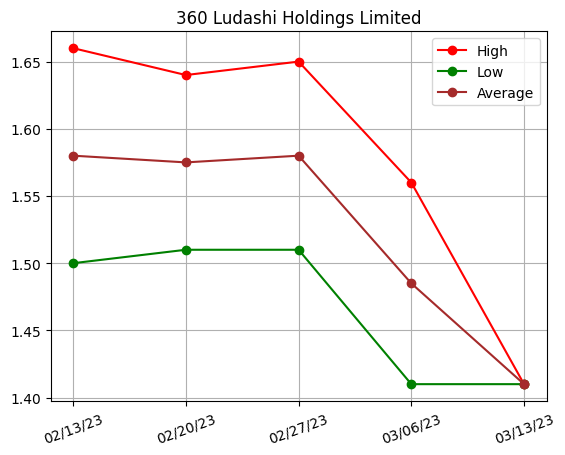
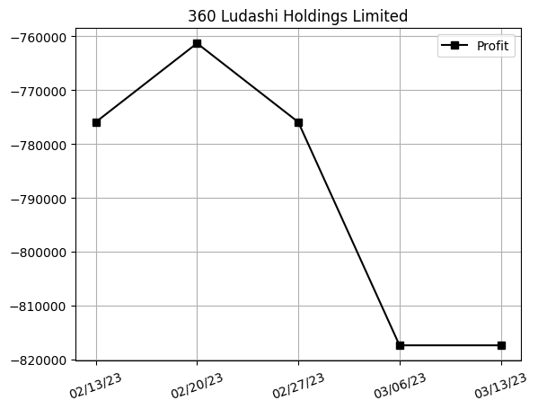
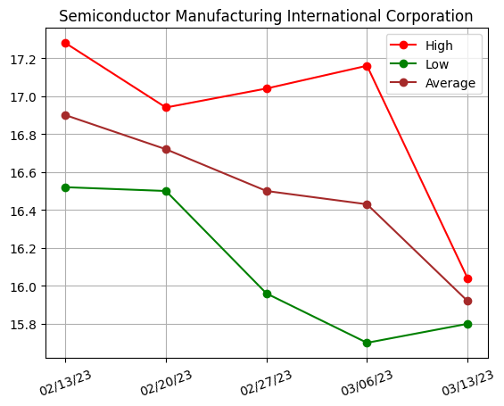
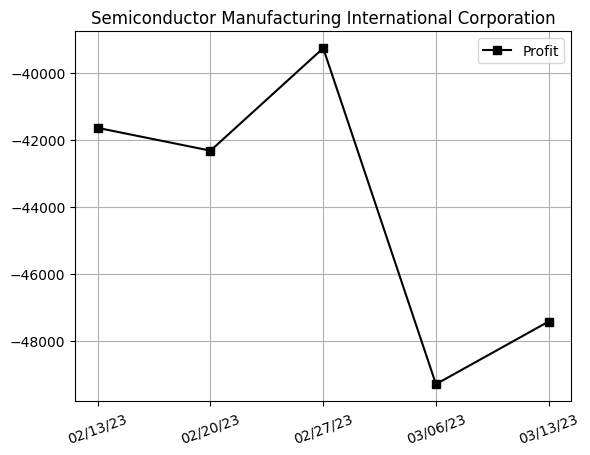

## Net Profit [📉]:
### $-864830.01
|type|graph|data|
|:---:|:---:|:---:|
|1d / 30m||<table border="1" class="dataframe"> <thead> <tr style="text-align: right;"> <th>Datetime</th> <th>Profit</th> </tr> </thead> <tbody> <tr> <td>09:30</td> <td>-864660.01</td> </tr> <tr> <td>10:00</td> <td>-864660.01</td> </tr> </tbody></table>
|7d / 1d||<table border="1" class="dataframe"> <thead> <tr style="text-align: right;"> <th>Date</th> <th>Profit</th> </tr> </thead> <tbody> <tr> <td>03/03/23</td> <td>-815190.00</td> </tr> <tr> <td>03/06/23</td> <td>-828750.01</td> </tr> <tr> <td>03/07/23</td> <td>-833970.00</td> </tr> <tr> <td>03/08/23</td> <td>-842820.00</td> </tr> <tr> <td>03/09/23</td> <td>-842990.00</td> </tr> <tr> <td>03/10/23</td> <td>-866700.01</td> </tr> <tr> <td>03/13/23</td> <td>-864660.01</td> </tr> </tbody></table>
|1mo / 1wk||<table border="1" class="dataframe"> <thead> <tr style="text-align: right;"> <th>Date</th> <th>Profit</th> </tr> </thead> <tbody> <tr> <td>02/13/23</td> <td>-817569.99</td> </tr> <tr> <td>02/20/23</td> <td>-803610.00</td> </tr> <tr> <td>02/27/23</td> <td>-815190.00</td> </tr> <tr> <td>03/06/23</td> <td>-866700.01</td> </tr> <tr> <td>03/13/23</td> <td>-864830.01</td> </tr> </tbody></table>
---
## 3601.HK [📉] [$-817400.01] [-70.38%]:
#### 360 Ludashi Holdings Limited
|price|profit|data|
|:---:|:---:|:---:|
|||<table border="1" class="dataframe"> <thead> <tr style="text-align: right;"> <th>Datetime</th> <th>Profit</th> </tr> </thead> <tbody> <tr> <td>09:30</td> <td>-817400.01</td> </tr> </tbody></table>|
||<table border="1" class="dataframe"> <thead> <tr style="text-align: right;"> <th>Date</th> <th>Profit</th> </tr> </thead> <tbody> <tr> <td>03/03/23</td> <td>-775919.99</td> </tr> <tr> <td>03/06/23</td> <td>-788120.01</td> </tr> <tr> <td>03/07/23</td> <td>-793000.00</td> </tr> <tr> <td>03/08/23</td> <td>-800320.00</td> </tr> <tr> <td>03/09/23</td> <td>-800320.00</td> </tr> <tr> <td>03/10/23</td> <td>-817400.01</td> </tr> <tr> <td>03/13/23</td> <td>-817400.01</td> </tr> </tbody></table>|
||<table border="1" class="dataframe"> <thead> <tr style="text-align: right;"> <th>Date</th> <th>Profit</th> </tr> </thead> <tbody> <tr> <td>02/13/23</td> <td>-775919.99</td> </tr> <tr> <td>02/20/23</td> <td>-761280.00</td> </tr> <tr> <td>02/27/23</td> <td>-775919.99</td> </tr> <tr> <td>03/06/23</td> <td>-817400.01</td> </tr> <tr> <td>03/13/23</td> <td>-817400.01</td> </tr> </tbody></table>|
---
## 0981.HK [📉] [$-47430.00] [-25.95%]:
#### Semiconductor Manufacturing International Corporation
|price|profit|data|
|:---:|:---:|:---:|
|||<table border="1" class="dataframe"> <thead> <tr style="text-align: right;"> <th>Datetime</th> <th>Profit</th> </tr> </thead> <tbody> <tr> <td>09:30</td> <td>-47260.00</td> </tr> <tr> <td>10:00</td> <td>-47260.00</td> </tr> </tbody></table>|
||<table border="1" class="dataframe"> <thead> <tr style="text-align: right;"> <th>Date</th> <th>Profit</th> </tr> </thead> <tbody> <tr> <td>03/03/23</td> <td>-39270.01</td> </tr> <tr> <td>03/06/23</td> <td>-40630.01</td> </tr> <tr> <td>03/07/23</td> <td>-40970.00</td> </tr> <tr> <td>03/08/23</td> <td>-42500.00</td> </tr> <tr> <td>03/09/23</td> <td>-42670.00</td> </tr> <tr> <td>03/10/23</td> <td>-49300.00</td> </tr> <tr> <td>03/13/23</td> <td>-47260.00</td> </tr> </tbody></table>|
||<table border="1" class="dataframe"> <thead> <tr style="text-align: right;"> <th>Date</th> <th>Profit</th> </tr> </thead> <tbody> <tr> <td>02/13/23</td> <td>-41650.00</td> </tr> <tr> <td>02/20/23</td> <td>-42330.00</td> </tr> <tr> <td>02/27/23</td> <td>-39270.01</td> </tr> <tr> <td>03/06/23</td> <td>-49300.00</td> </tr> <tr> <td>03/13/23</td> <td>-47430.00</td> </tr> </tbody></table>|
---
