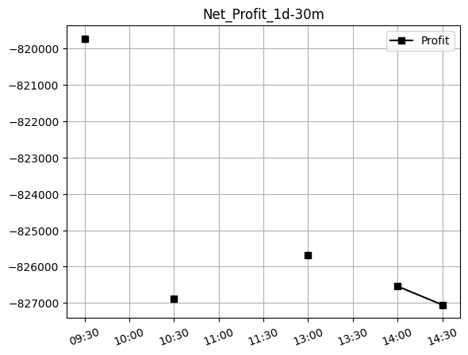
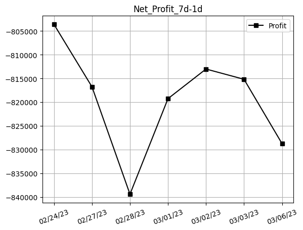
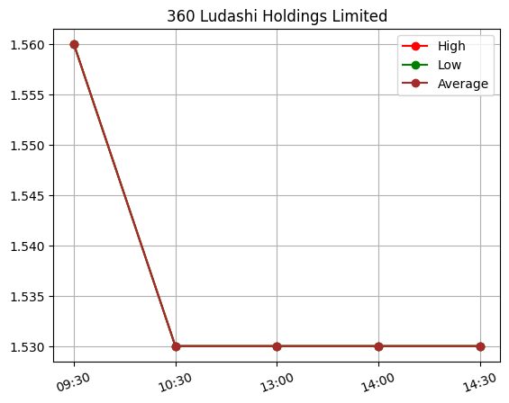
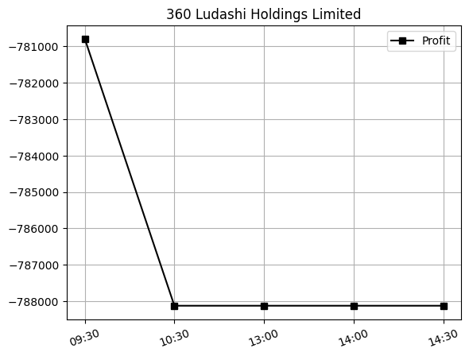
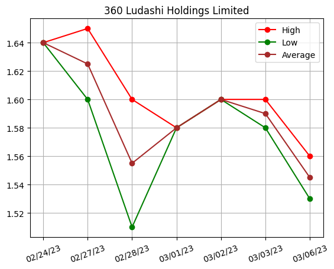
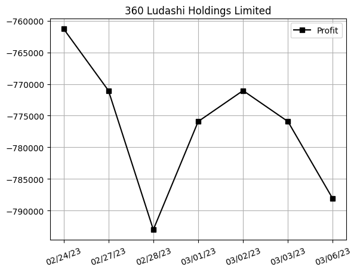
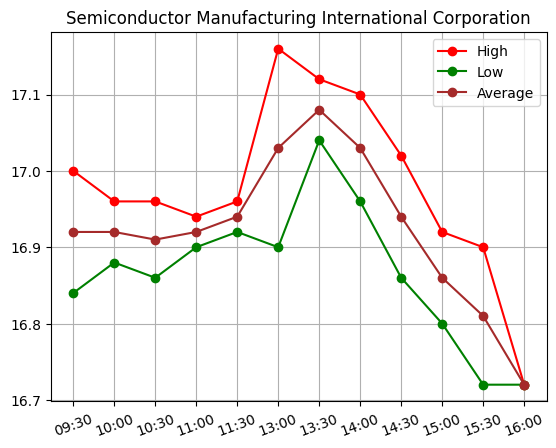
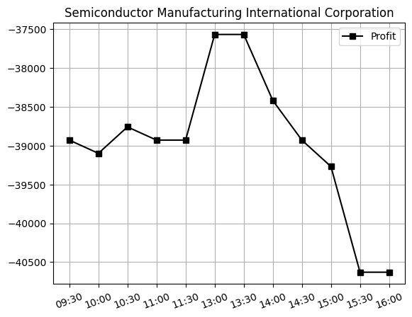
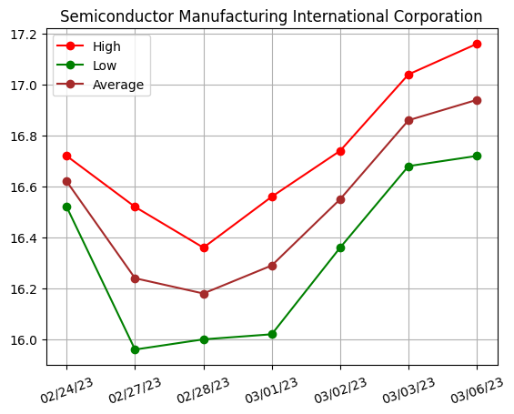
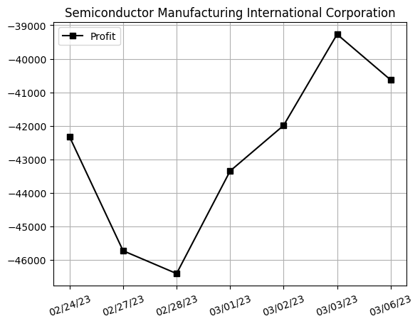

## Net Profit [📉]:
### $-828750.01
|type|graph|data|
|:---:|:---:|:---:|
|30m / 1d||<table border="1" class="dataframe"> <thead> <tr style="text-align: right;"> <th>Datetime</th> <th>Profit</th> </tr> </thead> <tbody> <tr> <td>09:30</td> <td>-819730.01</td> </tr> <tr> <td>10:00</td> <td>nan</td> </tr> <tr> <td>10:30</td> <td>-826880.00</td> </tr> <tr> <td>11:00</td> <td>nan</td> </tr> <tr> <td>11:30</td> <td>nan</td> </tr> <tr> <td>13:00</td> <td>-825690.01</td> </tr> <tr> <td>13:30</td> <td>nan</td> </tr> <tr> <td>14:00</td> <td>-826540.01</td> </tr> <tr> <td>14:30</td> <td>-827050.01</td> </tr> <tr> <td>15:00</td> <td>nan</td> </tr> <tr> <td>15:30</td> <td>nan</td> </tr> <tr> <td>16:00</td> <td>nan</td> </tr> </tbody></table>
|1d / 7d||<table border="1" class="dataframe"> <thead> <tr style="text-align: right;"> <th>Date</th> <th>Profit</th> </tr> </thead> <tbody> <tr> <td>02/24/23</td> <td>-803610.00</td> </tr> <tr> <td>02/27/23</td> <td>-816769.99</td> </tr> <tr> <td>02/28/23</td> <td>-839409.99</td> </tr> <tr> <td>03/01/23</td> <td>-819269.99</td> </tr> <tr> <td>03/02/23</td> <td>-813030.00</td> </tr> <tr> <td>03/03/23</td> <td>-815190.00</td> </tr> <tr> <td>03/06/23</td> <td>-828750.01</td> </tr> </tbody></table>
---
## 3601.HK [📉] [$-788120.01] [-67.86%]:
#### 360 Ludashi Holdings Limited
|price|profit|data|
|:---:|:---:|:---:|
|||<table border="1" class="dataframe"> <thead> <tr style="text-align: right;"> <th>Datetime</th> <th>Profit</th> </tr> </thead> <tbody> <tr> <td>09:30</td> <td>-780800.01</td> </tr> <tr> <td>10:30</td> <td>-788120.01</td> </tr> <tr> <td>13:00</td> <td>-788120.01</td> </tr> <tr> <td>14:00</td> <td>-788120.01</td> </tr> <tr> <td>14:30</td> <td>-788120.01</td> </tr> </tbody></table>|
||<table border="1" class="dataframe"> <thead> <tr style="text-align: right;"> <th>Date</th> <th>Profit</th> </tr> </thead> <tbody> <tr> <td>02/24/23</td> <td>-761280.00</td> </tr> <tr> <td>02/27/23</td> <td>-771039.99</td> </tr> <tr> <td>02/28/23</td> <td>-793000.00</td> </tr> <tr> <td>03/01/23</td> <td>-775919.99</td> </tr> <tr> <td>03/02/23</td> <td>-771039.99</td> </tr> <tr> <td>03/03/23</td> <td>-775919.99</td> </tr> <tr> <td>03/06/23</td> <td>-788120.01</td> </tr> </tbody></table>|
---
## 0981.HK [📉] [$-40630.01] [-22.23%]:
#### Semiconductor Manufacturing International Corporation
|price|profit|data|
|:---:|:---:|:---:|
|||<table border="1" class="dataframe"> <thead> <tr style="text-align: right;"> <th>Datetime</th> <th>Profit</th> </tr> </thead> <tbody> <tr> <td>09:30</td> <td>-38930.00</td> </tr> <tr> <td>10:00</td> <td>-39100.00</td> </tr> <tr> <td>10:30</td> <td>-38760.00</td> </tr> <tr> <td>11:00</td> <td>-38930.00</td> </tr> <tr> <td>11:30</td> <td>-38930.00</td> </tr> <tr> <td>13:00</td> <td>-37570.00</td> </tr> <tr> <td>13:30</td> <td>-37570.00</td> </tr> <tr> <td>14:00</td> <td>-38420.00</td> </tr> <tr> <td>14:30</td> <td>-38930.00</td> </tr> <tr> <td>15:00</td> <td>-39270.01</td> </tr> <tr> <td>15:30</td> <td>-40630.01</td> </tr> <tr> <td>16:00</td> <td>-40630.01</td> </tr> </tbody></table>|
||<table border="1" class="dataframe"> <thead> <tr style="text-align: right;"> <th>Date</th> <th>Profit</th> </tr> </thead> <tbody> <tr> <td>02/24/23</td> <td>-42330.00</td> </tr> <tr> <td>02/27/23</td> <td>-45729.99</td> </tr> <tr> <td>02/28/23</td> <td>-46409.99</td> </tr> <tr> <td>03/01/23</td> <td>-43350.00</td> </tr> <tr> <td>03/02/23</td> <td>-41990.00</td> </tr> <tr> <td>03/03/23</td> <td>-39270.01</td> </tr> <tr> <td>03/06/23</td> <td>-40630.01</td> </tr> </tbody></table>|
---
