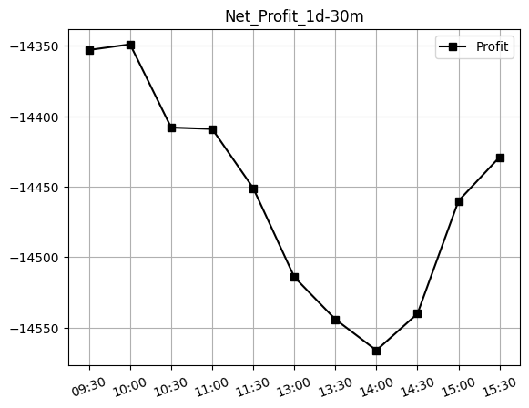
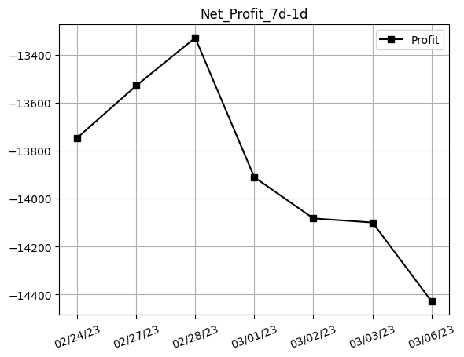

## Net Profit [:heavy_minus_sign:]:
### $-14429.00
|30m / 1d|1d / 7d|
|:---:|:---:|
|||
---
## 3033.HK [$3946.00] [65.77%]:
#### CSOP Hang Seng TECH Index ETF
|price|profit|data|
|:---:|:---:|:---:|
|||<table border="1" class="dataframe">  <thead>    <tr style="text-align: right;">      <th>Datetime</th>      <th>Profit</th>    </tr>  </thead>  <tbody>    <tr>      <td>09:30</td>      <td>3947.00</td>    </tr>    <tr>      <td>10:00</td>      <td>3951.00</td>    </tr>    <tr>      <td>10:30</td>      <td>3942.00</td>    </tr>    <tr>      <td>11:00</td>      <td>3941.00</td>    </tr>    <tr>      <td>11:30</td>      <td>3949.00</td>    </tr>    <tr>      <td>13:00</td>      <td>3936.00</td>    </tr>    <tr>      <td>13:30</td>      <td>3931.00</td>    </tr>    <tr>      <td>14:00</td>      <td>3934.00</td>    </tr>    <tr>      <td>14:30</td>      <td>3935.00</td>    </tr>    <tr>      <td>15:00</td>      <td>3940.00</td>    </tr>    <tr>      <td>15:30</td>      <td>3946.00</td>    </tr>    <tr>      <td>16:00</td>      <td>3946.00</td>    </tr>  </tbody></table>|
|||<table border="1" class="dataframe">  <thead>    <tr style="text-align: right;">      <th>Date</th>      <th>Profit</th>    </tr>  </thead>  <tbody>    <tr>      <td>02/24/23</td>      <td>4027.00</td>    </tr>    <tr>      <td>02/27/23</td>      <td>4045.00</td>    </tr>    <tr>      <td>02/28/23</td>      <td>4070.00</td>    </tr>    <tr>      <td>03/01/23</td>      <td>3939.00</td>    </tr>    <tr>      <td>03/02/23</td>      <td>3967.00</td>    </tr>    <tr>      <td>03/03/23</td>      <td>3925.00</td>    </tr>    <tr>      <td>03/06/23</td>      <td>3946.00</td>    </tr>  </tbody></table>|
||
---
## 0001.HK [$-18375.00] [-306.25%]:
#### CK Hutchison Holdings Limited
|price|profit|data|
|:---:|:---:|:---:|
|||<table border="1" class="dataframe">  <thead>    <tr style="text-align: right;">      <th>Datetime</th>      <th>Profit</th>    </tr>  </thead>  <tbody>    <tr>      <td>09:30</td>      <td>-18300.00</td>    </tr>    <tr>      <td>10:00</td>      <td>-18300.00</td>    </tr>    <tr>      <td>10:30</td>      <td>-18350.00</td>    </tr>    <tr>      <td>11:00</td>      <td>-18350.00</td>    </tr>    <tr>      <td>11:30</td>      <td>-18400.00</td>    </tr>    <tr>      <td>13:00</td>      <td>-18450.00</td>    </tr>    <tr>      <td>13:30</td>      <td>-18475.00</td>    </tr>    <tr>      <td>14:00</td>      <td>-18500.00</td>    </tr>    <tr>      <td>14:30</td>      <td>-18475.00</td>    </tr>    <tr>      <td>15:00</td>      <td>-18400.00</td>    </tr>    <tr>      <td>15:30</td>      <td>-18375.00</td>    </tr>  </tbody></table>|
|||<table border="1" class="dataframe">  <thead>    <tr style="text-align: right;">      <th>Date</th>      <th>Profit</th>    </tr>  </thead>  <tbody>    <tr>      <td>02/24/23</td>      <td>-17775.00</td>    </tr>    <tr>      <td>02/27/23</td>      <td>-17575.00</td>    </tr>    <tr>      <td>02/28/23</td>      <td>-17400.00</td>    </tr>    <tr>      <td>03/01/23</td>      <td>-17850.00</td>    </tr>    <tr>      <td>03/02/23</td>      <td>-18050.00</td>    </tr>    <tr>      <td>03/03/23</td>      <td>-18025.00</td>    </tr>    <tr>      <td>03/06/23</td>      <td>-18375.00</td>    </tr>  </tbody></table>|
||
---
