## Net Profit [📉]:
### $-2357.00
|type|graph|data|
|:---:|:---:|:---:|
|30m / 1d|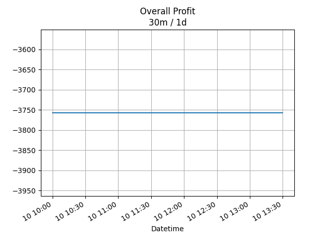|<table border="1" class="dataframe"> <thead> <tr style="text-align: center;"> <th>Datetime</th> <th>profit</th> </tr> </thead> <tbody> <tr> <td>09:30</td> <td>NaN</td> </tr> <tr> <td>10:00</td> <td>NaN</td> </tr> <tr> <td>10:30</td> <td>NaN</td> </tr> <tr> <td>11:00</td> <td>NaN</td> </tr> <tr> <td>11:30</td> <td>NaN</td> </tr> <tr> <td>13:00</td> <td>NaN</td> </tr> <tr> <td>13:30</td> <td>NaN</td> </tr> <tr> <td>14:00</td> <td>NaN</td> </tr> <tr> <td>14:30</td> <td>NaN</td> </tr> <tr> <td>15:00</td> <td>NaN</td> </tr> <tr> <td>15:30</td> <td>NaN</td> </tr> <tr> <td>16:00</td> <td>NaN</td> </tr> </tbody></table>|
|1d / 5d||<table border="1" class="dataframe"> <thead> <tr style="text-align: center;"> <th>Date</th> <th>profit</th> </tr> </thead> <tbody> <tr> <td>2025-11-18</td> <td>-2327.0</td> </tr> <tr> <td>2025-11-19</td> <td>-2312.0</td> </tr> <tr> <td>2025-11-20</td> <td>-2337.0</td> </tr> <tr> <td>2025-11-21</td> <td>-2507.0</td> </tr> <tr> <td>2025-11-24</td> <td>-2287.0</td> </tr> </tbody></table>|
|1wk / 1mo|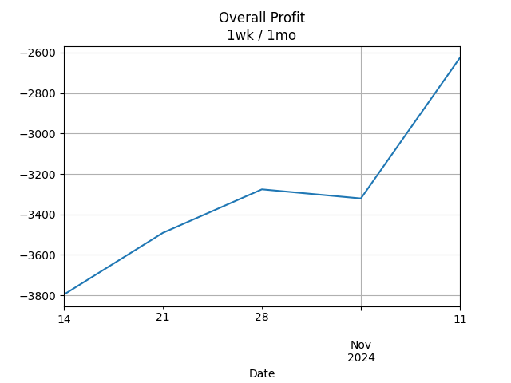|<table border="1" class="dataframe"> <thead> <tr style="text-align: center;"> <th>Date</th> <th>profit</th> </tr> </thead> <tbody> <tr> <td>2025-10-20</td> <td>-2287.0</td> </tr> <tr> <td>2025-10-27</td> <td>-2312.0</td> </tr> <tr> <td>2025-11-03</td> <td>-2217.0</td> </tr> <tr> <td>2025-11-10</td> <td>-2207.0</td> </tr> <tr> <td>2025-11-17</td> <td>-2507.0</td> </tr> </tbody></table>|
---
## 0573.HK [📉] [$-612.00] [-32.69%]:
#### TAO HEUNG HLDGS
|price|profit|data|
|:---:|:---:|:---:|
|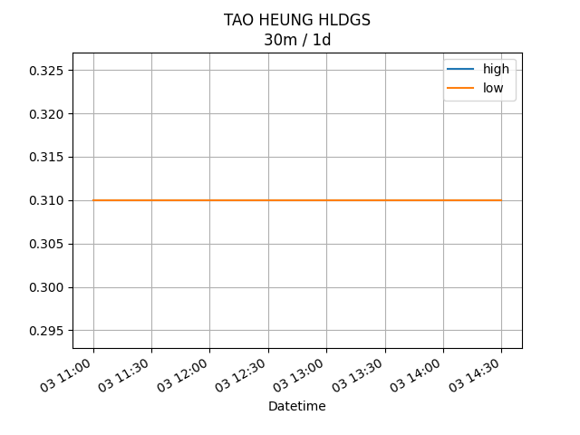|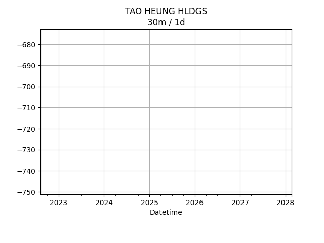|<table border="1" class="dataframe"> <thead> <tr style="text-align: center;"> <th>Datetime</th> <th>profit</th> </tr> </thead> <tbody> <tr> <td>15:30</td> <td>-612.0</td> </tr> </tbody></table>|
|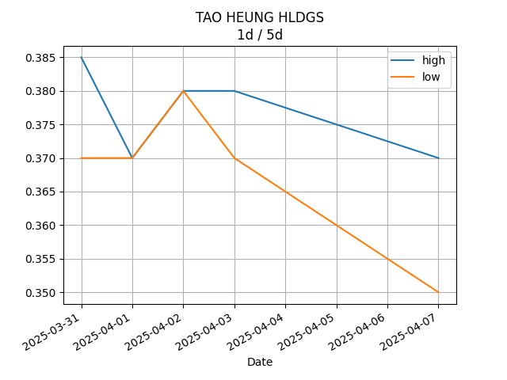|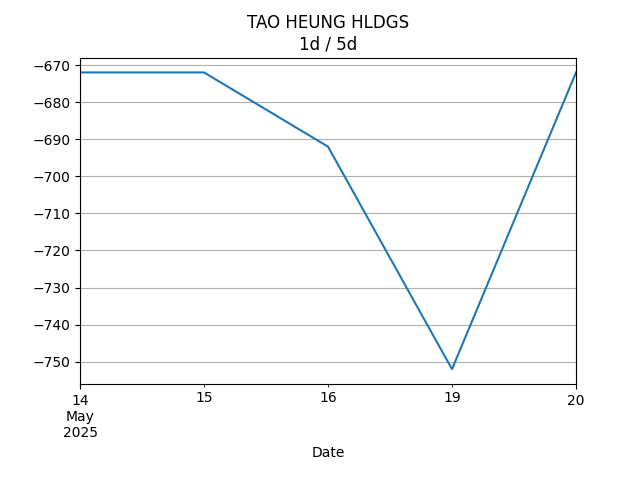|<table border="1" class="dataframe"> <thead> <tr style="text-align: center;"> <th>Date</th> <th>profit</th> </tr> </thead> <tbody> <tr> <td>2025-11-18</td> <td>-552.0</td> </tr> <tr> <td>2025-11-19</td> <td>-552.0</td> </tr> <tr> <td>2025-11-20</td> <td>-552.0</td> </tr> <tr> <td>2025-11-21</td> <td>-612.0</td> </tr> <tr> <td>2025-11-24</td> <td>-612.0</td> </tr> </tbody></table>|
|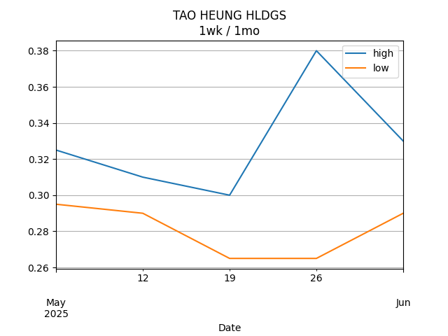|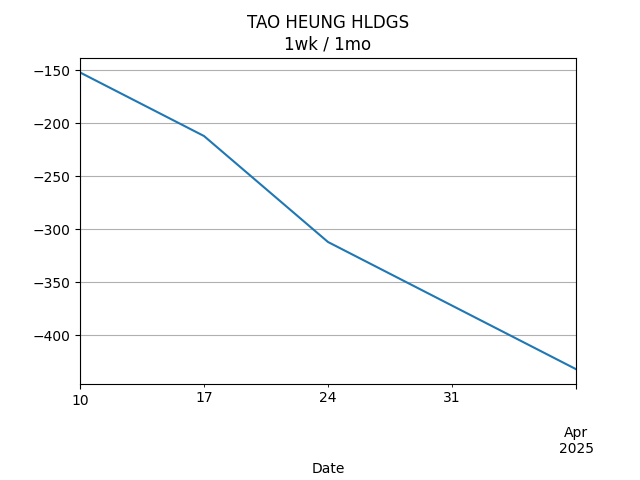|<table border="1" class="dataframe"> <thead> <tr style="text-align: center;"> <th>Date</th> <th>profit</th> </tr> </thead> <tbody> <tr> <td>2025-10-20</td> <td>-532.0</td> </tr> <tr> <td>2025-10-27</td> <td>-512.0</td> </tr> <tr> <td>2025-11-03</td> <td>-532.0</td> </tr> <tr> <td>2025-11-10</td> <td>-552.0</td> </tr> <tr> <td>2025-11-17</td> <td>-612.0</td> </tr> </tbody></table>|
---
## 0560.HK [📉] [$-176.00] [-5.47%]:
#### CHU KONG SHIP
|price|profit|data|
|:---:|:---:|:---:|
|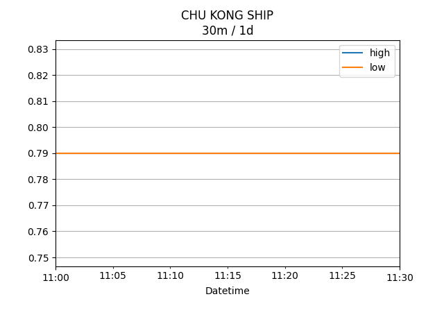|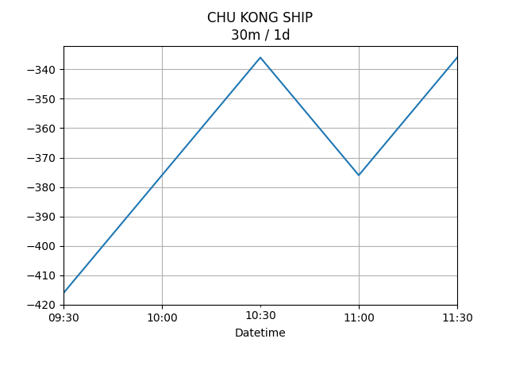|<table border="1" class="dataframe"> <thead> <tr style="text-align: center;"> <th>Datetime</th> <th>profit</th> </tr> </thead> <tbody> <tr> <td>10:00</td> <td>-136.0</td> </tr> <tr> <td>11:00</td> <td>-176.0</td> </tr> <tr> <td>11:30</td> <td>-136.0</td> </tr> <tr> <td>14:00</td> <td>-176.0</td> </tr> </tbody></table>|
|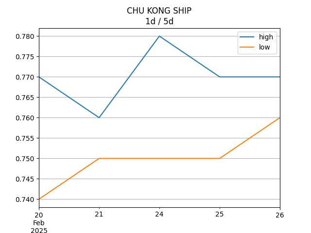|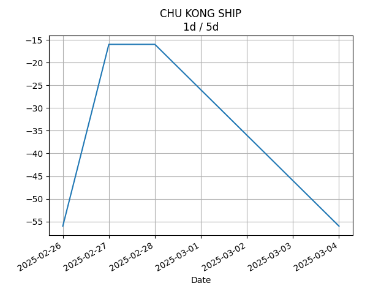|<table border="1" class="dataframe"> <thead> <tr style="text-align: center;"> <th>Date</th> <th>profit</th> </tr> </thead> <tbody> <tr> <td>2025-11-18</td> <td>-136.0</td> </tr> <tr> <td>2025-11-19</td> <td>-136.0</td> </tr> <tr> <td>2025-11-20</td> <td>-176.0</td> </tr> <tr> <td>2025-11-21</td> <td>-136.0</td> </tr> <tr> <td>2025-11-24</td> <td>-176.0</td> </tr> </tbody></table>|
|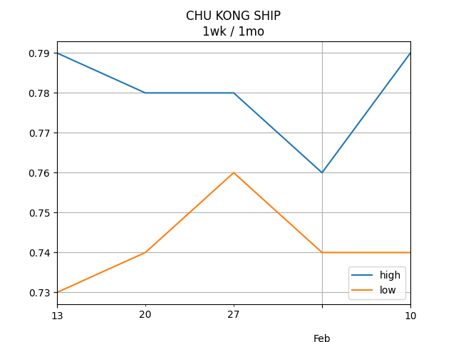|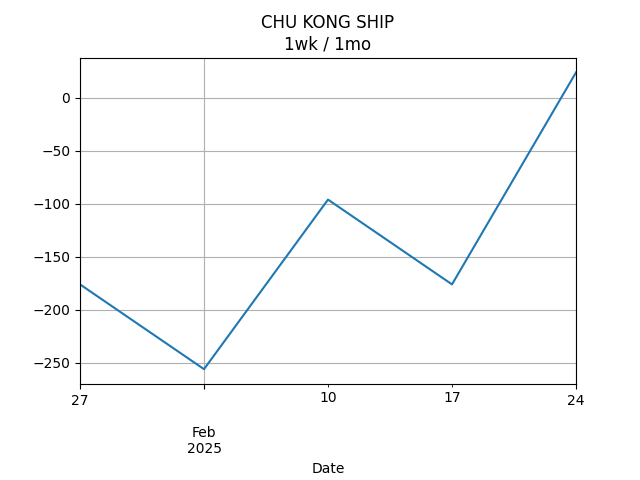|<table border="1" class="dataframe"> <thead> <tr style="text-align: center;"> <th>Date</th> <th>profit</th> </tr> </thead> <tbody> <tr> <td>2025-10-20</td> <td>-96.0</td> </tr> <tr> <td>2025-10-27</td> <td>-96.0</td> </tr> <tr> <td>2025-11-03</td> <td>-136.0</td> </tr> <tr> <td>2025-11-10</td> <td>-96.0</td> </tr> <tr> <td>2025-11-17</td> <td>-136.0</td> </tr> </tbody></table>|
---
## 0709.HK [📉] [$-1136.00] [-27.20%]:
#### GIORDANO INT'L
|price|profit|data|
|:---:|:---:|:---:|
|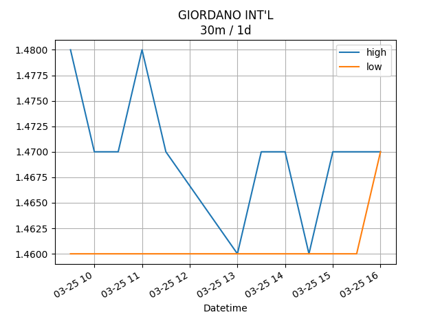||<table border="1" class="dataframe"> <thead> <tr style="text-align: center;"> <th>Datetime</th> <th>profit</th> </tr> </thead> <tbody> <tr> <td>09:30</td> <td>-1136.0</td> </tr> <tr> <td>10:00</td> <td>-1156.0</td> </tr> <tr> <td>10:30</td> <td>-1136.0</td> </tr> <tr> <td>11:30</td> <td>-1136.0</td> </tr> <tr> <td>13:00</td> <td>-1156.0</td> </tr> <tr> <td>14:00</td> <td>-1156.0</td> </tr> <tr> <td>14:30</td> <td>-1156.0</td> </tr> <tr> <td>15:00</td> <td>-1156.0</td> </tr> <tr> <td>15:30</td> <td>-1136.0</td> </tr> </tbody></table>|
|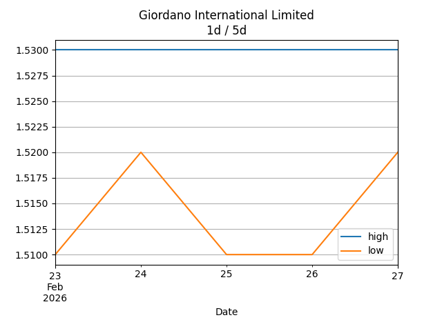||<table border="1" class="dataframe"> <thead> <tr style="text-align: center;"> <th>Date</th> <th>profit</th> </tr> </thead> <tbody> <tr> <td>2025-11-18</td> <td>-1156.0</td> </tr> <tr> <td>2025-11-19</td> <td>-1136.0</td> </tr> <tr> <td>2025-11-20</td> <td>-1116.0</td> </tr> <tr> <td>2025-11-21</td> <td>-1156.0</td> </tr> <tr> <td>2025-11-24</td> <td>-1136.0</td> </tr> </tbody></table>|
|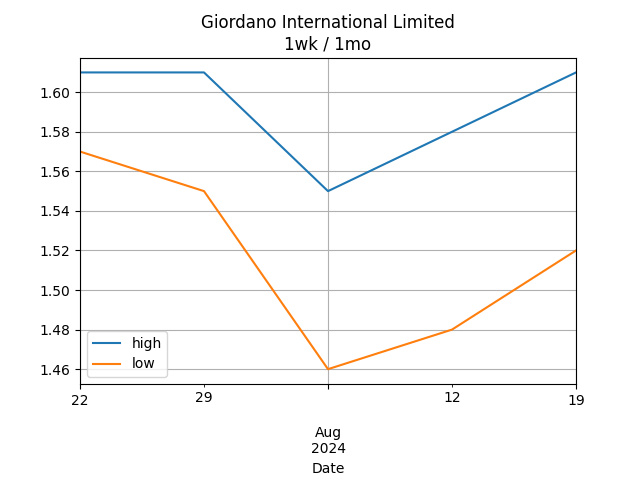|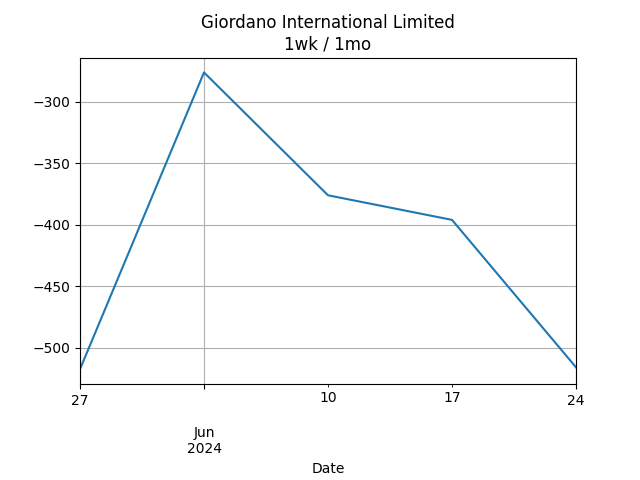|<table border="1" class="dataframe"> <thead> <tr style="text-align: center;"> <th>Date</th> <th>profit</th> </tr> </thead> <tbody> <tr> <td>2025-10-20</td> <td>-1176.0</td> </tr> <tr> <td>2025-10-27</td> <td>-1216.0</td> </tr> <tr> <td>2025-11-03</td> <td>-1216.0</td> </tr> <tr> <td>2025-11-10</td> <td>-1156.0</td> </tr> <tr> <td>2025-11-17</td> <td>-1156.0</td> </tr> </tbody></table>|
---
## 1310.HK [📈] [$381.00] [13.05%]:
#### HKBN
|price|profit|data|
|:---:|:---:|:---:|
|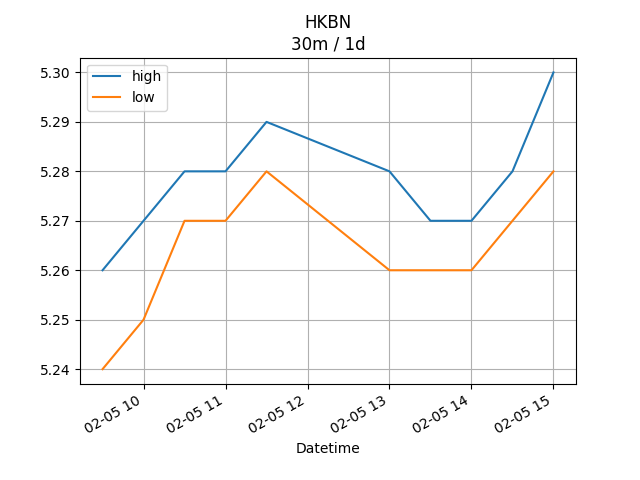||<table border="1" class="dataframe"> <thead> <tr style="text-align: center;"> <th>Datetime</th> <th>profit</th> </tr> </thead> <tbody> <tr> <td>09:30</td> <td>286.0</td> </tr> <tr> <td>10:00</td> <td>301.0</td> </tr> <tr> <td>10:30</td> <td>306.0</td> </tr> <tr> <td>11:00</td> <td>306.0</td> </tr> <tr> <td>11:30</td> <td>316.0</td> </tr> <tr> <td>13:00</td> <td>316.0</td> </tr> <tr> <td>13:30</td> <td>356.0</td> </tr> <tr> <td>14:00</td> <td>356.0</td> </tr> <tr> <td>14:30</td> <td>356.0</td> </tr> <tr> <td>15:00</td> <td>356.0</td> </tr> <tr> <td>15:30</td> <td>381.0</td> </tr> </tbody></table>|
|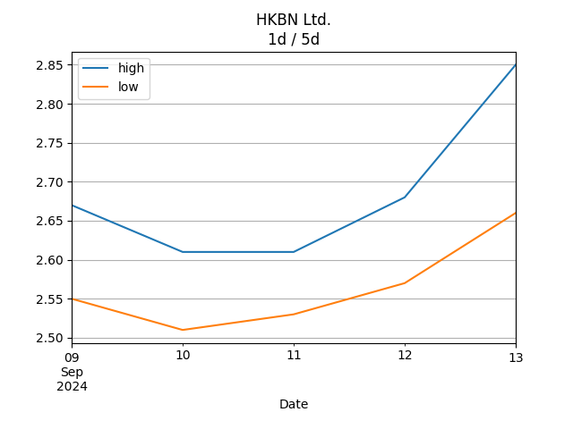|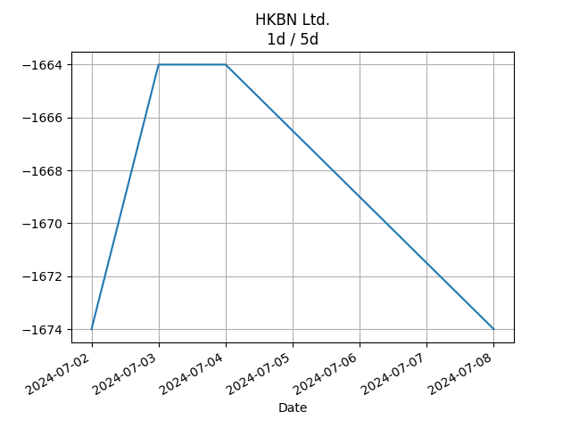|<table border="1" class="dataframe"> <thead> <tr style="text-align: center;"> <th>Date</th> <th>profit</th> </tr> </thead> <tbody> <tr> <td>2025-11-18</td> <td>376.0</td> </tr> <tr> <td>2025-11-19</td> <td>376.0</td> </tr> <tr> <td>2025-11-20</td> <td>356.0</td> </tr> <tr> <td>2025-11-21</td> <td>251.0</td> </tr> <tr> <td>2025-11-24</td> <td>451.0</td> </tr> </tbody></table>|
|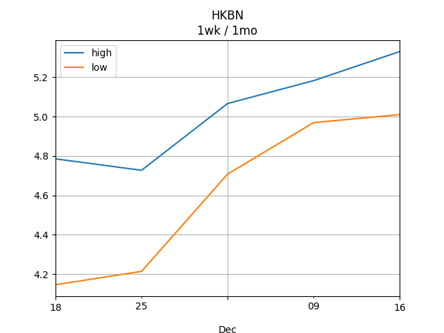|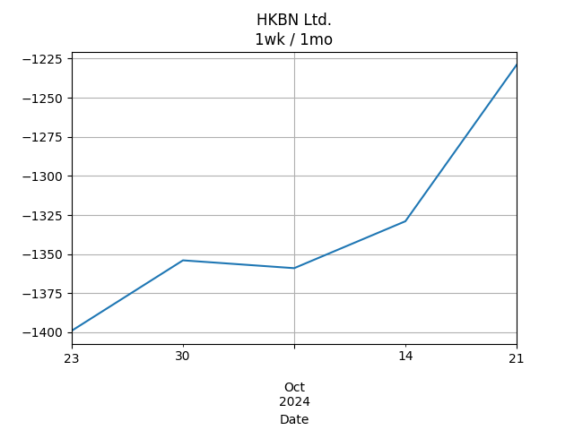|<table border="1" class="dataframe"> <thead> <tr style="text-align: center;"> <th>Date</th> <th>profit</th> </tr> </thead> <tbody> <tr> <td>2025-10-20</td> <td>491.0</td> </tr> <tr> <td>2025-10-27</td> <td>496.0</td> </tr> <tr> <td>2025-11-03</td> <td>581.0</td> </tr> <tr> <td>2025-11-10</td> <td>456.0</td> </tr> <tr> <td>2025-11-17</td> <td>251.0</td> </tr> </tbody></table>|
---
## 2638.HK [📈] [$251.00] [8.81%]:
#### HK Electric Investments and HK Electric Investments Limited
|price|profit|data|
|:---:|:---:|:---:|
|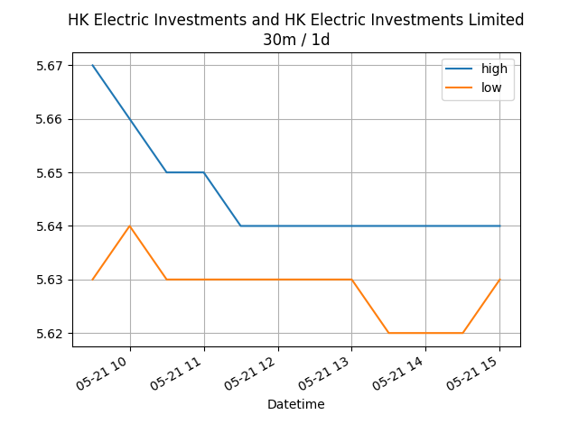|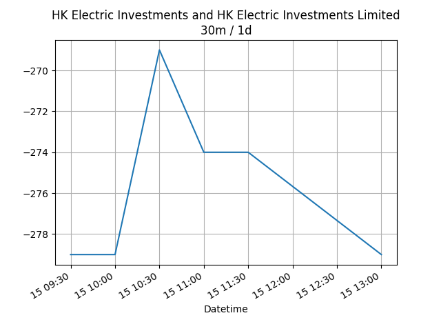|<table border="1" class="dataframe"> <thead> <tr style="text-align: center;"> <th>Datetime</th> <th>profit</th> </tr> </thead> <tbody> <tr> <td>09:30</td> <td>251.0</td> </tr> <tr> <td>10:00</td> <td>251.0</td> </tr> <tr> <td>10:30</td> <td>241.0</td> </tr> <tr> <td>11:00</td> <td>246.0</td> </tr> <tr> <td>11:30</td> <td>246.0</td> </tr> <tr> <td>13:00</td> <td>246.0</td> </tr> <tr> <td>13:30</td> <td>246.0</td> </tr> <tr> <td>14:00</td> <td>246.0</td> </tr> <tr> <td>14:30</td> <td>246.0</td> </tr> <tr> <td>15:00</td> <td>251.0</td> </tr> <tr> <td>15:30</td> <td>246.0</td> </tr> <tr> <td>16:00</td> <td>251.0</td> </tr> </tbody></table>|
|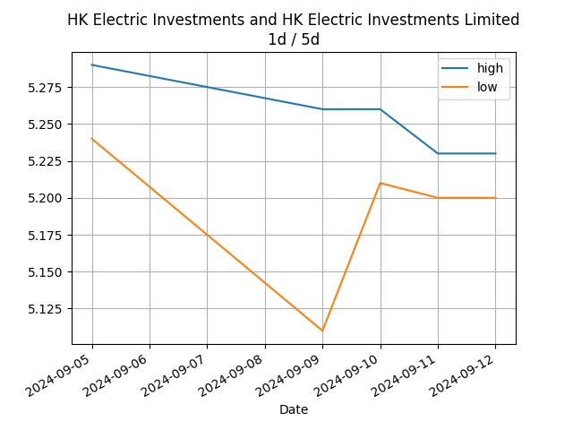|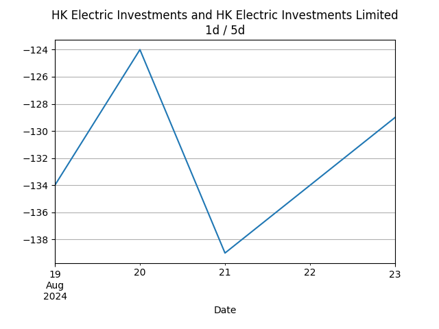|<table border="1" class="dataframe"> <thead> <tr style="text-align: center;"> <th>Date</th> <th>profit</th> </tr> </thead> <tbody> <tr> <td>2025-11-18</td> <td>236.0</td> </tr> <tr> <td>2025-11-19</td> <td>231.0</td> </tr> <tr> <td>2025-11-20</td> <td>246.0</td> </tr> <tr> <td>2025-11-21</td> <td>241.0</td> </tr> <tr> <td>2025-11-24</td> <td>251.0</td> </tr> </tbody></table>|
|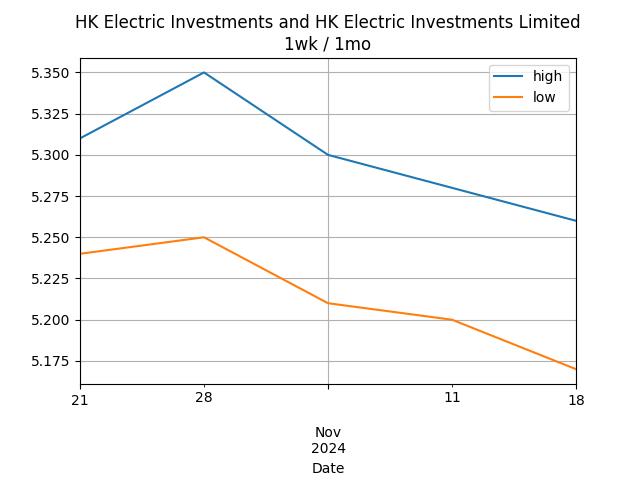|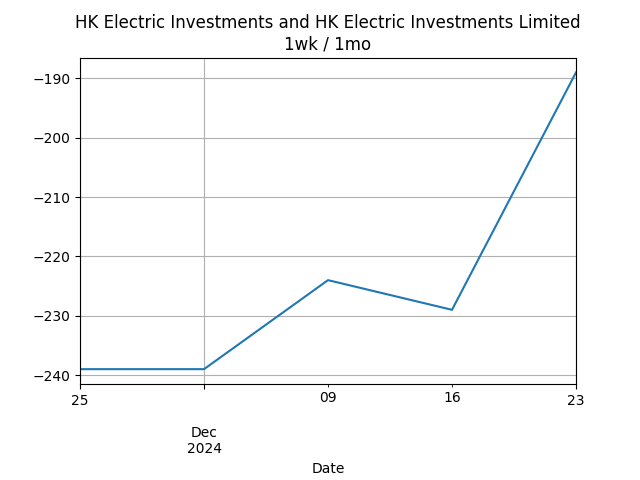|<table border="1" class="dataframe"> <thead> <tr style="text-align: center;"> <th>Date</th> <th>profit</th> </tr> </thead> <tbody> <tr> <td>2025-10-20</td> <td>181.0</td> </tr> <tr> <td>2025-10-27</td> <td>171.0</td> </tr> <tr> <td>2025-11-03</td> <td>211.0</td> </tr> <tr> <td>2025-11-10</td> <td>236.0</td> </tr> <tr> <td>2025-11-17</td> <td>241.0</td> </tr> </tbody></table>|
---
## 0533.HK [📉] [$-1065.00] [-26.79%]:
#### GOLDLION HOLD
|price|profit|data|
|:---:|:---:|:---:|
||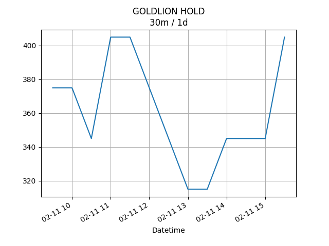|<table border="1" class="dataframe"> <thead> <tr style="text-align: center;"> <th>Datetime</th> <th>profit</th> </tr> </thead> <tbody> <tr> <td>10:00</td> <td>-1095.0</td> </tr> <tr> <td>13:00</td> <td>-1125.0</td> </tr> <tr> <td>15:00</td> <td>-1065.0</td> </tr> </tbody></table>|
|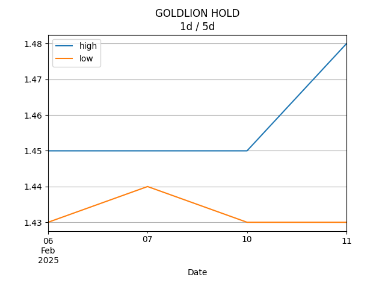|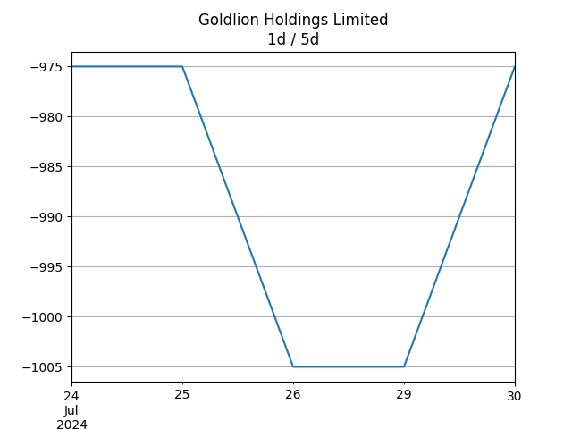|<table border="1" class="dataframe"> <thead> <tr style="text-align: center;"> <th>Date</th> <th>profit</th> </tr> </thead> <tbody> <tr> <td>2025-11-18</td> <td>-1095.0</td> </tr> <tr> <td>2025-11-19</td> <td>-1095.0</td> </tr> <tr> <td>2025-11-20</td> <td>-1095.0</td> </tr> <tr> <td>2025-11-21</td> <td>-1095.0</td> </tr> <tr> <td>2025-11-24</td> <td>-1065.0</td> </tr> </tbody></table>|
|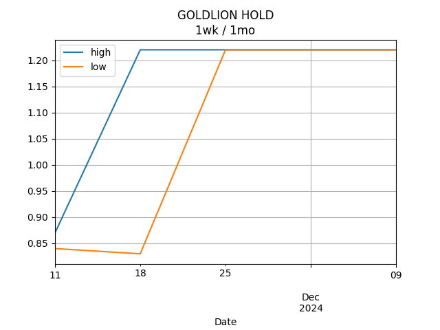|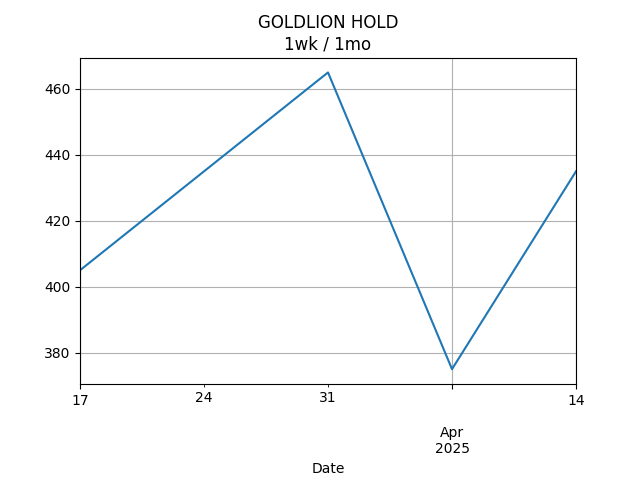|<table border="1" class="dataframe"> <thead> <tr style="text-align: center;"> <th>Date</th> <th>profit</th> </tr> </thead> <tbody> <tr> <td>2025-10-20</td> <td>-1155.0</td> </tr> <tr> <td>2025-10-27</td> <td>-1155.0</td> </tr> <tr> <td>2025-11-03</td> <td>-1125.0</td> </tr> <tr> <td>2025-11-10</td> <td>-1095.0</td> </tr> <tr> <td>2025-11-17</td> <td>-1095.0</td> </tr> </tbody></table>|
---
