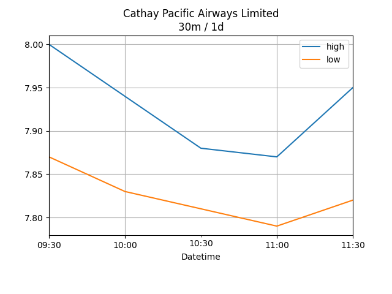
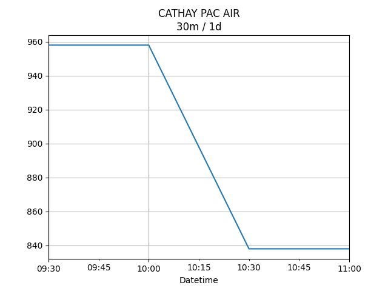
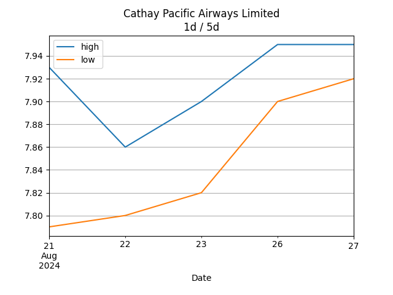
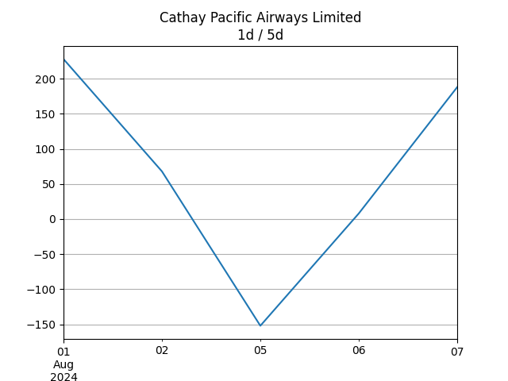
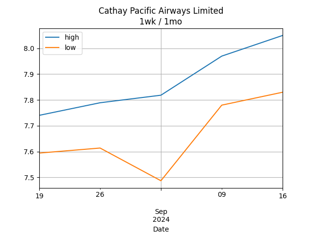
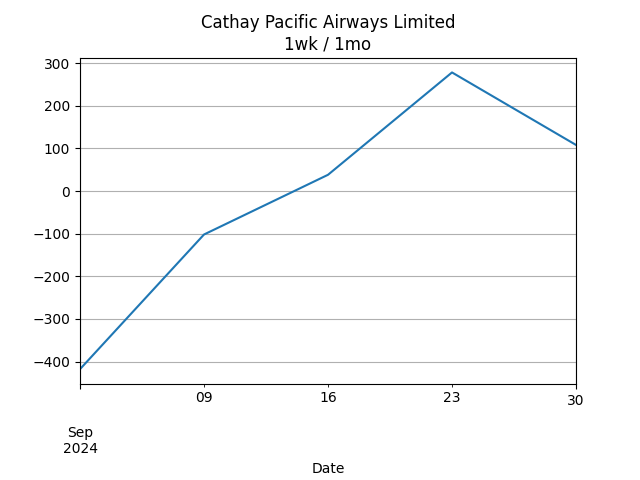

## Net Profit [📉]:
### $-2186.00
|type|graph|data|
|:---:|:---:|:---:|
|30m / 1d|||
|1d / 5d||<table border="1" class="dataframe"> <thead> <tr style="text-align: center;"> <th>Date</th> <th>profit</th> </tr> </thead> <tbody> <tr> <td>2024-07-09</td> <td>-3496.0</td> </tr> <tr> <td>2024-07-10</td> <td>-3531.0</td> </tr> <tr> <td>2024-07-11</td> <td>-3331.0</td> </tr> <tr> <td>2024-07-12</td> <td>-3081.0</td> </tr> <tr> <td>2024-07-15</td> <td>-3081.0</td> </tr> </tbody></table>|
|1wk / 1mo||<table border="1" class="dataframe"> <thead> <tr style="text-align: center;"> <th>Date</th> <th>profit</th> </tr> </thead> <tbody> <tr> <td>2024-06-17</td> <td>-3226.0</td> </tr> <tr> <td>2024-06-24</td> <td>-3656.0</td> </tr> <tr> <td>2024-07-01</td> <td>-3486.0</td> </tr> <tr> <td>2024-07-08</td> <td>-3081.0</td> </tr> <tr> <td>2024-07-15</td> <td>-3081.0</td> </tr> </tbody></table>|
---
## 0293.HK [📈] [$268.00] [3.34%]:
#### Cathay Pacific Airways Limited
|price|profit|data|
|:---:|:---:|:---:|
|||<table border="1" class="dataframe"> <thead> <tr style="text-align: center;"> <th>Datetime</th> <th>profit</th> </tr> </thead> <tbody> <tr> <td>09:30</td> <td>298.0</td> </tr> <tr> <td>10:00</td> <td>288.0</td> </tr> <tr> <td>10:30</td> <td>278.0</td> </tr> <tr> <td>11:00</td> <td>268.0</td> </tr> <tr> <td>11:30</td> <td>278.0</td> </tr> <tr> <td>13:00</td> <td>268.0</td> </tr> </tbody></table>|
|||<table border="1" class="dataframe"> <thead> <tr style="text-align: center;"> <th>Date</th> <th>profit</th> </tr> </thead> <tbody> <tr> <td>2024-07-09</td> <td>128.0</td> </tr> <tr> <td>2024-07-10</td> <td>118.0</td> </tr> <tr> <td>2024-07-11</td> <td>218.0</td> </tr> <tr> <td>2024-07-12</td> <td>328.0</td> </tr> <tr> <td>2024-07-15</td> <td>268.0</td> </tr> </tbody></table>|
|||<table border="1" class="dataframe"> <thead> <tr style="text-align: center;"> <th>Date</th> <th>profit</th> </tr> </thead> <tbody> <tr> <td>2024-06-17</td> <td>218.0</td> </tr> <tr> <td>2024-06-24</td> <td>-22.0</td> </tr> <tr> <td>2024-07-01</td> <td>28.0</td> </tr> <tr> <td>2024-07-08</td> <td>328.0</td> </tr> <tr> <td>2024-07-15</td> <td>268.0</td> </tr> </tbody></table>|
---
## 0709.HK [📉] [$-576.00] [-13.79%]:
#### Giordano International Limited
|price|profit|data|
|:---:|:---:|:---:|
|||<table border="1" class="dataframe"> <thead> <tr style="text-align: center;"> <th>Datetime</th> <th>profit</th> </tr> </thead> <tbody> <tr> <td>09:30</td> <td>-516.0</td> </tr> <tr> <td>10:00</td> <td>-556.0</td> </tr> <tr> <td>10:30</td> <td>-556.0</td> </tr> <tr> <td>11:00</td> <td>-556.0</td> </tr> <tr> <td>11:30</td> <td>-556.0</td> </tr> <tr> <td>13:00</td> <td>-576.0</td> </tr> </tbody></table>|
|||<table border="1" class="dataframe"> <thead> <tr style="text-align: center;"> <th>Date</th> <th>profit</th> </tr> </thead> <tbody> <tr> <td>2024-07-09</td> <td>-596.0</td> </tr> <tr> <td>2024-07-10</td> <td>-616.0</td> </tr> <tr> <td>2024-07-11</td> <td>-576.0</td> </tr> <tr> <td>2024-07-12</td> <td>-516.0</td> </tr> <tr> <td>2024-07-15</td> <td>-576.0</td> </tr> </tbody></table>|
|||<table border="1" class="dataframe"> <thead> <tr style="text-align: center;"> <th>Date</th> <th>profit</th> </tr> </thead> <tbody> <tr> <td>2024-06-17</td> <td>-396.0</td> </tr> <tr> <td>2024-06-24</td> <td>-476.0</td> </tr> <tr> <td>2024-07-01</td> <td>-496.0</td> </tr> <tr> <td>2024-07-08</td> <td>-516.0</td> </tr> <tr> <td>2024-07-15</td> <td>-576.0</td> </tr> </tbody></table>|
---
## 1310.HK [📉] [$-1599.00] [-54.78%]:
#### HKBN Ltd.
|price|profit|data|
|:---:|:---:|:---:|
|||<table border="1" class="dataframe"> <thead> <tr style="text-align: center;"> <th>Datetime</th> <th>profit</th> </tr> </thead> <tbody> <tr> <td>09:30</td> <td>-1604.0</td> </tr> <tr> <td>10:00</td> <td>-1599.0</td> </tr> <tr> <td>10:30</td> <td>-1604.0</td> </tr> <tr> <td>11:00</td> <td>-1594.0</td> </tr> <tr> <td>11:30</td> <td>-1594.0</td> </tr> <tr> <td>13:00</td> <td>-1599.0</td> </tr> </tbody></table>|
|||<table border="1" class="dataframe"> <thead> <tr style="text-align: center;"> <th>Date</th> <th>profit</th> </tr> </thead> <tbody> <tr> <td>2024-07-09</td> <td>-1679.0</td> </tr> <tr> <td>2024-07-10</td> <td>-1669.0</td> </tr> <tr> <td>2024-07-11</td> <td>-1649.0</td> </tr> <tr> <td>2024-07-12</td> <td>-1609.0</td> </tr> <tr> <td>2024-07-15</td> <td>-1599.0</td> </tr> </tbody></table>|
|||<table border="1" class="dataframe"> <thead> <tr style="text-align: center;"> <th>Date</th> <th>profit</th> </tr> </thead> <tbody> <tr> <td>2024-06-17</td> <td>-1674.0</td> </tr> <tr> <td>2024-06-24</td> <td>-1689.0</td> </tr> <tr> <td>2024-07-01</td> <td>-1664.0</td> </tr> <tr> <td>2024-07-08</td> <td>-1609.0</td> </tr> <tr> <td>2024-07-15</td> <td>-1599.0</td> </tr> </tbody></table>|
---
## 2638.HK [📉] [$-279.00] [-9.79%]:
#### HK Electric Investments and HK Electric Investments Limited
|price|profit|data|
|:---:|:---:|:---:|
|||<table border="1" class="dataframe"> <thead> <tr style="text-align: center;"> <th>Datetime</th> <th>profit</th> </tr> </thead> <tbody> <tr> <td>09:30</td> <td>-279.0</td> </tr> <tr> <td>10:00</td> <td>-279.0</td> </tr> <tr> <td>10:30</td> <td>-269.0</td> </tr> <tr> <td>11:00</td> <td>-274.0</td> </tr> <tr> <td>11:30</td> <td>-274.0</td> </tr> <tr> <td>13:00</td> <td>-279.0</td> </tr> </tbody></table>|
|||<table border="1" class="dataframe"> <thead> <tr style="text-align: center;"> <th>Date</th> <th>profit</th> </tr> </thead> <tbody> <tr> <td>2024-07-09</td> <td>-344.0</td> </tr> <tr> <td>2024-07-10</td> <td>-329.0</td> </tr> <tr> <td>2024-07-11</td> <td>-319.0</td> </tr> <tr> <td>2024-07-12</td> <td>-279.0</td> </tr> <tr> <td>2024-07-15</td> <td>-279.0</td> </tr> </tbody></table>|
|||<table border="1" class="dataframe"> <thead> <tr style="text-align: center;"> <th>Date</th> <th>profit</th> </tr> </thead> <tbody> <tr> <td>2024-06-17</td> <td>-399.0</td> </tr> <tr> <td>2024-06-24</td> <td>-374.0</td> </tr> <tr> <td>2024-07-01</td> <td>-319.0</td> </tr> <tr> <td>2024-07-08</td> <td>-279.0</td> </tr> <tr> <td>2024-07-15</td> <td>-279.0</td> </tr> </tbody></table>|
---
## 0533.HK [📈] [$0.00] [0.00%]:
#### Goldlion Holdings Limited
|price|profit|data|
|:---:|:---:|:---:|
|||<table border="1" class="dataframe"> <thead> <tr style="text-align: center;"> <th>index</th> <th>profit</th> </tr> </thead> <tbody> <tr> <td>00:00</td> <td>0</td> </tr> </tbody></table>|
|||<table border="1" class="dataframe"> <thead> <tr style="text-align: center;"> <th>Date</th> <th>profit</th> </tr> </thead> <tbody> <tr> <td>2024-07-09</td> <td>-1005.0</td> </tr> <tr> <td>2024-07-10</td> <td>-1035.0</td> </tr> <tr> <td>2024-07-11</td> <td>-1005.0</td> </tr> <tr> <td>2024-07-12</td> <td>-1005.0</td> </tr> </tbody></table>|
|||<table border="1" class="dataframe"> <thead> <tr style="text-align: center;"> <th>Date</th> <th>profit</th> </tr> </thead> <tbody> <tr> <td>2024-06-17</td> <td>-975.0</td> </tr> <tr> <td>2024-06-24</td> <td>-1095.0</td> </tr> <tr> <td>2024-07-01</td> <td>-1035.0</td> </tr> <tr> <td>2024-07-08</td> <td>-1005.0</td> </tr> </tbody></table>|
---
