## Net Profit [📉]:
### $-3100.00
|type|graph|data|
|:---:|:---:|:---:|
|30m / 1d|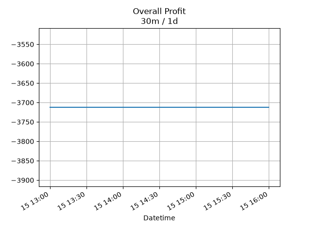||
|1d / 5d|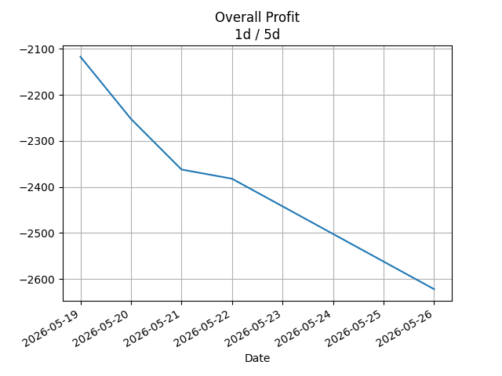|<table border="1" class="dataframe"> <thead> <tr style="text-align: center;"> <th>Date</th> <th>profit</th> </tr> </thead> <tbody> <tr> <td>2025-06-06</td> <td>-3787.0</td> </tr> <tr> <td>2025-06-09</td> <td>-3807.0</td> </tr> <tr> <td>2025-06-10</td> <td>-3802.0</td> </tr> <tr> <td>2025-06-11</td> <td>-3767.0</td> </tr> <tr> <td>2025-06-12</td> <td>-3767.0</td> </tr> </tbody></table>|
|1wk / 1mo|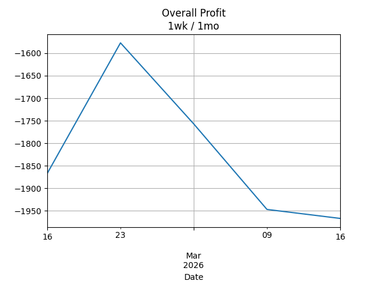|<table border="1" class="dataframe"> <thead> <tr style="text-align: center;"> <th>Date</th> <th>profit</th> </tr> </thead> <tbody> <tr> <td>2025-05-12</td> <td>-3907.34</td> </tr> <tr> <td>2025-05-19</td> <td>-3972.53</td> </tr> <tr> <td>2025-05-26</td> <td>-3905.29</td> </tr> <tr> <td>2025-06-02</td> <td>-4051.29</td> </tr> <tr> <td>2025-06-09</td> <td>-3772.00</td> </tr> </tbody></table>|
---
## 0573.HK [📈] [$0.00] [0.00%]:
#### TAO HEUNG HLDGS
|price|profit|data|
|:---:|:---:|:---:|
|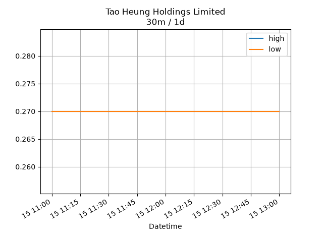|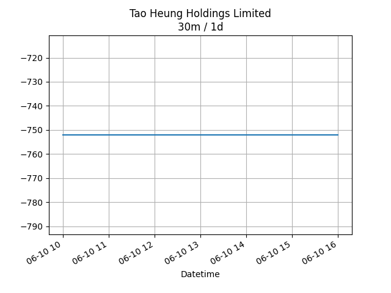|<table border="1" class="dataframe"> <thead> <tr style="text-align: center;"> <th>index</th> <th>profit</th> </tr> </thead> <tbody> <tr> <td>00:00</td> <td>0</td> </tr> </tbody></table>|
|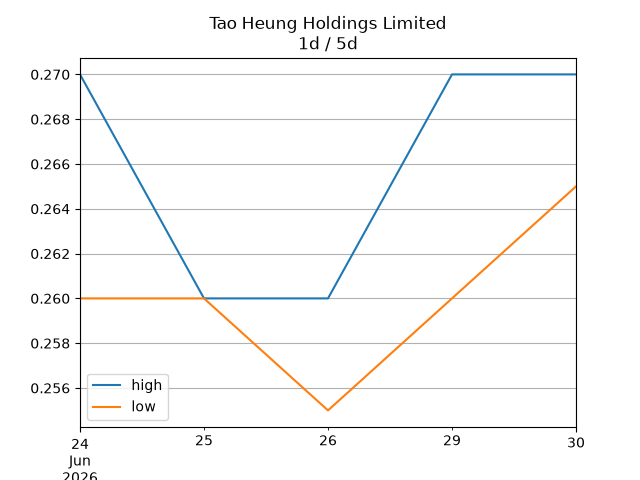|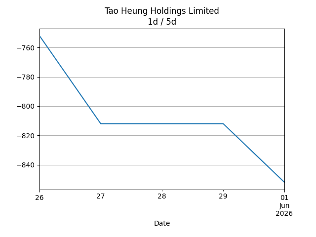|<table border="1" class="dataframe"> <thead> <tr style="text-align: center;"> <th>Date</th> <th>profit</th> </tr> </thead> <tbody> <tr> <td>2025-06-06</td> <td>-692.0</td> </tr> <tr> <td>2025-06-09</td> <td>-672.0</td> </tr> <tr> <td>2025-06-10</td> <td>-712.0</td> </tr> <tr> <td>2025-06-11</td> <td>-672.0</td> </tr> </tbody></table>|
|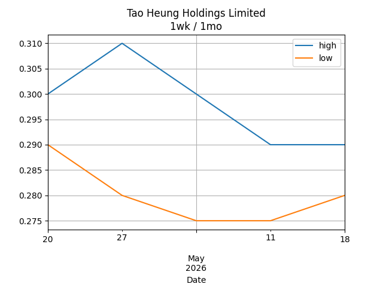|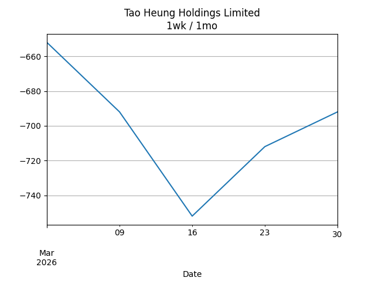|<table border="1" class="dataframe"> <thead> <tr style="text-align: center;"> <th>Date</th> <th>profit</th> </tr> </thead> <tbody> <tr> <td>2025-05-12</td> <td>-692.0</td> </tr> <tr> <td>2025-05-19</td> <td>-752.0</td> </tr> <tr> <td>2025-05-26</td> <td>-672.0</td> </tr> <tr> <td>2025-06-02</td> <td>-692.0</td> </tr> <tr> <td>2025-06-09</td> <td>-672.0</td> </tr> </tbody></table>|
---
## 0560.HK [📉] [$-136.00] [-4.23%]:
#### CHU KONG SHIP
|price|profit|data|
|:---:|:---:|:---:|
|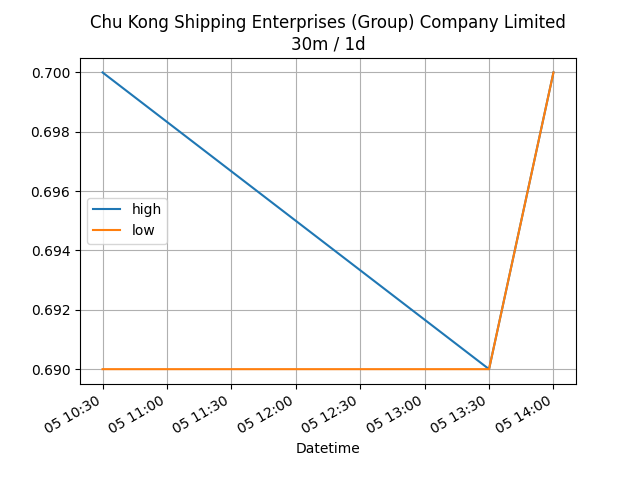|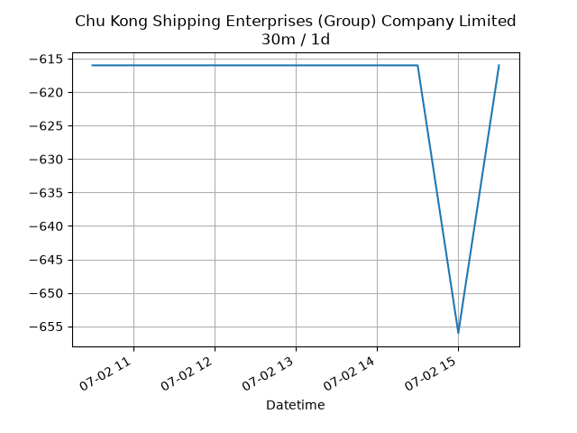|<table border="1" class="dataframe"> <thead> <tr style="text-align: center;"> <th>Datetime</th> <th>profit</th> </tr> </thead> <tbody> <tr> <td>10:30</td> <td>-136.0</td> </tr> <tr> <td>11:00</td> <td>-176.0</td> </tr> <tr> <td>11:30</td> <td>-136.0</td> </tr> <tr> <td>13:30</td> <td>-136.0</td> </tr> <tr> <td>14:00</td> <td>-136.0</td> </tr> </tbody></table>|
|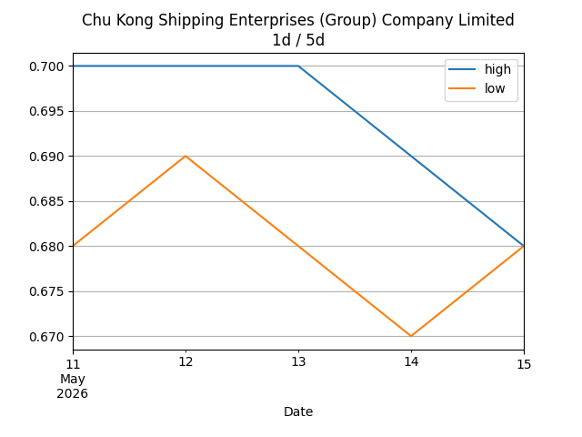|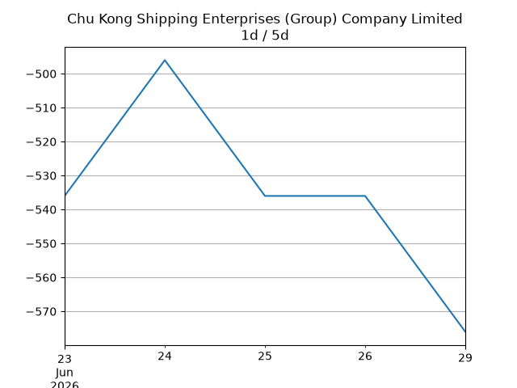|<table border="1" class="dataframe"> <thead> <tr style="text-align: center;"> <th>Date</th> <th>profit</th> </tr> </thead> <tbody> <tr> <td>2025-06-06</td> <td>-216.0</td> </tr> <tr> <td>2025-06-09</td> <td>-176.0</td> </tr> <tr> <td>2025-06-10</td> <td>-176.0</td> </tr> <tr> <td>2025-06-11</td> <td>-136.0</td> </tr> <tr> <td>2025-06-12</td> <td>-136.0</td> </tr> </tbody></table>|
|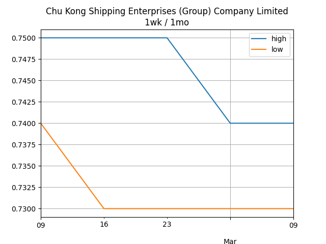|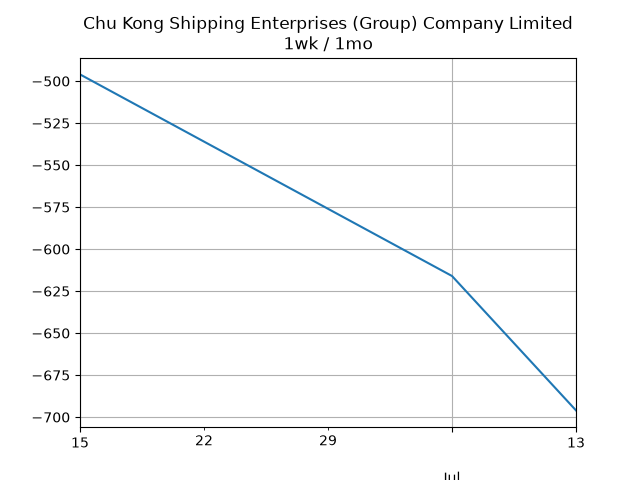|<table border="1" class="dataframe"> <thead> <tr style="text-align: center;"> <th>Date</th> <th>profit</th> </tr> </thead> <tbody> <tr> <td>2025-05-12</td> <td>-252.0</td> </tr> <tr> <td>2025-05-19</td> <td>-290.0</td> </tr> <tr> <td>2025-05-26</td> <td>-176.0</td> </tr> <tr> <td>2025-06-02</td> <td>-366.0</td> </tr> <tr> <td>2025-06-09</td> <td>-136.0</td> </tr> </tbody></table>|
---
## 0709.HK [📉] [$-1436.00] [-34.39%]:
#### GIORDANO INT'L
|price|profit|data|
|:---:|:---:|:---:|
|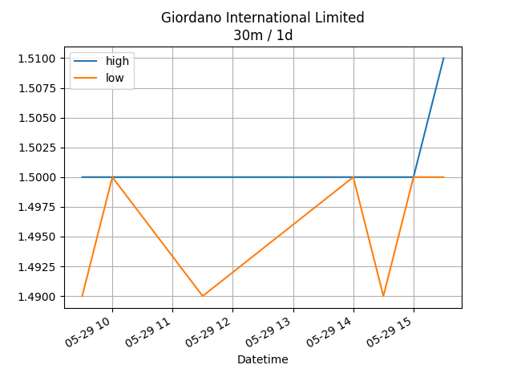|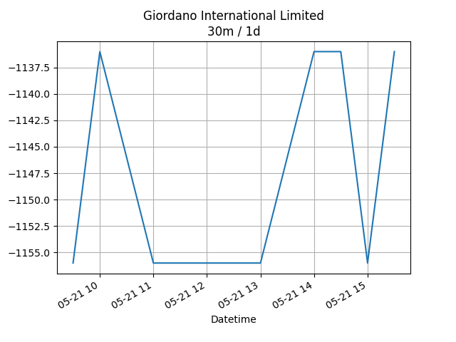|<table border="1" class="dataframe"> <thead> <tr style="text-align: center;"> <th>Datetime</th> <th>profit</th> </tr> </thead> <tbody> <tr> <td>09:30</td> <td>-1436.0</td> </tr> <tr> <td>10:00</td> <td>-1416.0</td> </tr> <tr> <td>10:30</td> <td>-1416.0</td> </tr> <tr> <td>11:00</td> <td>-1436.0</td> </tr> <tr> <td>11:30</td> <td>-1416.0</td> </tr> <tr> <td>13:00</td> <td>-1416.0</td> </tr> <tr> <td>13:30</td> <td>-1416.0</td> </tr> <tr> <td>14:00</td> <td>-1436.0</td> </tr> </tbody></table>|
|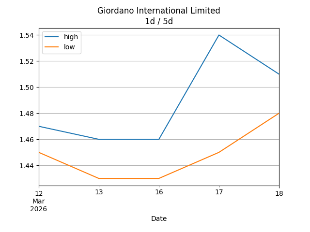|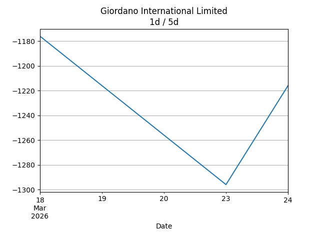|<table border="1" class="dataframe"> <thead> <tr style="text-align: center;"> <th>Date</th> <th>profit</th> </tr> </thead> <tbody> <tr> <td>2025-06-06</td> <td>-1376.0</td> </tr> <tr> <td>2025-06-09</td> <td>-1396.0</td> </tr> <tr> <td>2025-06-10</td> <td>-1416.0</td> </tr> <tr> <td>2025-06-11</td> <td>-1416.0</td> </tr> <tr> <td>2025-06-12</td> <td>-1436.0</td> </tr> </tbody></table>|
|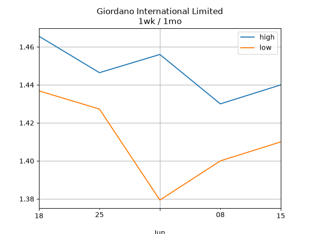|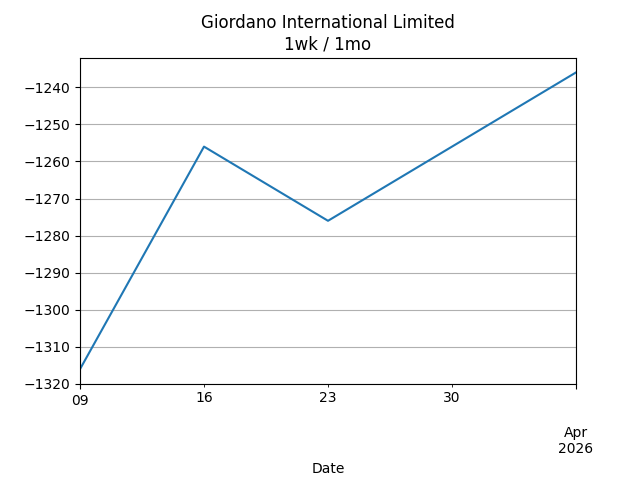|<table border="1" class="dataframe"> <thead> <tr style="text-align: center;"> <th>Date</th> <th>profit</th> </tr> </thead> <tbody> <tr> <td>2025-05-12</td> <td>-1298.45</td> </tr> <tr> <td>2025-05-19</td> <td>-1375.18</td> </tr> <tr> <td>2025-05-26</td> <td>-1394.37</td> </tr> <tr> <td>2025-06-02</td> <td>-1490.29</td> </tr> <tr> <td>2025-06-09</td> <td>-1436.00</td> </tr> </tbody></table>|
---
## 1310.HK [📉] [$-439.00] [-15.04%]:
#### HKBN
|price|profit|data|
|:---:|:---:|:---:|
|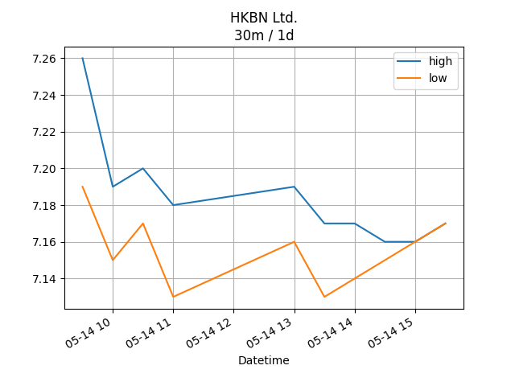|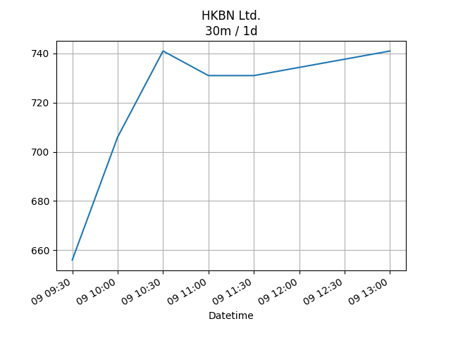|<table border="1" class="dataframe"> <thead> <tr style="text-align: center;"> <th>Datetime</th> <th>profit</th> </tr> </thead> <tbody> <tr> <td>09:30</td> <td>-439.0</td> </tr> <tr> <td>10:00</td> <td>-439.0</td> </tr> <tr> <td>10:30</td> <td>-439.0</td> </tr> <tr> <td>11:00</td> <td>-439.0</td> </tr> <tr> <td>11:30</td> <td>-434.0</td> </tr> <tr> <td>13:00</td> <td>-434.0</td> </tr> <tr> <td>13:30</td> <td>-434.0</td> </tr> <tr> <td>14:00</td> <td>-439.0</td> </tr> </tbody></table>|
|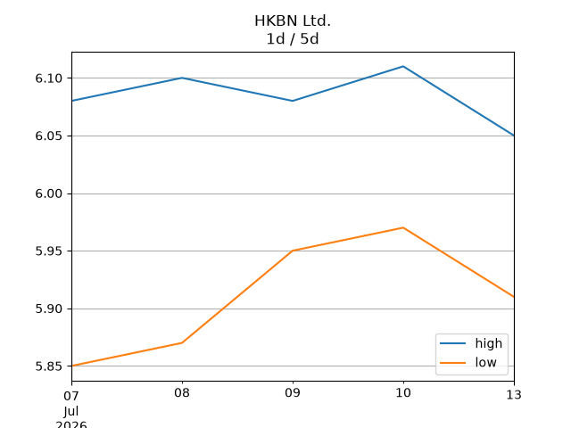|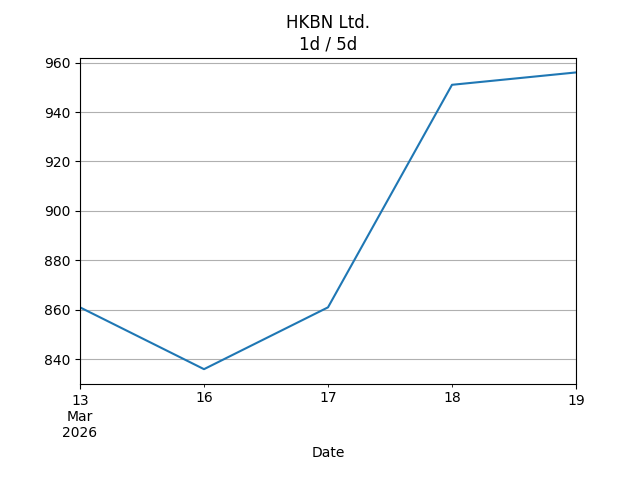|<table border="1" class="dataframe"> <thead> <tr style="text-align: center;"> <th>Date</th> <th>profit</th> </tr> </thead> <tbody> <tr> <td>2025-06-06</td> <td>-434.0</td> </tr> <tr> <td>2025-06-09</td> <td>-434.0</td> </tr> <tr> <td>2025-06-10</td> <td>-444.0</td> </tr> <tr> <td>2025-06-11</td> <td>-444.0</td> </tr> <tr> <td>2025-06-12</td> <td>-439.0</td> </tr> </tbody></table>|
|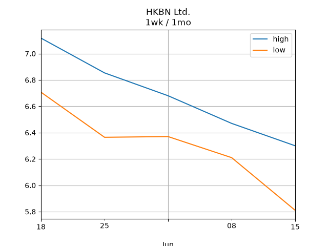|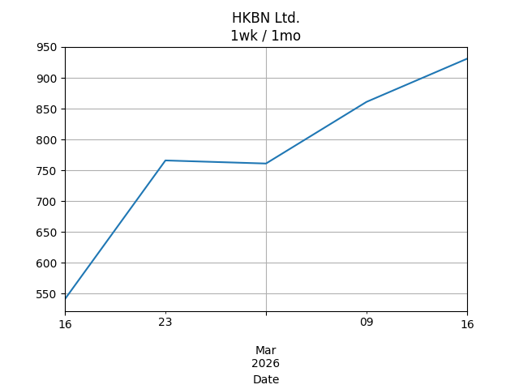|<table border="1" class="dataframe"> <thead> <tr style="text-align: center;"> <th>Date</th> <th>profit</th> </tr> </thead> <tbody> <tr> <td>2025-05-12</td> <td>-455.89</td> </tr> <tr> <td>2025-05-19</td> <td>-441.35</td> </tr> <tr> <td>2025-05-26</td> <td>-518.93</td> </tr> <tr> <td>2025-06-02</td> <td>-434.00</td> </tr> <tr> <td>2025-06-09</td> <td>-439.00</td> </tr> </tbody></table>|
---
## 2638.HK [📈] [$6.00] [0.21%]:
#### HK Electric Investments and HK Electric Investments Limited
|price|profit|data|
|:---:|:---:|:---:|
|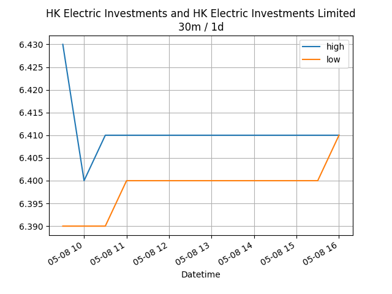|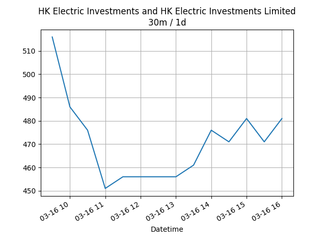|<table border="1" class="dataframe"> <thead> <tr style="text-align: center;"> <th>Datetime</th> <th>profit</th> </tr> </thead> <tbody> <tr> <td>09:30</td> <td>1.0</td> </tr> <tr> <td>10:00</td> <td>6.0</td> </tr> <tr> <td>10:30</td> <td>6.0</td> </tr> <tr> <td>11:00</td> <td>6.0</td> </tr> <tr> <td>11:30</td> <td>6.0</td> </tr> <tr> <td>13:00</td> <td>11.0</td> </tr> <tr> <td>13:30</td> <td>6.0</td> </tr> <tr> <td>14:00</td> <td>6.0</td> </tr> </tbody></table>|
|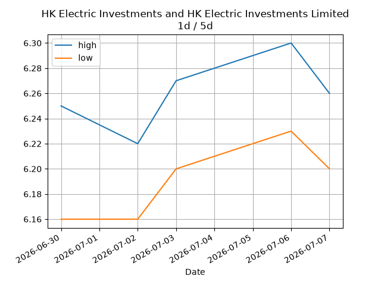|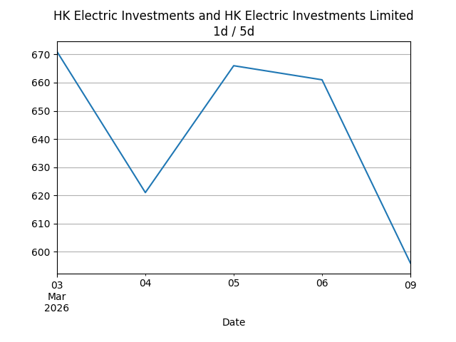|<table border="1" class="dataframe"> <thead> <tr style="text-align: center;"> <th>Date</th> <th>profit</th> </tr> </thead> <tbody> <tr> <td>2025-06-06</td> <td>26.0</td> </tr> <tr> <td>2025-06-09</td> <td>-4.0</td> </tr> <tr> <td>2025-06-10</td> <td>11.0</td> </tr> <tr> <td>2025-06-11</td> <td>-4.0</td> </tr> <tr> <td>2025-06-12</td> <td>6.0</td> </tr> </tbody></table>|
|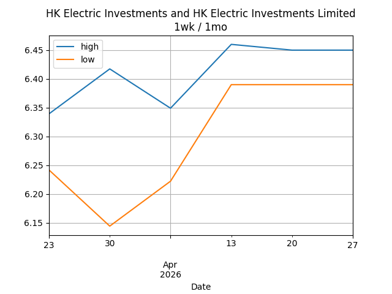|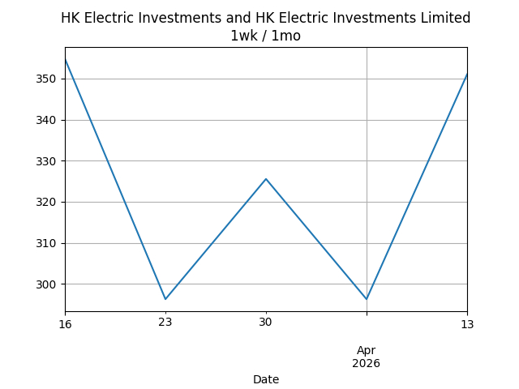|<table border="1" class="dataframe"> <thead> <tr style="text-align: center;"> <th>Date</th> <th>profit</th> </tr> </thead> <tbody> <tr> <td>2025-05-12</td> <td>-84.0</td> </tr> <tr> <td>2025-05-19</td> <td>-19.0</td> </tr> <tr> <td>2025-05-26</td> <td>-19.0</td> </tr> <tr> <td>2025-06-02</td> <td>26.0</td> </tr> <tr> <td>2025-06-09</td> <td>6.0</td> </tr> </tbody></table>|
---
## 0533.HK [📉] [$-1095.00] [-27.55%]:
#### GOLDLION HOLD
|price|profit|data|
|:---:|:---:|:---:|
|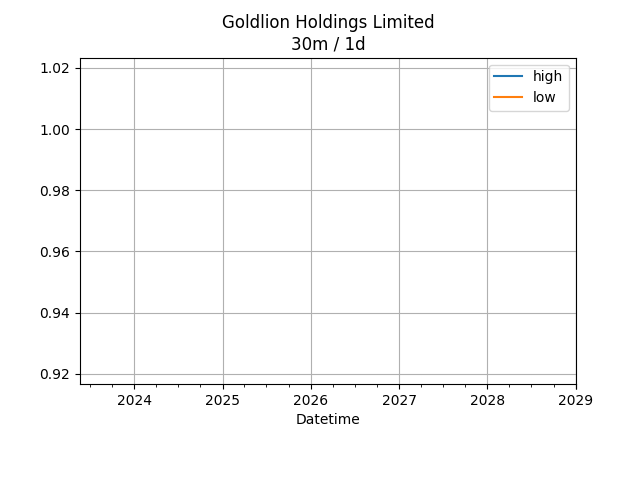|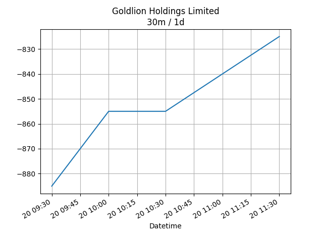|<table border="1" class="dataframe"> <thead> <tr style="text-align: center;"> <th>Datetime</th> <th>profit</th> </tr> </thead> <tbody> <tr> <td>09:30</td> <td>-1125.0</td> </tr> <tr> <td>10:00</td> <td>-1125.0</td> </tr> <tr> <td>10:30</td> <td>-1125.0</td> </tr> <tr> <td>11:00</td> <td>-1125.0</td> </tr> <tr> <td>11:30</td> <td>-1125.0</td> </tr> <tr> <td>13:00</td> <td>-1125.0</td> </tr> <tr> <td>13:30</td> <td>-1125.0</td> </tr> <tr> <td>14:00</td> <td>-1095.0</td> </tr> </tbody></table>|
|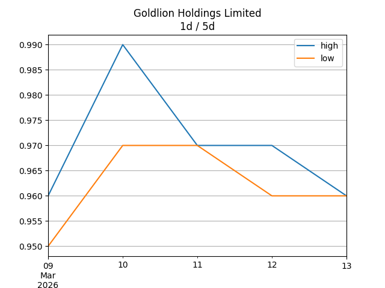|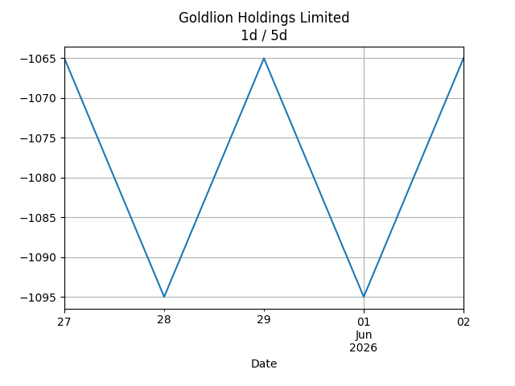|<table border="1" class="dataframe"> <thead> <tr style="text-align: center;"> <th>Date</th> <th>profit</th> </tr> </thead> <tbody> <tr> <td>2025-06-06</td> <td>-1095.0</td> </tr> <tr> <td>2025-06-09</td> <td>-1125.0</td> </tr> <tr> <td>2025-06-10</td> <td>-1065.0</td> </tr> <tr> <td>2025-06-11</td> <td>-1095.0</td> </tr> <tr> <td>2025-06-12</td> <td>-1095.0</td> </tr> </tbody></table>|
|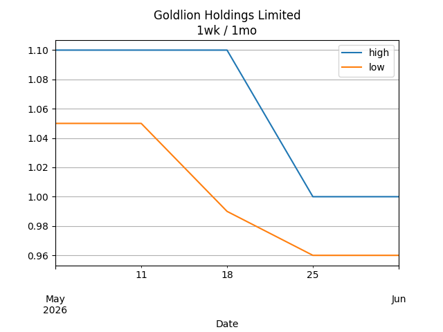|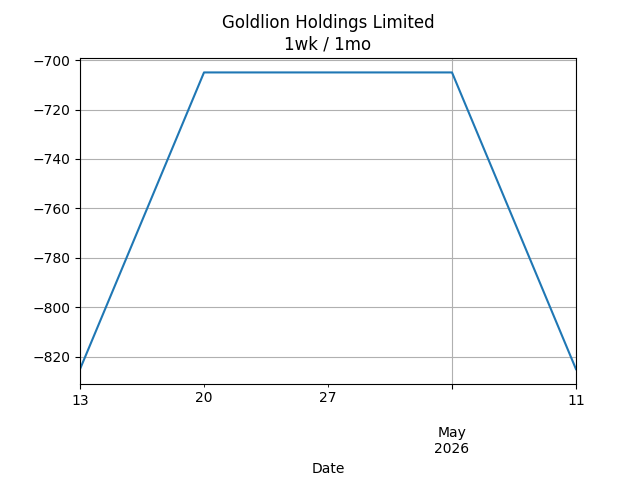|<table border="1" class="dataframe"> <thead> <tr style="text-align: center;"> <th>Date</th> <th>profit</th> </tr> </thead> <tbody> <tr> <td>2025-05-12</td> <td>-1125.0</td> </tr> <tr> <td>2025-05-19</td> <td>-1095.0</td> </tr> <tr> <td>2025-05-26</td> <td>-1125.0</td> </tr> <tr> <td>2025-06-02</td> <td>-1095.0</td> </tr> <tr> <td>2025-06-09</td> <td>-1095.0</td> </tr> </tbody></table>|
---
