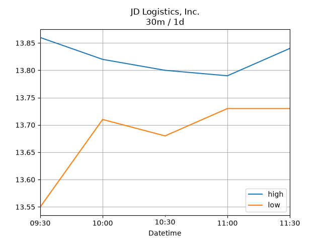
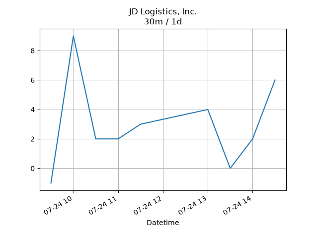
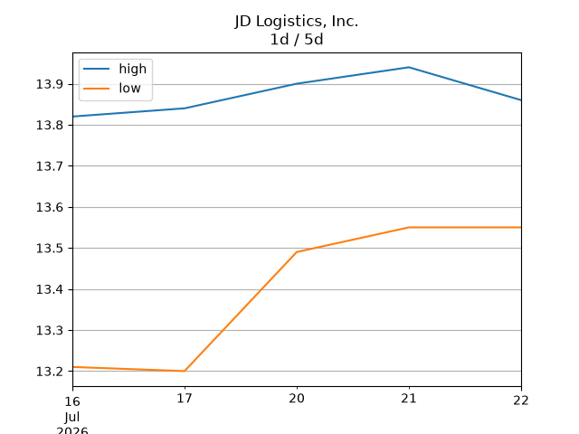
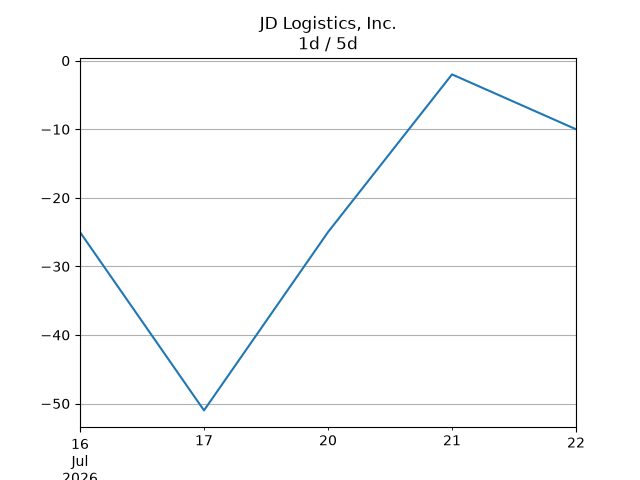
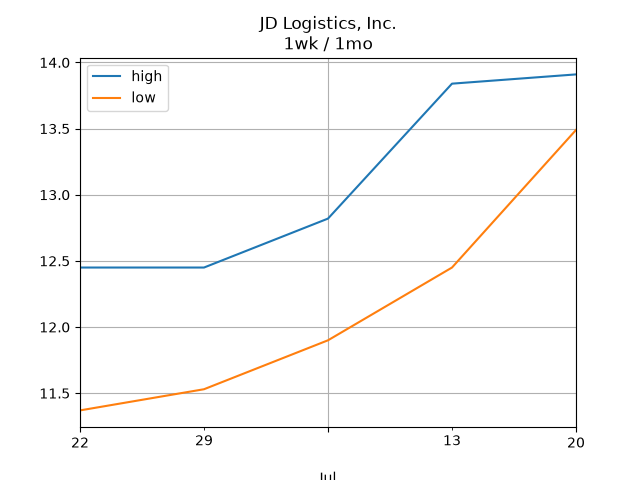
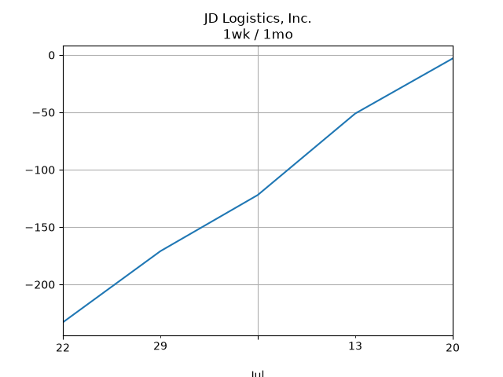

## Net Profit [📉]:
### $-3816.00
|type|graph|data|
|:---:|:---:|:---:|
|30m / 1d||<table border="1" class="dataframe"> <thead> <tr style="text-align: center;"> <th>Datetime</th> <th>profit</th> </tr> </thead> <tbody> <tr> <td>09:30</td> <td>NaN</td> </tr> <tr> <td>10:00</td> <td>NaN</td> </tr> <tr> <td>10:30</td> <td>NaN</td> </tr> <tr> <td>11:00</td> <td>NaN</td> </tr> <tr> <td>11:30</td> <td>NaN</td> </tr> <tr> <td>13:00</td> <td>NaN</td> </tr> <tr> <td>13:30</td> <td>NaN</td> </tr> <tr> <td>14:00</td> <td>NaN</td> </tr> <tr> <td>14:30</td> <td>NaN</td> </tr> </tbody></table>|
|1d / 5d||<table border="1" class="dataframe"> <thead> <tr style="text-align: center;"> <th>Date</th> <th>profit</th> </tr> </thead> <tbody> <tr> <td>2026-07-20</td> <td>-3847.0</td> </tr> <tr> <td>2026-07-21</td> <td>-3809.0</td> </tr> <tr> <td>2026-07-22</td> <td>-3796.0</td> </tr> <tr> <td>2026-07-23</td> <td>-3784.0</td> </tr> <tr> <td>2026-07-24</td> <td>-3816.0</td> </tr> </tbody></table>|
|1wk / 1mo||<table border="1" class="dataframe"> <thead> <tr style="text-align: center;"> <th>Date</th> <th>profit</th> </tr> </thead> <tbody> <tr> <td>2026-06-22</td> <td>-4020.0</td> </tr> <tr> <td>2026-06-29</td> <td>-3818.0</td> </tr> <tr> <td>2026-07-06</td> <td>-3799.0</td> </tr> <tr> <td>2026-07-13</td> <td>-3768.0</td> </tr> <tr> <td>2026-07-20</td> <td>-3816.0</td> </tr> </tbody></table>|
---
## 0573.HK [📉] [$-832.00] [-44.44%]:
#### Tao Heung Holdings Limited
|price|profit|data|
|:---:|:---:|:---:|
|||<table border="1" class="dataframe"> <thead> <tr style="text-align: center;"> <th>Datetime</th> <th>profit</th> </tr> </thead> <tbody> <tr> <td>11:30</td> <td>-832.0</td> </tr> </tbody></table>|
|||<table border="1" class="dataframe"> <thead> <tr style="text-align: center;"> <th>Date</th> <th>profit</th> </tr> </thead> <tbody> <tr> <td>2026-07-20</td> <td>-832.0</td> </tr> <tr> <td>2026-07-21</td> <td>-832.0</td> </tr> <tr> <td>2026-07-22</td> <td>-792.0</td> </tr> <tr> <td>2026-07-23</td> <td>-832.0</td> </tr> <tr> <td>2026-07-24</td> <td>-832.0</td> </tr> </tbody></table>|
|||<table border="1" class="dataframe"> <thead> <tr style="text-align: center;"> <th>Date</th> <th>profit</th> </tr> </thead> <tbody> <tr> <td>2026-06-22</td> <td>-852.0</td> </tr> <tr> <td>2026-06-29</td> <td>-792.0</td> </tr> <tr> <td>2026-07-06</td> <td>-832.0</td> </tr> <tr> <td>2026-07-13</td> <td>-792.0</td> </tr> <tr> <td>2026-07-20</td> <td>-832.0</td> </tr> </tbody></table>|
---
## 0560.HK [📉] [$-776.00] [-24.13%]:
#### Chu Kong Shipping Enterprises (Group) Company Limited
|price|profit|data|
|:---:|:---:|:---:|
|||<table border="1" class="dataframe"> <thead> <tr style="text-align: center;"> <th>Datetime</th> <th>profit</th> </tr> </thead> <tbody> <tr> <td>10:00</td> <td>-776.0</td> </tr> <tr> <td>14:30</td> <td>-776.0</td> </tr> </tbody></table>|
|||<table border="1" class="dataframe"> <thead> <tr style="text-align: center;"> <th>Date</th> <th>profit</th> </tr> </thead> <tbody> <tr> <td>2026-07-20</td> <td>-696.0</td> </tr> <tr> <td>2026-07-21</td> <td>-696.0</td> </tr> <tr> <td>2026-07-22</td> <td>-696.0</td> </tr> <tr> <td>2026-07-23</td> <td>-736.0</td> </tr> <tr> <td>2026-07-24</td> <td>-776.0</td> </tr> </tbody></table>|
|||<table border="1" class="dataframe"> <thead> <tr style="text-align: center;"> <th>Date</th> <th>profit</th> </tr> </thead> <tbody> <tr> <td>2026-06-22</td> <td>-536.0</td> </tr> <tr> <td>2026-06-29</td> <td>-576.0</td> </tr> <tr> <td>2026-07-06</td> <td>-616.0</td> </tr> <tr> <td>2026-07-13</td> <td>-616.0</td> </tr> <tr> <td>2026-07-20</td> <td>-776.0</td> </tr> </tbody></table>|
---
## 0709.HK [📉] [$-1376.00] [-32.95%]:
#### Giordano International Limited
|price|profit|data|
|:---:|:---:|:---:|
|||<table border="1" class="dataframe"> <thead> <tr style="text-align: center;"> <th>Datetime</th> <th>profit</th> </tr> </thead> <tbody> <tr> <td>09:30</td> <td>-1396.0</td> </tr> <tr> <td>10:30</td> <td>-1376.0</td> </tr> <tr> <td>11:00</td> <td>-1376.0</td> </tr> <tr> <td>11:30</td> <td>-1396.0</td> </tr> <tr> <td>13:00</td> <td>-1376.0</td> </tr> <tr> <td>13:30</td> <td>-1376.0</td> </tr> <tr> <td>14:00</td> <td>-1376.0</td> </tr> <tr> <td>14:30</td> <td>-1376.0</td> </tr> </tbody></table>|
|||<table border="1" class="dataframe"> <thead> <tr style="text-align: center;"> <th>Date</th> <th>profit</th> </tr> </thead> <tbody> <tr> <td>2026-07-20</td> <td>-1396.0</td> </tr> <tr> <td>2026-07-21</td> <td>-1396.0</td> </tr> <tr> <td>2026-07-22</td> <td>-1396.0</td> </tr> <tr> <td>2026-07-23</td> <td>-1396.0</td> </tr> <tr> <td>2026-07-24</td> <td>-1376.0</td> </tr> </tbody></table>|
|||<table border="1" class="dataframe"> <thead> <tr style="text-align: center;"> <th>Date</th> <th>profit</th> </tr> </thead> <tbody> <tr> <td>2026-06-22</td> <td>-1396.0</td> </tr> <tr> <td>2026-06-29</td> <td>-1416.0</td> </tr> <tr> <td>2026-07-06</td> <td>-1356.0</td> </tr> <tr> <td>2026-07-13</td> <td>-1396.0</td> </tr> <tr> <td>2026-07-20</td> <td>-1376.0</td> </tr> </tbody></table>|
---
## 1310.HK [📈] [$11.00] [0.38%]:
#### HKBN Ltd.
|price|profit|data|
|:---:|:---:|:---:|
|||<table border="1" class="dataframe"> <thead> <tr style="text-align: center;"> <th>Datetime</th> <th>profit</th> </tr> </thead> <tbody> <tr> <td>09:30</td> <td>-9.0</td> </tr> <tr> <td>10:00</td> <td>1.0</td> </tr> <tr> <td>10:30</td> <td>-9.0</td> </tr> <tr> <td>11:00</td> <td>1.0</td> </tr> <tr> <td>11:30</td> <td>6.0</td> </tr> <tr> <td>13:00</td> <td>11.0</td> </tr> <tr> <td>13:30</td> <td>1.0</td> </tr> <tr> <td>14:00</td> <td>6.0</td> </tr> <tr> <td>14:30</td> <td>11.0</td> </tr> </tbody></table>|
|||<table border="1" class="dataframe"> <thead> <tr style="text-align: center;"> <th>Date</th> <th>profit</th> </tr> </thead> <tbody> <tr> <td>2026-07-20</td> <td>16.0</td> </tr> <tr> <td>2026-07-21</td> <td>41.0</td> </tr> <tr> <td>2026-07-22</td> <td>-9.0</td> </tr> <tr> <td>2026-07-23</td> <td>26.0</td> </tr> <tr> <td>2026-07-24</td> <td>11.0</td> </tr> </tbody></table>|
|||<table border="1" class="dataframe"> <thead> <tr style="text-align: center;"> <th>Date</th> <th>profit</th> </tr> </thead> <tbody> <tr> <td>2026-06-22</td> <td>21.0</td> </tr> <tr> <td>2026-06-29</td> <td>96.0</td> </tr> <tr> <td>2026-07-06</td> <td>96.0</td> </tr> <tr> <td>2026-07-13</td> <td>-9.0</td> </tr> <tr> <td>2026-07-20</td> <td>11.0</td> </tr> </tbody></table>|
---
## 2638.HK [📈] [$366.00] [12.85%]:
#### HK Electric Investments and HK Electric Investments Limited
|price|profit|data|
|:---:|:---:|:---:|
|||<table border="1" class="dataframe"> <thead> <tr style="text-align: center;"> <th>Datetime</th> <th>profit</th> </tr> </thead> <tbody> <tr> <td>09:30</td> <td>361.0</td> </tr> <tr> <td>10:00</td> <td>371.0</td> </tr> <tr> <td>10:30</td> <td>366.0</td> </tr> <tr> <td>11:00</td> <td>366.0</td> </tr> <tr> <td>11:30</td> <td>371.0</td> </tr> <tr> <td>13:00</td> <td>366.0</td> </tr> <tr> <td>13:30</td> <td>371.0</td> </tr> <tr> <td>14:00</td> <td>366.0</td> </tr> <tr> <td>14:30</td> <td>366.0</td> </tr> </tbody></table>|
|||<table border="1" class="dataframe"> <thead> <tr style="text-align: center;"> <th>Date</th> <th>profit</th> </tr> </thead> <tbody> <tr> <td>2026-07-20</td> <td>331.0</td> </tr> <tr> <td>2026-07-21</td> <td>321.0</td> </tr> <tr> <td>2026-07-22</td> <td>356.0</td> </tr> <tr> <td>2026-07-23</td> <td>356.0</td> </tr> <tr> <td>2026-07-24</td> <td>366.0</td> </tr> </tbody></table>|
|||<table border="1" class="dataframe"> <thead> <tr style="text-align: center;"> <th>Date</th> <th>profit</th> </tr> </thead> <tbody> <tr> <td>2026-06-22</td> <td>251.0</td> </tr> <tr> <td>2026-06-29</td> <td>286.0</td> </tr> <tr> <td>2026-07-06</td> <td>276.0</td> </tr> <tr> <td>2026-07-13</td> <td>341.0</td> </tr> <tr> <td>2026-07-20</td> <td>366.0</td> </tr> </tbody></table>|
---
## 0533.HK [📉] [$-1215.00] [-30.57%]:
#### Goldlion Holdings Limited
|price|profit|data|
|:---:|:---:|:---:|
|||<table border="1" class="dataframe"> <thead> <tr style="text-align: center;"> <th>Datetime</th> <th>profit</th> </tr> </thead> <tbody> <tr> <td>11:00</td> <td>-1215.0</td> </tr> </tbody></table>|
|||<table border="1" class="dataframe"> <thead> <tr style="text-align: center;"> <th>Date</th> <th>profit</th> </tr> </thead> <tbody> <tr> <td>2026-07-20</td> <td>-1245.0</td> </tr> <tr> <td>2026-07-21</td> <td>-1245.0</td> </tr> <tr> <td>2026-07-22</td> <td>-1245.0</td> </tr> <tr> <td>2026-07-23</td> <td>-1215.0</td> </tr> <tr> <td>2026-07-24</td> <td>-1215.0</td> </tr> </tbody></table>|
|||<table border="1" class="dataframe"> <thead> <tr style="text-align: center;"> <th>Date</th> <th>profit</th> </tr> </thead> <tbody> <tr> <td>2026-06-22</td> <td>-1275.0</td> </tr> <tr> <td>2026-06-29</td> <td>-1245.0</td> </tr> <tr> <td>2026-07-06</td> <td>-1245.0</td> </tr> <tr> <td>2026-07-13</td> <td>-1245.0</td> </tr> <tr> <td>2026-07-20</td> <td>-1215.0</td> </tr> </tbody></table>|
---
## 2618.HK [📈] [$6.00] [0.43%]:
#### JD Logistics, Inc.
|price|profit|data|
|:---:|:---:|:---:|
|||<table border="1" class="dataframe"> <thead> <tr style="text-align: center;"> <th>Datetime</th> <th>profit</th> </tr> </thead> <tbody> <tr> <td>09:30</td> <td>-1.0</td> </tr> <tr> <td>10:00</td> <td>9.0</td> </tr> <tr> <td>10:30</td> <td>2.0</td> </tr> <tr> <td>11:00</td> <td>2.0</td> </tr> <tr> <td>11:30</td> <td>3.0</td> </tr> <tr> <td>13:00</td> <td>4.0</td> </tr> <tr> <td>13:30</td> <td>-0.0</td> </tr> <tr> <td>14:00</td> <td>2.0</td> </tr> <tr> <td>14:30</td> <td>6.0</td> </tr> </tbody></table>|
|||<table border="1" class="dataframe"> <thead> <tr style="text-align: center;"> <th>Date</th> <th>profit</th> </tr> </thead> <tbody> <tr> <td>2026-07-20</td> <td>-25.0</td> </tr> <tr> <td>2026-07-21</td> <td>-2.0</td> </tr> <tr> <td>2026-07-22</td> <td>-14.0</td> </tr> <tr> <td>2026-07-23</td> <td>13.0</td> </tr> <tr> <td>2026-07-24</td> <td>6.0</td> </tr> </tbody></table>|
|||<table border="1" class="dataframe"> <thead> <tr style="text-align: center;"> <th>Date</th> <th>profit</th> </tr> </thead> <tbody> <tr> <td>2026-06-22</td> <td>-233.0</td> </tr> <tr> <td>2026-06-29</td> <td>-171.0</td> </tr> <tr> <td>2026-07-06</td> <td>-122.0</td> </tr> <tr> <td>2026-07-13</td> <td>-51.0</td> </tr> <tr> <td>2026-07-20</td> <td>6.0</td> </tr> </tbody></table>|
---
