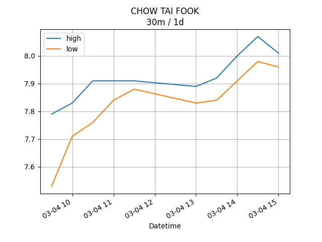
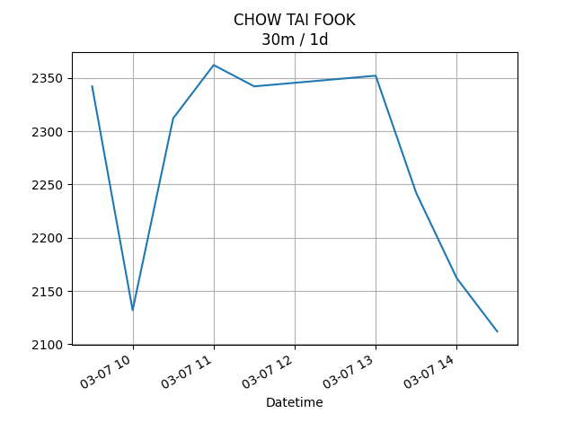
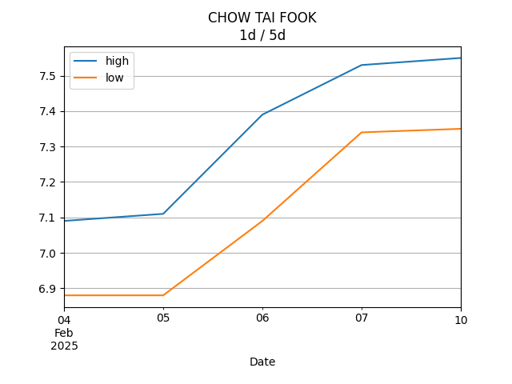
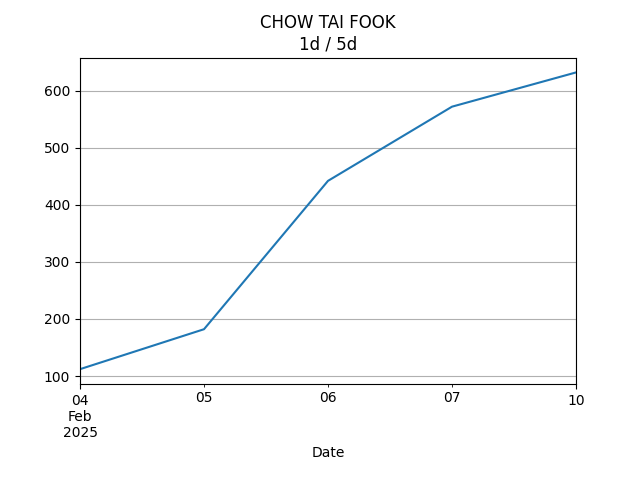
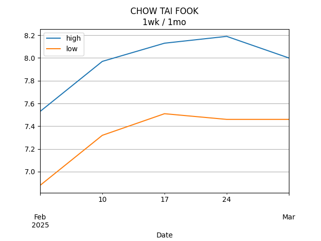
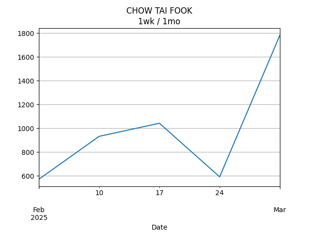

## Net Profit [📉]:
### $-1373.00
|type|graph|data|
|:---:|:---:|:---:|
|30m / 1d||<table border="1" class="dataframe"> <thead> <tr style="text-align: center;"> <th>Datetime</th> <th>profit</th> </tr> </thead> <tbody> <tr> <td>09:30</td> <td>NaN</td> </tr> <tr> <td>10:00</td> <td>NaN</td> </tr> <tr> <td>10:30</td> <td>-1298.0</td> </tr> <tr> <td>11:00</td> <td>-1298.0</td> </tr> <tr> <td>11:30</td> <td>-1298.0</td> </tr> <tr> <td>13:00</td> <td>-1298.0</td> </tr> <tr> <td>13:30</td> <td>-1298.0</td> </tr> <tr> <td>14:00</td> <td>-1298.0</td> </tr> </tbody></table>|
|1d / 5d||<table border="1" class="dataframe"> <thead> <tr style="text-align: center;"> <th>Date</th> <th>profit</th> </tr> </thead> <tbody> <tr> <td>2025-01-24</td> <td>-1448.0</td> </tr> <tr> <td>2025-01-27</td> <td>-1613.0</td> </tr> <tr> <td>2025-01-28</td> <td>-1358.0</td> </tr> <tr> <td>2025-02-03</td> <td>-1433.0</td> </tr> <tr> <td>2025-02-04</td> <td>-1373.0</td> </tr> </tbody></table>|
|1wk / 1mo||<table border="1" class="dataframe"> <thead> <tr style="text-align: center;"> <th>Date</th> <th>profit</th> </tr> </thead> <tbody> <tr> <td>2025-01-01</td> <td>-1663.0</td> </tr> <tr> <td>2025-01-08</td> <td>-1743.0</td> </tr> <tr> <td>2025-01-15</td> <td>-1353.0</td> </tr> <tr> <td>2025-01-22</td> <td>-1358.0</td> </tr> <tr> <td>2025-01-29</td> <td>-1433.0</td> </tr> <tr> <td>2025-02-04</td> <td>-1373.0</td> </tr> </tbody></table>|
---
## 1929.HK [📈] [$102.00] [1.47%]:
#### CHOW TAI FOOK
|price|profit|data|
|:---:|:---:|:---:|
|||<table border="1" class="dataframe"> <thead> <tr style="text-align: center;"> <th>Datetime</th> <th>profit</th> </tr> </thead> <tbody> <tr> <td>09:30</td> <td>142.0</td> </tr> <tr> <td>10:00</td> <td>152.0</td> </tr> <tr> <td>10:30</td> <td>142.0</td> </tr> <tr> <td>11:00</td> <td>82.0</td> </tr> <tr> <td>11:30</td> <td>52.0</td> </tr> <tr> <td>13:00</td> <td>72.0</td> </tr> <tr> <td>13:30</td> <td>82.0</td> </tr> <tr> <td>14:00</td> <td>102.0</td> </tr> </tbody></table>|
|||<table border="1" class="dataframe"> <thead> <tr style="text-align: center;"> <th>Date</th> <th>profit</th> </tr> </thead> <tbody> <tr> <td>2025-01-24</td> <td>22.0</td> </tr> <tr> <td>2025-01-27</td> <td>-138.0</td> </tr> <tr> <td>2025-01-28</td> <td>82.0</td> </tr> <tr> <td>2025-02-03</td> <td>2.0</td> </tr> <tr> <td>2025-02-04</td> <td>102.0</td> </tr> </tbody></table>|
|||<table border="1" class="dataframe"> <thead> <tr style="text-align: center;"> <th>Date</th> <th>profit</th> </tr> </thead> <tbody> <tr> <td>2025-01-01</td> <td>-198.0</td> </tr> <tr> <td>2025-01-08</td> <td>-128.0</td> </tr> <tr> <td>2025-01-15</td> <td>142.0</td> </tr> <tr> <td>2025-01-22</td> <td>82.0</td> </tr> <tr> <td>2025-01-29</td> <td>2.0</td> </tr> <tr> <td>2025-02-04</td> <td>102.0</td> </tr> </tbody></table>|
---
## 0560.HK [📉] [$-256.00] [-7.96%]:
#### CHU KONG SHIP
|price|profit|data|
|:---:|:---:|:---:|
|||<table border="1" class="dataframe"> <thead> <tr style="text-align: center;"> <th>Datetime</th> <th>profit</th> </tr> </thead> <tbody> <tr> <td>10:30</td> <td>-216.0</td> </tr> <tr> <td>13:00</td> <td>-256.0</td> </tr> <tr> <td>13:30</td> <td>-256.0</td> </tr> </tbody></table>|
|||<table border="1" class="dataframe"> <thead> <tr style="text-align: center;"> <th>Date</th> <th>profit</th> </tr> </thead> <tbody> <tr> <td>2025-01-24</td> <td>-136.0</td> </tr> <tr> <td>2025-01-27</td> <td>-176.0</td> </tr> <tr> <td>2025-01-28</td> <td>-176.0</td> </tr> <tr> <td>2025-02-03</td> <td>-256.0</td> </tr> <tr> <td>2025-02-04</td> <td>-256.0</td> </tr> </tbody></table>|
|||<table border="1" class="dataframe"> <thead> <tr style="text-align: center;"> <th>Date</th> <th>profit</th> </tr> </thead> <tbody> <tr> <td>2025-01-01</td> <td>-216.0</td> </tr> <tr> <td>2025-01-08</td> <td>-216.0</td> </tr> <tr> <td>2025-01-15</td> <td>-136.0</td> </tr> <tr> <td>2025-01-22</td> <td>-176.0</td> </tr> <tr> <td>2025-01-29</td> <td>-256.0</td> </tr> <tr> <td>2025-02-04</td> <td>-256.0</td> </tr> </tbody></table>|
---
## 0709.HK [📉] [$-1036.00] [-24.81%]:
#### GIORDANO INT'L
|price|profit|data|
|:---:|:---:|:---:|
|||<table border="1" class="dataframe"> <thead> <tr style="text-align: center;"> <th>Datetime</th> <th>profit</th> </tr> </thead> <tbody> <tr> <td>09:30</td> <td>-1036.0</td> </tr> <tr> <td>10:00</td> <td>-1016.0</td> </tr> <tr> <td>10:30</td> <td>-1016.0</td> </tr> <tr> <td>11:00</td> <td>-1016.0</td> </tr> <tr> <td>11:30</td> <td>-1016.0</td> </tr> <tr> <td>13:00</td> <td>-1016.0</td> </tr> <tr> <td>13:30</td> <td>-1036.0</td> </tr> <tr> <td>14:00</td> <td>-1036.0</td> </tr> </tbody></table>|
|||<table border="1" class="dataframe"> <thead> <tr style="text-align: center;"> <th>Date</th> <th>profit</th> </tr> </thead> <tbody> <tr> <td>2025-01-24</td> <td>-1116.0</td> </tr> <tr> <td>2025-01-27</td> <td>-1096.0</td> </tr> <tr> <td>2025-01-28</td> <td>-1096.0</td> </tr> <tr> <td>2025-02-03</td> <td>-1016.0</td> </tr> <tr> <td>2025-02-04</td> <td>-1036.0</td> </tr> </tbody></table>|
|||<table border="1" class="dataframe"> <thead> <tr style="text-align: center;"> <th>Date</th> <th>profit</th> </tr> </thead> <tbody> <tr> <td>2025-01-01</td> <td>-996.0</td> </tr> <tr> <td>2025-01-08</td> <td>-1136.0</td> </tr> <tr> <td>2025-01-15</td> <td>-1156.0</td> </tr> <tr> <td>2025-01-22</td> <td>-1096.0</td> </tr> <tr> <td>2025-01-29</td> <td>-1016.0</td> </tr> <tr> <td>2025-02-04</td> <td>-1036.0</td> </tr> </tbody></table>|
---
## 1310.HK [📉] [$-289.00] [-9.90%]:
#### HKBN
|price|profit|data|
|:---:|:---:|:---:|
|||<table border="1" class="dataframe"> <thead> <tr style="text-align: center;"> <th>Datetime</th> <th>profit</th> </tr> </thead> <tbody> <tr> <td>09:30</td> <td>-264.0</td> </tr> <tr> <td>10:00</td> <td>-264.0</td> </tr> <tr> <td>10:30</td> <td>-289.0</td> </tr> <tr> <td>11:00</td> <td>-279.0</td> </tr> <tr> <td>11:30</td> <td>-284.0</td> </tr> <tr> <td>13:00</td> <td>-289.0</td> </tr> <tr> <td>13:30</td> <td>-284.0</td> </tr> <tr> <td>14:00</td> <td>-289.0</td> </tr> </tbody></table>|
|||<table border="1" class="dataframe"> <thead> <tr style="text-align: center;"> <th>Date</th> <th>profit</th> </tr> </thead> <tbody> <tr> <td>2025-01-24</td> <td>-304.0</td> </tr> <tr> <td>2025-01-27</td> <td>-299.0</td> </tr> <tr> <td>2025-01-28</td> <td>-284.0</td> </tr> <tr> <td>2025-02-03</td> <td>-269.0</td> </tr> <tr> <td>2025-02-04</td> <td>-289.0</td> </tr> </tbody></table>|
|||<table border="1" class="dataframe"> <thead> <tr style="text-align: center;"> <th>Date</th> <th>profit</th> </tr> </thead> <tbody> <tr> <td>2025-01-01</td> <td>-329.0</td> </tr> <tr> <td>2025-01-08</td> <td>-304.0</td> </tr> <tr> <td>2025-01-15</td> <td>-294.0</td> </tr> <tr> <td>2025-01-22</td> <td>-284.0</td> </tr> <tr> <td>2025-01-29</td> <td>-269.0</td> </tr> <tr> <td>2025-02-04</td> <td>-289.0</td> </tr> </tbody></table>|
---
## 2638.HK [📉] [$-239.00] [-8.39%]:
#### HK Electric Investments and HK Electric Investments Limited
|price|profit|data|
|:---:|:---:|:---:|
|||<table border="1" class="dataframe"> <thead> <tr style="text-align: center;"> <th>Datetime</th> <th>profit</th> </tr> </thead> <tbody> <tr> <td>09:30</td> <td>-224.0</td> </tr> <tr> <td>10:00</td> <td>-224.0</td> </tr> <tr> <td>10:30</td> <td>-234.0</td> </tr> <tr> <td>11:00</td> <td>-234.0</td> </tr> <tr> <td>11:30</td> <td>-239.0</td> </tr> <tr> <td>13:00</td> <td>-239.0</td> </tr> <tr> <td>13:30</td> <td>-239.0</td> </tr> <tr> <td>14:00</td> <td>-239.0</td> </tr> </tbody></table>|
|||<table border="1" class="dataframe"> <thead> <tr style="text-align: center;"> <th>Date</th> <th>profit</th> </tr> </thead> <tbody> <tr> <td>2025-01-24</td> <td>-229.0</td> </tr> <tr> <td>2025-01-27</td> <td>-219.0</td> </tr> <tr> <td>2025-01-28</td> <td>-229.0</td> </tr> <tr> <td>2025-02-03</td> <td>-239.0</td> </tr> <tr> <td>2025-02-04</td> <td>-239.0</td> </tr> </tbody></table>|
|||<table border="1" class="dataframe"> <thead> <tr style="text-align: center;"> <th>Date</th> <th>profit</th> </tr> </thead> <tbody> <tr> <td>2025-01-01</td> <td>-209.0</td> </tr> <tr> <td>2025-01-08</td> <td>-244.0</td> </tr> <tr> <td>2025-01-15</td> <td>-224.0</td> </tr> <tr> <td>2025-01-22</td> <td>-229.0</td> </tr> <tr> <td>2025-01-29</td> <td>-239.0</td> </tr> <tr> <td>2025-02-04</td> <td>-239.0</td> </tr> </tbody></table>|
---
## 0533.HK [📈] [$345.00] [8.68%]:
#### GOLDLION HOLD
|price|profit|data|
|:---:|:---:|:---:|
|||<table border="1" class="dataframe"> <thead> <tr style="text-align: center;"> <th>Datetime</th> <th>profit</th> </tr> </thead> <tbody> <tr> <td>10:30</td> <td>315.0</td> </tr> <tr> <td>11:30</td> <td>345.0</td> </tr> </tbody></table>|
|||<table border="1" class="dataframe"> <thead> <tr style="text-align: center;"> <th>Date</th> <th>profit</th> </tr> </thead> <tbody> <tr> <td>2025-01-24</td> <td>315.0</td> </tr> <tr> <td>2025-01-27</td> <td>315.0</td> </tr> <tr> <td>2025-01-28</td> <td>345.0</td> </tr> <tr> <td>2025-02-03</td> <td>345.0</td> </tr> <tr> <td>2025-02-04</td> <td>345.0</td> </tr> </tbody></table>|
|||<table border="1" class="dataframe"> <thead> <tr style="text-align: center;"> <th>Date</th> <th>profit</th> </tr> </thead> <tbody> <tr> <td>2025-01-01</td> <td>285.0</td> </tr> <tr> <td>2025-01-08</td> <td>285.0</td> </tr> <tr> <td>2025-01-15</td> <td>315.0</td> </tr> <tr> <td>2025-01-22</td> <td>345.0</td> </tr> <tr> <td>2025-01-29</td> <td>345.0</td> </tr> <tr> <td>2025-02-04</td> <td>345.0</td> </tr> </tbody></table>|
---
