## Net Profit [📉]:
### $-1916.00
|type|graph|data|
|:---:|:---:|:---:|
|1d / 30m|No Data|No Data|
|7d / 1d|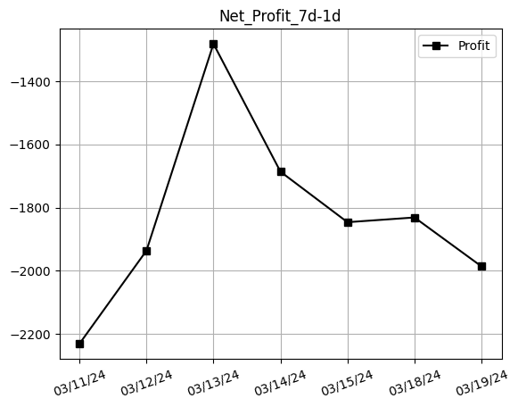|<table border="1" class="dataframe"> <thead> <tr style="text-align: right;"> <th>Date</th> <th>Profit</th> </tr> </thead> <tbody> <tr> <td>03/19/24</td> <td>-1981.00</td> </tr> <tr> <td>03/20/24</td> <td>-2016.00</td> </tr> <tr> <td>03/21/24</td> <td>-1796.00</td> </tr> <tr> <td>03/22/24</td> <td>-1976.00</td> </tr> <tr> <td>03/25/24</td> <td>-1996.00</td> </tr> <tr> <td>03/26/24</td> <td>-2051.00</td> </tr> <tr> <td>03/27/24</td> <td>-2051.00</td> </tr> </tbody></table>
|1mo / 1wk|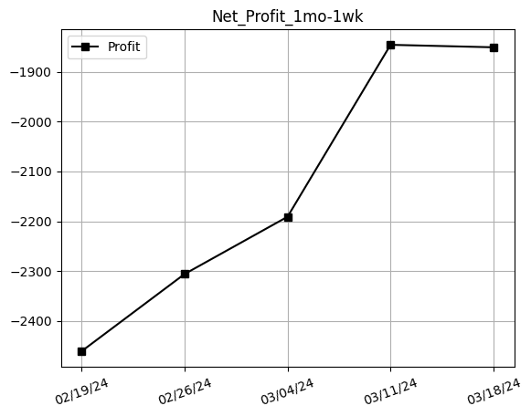|<table border="1" class="dataframe"> <thead> <tr style="text-align: right;"> <th>Date</th> <th>Profit</th> </tr> </thead> <tbody> <tr> <td>02/26/24</td> <td>-2306.00</td> </tr> <tr> <td>03/04/24</td> <td>-2191.00</td> </tr> <tr> <td>03/11/24</td> <td>-1846.00</td> </tr> <tr> <td>03/18/24</td> <td>-1976.00</td> </tr> <tr> <td>03/25/24</td> <td>-1916.00</td> </tr> </tbody></table>
---
## 0293.HK [📈] [$848.00] [10.58%]:
#### Cathay Pacific Airways Limited
|price|profit|data|
|:---:|:---:|:---:|
|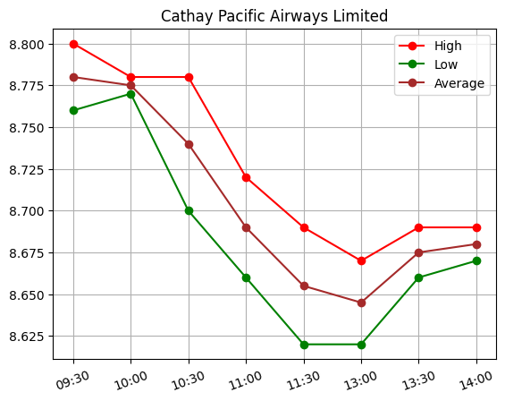|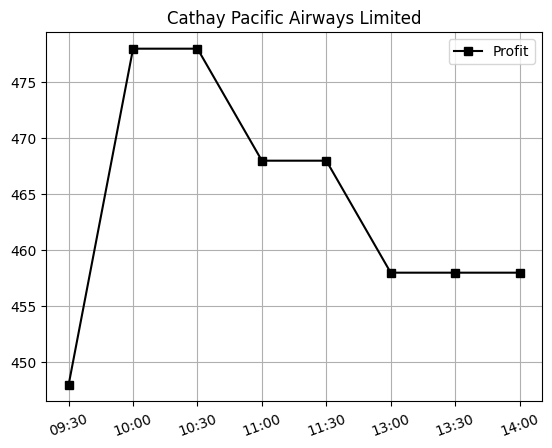|<table border="1" class="dataframe"> <thead> <tr style="text-align: right;"> <th>Datetime</th> <th>Profit</th> </tr> </thead> <tbody> <tr> <td>09:30</td> <td>788.00</td> </tr> <tr> <td>10:00</td> <td>828.00</td> </tr> <tr> <td>10:30</td> <td>838.00</td> </tr> <tr> <td>11:00</td> <td>848.00</td> </tr> </tbody></table>|
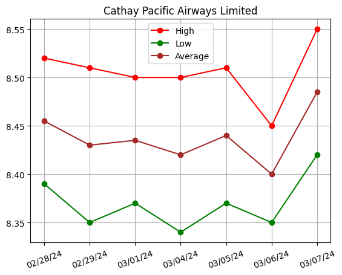|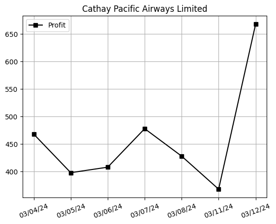|<table border="1" class="dataframe"> <thead> <tr style="text-align: right;"> <th>Date</th> <th>Profit</th> </tr> </thead> <tbody> <tr> <td>03/19/24</td> <td>708.00</td> </tr> <tr> <td>03/20/24</td> <td>708.00</td> </tr> <tr> <td>03/21/24</td> <td>788.00</td> </tr> <tr> <td>03/22/24</td> <td>638.00</td> </tr> <tr> <td>03/25/24</td> <td>728.00</td> </tr> <tr> <td>03/26/24</td> <td>788.00</td> </tr> <tr> <td>03/27/24</td> <td>848.00</td> </tr> </tbody></table>|
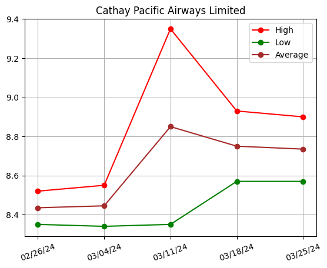|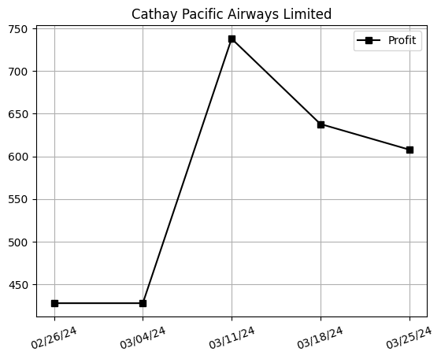|<table border="1" class="dataframe"> <thead> <tr style="text-align: right;"> <th>Date</th> <th>Profit</th> </tr> </thead> <tbody> <tr> <td>02/26/24</td> <td>428.00</td> </tr> <tr> <td>03/04/24</td> <td>428.00</td> </tr> <tr> <td>03/11/24</td> <td>738.00</td> </tr> <tr> <td>03/18/24</td> <td>638.00</td> </tr> <tr> <td>03/25/24</td> <td>848.00</td> </tr> </tbody></table>|
---
## 0709.HK [📈] [$4.00] [0.10%]:
#### Giordano International Limited
|price|profit|data|
|:---:|:---:|:---:|
|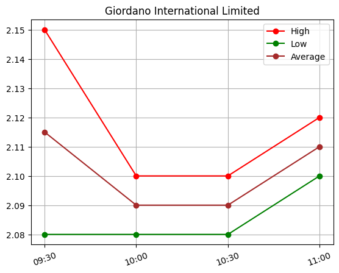|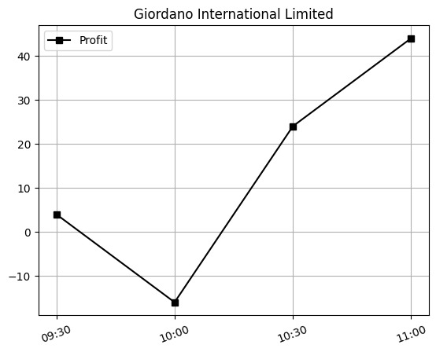|<table border="1" class="dataframe"> <thead> <tr style="text-align: right;"> <th>Datetime</th> <th>Profit</th> </tr> </thead> <tbody> <tr> <td>09:30</td> <td>-36.00</td> </tr> <tr> <td>10:00</td> <td>-16.00</td> </tr> <tr> <td>10:30</td> <td>-36.00</td> </tr> <tr> <td>11:00</td> <td>4.00</td> </tr> </tbody></table>|
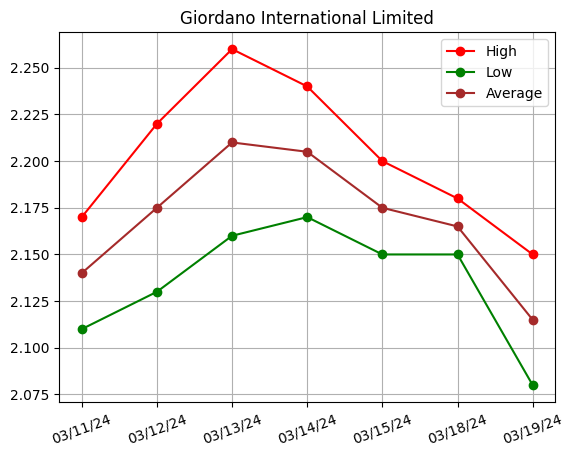|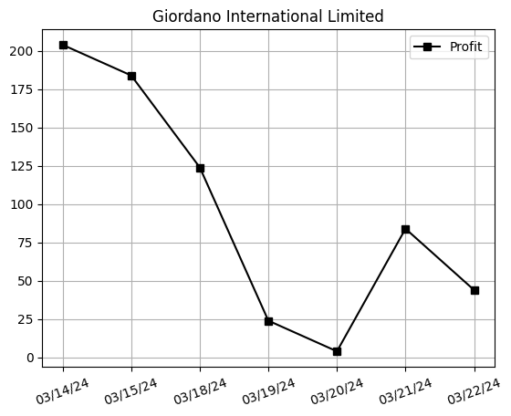|<table border="1" class="dataframe"> <thead> <tr style="text-align: right;"> <th>Date</th> <th>Profit</th> </tr> </thead> <tbody> <tr> <td>03/19/24</td> <td>24.00</td> </tr> <tr> <td>03/20/24</td> <td>4.00</td> </tr> <tr> <td>03/21/24</td> <td>84.00</td> </tr> <tr> <td>03/22/24</td> <td>24.00</td> </tr> <tr> <td>03/25/24</td> <td>-16.00</td> </tr> <tr> <td>03/26/24</td> <td>-76.00</td> </tr> <tr> <td>03/27/24</td> <td>4.00</td> </tr> </tbody></table>|
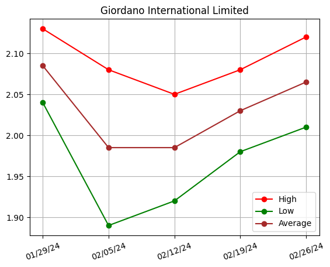|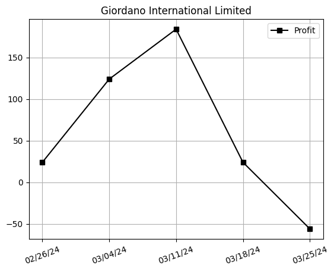|<table border="1" class="dataframe"> <thead> <tr style="text-align: right;"> <th>Date</th> <th>Profit</th> </tr> </thead> <tbody> <tr> <td>02/26/24</td> <td>24.00</td> </tr> <tr> <td>03/04/24</td> <td>124.00</td> </tr> <tr> <td>03/11/24</td> <td>184.00</td> </tr> <tr> <td>03/18/24</td> <td>24.00</td> </tr> <tr> <td>03/25/24</td> <td>4.00</td> </tr> </tbody></table>|
---
## 1310.HK [📉] [$-1414.00] [-48.44%]:
#### HKBN Ltd.
|price|profit|data|
|:---:|:---:|:---:|
|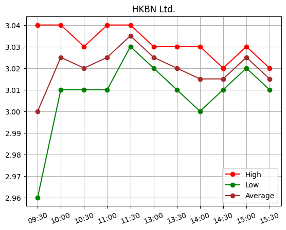|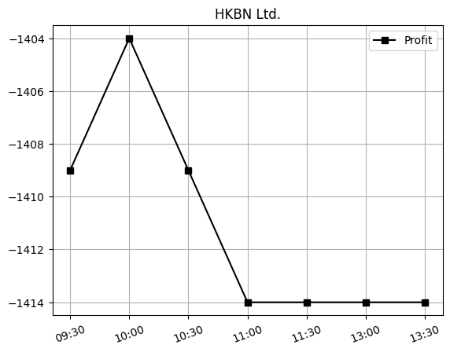|<table border="1" class="dataframe"> <thead> <tr style="text-align: right;"> <th>Datetime</th> <th>Profit</th> </tr> </thead> <tbody> <tr> <td>09:30</td> <td>-1409.00</td> </tr> <tr> <td>10:00</td> <td>-1404.00</td> </tr> <tr> <td>10:30</td> <td>-1409.00</td> </tr> <tr> <td>11:00</td> <td>-1414.00</td> </tr> </tbody></table>|
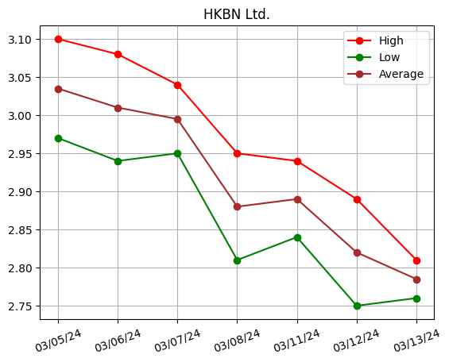|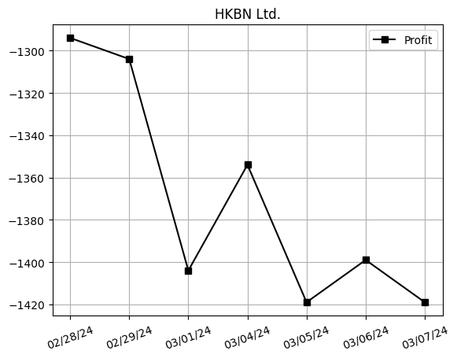|<table border="1" class="dataframe"> <thead> <tr style="text-align: right;"> <th>Date</th> <th>Profit</th> </tr> </thead> <tbody> <tr> <td>03/19/24</td> <td>-1519.00</td> </tr> <tr> <td>03/20/24</td> <td>-1514.00</td> </tr> <tr> <td>03/21/24</td> <td>-1429.00</td> </tr> <tr> <td>03/22/24</td> <td>-1399.00</td> </tr> <tr> <td>03/25/24</td> <td>-1404.00</td> </tr> <tr> <td>03/26/24</td> <td>-1404.00</td> </tr> <tr> <td>03/27/24</td> <td>-1414.00</td> </tr> </tbody></table>|
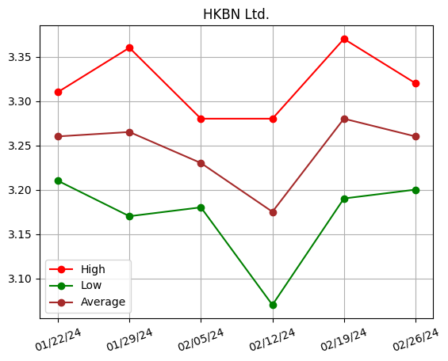|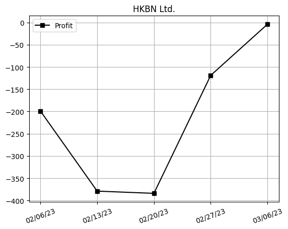|<table border="1" class="dataframe"> <thead> <tr style="text-align: right;"> <th>Date</th> <th>Profit</th> </tr> </thead> <tbody> <tr> <td>02/26/24</td> <td>-1404.00</td> </tr> <tr> <td>03/04/24</td> <td>-1469.00</td> </tr> <tr> <td>03/11/24</td> <td>-1509.00</td> </tr> <tr> <td>03/18/24</td> <td>-1399.00</td> </tr> <tr> <td>03/25/24</td> <td>-1414.00</td> </tr> </tbody></table>|
---
## 2638.HK [📉] [$-409.00] [-14.36%]:
#### HK Electric Investments and HK Electric Investments Limited
|price|profit|data|
|:---:|:---:|:---:|
|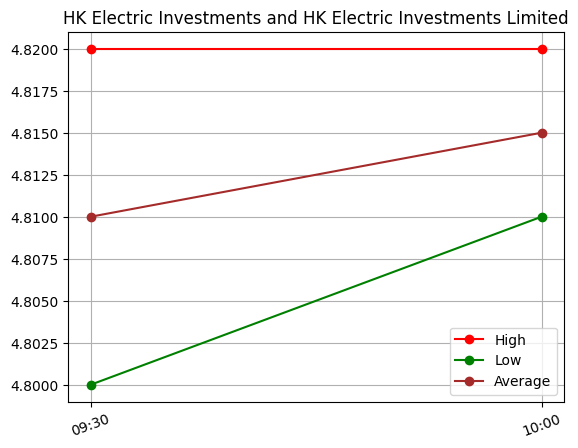|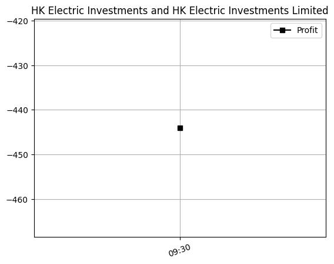|<table border="1" class="dataframe"> <thead> <tr style="text-align: right;"> <th>Datetime</th> <th>Profit</th> </tr> </thead> <tbody> <tr> <td>09:30</td> <td>-414.00</td> </tr> <tr> <td>10:00</td> <td>-409.00</td> </tr> <tr> <td>10:30</td> <td>-414.00</td> </tr> <tr> <td>11:00</td> <td>-409.00</td> </tr> </tbody></table>|
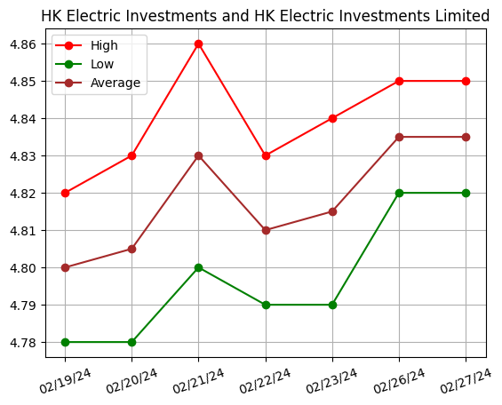|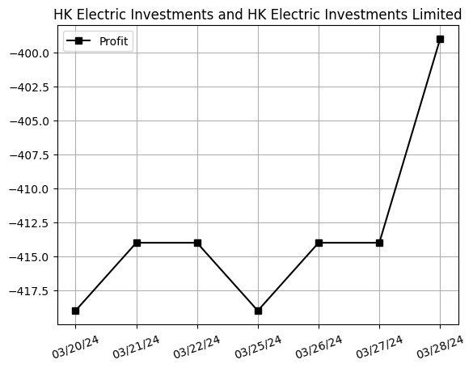|<table border="1" class="dataframe"> <thead> <tr style="text-align: right;"> <th>Date</th> <th>Profit</th> </tr> </thead> <tbody> <tr> <td>03/19/24</td> <td>-459.00</td> </tr> <tr> <td>03/20/24</td> <td>-419.00</td> </tr> <tr> <td>03/21/24</td> <td>-414.00</td> </tr> <tr> <td>03/22/24</td> <td>-414.00</td> </tr> <tr> <td>03/25/24</td> <td>-419.00</td> </tr> <tr> <td>03/26/24</td> <td>-414.00</td> </tr> <tr> <td>03/27/24</td> <td>-409.00</td> </tr> </tbody></table>|
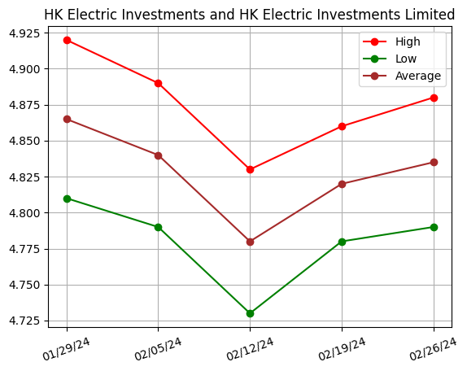|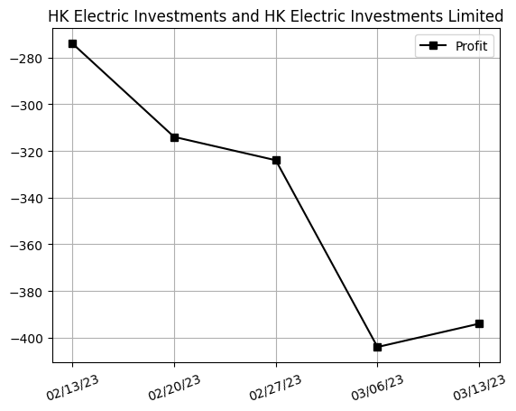|<table border="1" class="dataframe"> <thead> <tr style="text-align: right;"> <th>Date</th> <th>Profit</th> </tr> </thead> <tbody> <tr> <td>02/26/24</td> <td>-439.00</td> </tr> <tr> <td>03/04/24</td> <td>-449.00</td> </tr> <tr> <td>03/11/24</td> <td>-434.00</td> </tr> <tr> <td>03/18/24</td> <td>-414.00</td> </tr> <tr> <td>03/25/24</td> <td>-409.00</td> </tr> </tbody></table>|
---
## 0533.HK [📉] [$-945.00] [-23.77%]:
#### Goldlion Holdings Limited
|price|profit|data|
|:---:|:---:|:---:|
|No Data|No Data|No Data|
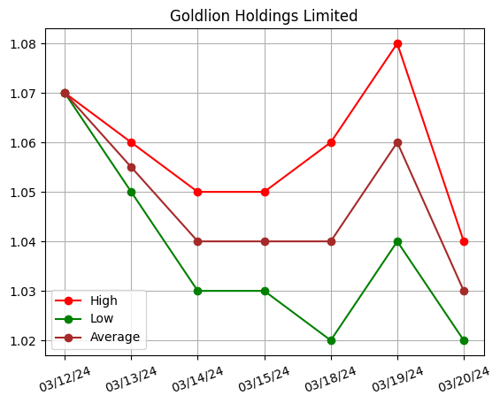|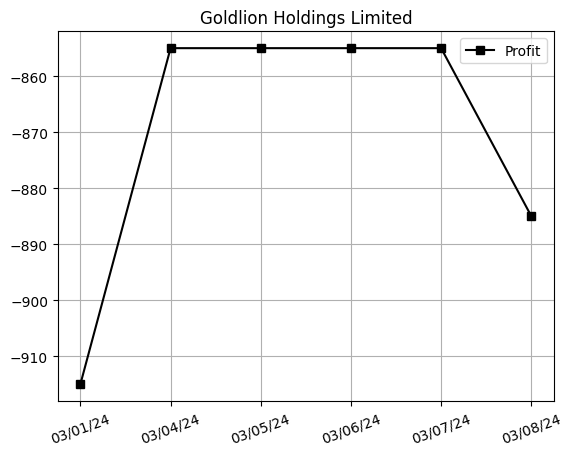|<table border="1" class="dataframe"> <thead> <tr style="text-align: right;"> <th>Date</th> <th>Profit</th> </tr> </thead> <tbody> <tr> <td>03/19/24</td> <td>-735.00</td> </tr> <tr> <td>03/20/24</td> <td>-795.00</td> </tr> <tr> <td>03/21/24</td> <td>-825.00</td> </tr> <tr> <td>03/22/24</td> <td>-825.00</td> </tr> <tr> <td>03/25/24</td> <td>-885.00</td> </tr> <tr> <td>03/26/24</td> <td>-945.00</td> </tr> </tbody></table>|
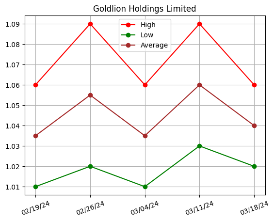|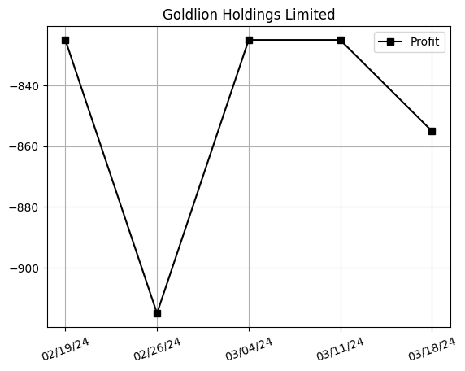|<table border="1" class="dataframe"> <thead> <tr style="text-align: right;"> <th>Date</th> <th>Profit</th> </tr> </thead> <tbody> <tr> <td>02/26/24</td> <td>-915.00</td> </tr> <tr> <td>03/04/24</td> <td>-825.00</td> </tr> <tr> <td>03/11/24</td> <td>-825.00</td> </tr> <tr> <td>03/18/24</td> <td>-825.00</td> </tr> <tr> <td>03/25/24</td> <td>-945.00</td> </tr> </tbody></table>|
---
