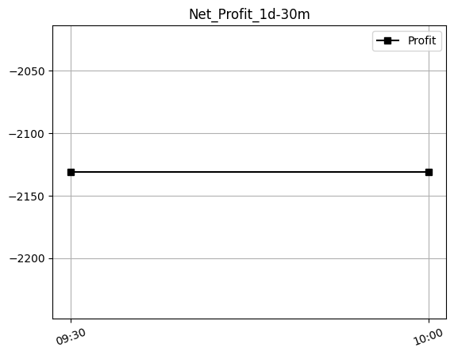
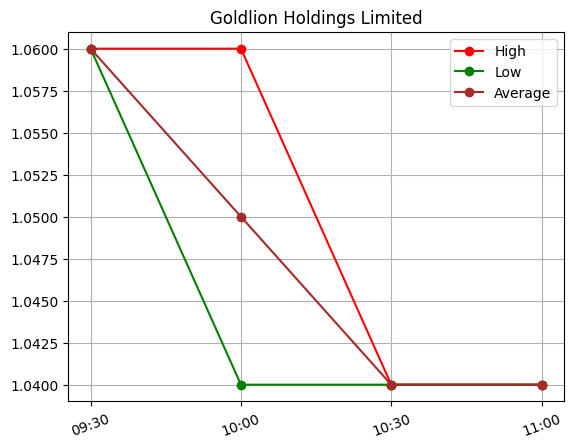
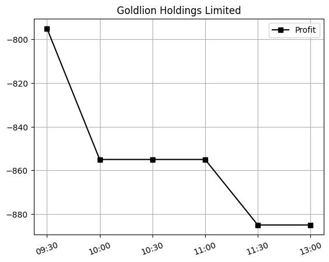

## Net Profit [📉]:
### $-1866.00
|type|graph|data|
|:---:|:---:|:---:|
|1d / 30m||<table border="1" class="dataframe"> <thead> <tr style="text-align: right;"> <th>Datetime</th> <th>Profit</th> </tr> </thead> <tbody> <tr> <td>09:30</td> <td>-1801.00</td> </tr> <tr> <td>10:00</td> <td>-1851.00</td> </tr> <tr> <td>10:30</td> <td>-1851.00</td> </tr> <tr> <td>11:00</td> <td>-1851.00</td> </tr> <tr> <td>11:30</td> <td>-1851.00</td> </tr> <tr> <td>13:00</td> <td>-1851.00</td> </tr> <tr> <td>13:30</td> <td>-1851.00</td> </tr> <tr> <td>14:00</td> <td>-1851.00</td> </tr> <tr> <td>14:30</td> <td>-1826.00</td> </tr> <tr> <td>15:00</td> <td>-1826.00</td> </tr> <tr> <td>15:30</td> <td>-1891.00</td> </tr> </tbody></table>
|7d / 1d||<table border="1" class="dataframe"> <thead> <tr style="text-align: right;"> <th>Date</th> <th>Profit</th> </tr> </thead> <tbody> <tr> <td>03/07/24</td> <td>-2331.00</td> </tr> <tr> <td>03/08/24</td> <td>-2191.00</td> </tr> <tr> <td>03/11/24</td> <td>-2231.00</td> </tr> <tr> <td>03/12/24</td> <td>-1936.00</td> </tr> <tr> <td>03/13/24</td> <td>-1281.00</td> </tr> <tr> <td>03/14/24</td> <td>-1686.00</td> </tr> <tr> <td>03/15/24</td> <td>-1866.00</td> </tr> </tbody></table>
|1mo / 1wk||<table border="1" class="dataframe"> <thead> <tr style="text-align: right;"> <th>Date</th> <th>Profit</th> </tr> </thead> <tbody> <tr> <td>02/12/24</td> <td>-2426.00</td> </tr> <tr> <td>02/19/24</td> <td>-2461.00</td> </tr> <tr> <td>02/26/24</td> <td>-2306.00</td> </tr> <tr> <td>03/04/24</td> <td>-2191.00</td> </tr> <tr> <td>03/11/24</td> <td>-1866.00</td> </tr> </tbody></table>
---
## 0293.HK [📈] [$728.00] [9.09%]:
#### Cathay Pacific Airways Limited
|price|profit|data|
|:---:|:---:|:---:|
|||<table border="1" class="dataframe"> <thead> <tr style="text-align: right;"> <th>Datetime</th> <th>Profit</th> </tr> </thead> <tbody> <tr> <td>09:30</td> <td>818.00</td> </tr> <tr> <td>10:00</td> <td>818.00</td> </tr> <tr> <td>10:30</td> <td>758.00</td> </tr> <tr> <td>11:00</td> <td>788.00</td> </tr> <tr> <td>11:30</td> <td>778.00</td> </tr> <tr> <td>13:00</td> <td>718.00</td> </tr> <tr> <td>13:30</td> <td>748.00</td> </tr> <tr> <td>14:00</td> <td>738.00</td> </tr> <tr> <td>14:30</td> <td>748.00</td> </tr> <tr> <td>15:00</td> <td>748.00</td> </tr> <tr> <td>15:30</td> <td>728.00</td> </tr> </tbody></table>|
||<table border="1" class="dataframe"> <thead> <tr style="text-align: right;"> <th>Date</th> <th>Profit</th> </tr> </thead> <tbody> <tr> <td>03/07/24</td> <td>478.00</td> </tr> <tr> <td>03/08/24</td> <td>428.00</td> </tr> <tr> <td>03/11/24</td> <td>368.00</td> </tr> <tr> <td>03/12/24</td> <td>668.00</td> </tr> <tr> <td>03/13/24</td> <td>1168.00</td> </tr> <tr> <td>03/14/24</td> <td>858.00</td> </tr> <tr> <td>03/15/24</td> <td>728.00</td> </tr> </tbody></table>|
||<table border="1" class="dataframe"> <thead> <tr style="text-align: right;"> <th>Date</th> <th>Profit</th> </tr> </thead> <tbody> <tr> <td>02/12/24</td> <td>178.00</td> </tr> <tr> <td>02/19/24</td> <td>138.00</td> </tr> <tr> <td>02/26/24</td> <td>428.00</td> </tr> <tr> <td>03/04/24</td> <td>428.00</td> </tr> <tr> <td>03/11/24</td> <td>728.00</td> </tr> </tbody></table>|
---
## 0709.HK [📈] [$204.00] [4.89%]:
#### Giordano International Limited
|price|profit|data|
|:---:|:---:|:---:|
|||<table border="1" class="dataframe"> <thead> <tr style="text-align: right;"> <th>Datetime</th> <th>Profit</th> </tr> </thead> <tbody> <tr> <td>09:30</td> <td>164.00</td> </tr> <tr> <td>10:00</td> <td>144.00</td> </tr> <tr> <td>10:30</td> <td>124.00</td> </tr> <tr> <td>11:00</td> <td>184.00</td> </tr> <tr> <td>11:30</td> <td>184.00</td> </tr> <tr> <td>13:00</td> <td>184.00</td> </tr> <tr> <td>13:30</td> <td>184.00</td> </tr> <tr> <td>14:00</td> <td>184.00</td> </tr> <tr> <td>14:30</td> <td>224.00</td> </tr> <tr> <td>15:00</td> <td>204.00</td> </tr> <tr> <td>15:30</td> <td>184.00</td> </tr> </tbody></table>|
||<table border="1" class="dataframe"> <thead> <tr style="text-align: right;"> <th>Date</th> <th>Profit</th> </tr> </thead> <tbody> <tr> <td>03/07/24</td> <td>-56.00</td> </tr> <tr> <td>03/08/24</td> <td>124.00</td> </tr> <tr> <td>03/11/24</td> <td>104.00</td> </tr> <tr> <td>03/12/24</td> <td>124.00</td> </tr> <tr> <td>03/13/24</td> <td>324.00</td> </tr> <tr> <td>03/14/24</td> <td>204.00</td> </tr> <tr> <td>03/15/24</td> <td>204.00</td> </tr> </tbody></table>|
||<table border="1" class="dataframe"> <thead> <tr style="text-align: right;"> <th>Date</th> <th>Profit</th> </tr> </thead> <tbody> <tr> <td>02/12/24</td> <td>-76.00</td> </tr> <tr> <td>02/19/24</td> <td>-56.00</td> </tr> <tr> <td>02/26/24</td> <td>24.00</td> </tr> <tr> <td>03/04/24</td> <td>124.00</td> </tr> <tr> <td>03/11/24</td> <td>204.00</td> </tr> </tbody></table>|
---
## 1310.HK [📉] [$-1509.00] [-51.70%]:
#### HKBN Ltd.
|price|profit|data|
|:---:|:---:|:---:|
|||<table border="1" class="dataframe"> <thead> <tr style="text-align: right;"> <th>Datetime</th> <th>Profit</th> </tr> </thead> <tbody> <tr> <td>09:30</td> <td>-1499.00</td> </tr> <tr> <td>10:00</td> <td>-1519.00</td> </tr> <tr> <td>10:30</td> <td>-1514.00</td> </tr> <tr> <td>11:00</td> <td>-1514.00</td> </tr> <tr> <td>11:30</td> <td>-1509.00</td> </tr> <tr> <td>13:00</td> <td>-1519.00</td> </tr> <tr> <td>13:30</td> <td>-1509.00</td> </tr> <tr> <td>14:00</td> <td>-1504.00</td> </tr> <tr> <td>14:30</td> <td>-1499.00</td> </tr> <tr> <td>15:00</td> <td>-1504.00</td> </tr> <tr> <td>15:30</td> <td>-1509.00</td> </tr> </tbody></table>|
||<table border="1" class="dataframe"> <thead> <tr style="text-align: right;"> <th>Date</th> <th>Profit</th> </tr> </thead> <tbody> <tr> <td>03/07/24</td> <td>-1444.00</td> </tr> <tr> <td>03/08/24</td> <td>-1469.00</td> </tr> <tr> <td>03/11/24</td> <td>-1484.00</td> </tr> <tr> <td>03/12/24</td> <td>-1514.00</td> </tr> <tr> <td>03/13/24</td> <td>-1529.00</td> </tr> <tr> <td>03/14/24</td> <td>-1489.00</td> </tr> <tr> <td>03/15/24</td> <td>-1509.00</td> </tr> </tbody></table>|
||<table border="1" class="dataframe"> <thead> <tr style="text-align: right;"> <th>Date</th> <th>Profit</th> </tr> </thead> <tbody> <tr> <td>02/12/24</td> <td>-1284.00</td> </tr> <tr> <td>02/19/24</td> <td>-1279.00</td> </tr> <tr> <td>02/26/24</td> <td>-1404.00</td> </tr> <tr> <td>03/04/24</td> <td>-1469.00</td> </tr> <tr> <td>03/11/24</td> <td>-1509.00</td> </tr> </tbody></table>|
---
## 2638.HK [📉] [$-434.00] [-15.23%]:
#### HK Electric Investments and HK Electric Investments Limited
|price|profit|data|
|:---:|:---:|:---:|
|||<table border="1" class="dataframe"> <thead> <tr style="text-align: right;"> <th>Datetime</th> <th>Profit</th> </tr> </thead> <tbody> <tr> <td>09:30</td> <td>-429.00</td> </tr> <tr> <td>10:00</td> <td>-439.00</td> </tr> <tr> <td>10:30</td> <td>-439.00</td> </tr> <tr> <td>11:00</td> <td>-439.00</td> </tr> <tr> <td>11:30</td> <td>-444.00</td> </tr> <tr> <td>13:00</td> <td>-439.00</td> </tr> <tr> <td>13:30</td> <td>-439.00</td> </tr> <tr> <td>14:00</td> <td>-439.00</td> </tr> <tr> <td>14:30</td> <td>-444.00</td> </tr> <tr> <td>15:00</td> <td>-434.00</td> </tr> <tr> <td>15:30</td> <td>-439.00</td> </tr> </tbody></table>|
||<table border="1" class="dataframe"> <thead> <tr style="text-align: right;"> <th>Date</th> <th>Profit</th> </tr> </thead> <tbody> <tr> <td>03/07/24</td> <td>-454.00</td> </tr> <tr> <td>03/08/24</td> <td>-449.00</td> </tr> <tr> <td>03/11/24</td> <td>-454.00</td> </tr> <tr> <td>03/12/24</td> <td>-449.00</td> </tr> <tr> <td>03/13/24</td> <td>-449.00</td> </tr> <tr> <td>03/14/24</td> <td>-434.00</td> </tr> <tr> <td>03/15/24</td> <td>-434.00</td> </tr> </tbody></table>|
||<table border="1" class="dataframe"> <thead> <tr style="text-align: right;"> <th>Date</th> <th>Profit</th> </tr> </thead> <tbody> <tr> <td>02/12/24</td> <td>-449.00</td> </tr> <tr> <td>02/19/24</td> <td>-439.00</td> </tr> <tr> <td>02/26/24</td> <td>-439.00</td> </tr> <tr> <td>03/04/24</td> <td>-449.00</td> </tr> <tr> <td>03/11/24</td> <td>-434.00</td> </tr> </tbody></table>|
---
## 0533.HK [📉] [$-855.00] [-21.51%]:
#### Goldlion Holdings Limited
|price|profit|data|
|:---:|:---:|:---:|
|||<table border="1" class="dataframe"> <thead> <tr style="text-align: right;"> <th>Datetime</th> <th>Profit</th> </tr> </thead> <tbody> <tr> <td>09:30</td> <td>-855.00</td> </tr> <tr> <td>10:00</td> <td>-855.00</td> </tr> <tr> <td>14:30</td> <td>-855.00</td> </tr> <tr> <td>15:30</td> <td>-855.00</td> </tr> </tbody></table>|
||<table border="1" class="dataframe"> <thead> <tr style="text-align: right;"> <th>Date</th> <th>Profit</th> </tr> </thead> <tbody> <tr> <td>03/07/24</td> <td>-855.00</td> </tr> <tr> <td>03/08/24</td> <td>-825.00</td> </tr> <tr> <td>03/11/24</td> <td>-765.00</td> </tr> <tr> <td>03/12/24</td> <td>-765.00</td> </tr> <tr> <td>03/13/24</td> <td>-795.00</td> </tr> <tr> <td>03/14/24</td> <td>-825.00</td> </tr> <tr> <td>03/15/24</td> <td>-855.00</td> </tr> </tbody></table>|
||<table border="1" class="dataframe"> <thead> <tr style="text-align: right;"> <th>Date</th> <th>Profit</th> </tr> </thead> <tbody> <tr> <td>02/12/24</td> <td>-795.00</td> </tr> <tr> <td>02/19/24</td> <td>-825.00</td> </tr> <tr> <td>02/26/24</td> <td>-915.00</td> </tr> <tr> <td>03/04/24</td> <td>-825.00</td> </tr> <tr> <td>03/11/24</td> <td>-855.00</td> </tr> </tbody></table>|
---
