## Net Profit [📉]:
### $-5002.50
|type|graph|data|
|:---:|:---:|:---:|
|30m / 1d|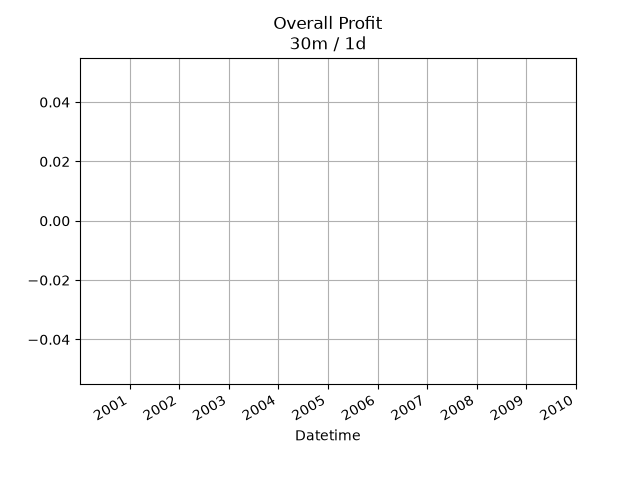|<table border="1" class="dataframe"> <thead> <tr style="text-align: center;"> <th>Datetime</th> <th>profit</th> </tr> </thead> <tbody> <tr> <td>09:30</td> <td>NaN</td> </tr> <tr> <td>10:00</td> <td>NaN</td> </tr> <tr> <td>10:30</td> <td>NaN</td> </tr> <tr> <td>11:00</td> <td>NaN</td> </tr> <tr> <td>11:30</td> <td>NaN</td> </tr> <tr> <td>13:00</td> <td>NaN</td> </tr> <tr> <td>13:30</td> <td>NaN</td> </tr> <tr> <td>14:00</td> <td>NaN</td> </tr> </tbody></table>|
|1d / 5d|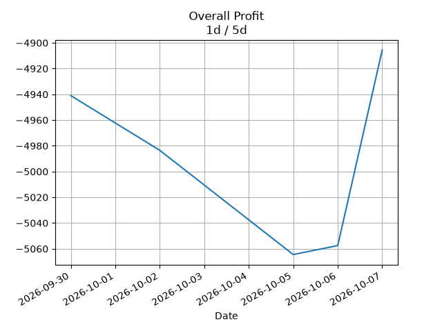|<table border="1" class="dataframe"> <thead> <tr style="text-align: center;"> <th>Date</th> <th>profit</th> </tr> </thead> <tbody> <tr> <td>2026-09-22</td> <td>-4757.0</td> </tr> <tr> <td>2026-09-23</td> <td>-4801.0</td> </tr> <tr> <td>2026-09-24</td> <td>-4839.0</td> </tr> <tr> <td>2026-09-25</td> <td>-4938.0</td> </tr> <tr> <td>2026-09-28</td> <td>-5002.5</td> </tr> </tbody></table>|
|1wk / 1mo|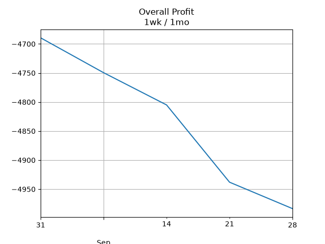|<table border="1" class="dataframe"> <thead> <tr style="text-align: center;"> <th>Date</th> <th>profit</th> </tr> </thead> <tbody> <tr> <td>2026-08-24</td> <td>-4503.02</td> </tr> <tr> <td>2026-08-31</td> <td>-4689.48</td> </tr> <tr> <td>2026-09-07</td> <td>-4749.50</td> </tr> <tr> <td>2026-09-14</td> <td>-4805.00</td> </tr> <tr> <td>2026-09-21</td> <td>-4938.00</td> </tr> <tr> <td>2026-09-28</td> <td>-4938.00</td> </tr> </tbody></table>|
---
## 0573.HK [📉] [$-832.00] [-44.44%]:
#### Tao Heung Holdings Limited
|price|profit|data|
|:---:|:---:|:---:|
|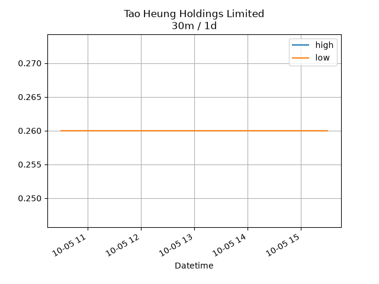|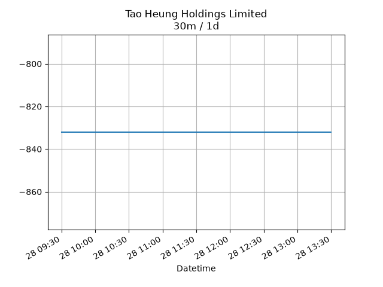|<table border="1" class="dataframe"> <thead> <tr style="text-align: center;"> <th>Datetime</th> <th>profit</th> </tr> </thead> <tbody> <tr> <td>09:30</td> <td>-832.0</td> </tr> <tr> <td>10:00</td> <td>-832.0</td> </tr> <tr> <td>13:30</td> <td>-832.0</td> </tr> </tbody></table>|
|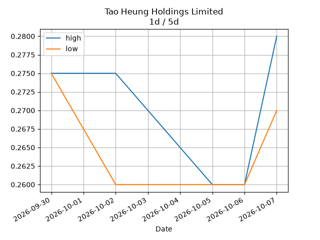|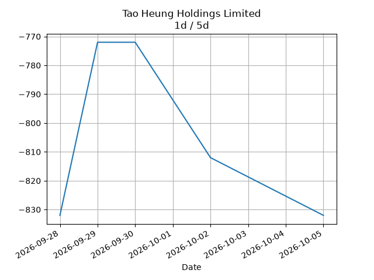|<table border="1" class="dataframe"> <thead> <tr style="text-align: center;"> <th>Date</th> <th>profit</th> </tr> </thead> <tbody> <tr> <td>2026-09-22</td> <td>-792.0</td> </tr> <tr> <td>2026-09-23</td> <td>-792.0</td> </tr> <tr> <td>2026-09-24</td> <td>-792.0</td> </tr> <tr> <td>2026-09-25</td> <td>-812.0</td> </tr> <tr> <td>2026-09-28</td> <td>-832.0</td> </tr> </tbody></table>|
|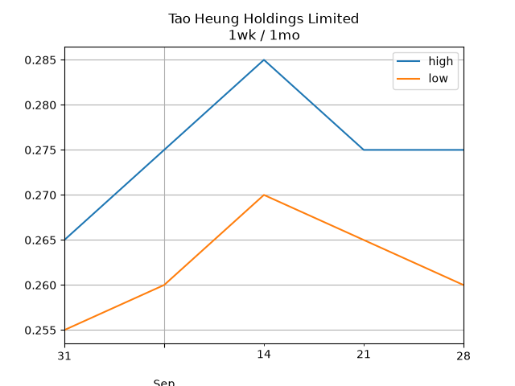|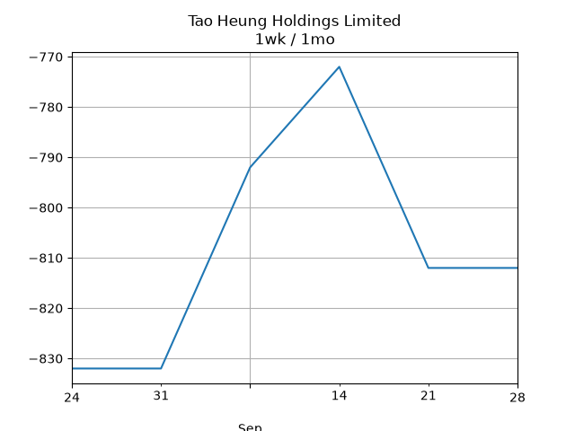|<table border="1" class="dataframe"> <thead> <tr style="text-align: center;"> <th>Date</th> <th>profit</th> </tr> </thead> <tbody> <tr> <td>2026-08-24</td> <td>-832.0</td> </tr> <tr> <td>2026-08-31</td> <td>-832.0</td> </tr> <tr> <td>2026-09-07</td> <td>-792.0</td> </tr> <tr> <td>2026-09-14</td> <td>-772.0</td> </tr> <tr> <td>2026-09-21</td> <td>-812.0</td> </tr> <tr> <td>2026-09-28</td> <td>-812.0</td> </tr> </tbody></table>|
---
## 0560.HK [📉] [$-856.00] [-26.62%]:
#### Chu Kong Shipping Enterprises (Group) Company Limited
|price|profit|data|
|:---:|:---:|:---:|
|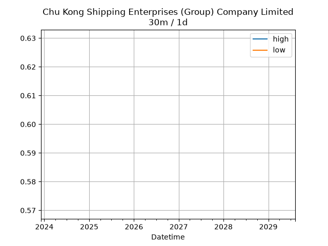|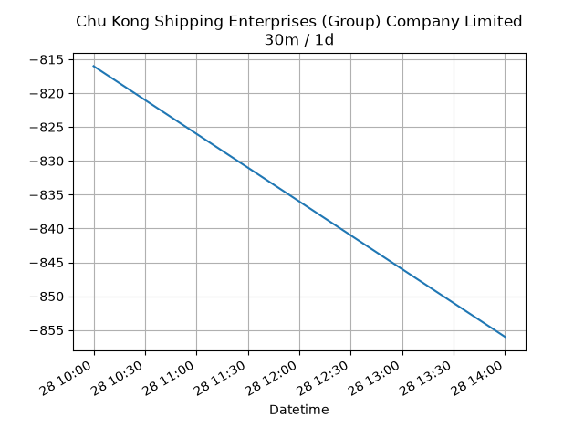|<table border="1" class="dataframe"> <thead> <tr style="text-align: center;"> <th>Datetime</th> <th>profit</th> </tr> </thead> <tbody> <tr> <td>10:00</td> <td>-816.0</td> </tr> <tr> <td>14:00</td> <td>-856.0</td> </tr> </tbody></table>|
|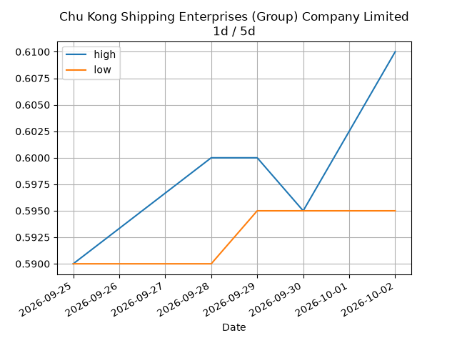|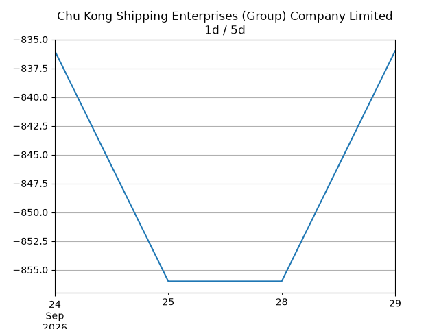|<table border="1" class="dataframe"> <thead> <tr style="text-align: center;"> <th>Date</th> <th>profit</th> </tr> </thead> <tbody> <tr> <td>2026-09-22</td> <td>-836.0</td> </tr> <tr> <td>2026-09-23</td> <td>-836.0</td> </tr> <tr> <td>2026-09-24</td> <td>-836.0</td> </tr> <tr> <td>2026-09-25</td> <td>-856.0</td> </tr> <tr> <td>2026-09-28</td> <td>-856.0</td> </tr> </tbody></table>|
|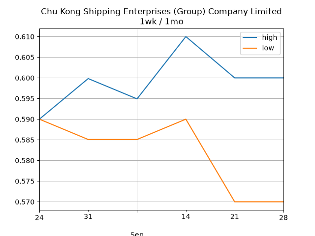|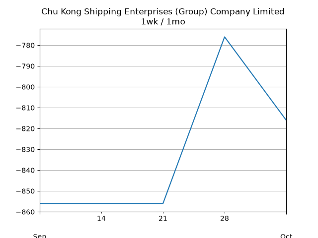|<table border="1" class="dataframe"> <thead> <tr style="text-align: center;"> <th>Date</th> <th>profit</th> </tr> </thead> <tbody> <tr> <td>2026-08-24</td> <td>-856.0</td> </tr> <tr> <td>2026-08-31</td> <td>-856.0</td> </tr> <tr> <td>2026-09-07</td> <td>-856.0</td> </tr> <tr> <td>2026-09-14</td> <td>-856.0</td> </tr> <tr> <td>2026-09-21</td> <td>-856.0</td> </tr> <tr> <td>2026-09-28</td> <td>-856.0</td> </tr> </tbody></table>|
---
## 0709.HK [📉] [$-1556.00] [-37.26%]:
#### Giordano International Limited
|price|profit|data|
|:---:|:---:|:---:|
|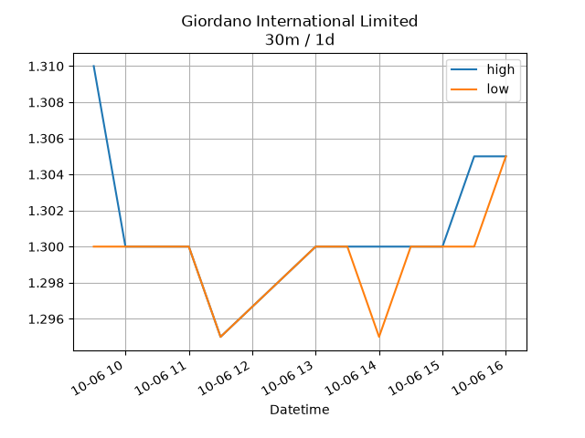|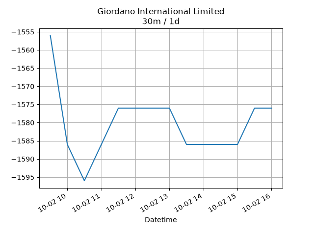|<table border="1" class="dataframe"> <thead> <tr style="text-align: center;"> <th>Datetime</th> <th>profit</th> </tr> </thead> <tbody> <tr> <td>09:30</td> <td>-1546.0</td> </tr> <tr> <td>10:30</td> <td>-1546.0</td> </tr> <tr> <td>11:30</td> <td>-1566.0</td> </tr> <tr> <td>13:00</td> <td>-1556.0</td> </tr> <tr> <td>13:30</td> <td>-1556.0</td> </tr> <tr> <td>14:00</td> <td>-1556.0</td> </tr> </tbody></table>|
|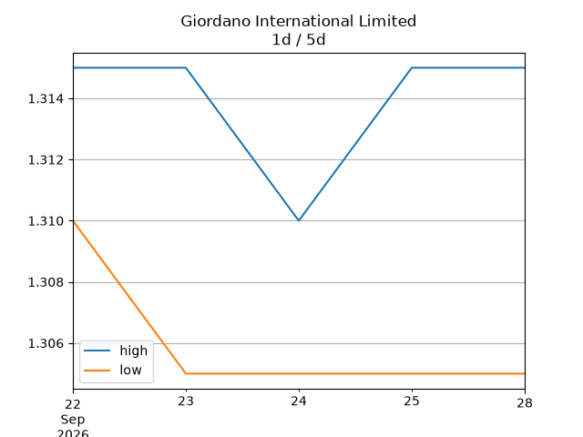|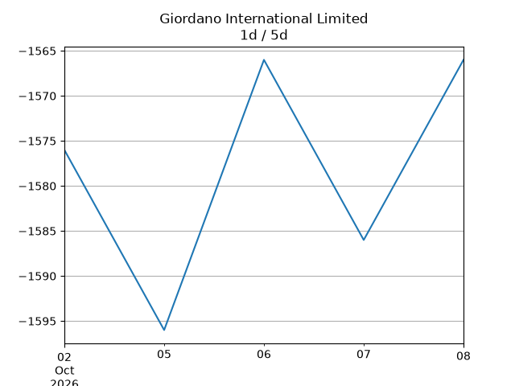|<table border="1" class="dataframe"> <thead> <tr style="text-align: center;"> <th>Date</th> <th>profit</th> </tr> </thead> <tbody> <tr> <td>2026-09-22</td> <td>-1546.0</td> </tr> <tr> <td>2026-09-23</td> <td>-1556.0</td> </tr> <tr> <td>2026-09-24</td> <td>-1566.0</td> </tr> <tr> <td>2026-09-25</td> <td>-1556.0</td> </tr> <tr> <td>2026-09-28</td> <td>-1556.0</td> </tr> </tbody></table>|
|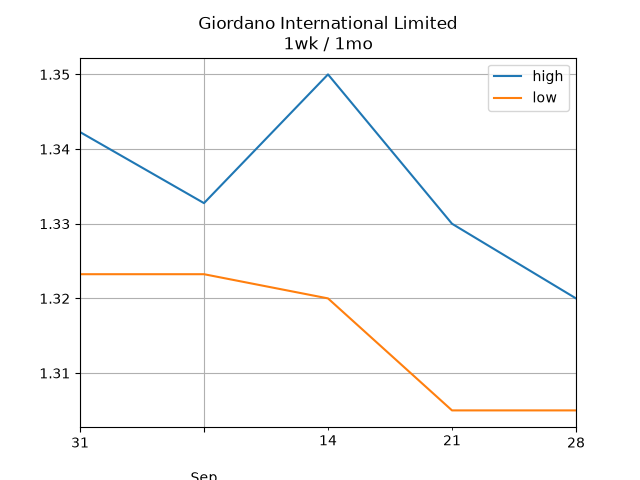|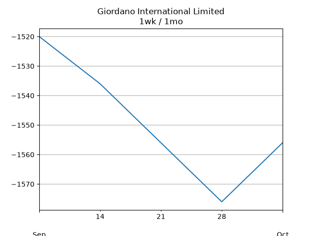|<table border="1" class="dataframe"> <thead> <tr style="text-align: center;"> <th>Date</th> <th>profit</th> </tr> </thead> <tbody> <tr> <td>2026-08-24</td> <td>-1529.52</td> </tr> <tr> <td>2026-08-31</td> <td>-1510.48</td> </tr> <tr> <td>2026-09-07</td> <td>-1520.00</td> </tr> <tr> <td>2026-09-14</td> <td>-1536.00</td> </tr> <tr> <td>2026-09-21</td> <td>-1556.00</td> </tr> <tr> <td>2026-09-28</td> <td>-1556.00</td> </tr> </tbody></table>|
---
## 1310.HK [📉] [$-146.50] [-5.02%]:
#### HKBN Ltd.
|price|profit|data|
|:---:|:---:|:---:|
|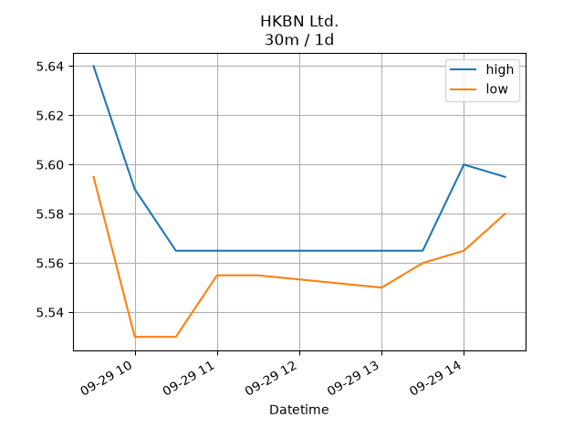|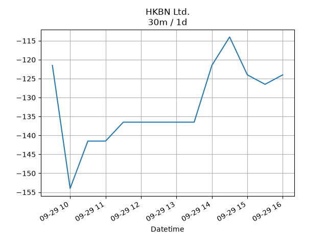|<table border="1" class="dataframe"> <thead> <tr style="text-align: center;"> <th>Datetime</th> <th>profit</th> </tr> </thead> <tbody> <tr> <td>09:30</td> <td>-111.5</td> </tr> <tr> <td>10:00</td> <td>-136.5</td> </tr> <tr> <td>10:30</td> <td>-146.5</td> </tr> <tr> <td>11:00</td> <td>-139.0</td> </tr> <tr> <td>11:30</td> <td>-136.5</td> </tr> <tr> <td>13:00</td> <td>-136.5</td> </tr> <tr> <td>13:30</td> <td>-144.0</td> </tr> <tr> <td>14:00</td> <td>-146.5</td> </tr> </tbody></table>|
|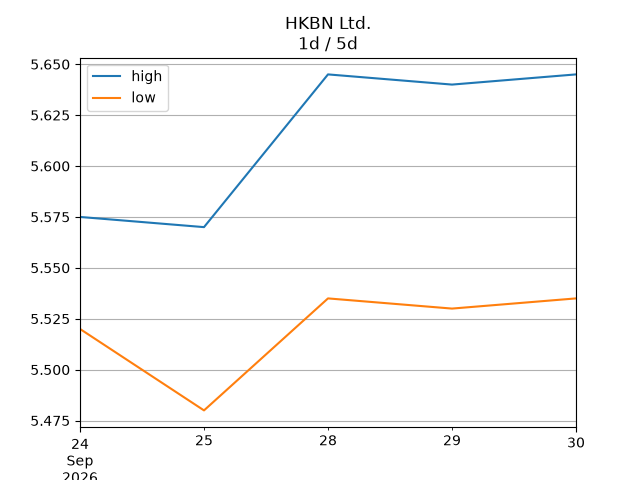|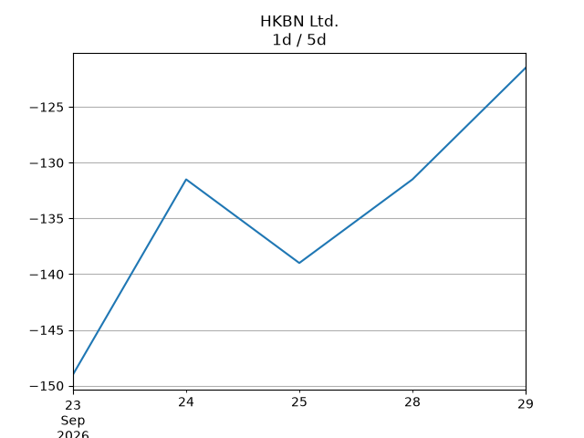|<table border="1" class="dataframe"> <thead> <tr style="text-align: center;"> <th>Date</th> <th>profit</th> </tr> </thead> <tbody> <tr> <td>2026-09-22</td> <td>-136.5</td> </tr> <tr> <td>2026-09-23</td> <td>-149.0</td> </tr> <tr> <td>2026-09-24</td> <td>-131.5</td> </tr> <tr> <td>2026-09-25</td> <td>-139.0</td> </tr> <tr> <td>2026-09-28</td> <td>-146.5</td> </tr> </tbody></table>|
|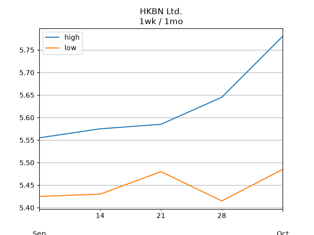|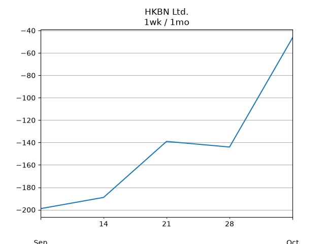|<table border="1" class="dataframe"> <thead> <tr style="text-align: center;"> <th>Date</th> <th>profit</th> </tr> </thead> <tbody> <tr> <td>2026-08-24</td> <td>26.0</td> </tr> <tr> <td>2026-08-31</td> <td>-161.5</td> </tr> <tr> <td>2026-09-07</td> <td>-199.0</td> </tr> <tr> <td>2026-09-14</td> <td>-189.0</td> </tr> <tr> <td>2026-09-21</td> <td>-139.0</td> </tr> <tr> <td>2026-09-28</td> <td>-139.0</td> </tr> </tbody></table>|
---
## 2638.HK [📈] [$261.00] [9.16%]:
#### HK Electric Investments and HK Electric Investments Limited
|price|profit|data|
|:---:|:---:|:---:|
|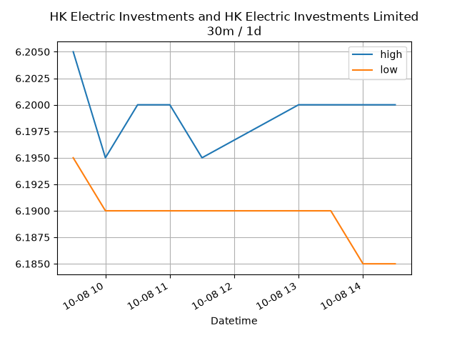|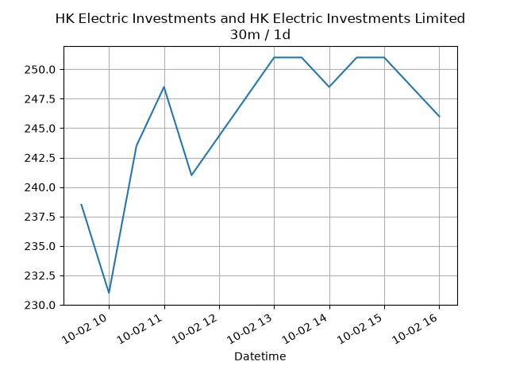|<table border="1" class="dataframe"> <thead> <tr style="text-align: center;"> <th>Datetime</th> <th>profit</th> </tr> </thead> <tbody> <tr> <td>09:30</td> <td>256.0</td> </tr> <tr> <td>10:00</td> <td>256.0</td> </tr> <tr> <td>10:30</td> <td>256.0</td> </tr> <tr> <td>11:00</td> <td>253.5</td> </tr> <tr> <td>11:30</td> <td>258.5</td> </tr> <tr> <td>13:00</td> <td>258.5</td> </tr> <tr> <td>13:30</td> <td>261.0</td> </tr> <tr> <td>14:00</td> <td>261.0</td> </tr> </tbody></table>|
|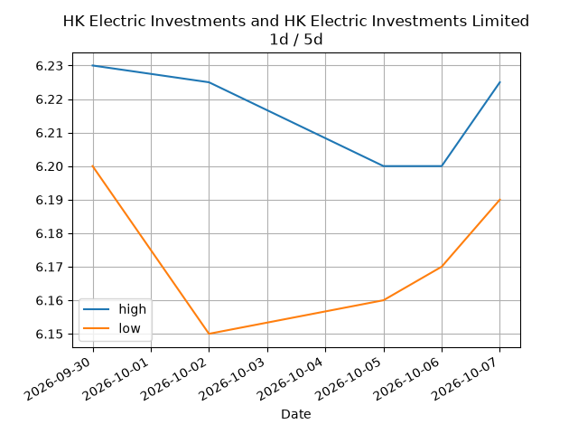|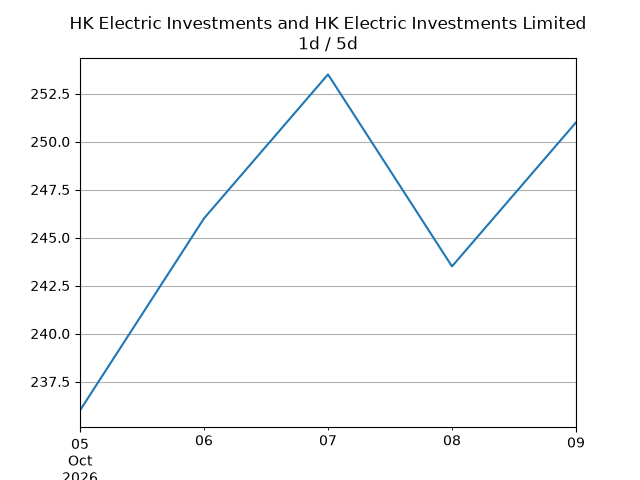|<table border="1" class="dataframe"> <thead> <tr style="text-align: center;"> <th>Date</th> <th>profit</th> </tr> </thead> <tbody> <tr> <td>2026-09-22</td> <td>283.5</td> </tr> <tr> <td>2026-09-23</td> <td>276.0</td> </tr> <tr> <td>2026-09-24</td> <td>263.5</td> </tr> <tr> <td>2026-09-25</td> <td>251.0</td> </tr> <tr> <td>2026-09-28</td> <td>261.0</td> </tr> </tbody></table>|
|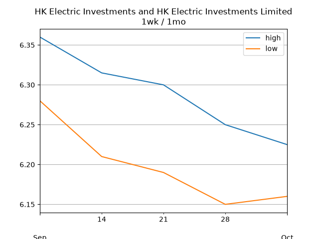|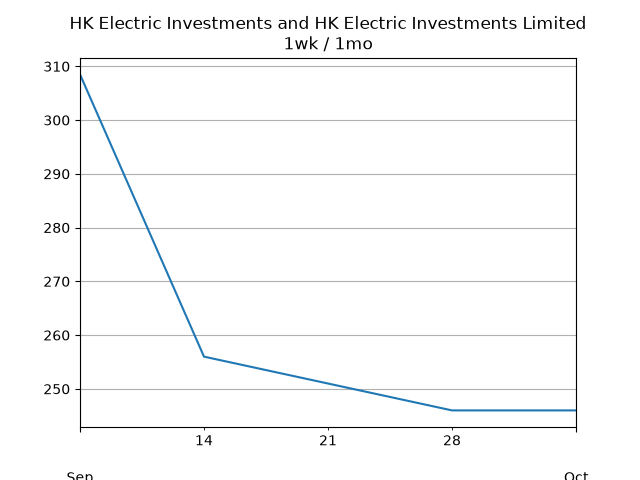|<table border="1" class="dataframe"> <thead> <tr style="text-align: center;"> <th>Date</th> <th>profit</th> </tr> </thead> <tbody> <tr> <td>2026-08-24</td> <td>303.5</td> </tr> <tr> <td>2026-08-31</td> <td>293.5</td> </tr> <tr> <td>2026-09-07</td> <td>308.5</td> </tr> <tr> <td>2026-09-14</td> <td>256.0</td> </tr> <tr> <td>2026-09-21</td> <td>251.0</td> </tr> <tr> <td>2026-09-28</td> <td>251.0</td> </tr> </tbody></table>|
---
## 0533.HK [📉] [$-1500.00] [-37.74%]:
#### Goldlion Holdings Limited
|price|profit|data|
|:---:|:---:|:---:|
|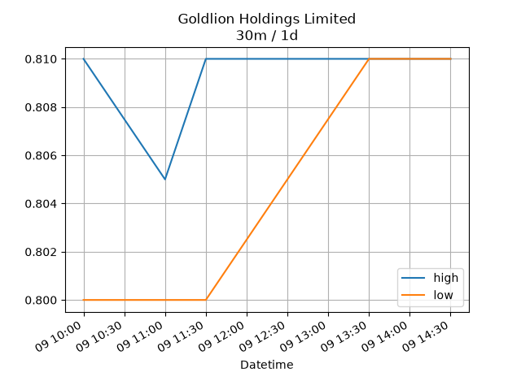|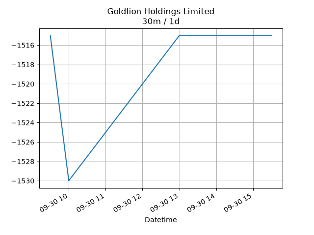|<table border="1" class="dataframe"> <thead> <tr style="text-align: center;"> <th>Datetime</th> <th>profit</th> </tr> </thead> <tbody> <tr> <td>10:00</td> <td>-1485.0</td> </tr> <tr> <td>10:30</td> <td>-1425.0</td> </tr> <tr> <td>11:00</td> <td>-1440.0</td> </tr> <tr> <td>11:30</td> <td>-1485.0</td> </tr> <tr> <td>13:00</td> <td>-1485.0</td> </tr> <tr> <td>13:30</td> <td>-1500.0</td> </tr> </tbody></table>|
|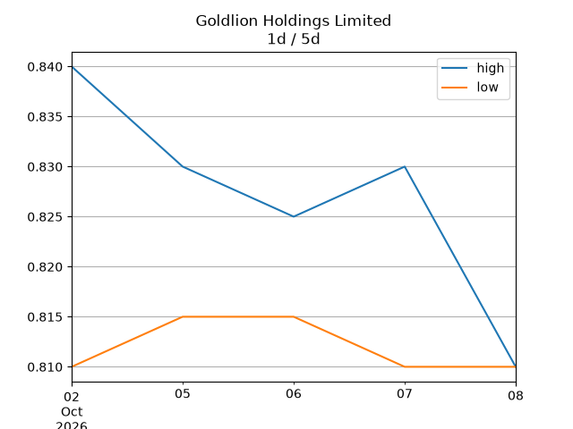|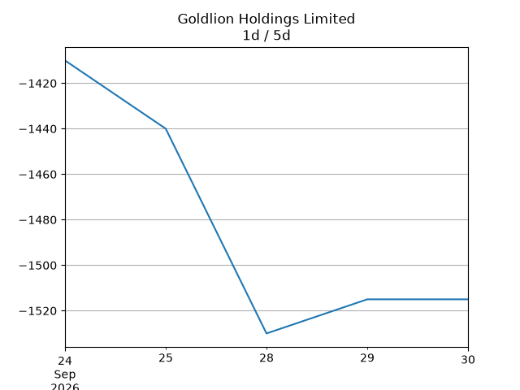|<table border="1" class="dataframe"> <thead> <tr style="text-align: center;"> <th>Date</th> <th>profit</th> </tr> </thead> <tbody> <tr> <td>2026-09-22</td> <td>-1380.0</td> </tr> <tr> <td>2026-09-23</td> <td>-1380.0</td> </tr> <tr> <td>2026-09-24</td> <td>-1410.0</td> </tr> <tr> <td>2026-09-25</td> <td>-1440.0</td> </tr> <tr> <td>2026-09-28</td> <td>-1500.0</td> </tr> </tbody></table>|
|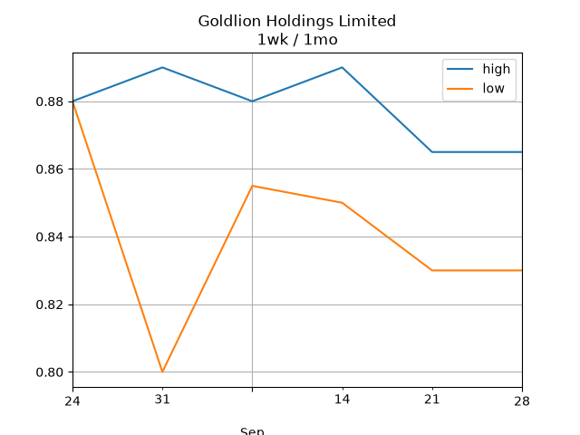|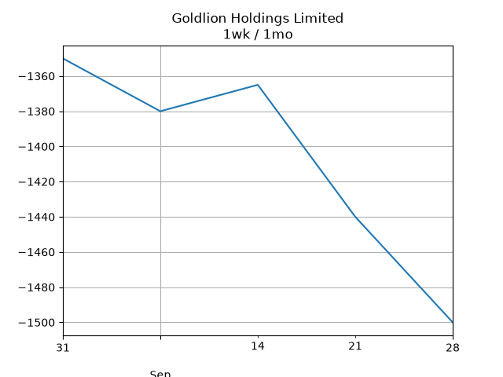|<table border="1" class="dataframe"> <thead> <tr style="text-align: center;"> <th>Date</th> <th>profit</th> </tr> </thead> <tbody> <tr> <td>2026-08-24</td> <td>-1335.0</td> </tr> <tr> <td>2026-08-31</td> <td>-1350.0</td> </tr> <tr> <td>2026-09-07</td> <td>-1380.0</td> </tr> <tr> <td>2026-09-14</td> <td>-1365.0</td> </tr> <tr> <td>2026-09-21</td> <td>-1440.0</td> </tr> <tr> <td>2026-09-28</td> <td>-1440.0</td> </tr> </tbody></table>|
---
## 2618.HK [📉] [$-373.00] [-26.83%]:
#### JD Logistics, Inc.
|price|profit|data|
|:---:|:---:|:---:|
|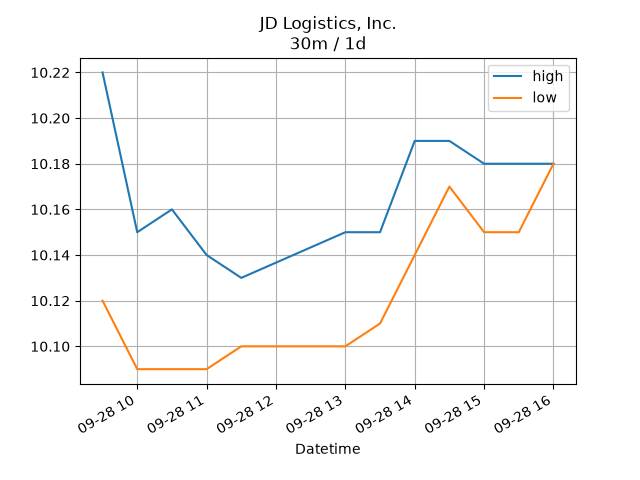|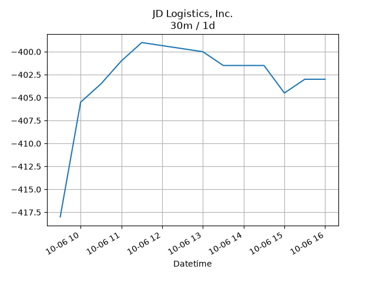|<table border="1" class="dataframe"> <thead> <tr style="text-align: center;"> <th>Datetime</th> <th>profit</th> </tr> </thead> <tbody> <tr> <td>09:30</td> <td>-376.0</td> </tr> <tr> <td>10:00</td> <td>-381.0</td> </tr> <tr> <td>10:30</td> <td>-376.0</td> </tr> <tr> <td>11:00</td> <td>-379.0</td> </tr> <tr> <td>11:30</td> <td>-380.0</td> </tr> <tr> <td>13:00</td> <td>-377.0</td> </tr> <tr> <td>13:30</td> <td>-377.0</td> </tr> <tr> <td>14:00</td> <td>-373.0</td> </tr> </tbody></table>|
|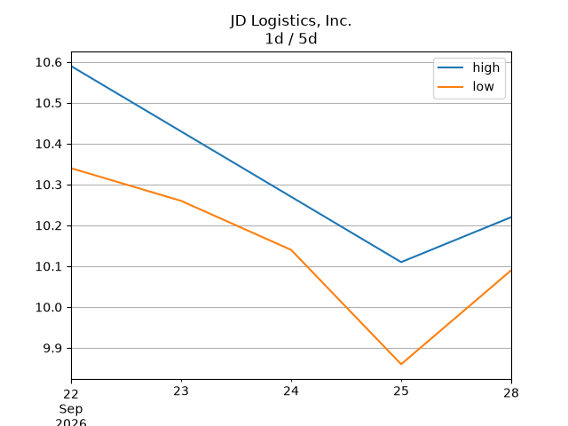|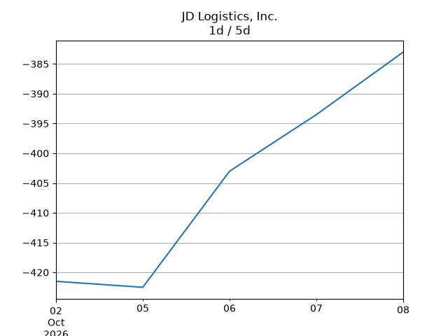|<table border="1" class="dataframe"> <thead> <tr style="text-align: center;"> <th>Date</th> <th>profit</th> </tr> </thead> <tbody> <tr> <td>2026-09-22</td> <td>-350.0</td> </tr> <tr> <td>2026-09-23</td> <td>-364.0</td> </tr> <tr> <td>2026-09-24</td> <td>-367.0</td> </tr> <tr> <td>2026-09-25</td> <td>-386.0</td> </tr> <tr> <td>2026-09-28</td> <td>-373.0</td> </tr> </tbody></table>|
|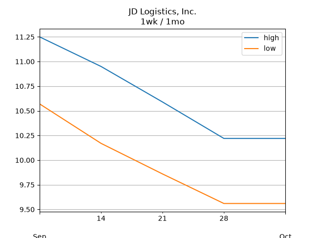|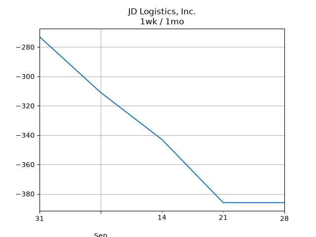|<table border="1" class="dataframe"> <thead> <tr style="text-align: center;"> <th>Date</th> <th>profit</th> </tr> </thead> <tbody> <tr> <td>2026-08-24</td> <td>-280.0</td> </tr> <tr> <td>2026-08-31</td> <td>-273.0</td> </tr> <tr> <td>2026-09-07</td> <td>-311.0</td> </tr> <tr> <td>2026-09-14</td> <td>-343.0</td> </tr> <tr> <td>2026-09-21</td> <td>-386.0</td> </tr> <tr> <td>2026-09-28</td> <td>-386.0</td> </tr> </tbody></table>|
---
