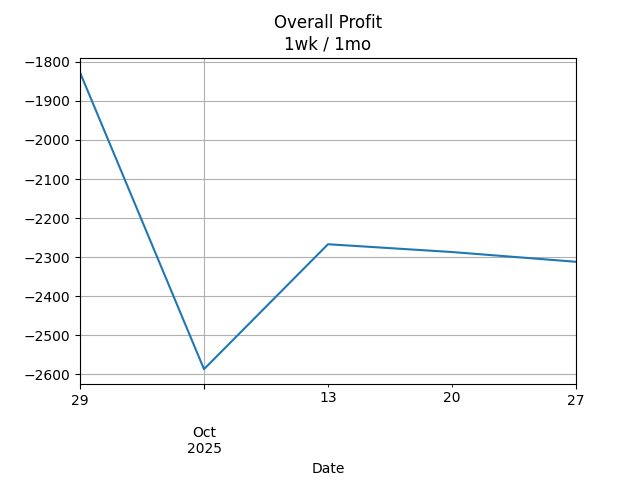
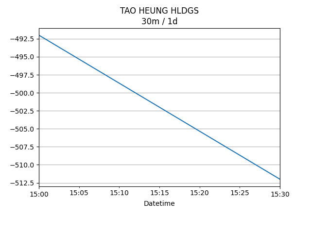

## Net Profit [📉]:
### $-1830.00
|type|graph|data|
|:---:|:---:|:---:|
|30m / 1d|||
|1d / 5d||<table border="1" class="dataframe"> <thead> <tr style="text-align: center;"> <th>Date</th> <th>profit</th> </tr> </thead> <tbody> <tr> <td>2025-10-17</td> <td>-2267.0</td> </tr> <tr> <td>2025-10-20</td> <td>-2292.0</td> </tr> <tr> <td>2025-10-21</td> <td>-2287.0</td> </tr> <tr> <td>2025-10-22</td> <td>-2332.0</td> </tr> <tr> <td>2025-10-23</td> <td>-2332.0</td> </tr> </tbody></table>|
|1wk / 1mo||<table border="1" class="dataframe"> <thead> <tr style="text-align: center;"> <th>Date</th> <th>profit</th> </tr> </thead> <tbody> <tr> <td>2025-09-22</td> <td>-1987.0</td> </tr> <tr> <td>2025-09-29</td> <td>-1827.0</td> </tr> <tr> <td>2025-10-06</td> <td>-2587.0</td> </tr> <tr> <td>2025-10-13</td> <td>-2267.0</td> </tr> <tr> <td>2025-10-20</td> <td>-2302.0</td> </tr> </tbody></table>|
---
## 0573.HK [📈] [$0.00] [0.00%]:
#### TAO HEUNG HLDGS
|price|profit|data|
|:---:|:---:|:---:|
|||<table border="1" class="dataframe"> <thead> <tr style="text-align: center;"> <th>index</th> <th>profit</th> </tr> </thead> <tbody> <tr> <td>00:00</td> <td>0</td> </tr> </tbody></table>|
|||<table border="1" class="dataframe"> <thead> <tr style="text-align: center;"> <th>Date</th> <th>profit</th> </tr> </thead> <tbody> <tr> <td>2025-10-17</td> <td>-492.0</td> </tr> <tr> <td>2025-10-20</td> <td>-472.0</td> </tr> <tr> <td>2025-10-21</td> <td>-512.0</td> </tr> <tr> <td>2025-10-22</td> <td>-472.0</td> </tr> </tbody></table>|
|||<table border="1" class="dataframe"> <thead> <tr style="text-align: center;"> <th>Date</th> <th>profit</th> </tr> </thead> <tbody> <tr> <td>2025-09-22</td> <td>-432.0</td> </tr> <tr> <td>2025-09-29</td> <td>-452.0</td> </tr> <tr> <td>2025-10-06</td> <td>-492.0</td> </tr> <tr> <td>2025-10-13</td> <td>-492.0</td> </tr> <tr> <td>2025-10-20</td> <td>-472.0</td> </tr> </tbody></table>|
---
## 0560.HK [📉] [$-136.00] [-4.23%]:
#### CHU KONG SHIP
|price|profit|data|
|:---:|:---:|:---:|
|||<table border="1" class="dataframe"> <thead> <tr style="text-align: center;"> <th>Datetime</th> <th>profit</th> </tr> </thead> <tbody> <tr> <td>10:30</td> <td>-136.0</td> </tr> <tr> <td>11:00</td> <td>-96.0</td> </tr> <tr> <td>11:30</td> <td>-136.0</td> </tr> </tbody></table>|
|||<table border="1" class="dataframe"> <thead> <tr style="text-align: center;"> <th>Date</th> <th>profit</th> </tr> </thead> <tbody> <tr> <td>2025-10-17</td> <td>-136.0</td> </tr> <tr> <td>2025-10-20</td> <td>-176.0</td> </tr> <tr> <td>2025-10-21</td> <td>-136.0</td> </tr> <tr> <td>2025-10-22</td> <td>-136.0</td> </tr> <tr> <td>2025-10-23</td> <td>-136.0</td> </tr> </tbody></table>|
|||<table border="1" class="dataframe"> <thead> <tr style="text-align: center;"> <th>Date</th> <th>profit</th> </tr> </thead> <tbody> <tr> <td>2025-09-22</td> <td>-136.0</td> </tr> <tr> <td>2025-09-29</td> <td>24.0</td> </tr> <tr> <td>2025-10-06</td> <td>-136.0</td> </tr> <tr> <td>2025-10-13</td> <td>-136.0</td> </tr> <tr> <td>2025-10-20</td> <td>-136.0</td> </tr> </tbody></table>|
---
## 0709.HK [📉] [$-1196.00] [-28.64%]:
#### GIORDANO INT'L
|price|profit|data|
|:---:|:---:|:---:|
|||<table border="1" class="dataframe"> <thead> <tr style="text-align: center;"> <th>Datetime</th> <th>profit</th> </tr> </thead> <tbody> <tr> <td>09:30</td> <td>-1196.0</td> </tr> <tr> <td>10:00</td> <td>-1176.0</td> </tr> <tr> <td>10:30</td> <td>-1176.0</td> </tr> <tr> <td>11:00</td> <td>-1196.0</td> </tr> <tr> <td>11:30</td> <td>-1196.0</td> </tr> <tr> <td>13:00</td> <td>-1196.0</td> </tr> </tbody></table>|
|||<table border="1" class="dataframe"> <thead> <tr style="text-align: center;"> <th>Date</th> <th>profit</th> </tr> </thead> <tbody> <tr> <td>2025-10-17</td> <td>-1216.0</td> </tr> <tr> <td>2025-10-20</td> <td>-1176.0</td> </tr> <tr> <td>2025-10-21</td> <td>-1176.0</td> </tr> <tr> <td>2025-10-22</td> <td>-1176.0</td> </tr> <tr> <td>2025-10-23</td> <td>-1196.0</td> </tr> </tbody></table>|
|||<table border="1" class="dataframe"> <thead> <tr style="text-align: center;"> <th>Date</th> <th>profit</th> </tr> </thead> <tbody> <tr> <td>2025-09-22</td> <td>-1156.0</td> </tr> <tr> <td>2025-09-29</td> <td>-1176.0</td> </tr> <tr> <td>2025-10-06</td> <td>-1196.0</td> </tr> <tr> <td>2025-10-13</td> <td>-1216.0</td> </tr> <tr> <td>2025-10-20</td> <td>-1196.0</td> </tr> </tbody></table>|
---
## 1310.HK [📈] [$481.00] [16.48%]:
#### HKBN
|price|profit|data|
|:---:|:---:|:---:|
|||<table border="1" class="dataframe"> <thead> <tr style="text-align: center;"> <th>Datetime</th> <th>profit</th> </tr> </thead> <tbody> <tr> <td>09:30</td> <td>491.0</td> </tr> <tr> <td>10:00</td> <td>496.0</td> </tr> <tr> <td>10:30</td> <td>461.0</td> </tr> <tr> <td>11:00</td> <td>461.0</td> </tr> <tr> <td>11:30</td> <td>466.0</td> </tr> <tr> <td>13:00</td> <td>481.0</td> </tr> </tbody></table>|
|||<table border="1" class="dataframe"> <thead> <tr style="text-align: center;"> <th>Date</th> <th>profit</th> </tr> </thead> <tbody> <tr> <td>2025-10-17</td> <td>536.0</td> </tr> <tr> <td>2025-10-20</td> <td>486.0</td> </tr> <tr> <td>2025-10-21</td> <td>511.0</td> </tr> <tr> <td>2025-10-22</td> <td>436.0</td> </tr> <tr> <td>2025-10-23</td> <td>481.0</td> </tr> </tbody></table>|
|||<table border="1" class="dataframe"> <thead> <tr style="text-align: center;"> <th>Date</th> <th>profit</th> </tr> </thead> <tbody> <tr> <td>2025-09-22</td> <td>721.0</td> </tr> <tr> <td>2025-09-29</td> <td>741.0</td> </tr> <tr> <td>2025-10-06</td> <td>256.0</td> </tr> <tr> <td>2025-10-13</td> <td>536.0</td> </tr> <tr> <td>2025-10-20</td> <td>481.0</td> </tr> </tbody></table>|
---
## 2638.HK [📈] [$176.00] [6.18%]:
#### HK Electric Investments and HK Electric Investments Limited
|price|profit|data|
|:---:|:---:|:---:|
|||<table border="1" class="dataframe"> <thead> <tr style="text-align: center;"> <th>Datetime</th> <th>profit</th> </tr> </thead> <tbody> <tr> <td>09:30</td> <td>171.0</td> </tr> <tr> <td>10:00</td> <td>171.0</td> </tr> <tr> <td>10:30</td> <td>181.0</td> </tr> <tr> <td>11:00</td> <td>176.0</td> </tr> <tr> <td>11:30</td> <td>171.0</td> </tr> <tr> <td>13:00</td> <td>176.0</td> </tr> <tr> <td>13:30</td> <td>176.0</td> </tr> </tbody></table>|
|||<table border="1" class="dataframe"> <thead> <tr style="text-align: center;"> <th>Date</th> <th>profit</th> </tr> </thead> <tbody> <tr> <td>2025-10-17</td> <td>166.0</td> </tr> <tr> <td>2025-10-20</td> <td>171.0</td> </tr> <tr> <td>2025-10-21</td> <td>181.0</td> </tr> <tr> <td>2025-10-22</td> <td>171.0</td> </tr> <tr> <td>2025-10-23</td> <td>176.0</td> </tr> </tbody></table>|
|||<table border="1" class="dataframe"> <thead> <tr style="text-align: center;"> <th>Date</th> <th>profit</th> </tr> </thead> <tbody> <tr> <td>2025-09-22</td> <td>111.0</td> </tr> <tr> <td>2025-09-29</td> <td>131.0</td> </tr> <tr> <td>2025-10-06</td> <td>136.0</td> </tr> <tr> <td>2025-10-13</td> <td>166.0</td> </tr> <tr> <td>2025-10-20</td> <td>176.0</td> </tr> </tbody></table>|
---
## 0533.HK [📉] [$-1155.00] [-29.06%]:
#### GOLDLION HOLD
|price|profit|data|
|:---:|:---:|:---:|
|||<table border="1" class="dataframe"> <thead> <tr style="text-align: center;"> <th>Datetime</th> <th>profit</th> </tr> </thead> <tbody> <tr> <td>09:30</td> <td>-1155.0</td> </tr> </tbody></table>|
|||<table border="1" class="dataframe"> <thead> <tr style="text-align: center;"> <th>Date</th> <th>profit</th> </tr> </thead> <tbody> <tr> <td>2025-10-17</td> <td>-1125.0</td> </tr> <tr> <td>2025-10-20</td> <td>-1125.0</td> </tr> <tr> <td>2025-10-21</td> <td>-1155.0</td> </tr> <tr> <td>2025-10-22</td> <td>-1155.0</td> </tr> <tr> <td>2025-10-23</td> <td>-1155.0</td> </tr> </tbody></table>|
|||<table border="1" class="dataframe"> <thead> <tr style="text-align: center;"> <th>Date</th> <th>profit</th> </tr> </thead> <tbody> <tr> <td>2025-09-22</td> <td>-1095.0</td> </tr> <tr> <td>2025-09-29</td> <td>-1095.0</td> </tr> <tr> <td>2025-10-06</td> <td>-1155.0</td> </tr> <tr> <td>2025-10-13</td> <td>-1125.0</td> </tr> <tr> <td>2025-10-20</td> <td>-1155.0</td> </tr> </tbody></table>|
---
