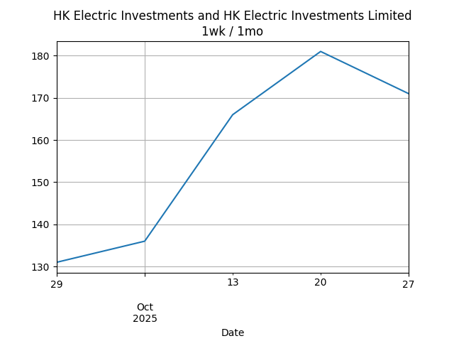

## Net Profit [📉]:
### $-3307.00
|type|graph|data|
|:---:|:---:|:---:|
|30m / 1d||<table border="1" class="dataframe"> <thead> <tr style="text-align: center;"> <th>Datetime</th> <th>profit</th> </tr> </thead> <tbody> <tr> <td>09:30</td> <td>-3392.0</td> </tr> <tr> <td>10:00</td> <td>-3382.0</td> </tr> <tr> <td>10:30</td> <td>-3382.0</td> </tr> <tr> <td>11:00</td> <td>-3382.0</td> </tr> <tr> <td>11:30</td> <td>-3292.0</td> </tr> <tr> <td>13:00</td> <td>-3292.0</td> </tr> <tr> <td>13:30</td> <td>-3292.0</td> </tr> <tr> <td>14:00</td> <td>-3292.0</td> </tr> <tr> <td>14:30</td> <td>-3292.0</td> </tr> <tr> <td>15:00</td> <td>-3362.0</td> </tr> <tr> <td>15:30</td> <td>-3362.0</td> </tr> </tbody></table>|
|1d / 5d||<table border="1" class="dataframe"> <thead> <tr style="text-align: center;"> <th>Date</th> <th>profit</th> </tr> </thead> <tbody> <tr> <td>2025-06-27</td> <td>-3447.0</td> </tr> <tr> <td>2025-06-30</td> <td>-3537.0</td> </tr> <tr> <td>2025-07-02</td> <td>-3487.0</td> </tr> <tr> <td>2025-07-03</td> <td>-3487.0</td> </tr> <tr> <td>2025-07-04</td> <td>-3187.0</td> </tr> </tbody></table>|
|1wk / 1mo||<table border="1" class="dataframe"> <thead> <tr style="text-align: center;"> <th>Date</th> <th>profit</th> </tr> </thead> <tbody> <tr> <td>2025-06-02</td> <td>-4051.29</td> </tr> <tr> <td>2025-06-09</td> <td>-3817.00</td> </tr> <tr> <td>2025-06-16</td> <td>-3812.00</td> </tr> <tr> <td>2025-06-23</td> <td>-3447.00</td> </tr> <tr> <td>2025-06-30</td> <td>-3187.00</td> </tr> </tbody></table>|
---
## 0573.HK [📉] [$-672.00] [-35.90%]:
#### TAO HEUNG HLDGS
|price|profit|data|
|:---:|:---:|:---:|
|||<table border="1" class="dataframe"> <thead> <tr style="text-align: center;"> <th>Datetime</th> <th>profit</th> </tr> </thead> <tbody> <tr> <td>09:30</td> <td>-672.0</td> </tr> <tr> <td>10:00</td> <td>-692.0</td> </tr> <tr> <td>11:30</td> <td>-672.0</td> </tr> <tr> <td>15:00</td> <td>-672.0</td> </tr> </tbody></table>|
|||<table border="1" class="dataframe"> <thead> <tr style="text-align: center;"> <th>Date</th> <th>profit</th> </tr> </thead> <tbody> <tr> <td>2025-06-27</td> <td>-652.0</td> </tr> <tr> <td>2025-06-30</td> <td>-672.0</td> </tr> <tr> <td>2025-07-02</td> <td>-672.0</td> </tr> <tr> <td>2025-07-03</td> <td>-652.0</td> </tr> <tr> <td>2025-07-04</td> <td>-672.0</td> </tr> </tbody></table>|
|||<table border="1" class="dataframe"> <thead> <tr style="text-align: center;"> <th>Date</th> <th>profit</th> </tr> </thead> <tbody> <tr> <td>2025-06-02</td> <td>-692.0</td> </tr> <tr> <td>2025-06-09</td> <td>-672.0</td> </tr> <tr> <td>2025-06-16</td> <td>-692.0</td> </tr> <tr> <td>2025-06-23</td> <td>-652.0</td> </tr> <tr> <td>2025-06-30</td> <td>-672.0</td> </tr> </tbody></table>|
---
## 0560.HK [📉] [$-16.00] [-0.50%]:
#### CHU KONG SHIP
|price|profit|data|
|:---:|:---:|:---:|
|||<table border="1" class="dataframe"> <thead> <tr style="text-align: center;"> <th>Datetime</th> <th>profit</th> </tr> </thead> <tbody> <tr> <td>09:30</td> <td>24.0</td> </tr> <tr> <td>10:00</td> <td>24.0</td> </tr> <tr> <td>11:00</td> <td>24.0</td> </tr> <tr> <td>11:30</td> <td>24.0</td> </tr> <tr> <td>13:30</td> <td>24.0</td> </tr> <tr> <td>14:00</td> <td>24.0</td> </tr> <tr> <td>14:30</td> <td>64.0</td> </tr> <tr> <td>15:00</td> <td>-16.0</td> </tr> </tbody></table>|
|||<table border="1" class="dataframe"> <thead> <tr style="text-align: center;"> <th>Date</th> <th>profit</th> </tr> </thead> <tbody> <tr> <td>2025-06-27</td> <td>24.0</td> </tr> <tr> <td>2025-06-30</td> <td>-56.0</td> </tr> <tr> <td>2025-07-02</td> <td>24.0</td> </tr> <tr> <td>2025-07-03</td> <td>24.0</td> </tr> <tr> <td>2025-07-04</td> <td>104.0</td> </tr> </tbody></table>|
|||<table border="1" class="dataframe"> <thead> <tr style="text-align: center;"> <th>Date</th> <th>profit</th> </tr> </thead> <tbody> <tr> <td>2025-06-02</td> <td>-366.0</td> </tr> <tr> <td>2025-06-09</td> <td>-136.0</td> </tr> <tr> <td>2025-06-16</td> <td>-176.0</td> </tr> <tr> <td>2025-06-23</td> <td>24.0</td> </tr> <tr> <td>2025-06-30</td> <td>104.0</td> </tr> </tbody></table>|
---
## 0709.HK [📉] [$-1336.00] [-31.99%]:
#### GIORDANO INT'L
|price|profit|data|
|:---:|:---:|:---:|
|||<table border="1" class="dataframe"> <thead> <tr style="text-align: center;"> <th>Datetime</th> <th>profit</th> </tr> </thead> <tbody> <tr> <td>09:30</td> <td>-1376.0</td> </tr> <tr> <td>10:00</td> <td>-1376.0</td> </tr> <tr> <td>10:30</td> <td>-1356.0</td> </tr> <tr> <td>11:00</td> <td>-1356.0</td> </tr> <tr> <td>11:30</td> <td>-1356.0</td> </tr> <tr> <td>13:00</td> <td>-1336.0</td> </tr> <tr> <td>13:30</td> <td>-1356.0</td> </tr> <tr> <td>14:00</td> <td>-1376.0</td> </tr> <tr> <td>14:30</td> <td>-1376.0</td> </tr> <tr> <td>15:00</td> <td>-1356.0</td> </tr> <tr> <td>15:30</td> <td>-1336.0</td> </tr> </tbody></table>|
|||<table border="1" class="dataframe"> <thead> <tr style="text-align: center;"> <th>Date</th> <th>profit</th> </tr> </thead> <tbody> <tr> <td>2025-06-27</td> <td>-1316.0</td> </tr> <tr> <td>2025-06-30</td> <td>-1296.0</td> </tr> <tr> <td>2025-07-02</td> <td>-1336.0</td> </tr> <tr> <td>2025-07-03</td> <td>-1356.0</td> </tr> <tr> <td>2025-07-04</td> <td>-1336.0</td> </tr> </tbody></table>|
|||<table border="1" class="dataframe"> <thead> <tr style="text-align: center;"> <th>Date</th> <th>profit</th> </tr> </thead> <tbody> <tr> <td>2025-06-02</td> <td>-1490.29</td> </tr> <tr> <td>2025-06-09</td> <td>-1456.00</td> </tr> <tr> <td>2025-06-16</td> <td>-1396.00</td> </tr> <tr> <td>2025-06-23</td> <td>-1316.00</td> </tr> <tr> <td>2025-06-30</td> <td>-1336.00</td> </tr> </tbody></table>|
---
## 1310.HK [📉] [$-404.00] [-13.84%]:
#### HKBN
|price|profit|data|
|:---:|:---:|:---:|
|||<table border="1" class="dataframe"> <thead> <tr style="text-align: center;"> <th>Datetime</th> <th>profit</th> </tr> </thead> <tbody> <tr> <td>09:30</td> <td>-414.0</td> </tr> <tr> <td>10:00</td> <td>-409.0</td> </tr> <tr> <td>10:30</td> <td>-409.0</td> </tr> <tr> <td>11:00</td> <td>-409.0</td> </tr> <tr> <td>11:30</td> <td>-409.0</td> </tr> <tr> <td>13:00</td> <td>-404.0</td> </tr> <tr> <td>13:30</td> <td>-404.0</td> </tr> <tr> <td>14:00</td> <td>-404.0</td> </tr> <tr> <td>14:30</td> <td>-409.0</td> </tr> <tr> <td>15:00</td> <td>-409.0</td> </tr> <tr> <td>15:30</td> <td>-404.0</td> </tr> </tbody></table>|
|||<table border="1" class="dataframe"> <thead> <tr style="text-align: center;"> <th>Date</th> <th>profit</th> </tr> </thead> <tbody> <tr> <td>2025-06-27</td> <td>-429.0</td> </tr> <tr> <td>2025-06-30</td> <td>-434.0</td> </tr> <tr> <td>2025-07-02</td> <td>-429.0</td> </tr> <tr> <td>2025-07-03</td> <td>-414.0</td> </tr> <tr> <td>2025-07-04</td> <td>-404.0</td> </tr> </tbody></table>|
|||<table border="1" class="dataframe"> <thead> <tr style="text-align: center;"> <th>Date</th> <th>profit</th> </tr> </thead> <tbody> <tr> <td>2025-06-02</td> <td>-434.0</td> </tr> <tr> <td>2025-06-09</td> <td>-439.0</td> </tr> <tr> <td>2025-06-16</td> <td>-424.0</td> </tr> <tr> <td>2025-06-23</td> <td>-429.0</td> </tr> <tr> <td>2025-06-30</td> <td>-404.0</td> </tr> </tbody></table>|
---
## 2638.HK [📈] [$66.00] [2.32%]:
#### HK Electric Investments and HK Electric Investments Limited
|price|profit|data|
|:---:|:---:|:---:|
|||<table border="1" class="dataframe"> <thead> <tr style="text-align: center;"> <th>Datetime</th> <th>profit</th> </tr> </thead> <tbody> <tr> <td>09:30</td> <td>51.0</td> </tr> <tr> <td>10:00</td> <td>46.0</td> </tr> <tr> <td>10:30</td> <td>51.0</td> </tr> <tr> <td>11:00</td> <td>46.0</td> </tr> <tr> <td>11:30</td> <td>66.0</td> </tr> <tr> <td>13:00</td> <td>66.0</td> </tr> <tr> <td>13:30</td> <td>66.0</td> </tr> <tr> <td>14:00</td> <td>66.0</td> </tr> <tr> <td>14:30</td> <td>66.0</td> </tr> <tr> <td>15:00</td> <td>66.0</td> </tr> <tr> <td>15:30</td> <td>66.0</td> </tr> </tbody></table>|
|||<table border="1" class="dataframe"> <thead> <tr style="text-align: center;"> <th>Date</th> <th>profit</th> </tr> </thead> <tbody> <tr> <td>2025-06-27</td> <td>21.0</td> </tr> <tr> <td>2025-06-30</td> <td>16.0</td> </tr> <tr> <td>2025-07-02</td> <td>51.0</td> </tr> <tr> <td>2025-07-03</td> <td>51.0</td> </tr> <tr> <td>2025-07-04</td> <td>66.0</td> </tr> </tbody></table>|
|||<table border="1" class="dataframe"> <thead> <tr style="text-align: center;"> <th>Date</th> <th>profit</th> </tr> </thead> <tbody> <tr> <td>2025-06-02</td> <td>26.0</td> </tr> <tr> <td>2025-06-09</td> <td>11.0</td> </tr> <tr> <td>2025-06-16</td> <td>1.0</td> </tr> <tr> <td>2025-06-23</td> <td>21.0</td> </tr> <tr> <td>2025-06-30</td> <td>66.0</td> </tr> </tbody></table>|
---
## 0533.HK [📉] [$-945.00] [-23.77%]:
#### GOLDLION HOLD
|price|profit|data|
|:---:|:---:|:---:|
|||<table border="1" class="dataframe"> <thead> <tr style="text-align: center;"> <th>Datetime</th> <th>profit</th> </tr> </thead> <tbody> <tr> <td>09:30</td> <td>-1005.0</td> </tr> <tr> <td>10:00</td> <td>-975.0</td> </tr> <tr> <td>10:30</td> <td>-945.0</td> </tr> <tr> <td>11:00</td> <td>-975.0</td> </tr> <tr> <td>11:30</td> <td>-945.0</td> </tr> <tr> <td>13:00</td> <td>-975.0</td> </tr> <tr> <td>13:30</td> <td>-975.0</td> </tr> <tr> <td>14:30</td> <td>-975.0</td> </tr> <tr> <td>15:00</td> <td>-975.0</td> </tr> <tr> <td>15:30</td> <td>-945.0</td> </tr> </tbody></table>|
|||<table border="1" class="dataframe"> <thead> <tr style="text-align: center;"> <th>Date</th> <th>profit</th> </tr> </thead> <tbody> <tr> <td>2025-06-27</td> <td>-1095.0</td> </tr> <tr> <td>2025-06-30</td> <td>-1095.0</td> </tr> <tr> <td>2025-07-02</td> <td>-1125.0</td> </tr> <tr> <td>2025-07-04</td> <td>-945.0</td> </tr> </tbody></table>|
|||<table border="1" class="dataframe"> <thead> <tr style="text-align: center;"> <th>Date</th> <th>profit</th> </tr> </thead> <tbody> <tr> <td>2025-06-02</td> <td>-1095.0</td> </tr> <tr> <td>2025-06-09</td> <td>-1125.0</td> </tr> <tr> <td>2025-06-16</td> <td>-1125.0</td> </tr> <tr> <td>2025-06-23</td> <td>-1095.0</td> </tr> <tr> <td>2025-06-30</td> <td>-945.0</td> </tr> </tbody></table>|
---
