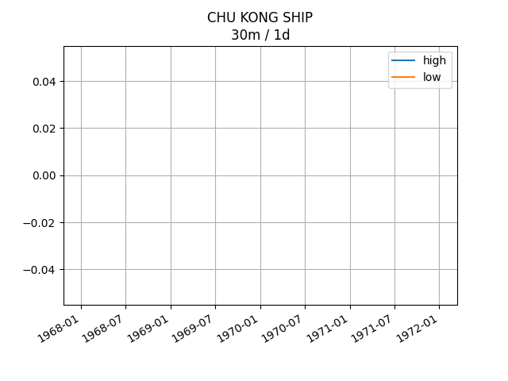
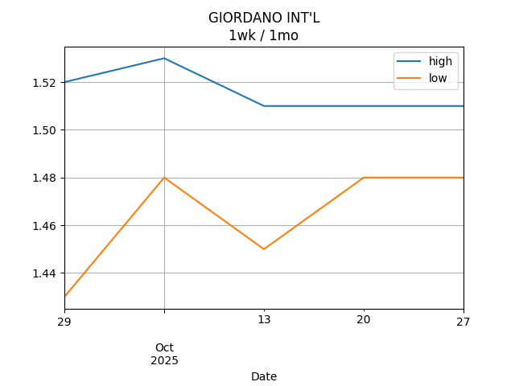

## Net Profit [📉]:
### $-2157.00
|type|graph|data|
|:---:|:---:|:---:|
|30m / 1d||<table border="1" class="dataframe"> <thead> <tr style="text-align: center;"> <th>Datetime</th> <th>profit</th> </tr> </thead> <tbody> <tr> <td>09:30</td> <td>NaN</td> </tr> <tr> <td>10:00</td> <td>NaN</td> </tr> <tr> <td>10:30</td> <td>NaN</td> </tr> <tr> <td>11:00</td> <td>NaN</td> </tr> <tr> <td>11:30</td> <td>NaN</td> </tr> <tr> <td>13:00</td> <td>NaN</td> </tr> <tr> <td>13:30</td> <td>NaN</td> </tr> <tr> <td>14:00</td> <td>NaN</td> </tr> <tr> <td>14:30</td> <td>NaN</td> </tr> <tr> <td>15:00</td> <td>NaN</td> </tr> <tr> <td>15:30</td> <td>NaN</td> </tr> <tr> <td>16:00</td> <td>NaN</td> </tr> </tbody></table>|
|1d / 5d||<table border="1" class="dataframe"> <thead> <tr style="text-align: center;"> <th>Date</th> <th>profit</th> </tr> </thead> <tbody> <tr> <td>2025-10-30</td> <td>-2302.0</td> </tr> <tr> <td>2025-10-31</td> <td>-2312.0</td> </tr> <tr> <td>2025-11-03</td> <td>-2142.0</td> </tr> <tr> <td>2025-11-04</td> <td>-1952.0</td> </tr> <tr> <td>2025-11-05</td> <td>-2057.0</td> </tr> </tbody></table>|
|1wk / 1mo||<table border="1" class="dataframe"> <thead> <tr style="text-align: center;"> <th>Date</th> <th>profit</th> </tr> </thead> <tbody> <tr> <td>2025-10-06</td> <td>-2587.0</td> </tr> <tr> <td>2025-10-13</td> <td>-2267.0</td> </tr> <tr> <td>2025-10-20</td> <td>-2287.0</td> </tr> <tr> <td>2025-10-27</td> <td>-2312.0</td> </tr> <tr> <td>2025-11-03</td> <td>-2057.0</td> </tr> </tbody></table>|
---
## 0573.HK [📉] [$-552.00] [-29.49%]:
#### TAO HEUNG HLDGS
|price|profit|data|
|:---:|:---:|:---:|
|||<table border="1" class="dataframe"> <thead> <tr style="text-align: center;"> <th>Datetime</th> <th>profit</th> </tr> </thead> <tbody> <tr> <td>10:00</td> <td>-552.0</td> </tr> <tr> <td>15:00</td> <td>-552.0</td> </tr> </tbody></table>|
|||<table border="1" class="dataframe"> <thead> <tr style="text-align: center;"> <th>Date</th> <th>profit</th> </tr> </thead> <tbody> <tr> <td>2025-10-30</td> <td>-552.0</td> </tr> <tr> <td>2025-10-31</td> <td>-512.0</td> </tr> <tr> <td>2025-11-03</td> <td>-512.0</td> </tr> <tr> <td>2025-11-04</td> <td>-512.0</td> </tr> <tr> <td>2025-11-05</td> <td>-552.0</td> </tr> </tbody></table>|
|||<table border="1" class="dataframe"> <thead> <tr style="text-align: center;"> <th>Date</th> <th>profit</th> </tr> </thead> <tbody> <tr> <td>2025-10-06</td> <td>-492.0</td> </tr> <tr> <td>2025-10-13</td> <td>-492.0</td> </tr> <tr> <td>2025-10-20</td> <td>-532.0</td> </tr> <tr> <td>2025-10-27</td> <td>-512.0</td> </tr> <tr> <td>2025-11-03</td> <td>-552.0</td> </tr> </tbody></table>|
---
## 0560.HK [📉] [$-136.00] [-4.23%]:
#### CHU KONG SHIP
|price|profit|data|
|:---:|:---:|:---:|
|||<table border="1" class="dataframe"> <thead> <tr style="text-align: center;"> <th>Datetime</th> <th>profit</th> </tr> </thead> <tbody> <tr> <td>10:30</td> <td>-136.0</td> </tr> <tr> <td>11:00</td> <td>-96.0</td> </tr> <tr> <td>11:30</td> <td>-136.0</td> </tr> <tr> <td>13:00</td> <td>-96.0</td> </tr> <tr> <td>14:30</td> <td>-136.0</td> </tr> <tr> <td>15:30</td> <td>-136.0</td> </tr> </tbody></table>|
|||<table border="1" class="dataframe"> <thead> <tr style="text-align: center;"> <th>Date</th> <th>profit</th> </tr> </thead> <tbody> <tr> <td>2025-10-30</td> <td>-96.0</td> </tr> <tr> <td>2025-10-31</td> <td>-96.0</td> </tr> <tr> <td>2025-11-03</td> <td>-96.0</td> </tr> <tr> <td>2025-11-04</td> <td>-96.0</td> </tr> <tr> <td>2025-11-05</td> <td>-136.0</td> </tr> </tbody></table>|
|||<table border="1" class="dataframe"> <thead> <tr style="text-align: center;"> <th>Date</th> <th>profit</th> </tr> </thead> <tbody> <tr> <td>2025-10-06</td> <td>-136.0</td> </tr> <tr> <td>2025-10-13</td> <td>-136.0</td> </tr> <tr> <td>2025-10-20</td> <td>-96.0</td> </tr> <tr> <td>2025-10-27</td> <td>-96.0</td> </tr> <tr> <td>2025-11-03</td> <td>-136.0</td> </tr> </tbody></table>|
---
## 0709.HK [📉] [$-1196.00] [-28.64%]:
#### GIORDANO INT'L
|price|profit|data|
|:---:|:---:|:---:|
|||<table border="1" class="dataframe"> <thead> <tr style="text-align: center;"> <th>Datetime</th> <th>profit</th> </tr> </thead> <tbody> <tr> <td>09:30</td> <td>-1216.0</td> </tr> <tr> <td>10:00</td> <td>-1216.0</td> </tr> <tr> <td>10:30</td> <td>-1216.0</td> </tr> <tr> <td>11:00</td> <td>-1216.0</td> </tr> <tr> <td>11:30</td> <td>-1196.0</td> </tr> <tr> <td>13:00</td> <td>-1216.0</td> </tr> <tr> <td>13:30</td> <td>-1196.0</td> </tr> <tr> <td>14:00</td> <td>-1196.0</td> </tr> <tr> <td>14:30</td> <td>-1196.0</td> </tr> <tr> <td>15:00</td> <td>-1196.0</td> </tr> <tr> <td>15:30</td> <td>-1196.0</td> </tr> </tbody></table>|
|||<table border="1" class="dataframe"> <thead> <tr style="text-align: center;"> <th>Date</th> <th>profit</th> </tr> </thead> <tbody> <tr> <td>2025-10-30</td> <td>-1196.0</td> </tr> <tr> <td>2025-10-31</td> <td>-1216.0</td> </tr> <tr> <td>2025-11-03</td> <td>-1196.0</td> </tr> <tr> <td>2025-11-04</td> <td>-1216.0</td> </tr> <tr> <td>2025-11-05</td> <td>-1196.0</td> </tr> </tbody></table>|
|||<table border="1" class="dataframe"> <thead> <tr style="text-align: center;"> <th>Date</th> <th>profit</th> </tr> </thead> <tbody> <tr> <td>2025-10-06</td> <td>-1196.0</td> </tr> <tr> <td>2025-10-13</td> <td>-1216.0</td> </tr> <tr> <td>2025-10-20</td> <td>-1176.0</td> </tr> <tr> <td>2025-10-27</td> <td>-1216.0</td> </tr> <tr> <td>2025-11-03</td> <td>-1196.0</td> </tr> </tbody></table>|
---
## 1310.HK [📈] [$631.00] [21.62%]:
#### HKBN
|price|profit|data|
|:---:|:---:|:---:|
|||<table border="1" class="dataframe"> <thead> <tr style="text-align: center;"> <th>Datetime</th> <th>profit</th> </tr> </thead> <tbody> <tr> <td>09:30</td> <td>771.0</td> </tr> <tr> <td>10:00</td> <td>686.0</td> </tr> <tr> <td>10:30</td> <td>686.0</td> </tr> <tr> <td>11:00</td> <td>686.0</td> </tr> <tr> <td>11:30</td> <td>686.0</td> </tr> <tr> <td>13:00</td> <td>696.0</td> </tr> <tr> <td>13:30</td> <td>696.0</td> </tr> <tr> <td>14:00</td> <td>681.0</td> </tr> <tr> <td>14:30</td> <td>656.0</td> </tr> <tr> <td>15:00</td> <td>641.0</td> </tr> <tr> <td>15:30</td> <td>631.0</td> </tr> </tbody></table>|
|||<table border="1" class="dataframe"> <thead> <tr style="text-align: center;"> <th>Date</th> <th>profit</th> </tr> </thead> <tbody> <tr> <td>2025-10-30</td> <td>576.0</td> </tr> <tr> <td>2025-10-31</td> <td>496.0</td> </tr> <tr> <td>2025-11-03</td> <td>611.0</td> </tr> <tr> <td>2025-11-04</td> <td>801.0</td> </tr> <tr> <td>2025-11-05</td> <td>731.0</td> </tr> </tbody></table>|
|||<table border="1" class="dataframe"> <thead> <tr style="text-align: center;"> <th>Date</th> <th>profit</th> </tr> </thead> <tbody> <tr> <td>2025-10-06</td> <td>256.0</td> </tr> <tr> <td>2025-10-13</td> <td>536.0</td> </tr> <tr> <td>2025-10-20</td> <td>491.0</td> </tr> <tr> <td>2025-10-27</td> <td>496.0</td> </tr> <tr> <td>2025-11-03</td> <td>731.0</td> </tr> </tbody></table>|
---
## 2638.HK [📈] [$221.00] [7.76%]:
#### HK Electric Investments and HK Electric Investments Limited
|price|profit|data|
|:---:|:---:|:---:|
|||<table border="1" class="dataframe"> <thead> <tr style="text-align: center;"> <th>Datetime</th> <th>profit</th> </tr> </thead> <tbody> <tr> <td>09:30</td> <td>196.0</td> </tr> <tr> <td>10:00</td> <td>191.0</td> </tr> <tr> <td>10:30</td> <td>201.0</td> </tr> <tr> <td>11:00</td> <td>201.0</td> </tr> <tr> <td>11:30</td> <td>201.0</td> </tr> <tr> <td>13:00</td> <td>201.0</td> </tr> <tr> <td>13:30</td> <td>206.0</td> </tr> <tr> <td>14:00</td> <td>206.0</td> </tr> <tr> <td>14:30</td> <td>206.0</td> </tr> <tr> <td>15:00</td> <td>211.0</td> </tr> <tr> <td>15:30</td> <td>216.0</td> </tr> <tr> <td>16:00</td> <td>221.0</td> </tr> </tbody></table>|
|||<table border="1" class="dataframe"> <thead> <tr style="text-align: center;"> <th>Date</th> <th>profit</th> </tr> </thead> <tbody> <tr> <td>2025-10-30</td> <td>181.0</td> </tr> <tr> <td>2025-10-31</td> <td>171.0</td> </tr> <tr> <td>2025-11-03</td> <td>176.0</td> </tr> <tr> <td>2025-11-04</td> <td>196.0</td> </tr> <tr> <td>2025-11-05</td> <td>221.0</td> </tr> </tbody></table>|
|||<table border="1" class="dataframe"> <thead> <tr style="text-align: center;"> <th>Date</th> <th>profit</th> </tr> </thead> <tbody> <tr> <td>2025-10-06</td> <td>136.0</td> </tr> <tr> <td>2025-10-13</td> <td>166.0</td> </tr> <tr> <td>2025-10-20</td> <td>181.0</td> </tr> <tr> <td>2025-10-27</td> <td>171.0</td> </tr> <tr> <td>2025-11-03</td> <td>221.0</td> </tr> </tbody></table>|
---
## 0533.HK [📉] [$-1125.00] [-28.30%]:
#### GOLDLION HOLD
|price|profit|data|
|:---:|:---:|:---:|
|||<table border="1" class="dataframe"> <thead> <tr style="text-align: center;"> <th>Datetime</th> <th>profit</th> </tr> </thead> <tbody> <tr> <td>13:30</td> <td>-1155.0</td> </tr> <tr> <td>15:30</td> <td>-1125.0</td> </tr> </tbody></table>|
|||<table border="1" class="dataframe"> <thead> <tr style="text-align: center;"> <th>Date</th> <th>profit</th> </tr> </thead> <tbody> <tr> <td>2025-10-30</td> <td>-1215.0</td> </tr> <tr> <td>2025-10-31</td> <td>-1155.0</td> </tr> <tr> <td>2025-11-03</td> <td>-1125.0</td> </tr> <tr> <td>2025-11-04</td> <td>-1125.0</td> </tr> <tr> <td>2025-11-05</td> <td>-1125.0</td> </tr> </tbody></table>|
|||<table border="1" class="dataframe"> <thead> <tr style="text-align: center;"> <th>Date</th> <th>profit</th> </tr> </thead> <tbody> <tr> <td>2025-10-06</td> <td>-1155.0</td> </tr> <tr> <td>2025-10-13</td> <td>-1125.0</td> </tr> <tr> <td>2025-10-20</td> <td>-1155.0</td> </tr> <tr> <td>2025-10-27</td> <td>-1155.0</td> </tr> <tr> <td>2025-11-03</td> <td>-1125.0</td> </tr> </tbody></table>|
---
