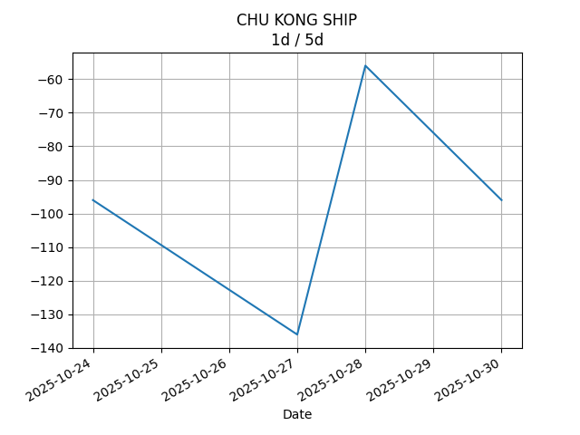
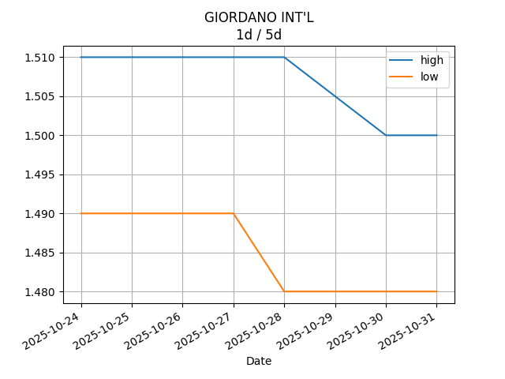

## Net Profit [📉]:
### $-2891.00
|type|graph|data|
|:---:|:---:|:---:|
|30m / 1d|||
|1d / 5d||<table border="1" class="dataframe"> <thead> <tr style="text-align: center;"> <th>Date</th> <th>profit</th> </tr> </thead> <tbody> <tr> <td>2025-08-27</td> <td>-3107.31</td> </tr> <tr> <td>2025-08-28</td> <td>-3157.00</td> </tr> <tr> <td>2025-08-29</td> <td>-3132.00</td> </tr> <tr> <td>2025-09-01</td> <td>-3037.00</td> </tr> <tr> <td>2025-09-02</td> <td>-2987.00</td> </tr> </tbody></table>|
|1wk / 1mo||<table border="1" class="dataframe"> <thead> <tr style="text-align: center;"> <th>Date</th> <th>profit</th> </tr> </thead> <tbody> <tr> <td>2025-08-04</td> <td>-3125.91</td> </tr> <tr> <td>2025-08-11</td> <td>-3026.67</td> </tr> <tr> <td>2025-08-18</td> <td>-3132.01</td> </tr> <tr> <td>2025-08-25</td> <td>-3208.63</td> </tr> <tr> <td>2025-09-01</td> <td>-2987.00</td> </tr> </tbody></table>|
---
## 0573.HK [📉] [$-692.00] [-36.97%]:
#### TAO HEUNG HLDGS
|price|profit|data|
|:---:|:---:|:---:|
|||<table border="1" class="dataframe"> <thead> <tr style="text-align: center;"> <th>Datetime</th> <th>profit</th> </tr> </thead> <tbody> <tr> <td>10:00</td> <td>-692.0</td> </tr> </tbody></table>|
|||<table border="1" class="dataframe"> <thead> <tr style="text-align: center;"> <th>Date</th> <th>profit</th> </tr> </thead> <tbody> <tr> <td>2025-08-27</td> <td>-692.0</td> </tr> <tr> <td>2025-08-28</td> <td>-672.0</td> </tr> <tr> <td>2025-08-29</td> <td>-672.0</td> </tr> <tr> <td>2025-09-01</td> <td>-692.0</td> </tr> <tr> <td>2025-09-02</td> <td>-692.0</td> </tr> </tbody></table>|
|||<table border="1" class="dataframe"> <thead> <tr style="text-align: center;"> <th>Date</th> <th>profit</th> </tr> </thead> <tbody> <tr> <td>2025-08-04</td> <td>-672.0</td> </tr> <tr> <td>2025-08-11</td> <td>-612.0</td> </tr> <tr> <td>2025-08-18</td> <td>-692.0</td> </tr> <tr> <td>2025-08-25</td> <td>-672.0</td> </tr> <tr> <td>2025-09-01</td> <td>-692.0</td> </tr> </tbody></table>|
---
## 0560.HK [📈] [$0.00] [0.00%]:
#### CHU KONG SHIP
|price|profit|data|
|:---:|:---:|:---:|
|||<table border="1" class="dataframe"> <thead> <tr style="text-align: center;"> <th>index</th> <th>profit</th> </tr> </thead> <tbody> <tr> <td>00:00</td> <td>0</td> </tr> </tbody></table>|
|||<table border="1" class="dataframe"> <thead> <tr style="text-align: center;"> <th>Date</th> <th>profit</th> </tr> </thead> <tbody> <tr> <td>2025-08-27</td> <td>-16.0</td> </tr> <tr> <td>2025-08-28</td> <td>-56.0</td> </tr> <tr> <td>2025-08-29</td> <td>-96.0</td> </tr> <tr> <td>2025-09-01</td> <td>-96.0</td> </tr> <tr> <td>2025-09-02</td> <td>-96.0</td> </tr> </tbody></table>|
|||<table border="1" class="dataframe"> <thead> <tr style="text-align: center;"> <th>Date</th> <th>profit</th> </tr> </thead> <tbody> <tr> <td>2025-08-04</td> <td>-56.0</td> </tr> <tr> <td>2025-08-11</td> <td>-56.0</td> </tr> <tr> <td>2025-08-18</td> <td>-56.0</td> </tr> <tr> <td>2025-08-25</td> <td>-96.0</td> </tr> <tr> <td>2025-09-01</td> <td>-96.0</td> </tr> </tbody></table>|
---
## 0709.HK [📉] [$-936.00] [-22.41%]:
#### GIORDANO INT'L
|price|profit|data|
|:---:|:---:|:---:|
|||<table border="1" class="dataframe"> <thead> <tr style="text-align: center;"> <th>Datetime</th> <th>profit</th> </tr> </thead> <tbody> <tr> <td>09:30</td> <td>-956.0</td> </tr> <tr> <td>10:00</td> <td>-936.0</td> </tr> </tbody></table>|
|||<table border="1" class="dataframe"> <thead> <tr style="text-align: center;"> <th>Date</th> <th>profit</th> </tr> </thead> <tbody> <tr> <td>2025-08-27</td> <td>-1096.0</td> </tr> <tr> <td>2025-08-28</td> <td>-1116.0</td> </tr> <tr> <td>2025-08-29</td> <td>-1056.0</td> </tr> <tr> <td>2025-09-01</td> <td>-956.0</td> </tr> <tr> <td>2025-09-02</td> <td>-936.0</td> </tr> </tbody></table>|
|||<table border="1" class="dataframe"> <thead> <tr style="text-align: center;"> <th>Date</th> <th>profit</th> </tr> </thead> <tbody> <tr> <td>2025-08-04</td> <td>-1136.0</td> </tr> <tr> <td>2025-08-11</td> <td>-1136.0</td> </tr> <tr> <td>2025-08-18</td> <td>-1156.0</td> </tr> <tr> <td>2025-08-25</td> <td>-1056.0</td> </tr> <tr> <td>2025-09-01</td> <td>-936.0</td> </tr> </tbody></table>|
---
## 1310.HK [📉] [$-384.00] [-13.16%]:
#### HKBN
|price|profit|data|
|:---:|:---:|:---:|
|||<table border="1" class="dataframe"> <thead> <tr style="text-align: center;"> <th>Datetime</th> <th>profit</th> </tr> </thead> <tbody> <tr> <td>09:30</td> <td>-384.0</td> </tr> <tr> <td>10:00</td> <td>-384.0</td> </tr> </tbody></table>|
|||<table border="1" class="dataframe"> <thead> <tr style="text-align: center;"> <th>Date</th> <th>profit</th> </tr> </thead> <tbody> <tr> <td>2025-08-27</td> <td>-389.0</td> </tr> <tr> <td>2025-08-28</td> <td>-389.0</td> </tr> <tr> <td>2025-08-29</td> <td>-394.0</td> </tr> <tr> <td>2025-09-01</td> <td>-394.0</td> </tr> <tr> <td>2025-09-02</td> <td>-384.0</td> </tr> </tbody></table>|
|||<table border="1" class="dataframe"> <thead> <tr style="text-align: center;"> <th>Date</th> <th>profit</th> </tr> </thead> <tbody> <tr> <td>2025-08-04</td> <td>-394.0</td> </tr> <tr> <td>2025-08-11</td> <td>-384.0</td> </tr> <tr> <td>2025-08-18</td> <td>-384.0</td> </tr> <tr> <td>2025-08-25</td> <td>-394.0</td> </tr> <tr> <td>2025-09-01</td> <td>-384.0</td> </tr> </tbody></table>|
---
## 2638.HK [📈] [$156.00] [5.48%]:
#### HK Electric Investments and HK Electric Investments Limited
|price|profit|data|
|:---:|:---:|:---:|
|||<table border="1" class="dataframe"> <thead> <tr style="text-align: center;"> <th>Datetime</th> <th>profit</th> </tr> </thead> <tbody> <tr> <td>09:30</td> <td>161.0</td> </tr> <tr> <td>10:00</td> <td>156.0</td> </tr> </tbody></table>|
|||<table border="1" class="dataframe"> <thead> <tr style="text-align: center;"> <th>Date</th> <th>profit</th> </tr> </thead> <tbody> <tr> <td>2025-08-27</td> <td>121.0</td> </tr> <tr> <td>2025-08-28</td> <td>141.0</td> </tr> <tr> <td>2025-08-29</td> <td>151.0</td> </tr> <tr> <td>2025-09-01</td> <td>166.0</td> </tr> <tr> <td>2025-09-02</td> <td>156.0</td> </tr> </tbody></table>|
|||<table border="1" class="dataframe"> <thead> <tr style="text-align: center;"> <th>Date</th> <th>profit</th> </tr> </thead> <tbody> <tr> <td>2025-08-04</td> <td>137.71</td> </tr> <tr> <td>2025-08-11</td> <td>166.94</td> </tr> <tr> <td>2025-08-18</td> <td>191.30</td> </tr> <tr> <td>2025-08-25</td> <td>74.37</td> </tr> <tr> <td>2025-09-01</td> <td>156.00</td> </tr> </tbody></table>|
---
## 0533.HK [📉] [$-1035.00] [-26.04%]:
#### GOLDLION HOLD
|price|profit|data|
|:---:|:---:|:---:|
|||<table border="1" class="dataframe"> <thead> <tr style="text-align: center;"> <th>Datetime</th> <th>profit</th> </tr> </thead> <tbody> <tr> <td>09:30</td> <td>-1035.0</td> </tr> </tbody></table>|
|||<table border="1" class="dataframe"> <thead> <tr style="text-align: center;"> <th>Date</th> <th>profit</th> </tr> </thead> <tbody> <tr> <td>2025-08-27</td> <td>-1035.31</td> </tr> <tr> <td>2025-08-28</td> <td>-1065.00</td> </tr> <tr> <td>2025-08-29</td> <td>-1065.00</td> </tr> <tr> <td>2025-09-01</td> <td>-1065.00</td> </tr> <tr> <td>2025-09-02</td> <td>-1035.00</td> </tr> </tbody></table>|
|||<table border="1" class="dataframe"> <thead> <tr style="text-align: center;"> <th>Date</th> <th>profit</th> </tr> </thead> <tbody> <tr> <td>2025-08-04</td> <td>-1005.61</td> </tr> <tr> <td>2025-08-11</td> <td>-1005.61</td> </tr> <tr> <td>2025-08-18</td> <td>-1035.31</td> </tr> <tr> <td>2025-08-25</td> <td>-1065.00</td> </tr> <tr> <td>2025-09-01</td> <td>-1035.00</td> </tr> </tbody></table>|
---
