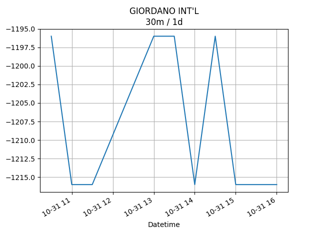
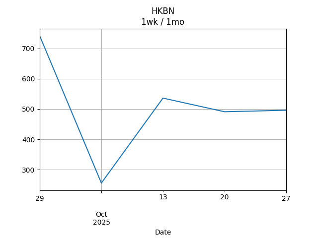
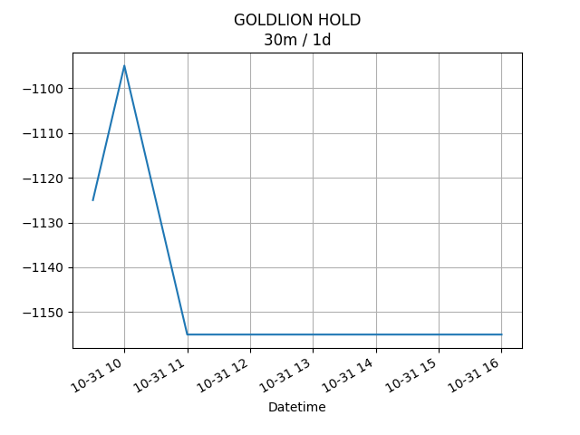

## Net Profit [📉]:
### $-1107.00
|type|graph|data|
|:---:|:---:|:---:|
|30m / 1d|||
|1d / 5d||<table border="1" class="dataframe"> <thead> <tr style="text-align: center;"> <th>Date</th> <th>profit</th> </tr> </thead> <tbody> <tr> <td>2026-01-29</td> <td>-2087.0</td> </tr> <tr> <td>2026-01-30</td> <td>-2092.0</td> </tr> <tr> <td>2026-02-02</td> <td>-2182.0</td> </tr> <tr> <td>2026-02-03</td> <td>-2192.0</td> </tr> <tr> <td>2026-02-04</td> <td>-2192.0</td> </tr> </tbody></table>|
|1wk / 1mo||<table border="1" class="dataframe"> <thead> <tr style="text-align: center;"> <th>Date</th> <th>profit</th> </tr> </thead> <tbody> <tr> <td>2026-01-01</td> <td>-2487.0</td> </tr> <tr> <td>2026-01-08</td> <td>-2332.0</td> </tr> <tr> <td>2026-01-15</td> <td>-2262.0</td> </tr> <tr> <td>2026-01-22</td> <td>-2022.0</td> </tr> <tr> <td>2026-01-29</td> <td>-2202.0</td> </tr> </tbody></table>|
---
## 0573.HK [📉] [$-712.00] [-38.03%]:
#### Tao Heung Holdings Limited
|price|profit|data|
|:---:|:---:|:---:|
|||<table border="1" class="dataframe"> <thead> <tr style="text-align: center;"> <th>Datetime</th> <th>profit</th> </tr> </thead> <tbody> <tr> <td>09:30</td> <td>-692.0</td> </tr> <tr> <td>10:00</td> <td>-712.0</td> </tr> </tbody></table>|
|||<table border="1" class="dataframe"> <thead> <tr style="text-align: center;"> <th>Date</th> <th>profit</th> </tr> </thead> <tbody> <tr> <td>2026-01-29</td> <td>-612.0</td> </tr> <tr> <td>2026-01-30</td> <td>-612.0</td> </tr> <tr> <td>2026-02-02</td> <td>-672.0</td> </tr> <tr> <td>2026-02-03</td> <td>-672.0</td> </tr> <tr> <td>2026-02-04</td> <td>-712.0</td> </tr> </tbody></table>|
|||<table border="1" class="dataframe"> <thead> <tr style="text-align: center;"> <th>Date</th> <th>profit</th> </tr> </thead> <tbody> <tr> <td>2026-01-01</td> <td>-592.0</td> </tr> <tr> <td>2026-01-08</td> <td>-572.0</td> </tr> <tr> <td>2026-01-15</td> <td>-552.0</td> </tr> <tr> <td>2026-01-22</td> <td>-572.0</td> </tr> <tr> <td>2026-01-29</td> <td>-712.0</td> </tr> </tbody></table>|
---
## 0560.HK [📉] [$-216.00] [-6.72%]:
#### Chu Kong Shipping Enterprises (Group) Company Limited
|price|profit|data|
|:---:|:---:|:---:|
|||<table border="1" class="dataframe"> <thead> <tr style="text-align: center;"> <th>Datetime</th> <th>profit</th> </tr> </thead> <tbody> <tr> <td>10:30</td> <td>-216.0</td> </tr> </tbody></table>|
|||<table border="1" class="dataframe"> <thead> <tr style="text-align: center;"> <th>Date</th> <th>profit</th> </tr> </thead> <tbody> <tr> <td>2026-01-29</td> <td>-216.0</td> </tr> <tr> <td>2026-01-30</td> <td>-216.0</td> </tr> <tr> <td>2026-02-02</td> <td>-216.0</td> </tr> <tr> <td>2026-02-03</td> <td>-216.0</td> </tr> <tr> <td>2026-02-04</td> <td>-216.0</td> </tr> </tbody></table>|
|||<table border="1" class="dataframe"> <thead> <tr style="text-align: center;"> <th>Date</th> <th>profit</th> </tr> </thead> <tbody> <tr> <td>2026-01-01</td> <td>-176.0</td> </tr> <tr> <td>2026-01-08</td> <td>-216.0</td> </tr> <tr> <td>2026-01-15</td> <td>-216.0</td> </tr> <tr> <td>2026-01-22</td> <td>-176.0</td> </tr> <tr> <td>2026-01-29</td> <td>-216.0</td> </tr> </tbody></table>|
---
## 0709.HK [📉] [$-1236.00] [-29.60%]:
#### Giordano International Limited
|price|profit|data|
|:---:|:---:|:---:|
|||<table border="1" class="dataframe"> <thead> <tr style="text-align: center;"> <th>Datetime</th> <th>profit</th> </tr> </thead> <tbody> <tr> <td>09:30</td> <td>-1276.0</td> </tr> <tr> <td>10:00</td> <td>-1256.0</td> </tr> <tr> <td>10:30</td> <td>-1256.0</td> </tr> <tr> <td>11:00</td> <td>-1216.0</td> </tr> <tr> <td>11:30</td> <td>-1236.0</td> </tr> </tbody></table>|
|||<table border="1" class="dataframe"> <thead> <tr style="text-align: center;"> <th>Date</th> <th>profit</th> </tr> </thead> <tbody> <tr> <td>2026-01-29</td> <td>-1256.0</td> </tr> <tr> <td>2026-01-30</td> <td>-1236.0</td> </tr> <tr> <td>2026-02-02</td> <td>-1236.0</td> </tr> <tr> <td>2026-02-03</td> <td>-1236.0</td> </tr> <tr> <td>2026-02-04</td> <td>-1236.0</td> </tr> </tbody></table>|
|||<table border="1" class="dataframe"> <thead> <tr style="text-align: center;"> <th>Date</th> <th>profit</th> </tr> </thead> <tbody> <tr> <td>2026-01-01</td> <td>-1276.0</td> </tr> <tr> <td>2026-01-08</td> <td>-1316.0</td> </tr> <tr> <td>2026-01-15</td> <td>-1296.0</td> </tr> <tr> <td>2026-01-22</td> <td>-1256.0</td> </tr> <tr> <td>2026-01-29</td> <td>-1236.0</td> </tr> </tbody></table>|
---
## 1310.HK [📈] [$566.00] [19.39%]:
#### HKBN Ltd.
|price|profit|data|
|:---:|:---:|:---:|
|||<table border="1" class="dataframe"> <thead> <tr style="text-align: center;"> <th>Datetime</th> <th>profit</th> </tr> </thead> <tbody> <tr> <td>09:30</td> <td>561.0</td> </tr> <tr> <td>10:00</td> <td>576.0</td> </tr> <tr> <td>10:30</td> <td>571.0</td> </tr> <tr> <td>11:00</td> <td>576.0</td> </tr> <tr> <td>11:30</td> <td>566.0</td> </tr> </tbody></table>|
|||<table border="1" class="dataframe"> <thead> <tr style="text-align: center;"> <th>Date</th> <th>profit</th> </tr> </thead> <tbody> <tr> <td>2026-01-29</td> <td>551.0</td> </tr> <tr> <td>2026-01-30</td> <td>576.0</td> </tr> <tr> <td>2026-02-02</td> <td>541.0</td> </tr> <tr> <td>2026-02-03</td> <td>566.0</td> </tr> <tr> <td>2026-02-04</td> <td>566.0</td> </tr> </tbody></table>|
|||<table border="1" class="dataframe"> <thead> <tr style="text-align: center;"> <th>Date</th> <th>profit</th> </tr> </thead> <tbody> <tr> <td>2026-01-01</td> <td>256.0</td> </tr> <tr> <td>2026-01-08</td> <td>456.0</td> </tr> <tr> <td>2026-01-15</td> <td>416.0</td> </tr> <tr> <td>2026-01-22</td> <td>596.0</td> </tr> <tr> <td>2026-01-29</td> <td>566.0</td> </tr> </tbody></table>|
---
## 2638.HK [📈] [$491.00] [17.23%]:
#### HK Electric Investments and HK Electric Investments Limited
|price|profit|data|
|:---:|:---:|:---:|
|||<table border="1" class="dataframe"> <thead> <tr style="text-align: center;"> <th>Datetime</th> <th>profit</th> </tr> </thead> <tbody> <tr> <td>09:30</td> <td>481.0</td> </tr> <tr> <td>10:00</td> <td>461.0</td> </tr> <tr> <td>10:30</td> <td>476.0</td> </tr> <tr> <td>11:00</td> <td>486.0</td> </tr> <tr> <td>11:30</td> <td>491.0</td> </tr> </tbody></table>|
|||<table border="1" class="dataframe"> <thead> <tr style="text-align: center;"> <th>Date</th> <th>profit</th> </tr> </thead> <tbody> <tr> <td>2026-01-29</td> <td>511.0</td> </tr> <tr> <td>2026-01-30</td> <td>491.0</td> </tr> <tr> <td>2026-02-02</td> <td>466.0</td> </tr> <tr> <td>2026-02-03</td> <td>461.0</td> </tr> <tr> <td>2026-02-04</td> <td>491.0</td> </tr> </tbody></table>|
|||<table border="1" class="dataframe"> <thead> <tr style="text-align: center;"> <th>Date</th> <th>profit</th> </tr> </thead> <tbody> <tr> <td>2026-01-01</td> <td>366.0</td> </tr> <tr> <td>2026-01-08</td> <td>381.0</td> </tr> <tr> <td>2026-01-15</td> <td>451.0</td> </tr> <tr> <td>2026-01-22</td> <td>481.0</td> </tr> <tr> <td>2026-01-29</td> <td>491.0</td> </tr> </tbody></table>|
---
## 0533.HK [📈] [$0.00] [0.00%]:
#### Goldlion Holdings Limited
|price|profit|data|
|:---:|:---:|:---:|
|||<table border="1" class="dataframe"> <thead> <tr style="text-align: center;"> <th>index</th> <th>profit</th> </tr> </thead> <tbody> <tr> <td>00:00</td> <td>0</td> </tr> </tbody></table>|
|||<table border="1" class="dataframe"> <thead> <tr style="text-align: center;"> <th>Date</th> <th>profit</th> </tr> </thead> <tbody> <tr> <td>2026-01-29</td> <td>-1065.0</td> </tr> <tr> <td>2026-01-30</td> <td>-1095.0</td> </tr> <tr> <td>2026-02-02</td> <td>-1065.0</td> </tr> <tr> <td>2026-02-03</td> <td>-1095.0</td> </tr> </tbody></table>|
|||<table border="1" class="dataframe"> <thead> <tr style="text-align: center;"> <th>Date</th> <th>profit</th> </tr> </thead> <tbody> <tr> <td>2026-01-01</td> <td>-1065.0</td> </tr> <tr> <td>2026-01-08</td> <td>-1065.0</td> </tr> <tr> <td>2026-01-15</td> <td>-1065.0</td> </tr> <tr> <td>2026-01-22</td> <td>-1095.0</td> </tr> <tr> <td>2026-01-29</td> <td>-1095.0</td> </tr> </tbody></table>|
---
