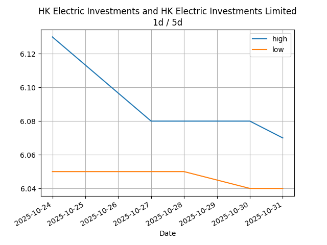
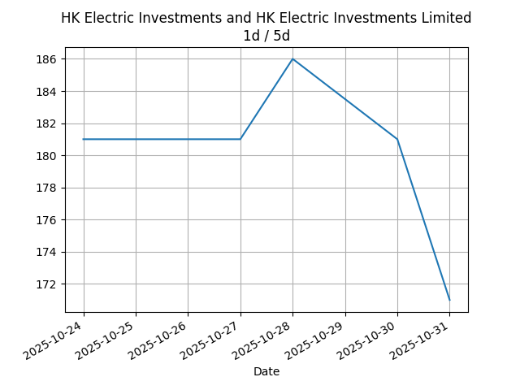

## Net Profit [📉]:
### $-730.00
|type|graph|data|
|:---:|:---:|:---:|
|30m / 1d|||
|1d / 5d||<table border="1" class="dataframe"> <thead> <tr style="text-align: center;"> <th>Date</th> <th>profit</th> </tr> </thead> <tbody> <tr> <td>2026-01-14</td> <td>-2332.0</td> </tr> <tr> <td>2026-01-15</td> <td>-2347.0</td> </tr> <tr> <td>2026-01-16</td> <td>-2347.0</td> </tr> <tr> <td>2026-01-19</td> <td>-2307.0</td> </tr> <tr> <td>2026-01-20</td> <td>-2307.0</td> </tr> </tbody></table>|
|1wk / 1mo||<table border="1" class="dataframe"> <thead> <tr style="text-align: center;"> <th>Date</th> <th>profit</th> </tr> </thead> <tbody> <tr> <td>2025-12-22</td> <td>-2627.0</td> </tr> <tr> <td>2025-12-29</td> <td>-2577.0</td> </tr> <tr> <td>2026-01-05</td> <td>-2602.0</td> </tr> <tr> <td>2026-01-12</td> <td>-2347.0</td> </tr> <tr> <td>2026-01-19</td> <td>-2377.0</td> </tr> </tbody></table>|
---
## 0573.HK [📈] [$0.00] [0.00%]:
#### Tao Heung Holdings Limited
|price|profit|data|
|:---:|:---:|:---:|
|||<table border="1" class="dataframe"> <thead> <tr style="text-align: center;"> <th>index</th> <th>profit</th> </tr> </thead> <tbody> <tr> <td>00:00</td> <td>0</td> </tr> </tbody></table>|
|||<table border="1" class="dataframe"> <thead> <tr style="text-align: center;"> <th>Date</th> <th>profit</th> </tr> </thead> <tbody> <tr> <td>2026-01-14</td> <td>-572.0</td> </tr> <tr> <td>2026-01-15</td> <td>-572.0</td> </tr> <tr> <td>2026-01-16</td> <td>-592.0</td> </tr> <tr> <td>2026-01-19</td> <td>-552.0</td> </tr> </tbody></table>|
|||<table border="1" class="dataframe"> <thead> <tr style="text-align: center;"> <th>Date</th> <th>profit</th> </tr> </thead> <tbody> <tr> <td>2025-12-22</td> <td>-592.0</td> </tr> <tr> <td>2025-12-29</td> <td>-572.0</td> </tr> <tr> <td>2026-01-05</td> <td>-592.0</td> </tr> <tr> <td>2026-01-12</td> <td>-592.0</td> </tr> <tr> <td>2026-01-19</td> <td>-552.0</td> </tr> </tbody></table>|
---
## 0560.HK [📉] [$-256.00] [-7.96%]:
#### Chu Kong Shipping Enterprises (Group) Company Limited
|price|profit|data|
|:---:|:---:|:---:|
|||<table border="1" class="dataframe"> <thead> <tr style="text-align: center;"> <th>Datetime</th> <th>profit</th> </tr> </thead> <tbody> <tr> <td>09:30</td> <td>-256.0</td> </tr> </tbody></table>|
|||<table border="1" class="dataframe"> <thead> <tr style="text-align: center;"> <th>Date</th> <th>profit</th> </tr> </thead> <tbody> <tr> <td>2026-01-14</td> <td>-216.0</td> </tr> <tr> <td>2026-01-15</td> <td>-216.0</td> </tr> <tr> <td>2026-01-16</td> <td>-216.0</td> </tr> <tr> <td>2026-01-19</td> <td>-216.0</td> </tr> <tr> <td>2026-01-20</td> <td>-256.0</td> </tr> </tbody></table>|
|||<table border="1" class="dataframe"> <thead> <tr style="text-align: center;"> <th>Date</th> <th>profit</th> </tr> </thead> <tbody> <tr> <td>2025-12-22</td> <td>-216.0</td> </tr> <tr> <td>2025-12-29</td> <td>-136.0</td> </tr> <tr> <td>2026-01-05</td> <td>-216.0</td> </tr> <tr> <td>2026-01-12</td> <td>-216.0</td> </tr> <tr> <td>2026-01-19</td> <td>-256.0</td> </tr> </tbody></table>|
---
## 0709.HK [📉] [$-1336.00] [-31.99%]:
#### Giordano International Limited
|price|profit|data|
|:---:|:---:|:---:|
|||<table border="1" class="dataframe"> <thead> <tr style="text-align: center;"> <th>Datetime</th> <th>profit</th> </tr> </thead> <tbody> <tr> <td>09:30</td> <td>-1336.0</td> </tr> <tr> <td>10:00</td> <td>-1336.0</td> </tr> </tbody></table>|
|||<table border="1" class="dataframe"> <thead> <tr style="text-align: center;"> <th>Date</th> <th>profit</th> </tr> </thead> <tbody> <tr> <td>2026-01-14</td> <td>-1316.0</td> </tr> <tr> <td>2026-01-15</td> <td>-1336.0</td> </tr> <tr> <td>2026-01-16</td> <td>-1336.0</td> </tr> <tr> <td>2026-01-19</td> <td>-1336.0</td> </tr> <tr> <td>2026-01-20</td> <td>-1336.0</td> </tr> </tbody></table>|
|||<table border="1" class="dataframe"> <thead> <tr style="text-align: center;"> <th>Date</th> <th>profit</th> </tr> </thead> <tbody> <tr> <td>2025-12-22</td> <td>-1236.0</td> </tr> <tr> <td>2025-12-29</td> <td>-1336.0</td> </tr> <tr> <td>2026-01-05</td> <td>-1336.0</td> </tr> <tr> <td>2026-01-12</td> <td>-1336.0</td> </tr> <tr> <td>2026-01-19</td> <td>-1336.0</td> </tr> </tbody></table>|
---
## 1310.HK [📈] [$461.00] [15.79%]:
#### HKBN Ltd.
|price|profit|data|
|:---:|:---:|:---:|
|||<table border="1" class="dataframe"> <thead> <tr style="text-align: center;"> <th>Datetime</th> <th>profit</th> </tr> </thead> <tbody> <tr> <td>09:30</td> <td>456.0</td> </tr> <tr> <td>10:00</td> <td>451.0</td> </tr> <tr> <td>10:30</td> <td>461.0</td> </tr> </tbody></table>|
|||<table border="1" class="dataframe"> <thead> <tr style="text-align: center;"> <th>Date</th> <th>profit</th> </tr> </thead> <tbody> <tr> <td>2026-01-14</td> <td>456.0</td> </tr> <tr> <td>2026-01-15</td> <td>456.0</td> </tr> <tr> <td>2026-01-16</td> <td>466.0</td> </tr> <tr> <td>2026-01-19</td> <td>476.0</td> </tr> <tr> <td>2026-01-20</td> <td>461.0</td> </tr> </tbody></table>|
|||<table border="1" class="dataframe"> <thead> <tr style="text-align: center;"> <th>Date</th> <th>profit</th> </tr> </thead> <tbody> <tr> <td>2025-12-22</td> <td>231.0</td> </tr> <tr> <td>2025-12-29</td> <td>206.0</td> </tr> <tr> <td>2026-01-05</td> <td>236.0</td> </tr> <tr> <td>2026-01-12</td> <td>466.0</td> </tr> <tr> <td>2026-01-19</td> <td>461.0</td> </tr> </tbody></table>|
---
## 2638.HK [📈] [$401.00] [14.08%]:
#### HK Electric Investments and HK Electric Investments Limited
|price|profit|data|
|:---:|:---:|:---:|
|||<table border="1" class="dataframe"> <thead> <tr style="text-align: center;"> <th>Datetime</th> <th>profit</th> </tr> </thead> <tbody> <tr> <td>09:30</td> <td>411.0</td> </tr> <tr> <td>10:00</td> <td>401.0</td> </tr> <tr> <td>10:30</td> <td>401.0</td> </tr> </tbody></table>|
|||<table border="1" class="dataframe"> <thead> <tr style="text-align: center;"> <th>Date</th> <th>profit</th> </tr> </thead> <tbody> <tr> <td>2026-01-14</td> <td>381.0</td> </tr> <tr> <td>2026-01-15</td> <td>416.0</td> </tr> <tr> <td>2026-01-16</td> <td>426.0</td> </tr> <tr> <td>2026-01-19</td> <td>416.0</td> </tr> <tr> <td>2026-01-20</td> <td>401.0</td> </tr> </tbody></table>|
|||<table border="1" class="dataframe"> <thead> <tr style="text-align: center;"> <th>Date</th> <th>profit</th> </tr> </thead> <tbody> <tr> <td>2025-12-22</td> <td>311.0</td> </tr> <tr> <td>2025-12-29</td> <td>326.0</td> </tr> <tr> <td>2026-01-05</td> <td>371.0</td> </tr> <tr> <td>2026-01-12</td> <td>426.0</td> </tr> <tr> <td>2026-01-19</td> <td>401.0</td> </tr> </tbody></table>|
---
## 0533.HK [📈] [$0.00] [0.00%]:
#### Goldlion Holdings Limited
|price|profit|data|
|:---:|:---:|:---:|
|||<table border="1" class="dataframe"> <thead> <tr style="text-align: center;"> <th>index</th> <th>profit</th> </tr> </thead> <tbody> <tr> <td>00:00</td> <td>0</td> </tr> </tbody></table>|
|||<table border="1" class="dataframe"> <thead> <tr style="text-align: center;"> <th>Date</th> <th>profit</th> </tr> </thead> <tbody> <tr> <td>2026-01-14</td> <td>-1065.0</td> </tr> <tr> <td>2026-01-15</td> <td>-1095.0</td> </tr> <tr> <td>2026-01-16</td> <td>-1095.0</td> </tr> <tr> <td>2026-01-19</td> <td>-1095.0</td> </tr> </tbody></table>|
|||<table border="1" class="dataframe"> <thead> <tr style="text-align: center;"> <th>Date</th> <th>profit</th> </tr> </thead> <tbody> <tr> <td>2025-12-22</td> <td>-1125.0</td> </tr> <tr> <td>2025-12-29</td> <td>-1065.0</td> </tr> <tr> <td>2026-01-05</td> <td>-1065.0</td> </tr> <tr> <td>2026-01-12</td> <td>-1095.0</td> </tr> <tr> <td>2026-01-19</td> <td>-1095.0</td> </tr> </tbody></table>|
---
