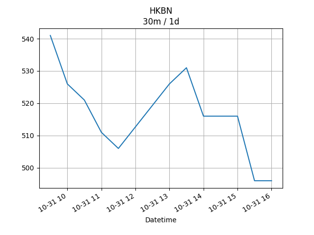
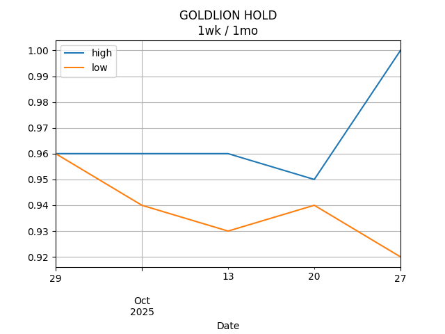

## Net Profit [📉]:
### $-1689.00
|type|graph|data|
|:---:|:---:|:---:|
|30m / 1d|||
|1d / 5d||<table border="1" class="dataframe"> <thead> <tr style="text-align: center;"> <th>Date</th> <th>profit</th> </tr> </thead> <tbody> <tr> <td>2025-12-05</td> <td>-2247.0</td> </tr> <tr> <td>2025-12-08</td> <td>-2367.0</td> </tr> <tr> <td>2025-12-09</td> <td>-2382.0</td> </tr> <tr> <td>2025-12-10</td> <td>-2387.0</td> </tr> <tr> <td>2025-12-11</td> <td>-2387.0</td> </tr> </tbody></table>|
|1wk / 1mo||<table border="1" class="dataframe"> <thead> <tr style="text-align: center;"> <th>Date</th> <th>profit</th> </tr> </thead> <tbody> <tr> <td>2025-11-10</td> <td>-2207.0</td> </tr> <tr> <td>2025-11-17</td> <td>-2507.0</td> </tr> <tr> <td>2025-11-24</td> <td>-2272.0</td> </tr> <tr> <td>2025-12-01</td> <td>-2247.0</td> </tr> <tr> <td>2025-12-08</td> <td>-2417.0</td> </tr> </tbody></table>|
---
## 0573.HK [📈] [$0.00] [0.00%]:
#### TAO HEUNG HLDGS
|price|profit|data|
|:---:|:---:|:---:|
|||<table border="1" class="dataframe"> <thead> <tr style="text-align: center;"> <th>index</th> <th>profit</th> </tr> </thead> <tbody> <tr> <td>00:00</td> <td>0</td> </tr> </tbody></table>|
|||<table border="1" class="dataframe"> <thead> <tr style="text-align: center;"> <th>Date</th> <th>profit</th> </tr> </thead> <tbody> <tr> <td>2025-12-05</td> <td>-572.0</td> </tr> <tr> <td>2025-12-08</td> <td>-572.0</td> </tr> <tr> <td>2025-12-09</td> <td>-572.0</td> </tr> <tr> <td>2025-12-10</td> <td>-552.0</td> </tr> </tbody></table>|
|||<table border="1" class="dataframe"> <thead> <tr style="text-align: center;"> <th>Date</th> <th>profit</th> </tr> </thead> <tbody> <tr> <td>2025-11-10</td> <td>-552.0</td> </tr> <tr> <td>2025-11-17</td> <td>-612.0</td> </tr> <tr> <td>2025-11-24</td> <td>-572.0</td> </tr> <tr> <td>2025-12-01</td> <td>-572.0</td> </tr> <tr> <td>2025-12-08</td> <td>-552.0</td> </tr> </tbody></table>|
---
## 0560.HK [📈] [$0.00] [0.00%]:
#### CHU KONG SHIP
|price|profit|data|
|:---:|:---:|:---:|
|||<table border="1" class="dataframe"> <thead> <tr style="text-align: center;"> <th>index</th> <th>profit</th> </tr> </thead> <tbody> <tr> <td>00:00</td> <td>0</td> </tr> </tbody></table>|
|||<table border="1" class="dataframe"> <thead> <tr style="text-align: center;"> <th>Date</th> <th>profit</th> </tr> </thead> <tbody> <tr> <td>2025-12-05</td> <td>-136.0</td> </tr> <tr> <td>2025-12-08</td> <td>-176.0</td> </tr> <tr> <td>2025-12-09</td> <td>-176.0</td> </tr> <tr> <td>2025-12-10</td> <td>-176.0</td> </tr> </tbody></table>|
|||<table border="1" class="dataframe"> <thead> <tr style="text-align: center;"> <th>Date</th> <th>profit</th> </tr> </thead> <tbody> <tr> <td>2025-11-10</td> <td>-96.0</td> </tr> <tr> <td>2025-11-17</td> <td>-136.0</td> </tr> <tr> <td>2025-11-24</td> <td>-136.0</td> </tr> <tr> <td>2025-12-01</td> <td>-136.0</td> </tr> <tr> <td>2025-12-08</td> <td>-176.0</td> </tr> </tbody></table>|
---
## 0709.HK [📉] [$-1196.00] [-28.64%]:
#### GIORDANO INT'L
|price|profit|data|
|:---:|:---:|:---:|
|||<table border="1" class="dataframe"> <thead> <tr style="text-align: center;"> <th>Datetime</th> <th>profit</th> </tr> </thead> <tbody> <tr> <td>09:30</td> <td>-1216.0</td> </tr> <tr> <td>10:00</td> <td>-1196.0</td> </tr> <tr> <td>10:30</td> <td>-1196.0</td> </tr> </tbody></table>|
|||<table border="1" class="dataframe"> <thead> <tr style="text-align: center;"> <th>Date</th> <th>profit</th> </tr> </thead> <tbody> <tr> <td>2025-12-05</td> <td>-1156.0</td> </tr> <tr> <td>2025-12-08</td> <td>-1176.0</td> </tr> <tr> <td>2025-12-09</td> <td>-1196.0</td> </tr> <tr> <td>2025-12-10</td> <td>-1196.0</td> </tr> <tr> <td>2025-12-11</td> <td>-1196.0</td> </tr> </tbody></table>|
|||<table border="1" class="dataframe"> <thead> <tr style="text-align: center;"> <th>Date</th> <th>profit</th> </tr> </thead> <tbody> <tr> <td>2025-11-10</td> <td>-1156.0</td> </tr> <tr> <td>2025-11-17</td> <td>-1156.0</td> </tr> <tr> <td>2025-11-24</td> <td>-1136.0</td> </tr> <tr> <td>2025-12-01</td> <td>-1156.0</td> </tr> <tr> <td>2025-12-08</td> <td>-1196.0</td> </tr> </tbody></table>|
---
## 1310.HK [📈] [$341.00] [11.68%]:
#### HKBN
|price|profit|data|
|:---:|:---:|:---:|
|||<table border="1" class="dataframe"> <thead> <tr style="text-align: center;"> <th>Datetime</th> <th>profit</th> </tr> </thead> <tbody> <tr> <td>09:30</td> <td>376.0</td> </tr> <tr> <td>10:00</td> <td>351.0</td> </tr> <tr> <td>10:30</td> <td>341.0</td> </tr> </tbody></table>|
|||<table border="1" class="dataframe"> <thead> <tr style="text-align: center;"> <th>Date</th> <th>profit</th> </tr> </thead> <tbody> <tr> <td>2025-12-05</td> <td>406.0</td> </tr> <tr> <td>2025-12-08</td> <td>396.0</td> </tr> <tr> <td>2025-12-09</td> <td>431.0</td> </tr> <tr> <td>2025-12-10</td> <td>396.0</td> </tr> <tr> <td>2025-12-11</td> <td>341.0</td> </tr> </tbody></table>|
|||<table border="1" class="dataframe"> <thead> <tr style="text-align: center;"> <th>Date</th> <th>profit</th> </tr> </thead> <tbody> <tr> <td>2025-11-10</td> <td>456.0</td> </tr> <tr> <td>2025-11-17</td> <td>251.0</td> </tr> <tr> <td>2025-11-24</td> <td>361.0</td> </tr> <tr> <td>2025-12-01</td> <td>406.0</td> </tr> <tr> <td>2025-12-08</td> <td>341.0</td> </tr> </tbody></table>|
---
## 2638.HK [📈] [$291.00] [10.21%]:
#### HK Electric Investments and HK Electric Investments Limited
|price|profit|data|
|:---:|:---:|:---:|
|||<table border="1" class="dataframe"> <thead> <tr style="text-align: center;"> <th>Datetime</th> <th>profit</th> </tr> </thead> <tbody> <tr> <td>09:30</td> <td>271.0</td> </tr> <tr> <td>10:00</td> <td>281.0</td> </tr> <tr> <td>10:30</td> <td>291.0</td> </tr> </tbody></table>|
|||<table border="1" class="dataframe"> <thead> <tr style="text-align: center;"> <th>Date</th> <th>profit</th> </tr> </thead> <tbody> <tr> <td>2025-12-05</td> <td>306.0</td> </tr> <tr> <td>2025-12-08</td> <td>286.0</td> </tr> <tr> <td>2025-12-09</td> <td>256.0</td> </tr> <tr> <td>2025-12-10</td> <td>266.0</td> </tr> <tr> <td>2025-12-11</td> <td>291.0</td> </tr> </tbody></table>|
|||<table border="1" class="dataframe"> <thead> <tr style="text-align: center;"> <th>Date</th> <th>profit</th> </tr> </thead> <tbody> <tr> <td>2025-11-10</td> <td>236.0</td> </tr> <tr> <td>2025-11-17</td> <td>241.0</td> </tr> <tr> <td>2025-11-24</td> <td>276.0</td> </tr> <tr> <td>2025-12-01</td> <td>306.0</td> </tr> <tr> <td>2025-12-08</td> <td>291.0</td> </tr> </tbody></table>|
---
## 0533.HK [📉] [$-1125.00] [-28.30%]:
#### GOLDLION HOLD
|price|profit|data|
|:---:|:---:|:---:|
|||<table border="1" class="dataframe"> <thead> <tr style="text-align: center;"> <th>Datetime</th> <th>profit</th> </tr> </thead> <tbody> <tr> <td>10:00</td> <td>-1125.0</td> </tr> </tbody></table>|
|||<table border="1" class="dataframe"> <thead> <tr style="text-align: center;"> <th>Date</th> <th>profit</th> </tr> </thead> <tbody> <tr> <td>2025-12-05</td> <td>-1095.0</td> </tr> <tr> <td>2025-12-08</td> <td>-1125.0</td> </tr> <tr> <td>2025-12-09</td> <td>-1125.0</td> </tr> <tr> <td>2025-12-10</td> <td>-1125.0</td> </tr> <tr> <td>2025-12-11</td> <td>-1125.0</td> </tr> </tbody></table>|
|||<table border="1" class="dataframe"> <thead> <tr style="text-align: center;"> <th>Date</th> <th>profit</th> </tr> </thead> <tbody> <tr> <td>2025-11-10</td> <td>-1095.0</td> </tr> <tr> <td>2025-11-17</td> <td>-1095.0</td> </tr> <tr> <td>2025-11-24</td> <td>-1065.0</td> </tr> <tr> <td>2025-12-01</td> <td>-1095.0</td> </tr> <tr> <td>2025-12-08</td> <td>-1125.0</td> </tr> </tbody></table>|
---
