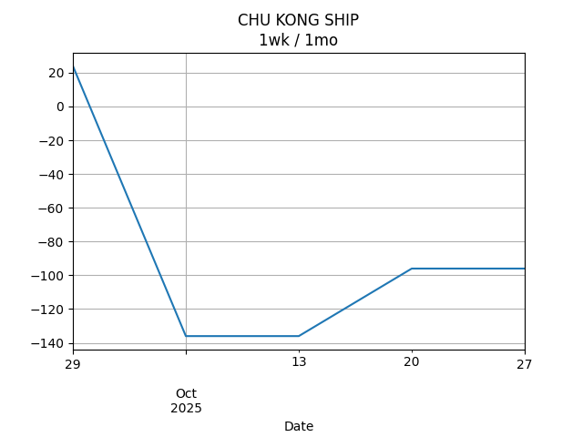
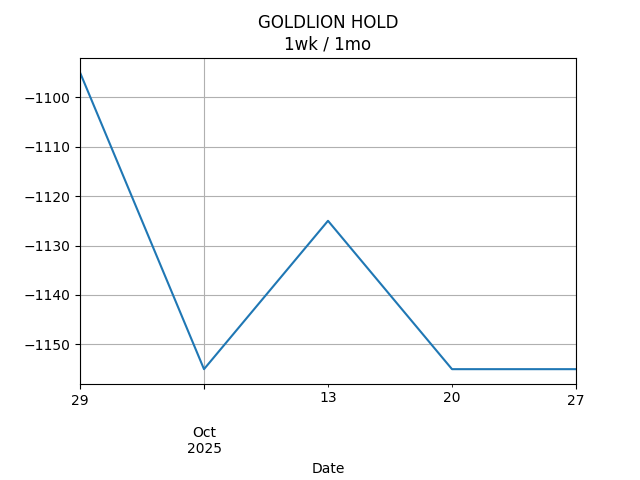

## Net Profit [📉]:
### $-1799.00
|type|graph|data|
|:---:|:---:|:---:|
|30m / 1d|||
|1d / 5d||<table border="1" class="dataframe"> <thead> <tr style="text-align: center;"> <th>Date</th> <th>profit</th> </tr> </thead> <tbody> <tr> <td>2025-12-29</td> <td>-2727.0</td> </tr> <tr> <td>2025-12-30</td> <td>-2762.0</td> </tr> <tr> <td>2025-12-31</td> <td>-2767.0</td> </tr> <tr> <td>2026-01-02</td> <td>-2577.0</td> </tr> <tr> <td>2026-01-05</td> <td>-2577.0</td> </tr> </tbody></table>|
|1wk / 1mo||<table border="1" class="dataframe"> <thead> <tr style="text-align: center;"> <th>Date</th> <th>profit</th> </tr> </thead> <tbody> <tr> <td>2025-12-01</td> <td>-2340.66</td> </tr> <tr> <td>2025-12-08</td> <td>-2503.96</td> </tr> <tr> <td>2025-12-15</td> <td>-2637.13</td> </tr> <tr> <td>2025-12-22</td> <td>-2627.00</td> </tr> <tr> <td>2025-12-29</td> <td>-2577.00</td> </tr> </tbody></table>|
---
## 0573.HK [📈] [$0.00] [0.00%]:
#### Tao Heung Holdings Limited
|price|profit|data|
|:---:|:---:|:---:|
|||<table border="1" class="dataframe"> <thead> <tr style="text-align: center;"> <th>index</th> <th>profit</th> </tr> </thead> <tbody> <tr> <td>00:00</td> <td>0</td> </tr> </tbody></table>|
|||<table border="1" class="dataframe"> <thead> <tr style="text-align: center;"> <th>Date</th> <th>profit</th> </tr> </thead> <tbody> <tr> <td>2025-12-29</td> <td>-592.0</td> </tr> <tr> <td>2025-12-30</td> <td>-592.0</td> </tr> <tr> <td>2025-12-31</td> <td>-592.0</td> </tr> <tr> <td>2026-01-02</td> <td>-572.0</td> </tr> <tr> <td>2026-01-05</td> <td>-532.0</td> </tr> </tbody></table>|
|||<table border="1" class="dataframe"> <thead> <tr style="text-align: center;"> <th>Date</th> <th>profit</th> </tr> </thead> <tbody> <tr> <td>2025-12-01</td> <td>-572.0</td> </tr> <tr> <td>2025-12-08</td> <td>-572.0</td> </tr> <tr> <td>2025-12-15</td> <td>-532.0</td> </tr> <tr> <td>2025-12-22</td> <td>-592.0</td> </tr> <tr> <td>2025-12-29</td> <td>-572.0</td> </tr> </tbody></table>|
---
## 0560.HK [📈] [$0.00] [0.00%]:
#### Chu Kong Shipping Enterprises (Group) Company Limited
|price|profit|data|
|:---:|:---:|:---:|
|||<table border="1" class="dataframe"> <thead> <tr style="text-align: center;"> <th>index</th> <th>profit</th> </tr> </thead> <tbody> <tr> <td>00:00</td> <td>0</td> </tr> </tbody></table>|
|||<table border="1" class="dataframe"> <thead> <tr style="text-align: center;"> <th>Date</th> <th>profit</th> </tr> </thead> <tbody> <tr> <td>2025-12-29</td> <td>-176.0</td> </tr> <tr> <td>2025-12-30</td> <td>-216.0</td> </tr> <tr> <td>2025-12-31</td> <td>-216.0</td> </tr> <tr> <td>2026-01-02</td> <td>-136.0</td> </tr> </tbody></table>|
|||<table border="1" class="dataframe"> <thead> <tr style="text-align: center;"> <th>Date</th> <th>profit</th> </tr> </thead> <tbody> <tr> <td>2025-12-01</td> <td>-136.0</td> </tr> <tr> <td>2025-12-08</td> <td>-176.0</td> </tr> <tr> <td>2025-12-15</td> <td>-216.0</td> </tr> <tr> <td>2025-12-22</td> <td>-216.0</td> </tr> <tr> <td>2025-12-29</td> <td>-136.0</td> </tr> </tbody></table>|
---
## 0709.HK [📉] [$-1316.00] [-31.51%]:
#### Giordano International Limited
|price|profit|data|
|:---:|:---:|:---:|
|||<table border="1" class="dataframe"> <thead> <tr style="text-align: center;"> <th>Datetime</th> <th>profit</th> </tr> </thead> <tbody> <tr> <td>09:30</td> <td>-1336.0</td> </tr> <tr> <td>10:00</td> <td>-1316.0</td> </tr> <tr> <td>10:30</td> <td>-1316.0</td> </tr> <tr> <td>11:00</td> <td>-1316.0</td> </tr> </tbody></table>|
|||<table border="1" class="dataframe"> <thead> <tr style="text-align: center;"> <th>Date</th> <th>profit</th> </tr> </thead> <tbody> <tr> <td>2025-12-29</td> <td>-1296.0</td> </tr> <tr> <td>2025-12-30</td> <td>-1316.0</td> </tr> <tr> <td>2025-12-31</td> <td>-1316.0</td> </tr> <tr> <td>2026-01-02</td> <td>-1336.0</td> </tr> <tr> <td>2026-01-05</td> <td>-1316.0</td> </tr> </tbody></table>|
|||<table border="1" class="dataframe"> <thead> <tr style="text-align: center;"> <th>Date</th> <th>profit</th> </tr> </thead> <tbody> <tr> <td>2025-12-01</td> <td>-1156.0</td> </tr> <tr> <td>2025-12-08</td> <td>-1216.0</td> </tr> <tr> <td>2025-12-15</td> <td>-1256.0</td> </tr> <tr> <td>2025-12-22</td> <td>-1236.0</td> </tr> <tr> <td>2025-12-29</td> <td>-1336.0</td> </tr> </tbody></table>|
---
## 1310.HK [📈] [$256.00] [8.77%]:
#### HKBN Ltd.
|price|profit|data|
|:---:|:---:|:---:|
|||<table border="1" class="dataframe"> <thead> <tr style="text-align: center;"> <th>Datetime</th> <th>profit</th> </tr> </thead> <tbody> <tr> <td>09:30</td> <td>306.0</td> </tr> <tr> <td>10:00</td> <td>251.0</td> </tr> <tr> <td>10:30</td> <td>256.0</td> </tr> <tr> <td>11:00</td> <td>256.0</td> </tr> </tbody></table>|
|||<table border="1" class="dataframe"> <thead> <tr style="text-align: center;"> <th>Date</th> <th>profit</th> </tr> </thead> <tbody> <tr> <td>2025-12-29</td> <td>161.0</td> </tr> <tr> <td>2025-12-30</td> <td>186.0</td> </tr> <tr> <td>2025-12-31</td> <td>176.0</td> </tr> <tr> <td>2026-01-02</td> <td>206.0</td> </tr> <tr> <td>2026-01-05</td> <td>256.0</td> </tr> </tbody></table>|
|||<table border="1" class="dataframe"> <thead> <tr style="text-align: center;"> <th>Date</th> <th>profit</th> </tr> </thead> <tbody> <tr> <td>2025-12-01</td> <td>312.35</td> </tr> <tr> <td>2025-12-08</td> <td>254.04</td> </tr> <tr> <td>2025-12-15</td> <td>190.87</td> </tr> <tr> <td>2025-12-22</td> <td>231.00</td> </tr> <tr> <td>2025-12-29</td> <td>206.00</td> </tr> </tbody></table>|
---
## 2638.HK [📈] [$326.00] [11.44%]:
#### HK Electric Investments and HK Electric Investments Limited
|price|profit|data|
|:---:|:---:|:---:|
|||<table border="1" class="dataframe"> <thead> <tr style="text-align: center;"> <th>Datetime</th> <th>profit</th> </tr> </thead> <tbody> <tr> <td>09:30</td> <td>331.0</td> </tr> <tr> <td>10:00</td> <td>321.0</td> </tr> <tr> <td>10:30</td> <td>326.0</td> </tr> <tr> <td>11:00</td> <td>326.0</td> </tr> </tbody></table>|
|||<table border="1" class="dataframe"> <thead> <tr style="text-align: center;"> <th>Date</th> <th>profit</th> </tr> </thead> <tbody> <tr> <td>2025-12-29</td> <td>301.0</td> </tr> <tr> <td>2025-12-30</td> <td>301.0</td> </tr> <tr> <td>2025-12-31</td> <td>306.0</td> </tr> <tr> <td>2026-01-02</td> <td>326.0</td> </tr> <tr> <td>2026-01-05</td> <td>326.0</td> </tr> </tbody></table>|
|||<table border="1" class="dataframe"> <thead> <tr style="text-align: center;"> <th>Date</th> <th>profit</th> </tr> </thead> <tbody> <tr> <td>2025-12-01</td> <td>306.0</td> </tr> <tr> <td>2025-12-08</td> <td>301.0</td> </tr> <tr> <td>2025-12-15</td> <td>301.0</td> </tr> <tr> <td>2025-12-22</td> <td>311.0</td> </tr> <tr> <td>2025-12-29</td> <td>326.0</td> </tr> </tbody></table>|
---
## 0533.HK [📉] [$-1065.00] [-26.79%]:
#### Goldlion Holdings Limited
|price|profit|data|
|:---:|:---:|:---:|
|||<table border="1" class="dataframe"> <thead> <tr style="text-align: center;"> <th>Datetime</th> <th>profit</th> </tr> </thead> <tbody> <tr> <td>09:30</td> <td>-1065.0</td> </tr> </tbody></table>|
|||<table border="1" class="dataframe"> <thead> <tr style="text-align: center;"> <th>Date</th> <th>profit</th> </tr> </thead> <tbody> <tr> <td>2025-12-29</td> <td>-1125.0</td> </tr> <tr> <td>2025-12-30</td> <td>-1125.0</td> </tr> <tr> <td>2025-12-31</td> <td>-1125.0</td> </tr> <tr> <td>2026-01-02</td> <td>-1065.0</td> </tr> <tr> <td>2026-01-05</td> <td>-1065.0</td> </tr> </tbody></table>|
|||<table border="1" class="dataframe"> <thead> <tr style="text-align: center;"> <th>Date</th> <th>profit</th> </tr> </thead> <tbody> <tr> <td>2025-12-01</td> <td>-1095.0</td> </tr> <tr> <td>2025-12-08</td> <td>-1095.0</td> </tr> <tr> <td>2025-12-15</td> <td>-1125.0</td> </tr> <tr> <td>2025-12-22</td> <td>-1125.0</td> </tr> <tr> <td>2025-12-29</td> <td>-1065.0</td> </tr> </tbody></table>|
---
