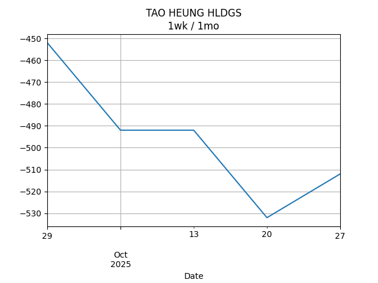
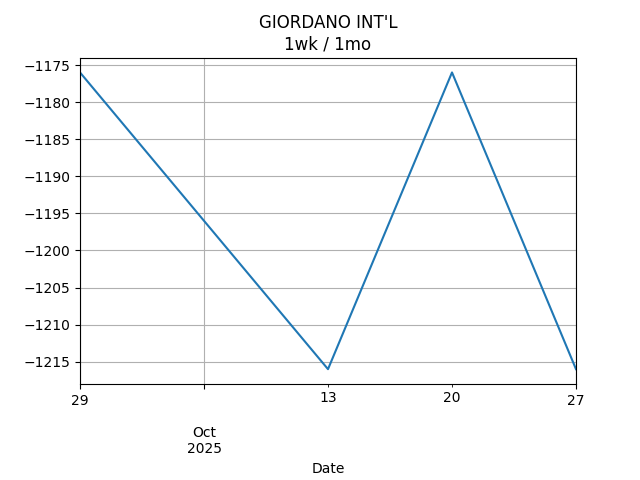
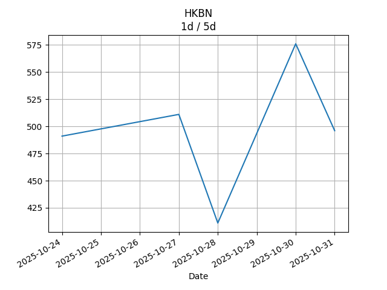

## Net Profit [📉]:
### $-1852.00
|type|graph|data|
|:---:|:---:|:---:|
|30m / 1d||<table border="1" class="dataframe"> <thead> <tr style="text-align: center;"> <th>Datetime</th> <th>profit</th> </tr> </thead> <tbody> <tr> <td>09:30</td> <td>NaN</td> </tr> <tr> <td>10:00</td> <td>NaN</td> </tr> <tr> <td>10:30</td> <td>NaN</td> </tr> <tr> <td>11:00</td> <td>-1972.0</td> </tr> <tr> <td>11:30</td> <td>-1972.0</td> </tr> <tr> <td>13:00</td> <td>-1972.0</td> </tr> <tr> <td>13:30</td> <td>-1972.0</td> </tr> <tr> <td>14:00</td> <td>-1972.0</td> </tr> <tr> <td>14:30</td> <td>-1972.0</td> </tr> <tr> <td>15:00</td> <td>-1972.0</td> </tr> </tbody></table>|
|1d / 5d||<table border="1" class="dataframe"> <thead> <tr style="text-align: center;"> <th>Date</th> <th>profit</th> </tr> </thead> <tbody> <tr> <td>2025-09-25</td> <td>-2112.0</td> </tr> <tr> <td>2025-09-26</td> <td>-1987.0</td> </tr> <tr> <td>2025-10-02</td> <td>-1852.0</td> </tr> </tbody></table>|
|1wk / 1mo||<table border="1" class="dataframe"> <thead> <tr style="text-align: center;"> <th>Date</th> <th>profit</th> </tr> </thead> <tbody> <tr> <td>2025-09-01</td> <td>-3113.07</td> </tr> <tr> <td>2025-09-08</td> <td>-2945.59</td> </tr> <tr> <td>2025-09-15</td> <td>-2328.73</td> </tr> <tr> <td>2025-09-22</td> <td>-1987.00</td> </tr> <tr> <td>2025-09-29</td> <td>-1852.00</td> </tr> </tbody></table>|
---
## 0573.HK [📉] [$-472.00] [-25.21%]:
#### TAO HEUNG HLDGS
|price|profit|data|
|:---:|:---:|:---:|
|||<table border="1" class="dataframe"> <thead> <tr style="text-align: center;"> <th>Datetime</th> <th>profit</th> </tr> </thead> <tbody> <tr> <td>11:00</td> <td>-452.0</td> </tr> <tr> <td>11:30</td> <td>-452.0</td> </tr> <tr> <td>13:00</td> <td>-472.0</td> </tr> <tr> <td>14:00</td> <td>-472.0</td> </tr> </tbody></table>|
|||<table border="1" class="dataframe"> <thead> <tr style="text-align: center;"> <th>Date</th> <th>profit</th> </tr> </thead> <tbody> <tr> <td>2025-09-25</td> <td>-432.0</td> </tr> <tr> <td>2025-09-26</td> <td>-432.0</td> </tr> <tr> <td>2025-10-02</td> <td>-472.0</td> </tr> </tbody></table>|
|||<table border="1" class="dataframe"> <thead> <tr style="text-align: center;"> <th>Date</th> <th>profit</th> </tr> </thead> <tbody> <tr> <td>2025-09-01</td> <td>-532.0</td> </tr> <tr> <td>2025-09-08</td> <td>-552.0</td> </tr> <tr> <td>2025-09-15</td> <td>-472.0</td> </tr> <tr> <td>2025-09-22</td> <td>-432.0</td> </tr> <tr> <td>2025-09-29</td> <td>-472.0</td> </tr> </tbody></table>|
---
## 0560.HK [📈] [$24.00] [0.75%]:
#### CHU KONG SHIP
|price|profit|data|
|:---:|:---:|:---:|
|||<table border="1" class="dataframe"> <thead> <tr style="text-align: center;"> <th>Datetime</th> <th>profit</th> </tr> </thead> <tbody> <tr> <td>10:00</td> <td>-96.0</td> </tr> <tr> <td>11:00</td> <td>-136.0</td> </tr> <tr> <td>13:30</td> <td>-136.0</td> </tr> <tr> <td>14:00</td> <td>-56.0</td> </tr> <tr> <td>14:30</td> <td>104.0</td> </tr> <tr> <td>15:00</td> <td>24.0</td> </tr> </tbody></table>|
|||<table border="1" class="dataframe"> <thead> <tr style="text-align: center;"> <th>Date</th> <th>profit</th> </tr> </thead> <tbody> <tr> <td>2025-09-25</td> <td>-96.0</td> </tr> <tr> <td>2025-09-26</td> <td>-136.0</td> </tr> <tr> <td>2025-10-02</td> <td>24.0</td> </tr> </tbody></table>|
|||<table border="1" class="dataframe"> <thead> <tr style="text-align: center;"> <th>Date</th> <th>profit</th> </tr> </thead> <tbody> <tr> <td>2025-09-01</td> <td>-174.5</td> </tr> <tr> <td>2025-09-08</td> <td>-95.5</td> </tr> <tr> <td>2025-09-15</td> <td>-135.0</td> </tr> <tr> <td>2025-09-22</td> <td>-136.0</td> </tr> <tr> <td>2025-09-29</td> <td>24.0</td> </tr> </tbody></table>|
---
## 0709.HK [📉] [$-1176.00] [-28.16%]:
#### GIORDANO INT'L
|price|profit|data|
|:---:|:---:|:---:|
|||<table border="1" class="dataframe"> <thead> <tr style="text-align: center;"> <th>Datetime</th> <th>profit</th> </tr> </thead> <tbody> <tr> <td>09:30</td> <td>-1176.0</td> </tr> <tr> <td>10:30</td> <td>-1176.0</td> </tr> <tr> <td>11:00</td> <td>-1156.0</td> </tr> <tr> <td>13:00</td> <td>-1176.0</td> </tr> <tr> <td>14:30</td> <td>-1176.0</td> </tr> <tr> <td>15:00</td> <td>-1176.0</td> </tr> </tbody></table>|
|||<table border="1" class="dataframe"> <thead> <tr style="text-align: center;"> <th>Date</th> <th>profit</th> </tr> </thead> <tbody> <tr> <td>2025-09-25</td> <td>-1116.0</td> </tr> <tr> <td>2025-09-26</td> <td>-1156.0</td> </tr> <tr> <td>2025-10-02</td> <td>-1176.0</td> </tr> </tbody></table>|
|||<table border="1" class="dataframe"> <thead> <tr style="text-align: center;"> <th>Date</th> <th>profit</th> </tr> </thead> <tbody> <tr> <td>2025-09-01</td> <td>-1064.18</td> </tr> <tr> <td>2025-09-08</td> <td>-1045.09</td> </tr> <tr> <td>2025-09-15</td> <td>-1178.73</td> </tr> <tr> <td>2025-09-22</td> <td>-1156.00</td> </tr> <tr> <td>2025-09-29</td> <td>-1176.00</td> </tr> </tbody></table>|
---
## 1310.HK [📈] [$726.00] [24.87%]:
#### HKBN
|price|profit|data|
|:---:|:---:|:---:|
|||<table border="1" class="dataframe"> <thead> <tr style="text-align: center;"> <th>Datetime</th> <th>profit</th> </tr> </thead> <tbody> <tr> <td>09:30</td> <td>791.0</td> </tr> <tr> <td>10:00</td> <td>736.0</td> </tr> <tr> <td>10:30</td> <td>721.0</td> </tr> <tr> <td>11:00</td> <td>731.0</td> </tr> <tr> <td>11:30</td> <td>781.0</td> </tr> <tr> <td>13:00</td> <td>766.0</td> </tr> <tr> <td>13:30</td> <td>756.0</td> </tr> <tr> <td>14:00</td> <td>741.0</td> </tr> <tr> <td>14:30</td> <td>731.0</td> </tr> <tr> <td>15:00</td> <td>726.0</td> </tr> </tbody></table>|
|||<table border="1" class="dataframe"> <thead> <tr style="text-align: center;"> <th>Date</th> <th>profit</th> </tr> </thead> <tbody> <tr> <td>2025-09-25</td> <td>511.0</td> </tr> <tr> <td>2025-09-26</td> <td>721.0</td> </tr> <tr> <td>2025-10-02</td> <td>726.0</td> </tr> </tbody></table>|
|||<table border="1" class="dataframe"> <thead> <tr style="text-align: center;"> <th>Date</th> <th>profit</th> </tr> </thead> <tbody> <tr> <td>2025-09-01</td> <td>-369.0</td> </tr> <tr> <td>2025-09-08</td> <td>-379.0</td> </tr> <tr> <td>2025-09-15</td> <td>396.0</td> </tr> <tr> <td>2025-09-22</td> <td>721.0</td> </tr> <tr> <td>2025-09-29</td> <td>726.0</td> </tr> </tbody></table>|
---
## 2638.HK [📈] [$141.00] [4.95%]:
#### HK Electric Investments and HK Electric Investments Limited
|price|profit|data|
|:---:|:---:|:---:|
|||<table border="1" class="dataframe"> <thead> <tr style="text-align: center;"> <th>Datetime</th> <th>profit</th> </tr> </thead> <tbody> <tr> <td>09:30</td> <td>131.0</td> </tr> <tr> <td>10:00</td> <td>146.0</td> </tr> <tr> <td>10:30</td> <td>136.0</td> </tr> <tr> <td>11:00</td> <td>136.0</td> </tr> <tr> <td>11:30</td> <td>146.0</td> </tr> <tr> <td>13:00</td> <td>146.0</td> </tr> <tr> <td>13:30</td> <td>141.0</td> </tr> <tr> <td>14:00</td> <td>141.0</td> </tr> <tr> <td>14:30</td> <td>141.0</td> </tr> <tr> <td>15:00</td> <td>141.0</td> </tr> </tbody></table>|
|||<table border="1" class="dataframe"> <thead> <tr style="text-align: center;"> <th>Date</th> <th>profit</th> </tr> </thead> <tbody> <tr> <td>2025-09-25</td> <td>116.0</td> </tr> <tr> <td>2025-09-26</td> <td>111.0</td> </tr> <tr> <td>2025-10-02</td> <td>141.0</td> </tr> </tbody></table>|
|||<table border="1" class="dataframe"> <thead> <tr style="text-align: center;"> <th>Date</th> <th>profit</th> </tr> </thead> <tbody> <tr> <td>2025-09-01</td> <td>151.0</td> </tr> <tr> <td>2025-09-08</td> <td>221.0</td> </tr> <tr> <td>2025-09-15</td> <td>156.0</td> </tr> <tr> <td>2025-09-22</td> <td>111.0</td> </tr> <tr> <td>2025-09-29</td> <td>141.0</td> </tr> </tbody></table>|
---
## 0533.HK [📉] [$-1095.00] [-27.55%]:
#### GOLDLION HOLD
|price|profit|data|
|:---:|:---:|:---:|
|||<table border="1" class="dataframe"> <thead> <tr style="text-align: center;"> <th>Datetime</th> <th>profit</th> </tr> </thead> <tbody> <tr> <td>10:00</td> <td>-1095.0</td> </tr> <tr> <td>11:00</td> <td>-1095.0</td> </tr> <tr> <td>13:30</td> <td>-1095.0</td> </tr> <tr> <td>15:00</td> <td>-1095.0</td> </tr> </tbody></table>|
|||<table border="1" class="dataframe"> <thead> <tr style="text-align: center;"> <th>Date</th> <th>profit</th> </tr> </thead> <tbody> <tr> <td>2025-09-25</td> <td>-1095.0</td> </tr> <tr> <td>2025-09-26</td> <td>-1095.0</td> </tr> <tr> <td>2025-10-02</td> <td>-1095.0</td> </tr> </tbody></table>|
|||<table border="1" class="dataframe"> <thead> <tr style="text-align: center;"> <th>Date</th> <th>profit</th> </tr> </thead> <tbody> <tr> <td>2025-09-01</td> <td>-1124.39</td> </tr> <tr> <td>2025-09-08</td> <td>-1095.00</td> </tr> <tr> <td>2025-09-15</td> <td>-1095.00</td> </tr> <tr> <td>2025-09-22</td> <td>-1095.00</td> </tr> <tr> <td>2025-09-29</td> <td>-1095.00</td> </tr> </tbody></table>|
---
