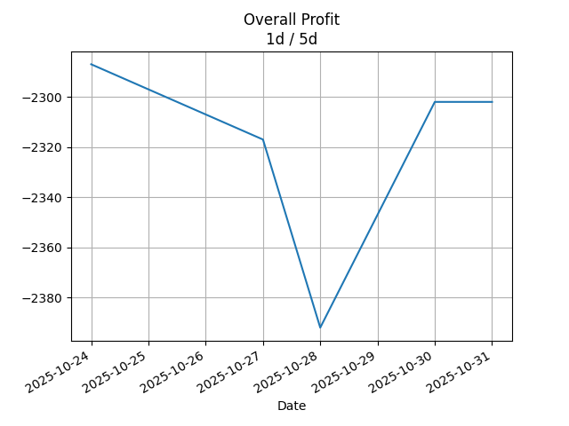
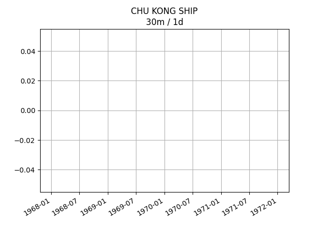
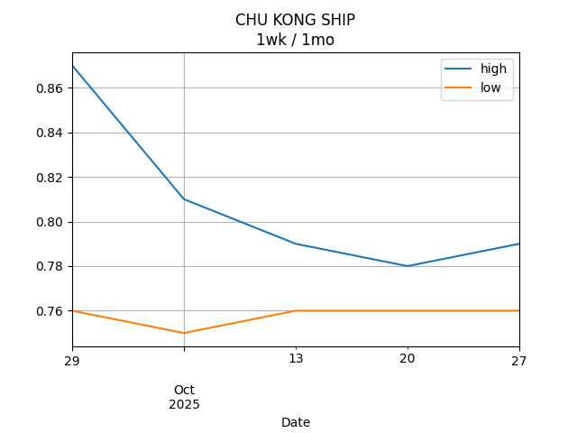
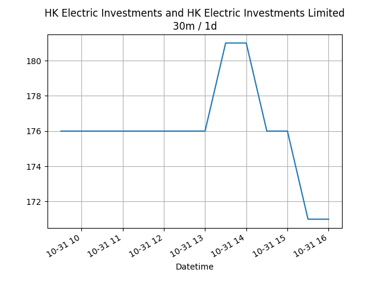
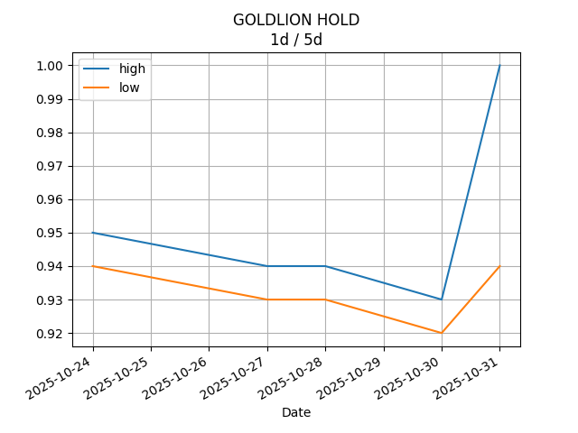
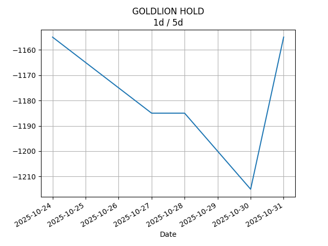

## Net Profit [📉]:
### $-2892.00
|type|graph|data|
|:---:|:---:|:---:|
|30m / 1d||<table border="1" class="dataframe"> <thead> <tr style="text-align: center;"> <th>Datetime</th> <th>profit</th> </tr> </thead> <tbody> <tr> <td>09:30</td> <td>NaN</td> </tr> <tr> <td>10:00</td> <td>NaN</td> </tr> <tr> <td>10:30</td> <td>NaN</td> </tr> <tr> <td>11:00</td> <td>NaN</td> </tr> <tr> <td>11:30</td> <td>NaN</td> </tr> <tr> <td>13:00</td> <td>NaN</td> </tr> <tr> <td>13:30</td> <td>NaN</td> </tr> <tr> <td>14:00</td> <td>NaN</td> </tr> <tr> <td>14:30</td> <td>NaN</td> </tr> <tr> <td>15:00</td> <td>NaN</td> </tr> <tr> <td>15:30</td> <td>NaN</td> </tr> </tbody></table>|
|1d / 5d||<table border="1" class="dataframe"> <thead> <tr style="text-align: center;"> <th>Date</th> <th>profit</th> </tr> </thead> <tbody> <tr> <td>2025-08-07</td> <td>-2932.0</td> </tr> <tr> <td>2025-08-08</td> <td>-3017.0</td> </tr> <tr> <td>2025-08-11</td> <td>-2987.0</td> </tr> <tr> <td>2025-08-12</td> <td>-2947.0</td> </tr> <tr> <td>2025-08-13</td> <td>-2902.0</td> </tr> </tbody></table>|
|1wk / 1mo||<table border="1" class="dataframe"> <thead> <tr style="text-align: center;"> <th>Date</th> <th>profit</th> </tr> </thead> <tbody> <tr> <td>2025-07-14</td> <td>-3257.0</td> </tr> <tr> <td>2025-07-21</td> <td>-2932.0</td> </tr> <tr> <td>2025-07-28</td> <td>-3187.0</td> </tr> <tr> <td>2025-08-04</td> <td>-3017.0</td> </tr> <tr> <td>2025-08-11</td> <td>-2902.0</td> </tr> </tbody></table>|
---
## 0573.HK [📉] [$-632.00] [-33.76%]:
#### TAO HEUNG HLDGS
|price|profit|data|
|:---:|:---:|:---:|
|||<table border="1" class="dataframe"> <thead> <tr style="text-align: center;"> <th>Datetime</th> <th>profit</th> </tr> </thead> <tbody> <tr> <td>10:00</td> <td>-632.0</td> </tr> <tr> <td>11:00</td> <td>-632.0</td> </tr> </tbody></table>|
|||<table border="1" class="dataframe"> <thead> <tr style="text-align: center;"> <th>Date</th> <th>profit</th> </tr> </thead> <tbody> <tr> <td>2025-08-07</td> <td>-672.0</td> </tr> <tr> <td>2025-08-08</td> <td>-672.0</td> </tr> <tr> <td>2025-08-11</td> <td>-672.0</td> </tr> <tr> <td>2025-08-12</td> <td>-612.0</td> </tr> <tr> <td>2025-08-13</td> <td>-632.0</td> </tr> </tbody></table>|
|||<table border="1" class="dataframe"> <thead> <tr style="text-align: center;"> <th>Date</th> <th>profit</th> </tr> </thead> <tbody> <tr> <td>2025-07-14</td> <td>-692.0</td> </tr> <tr> <td>2025-07-21</td> <td>-632.0</td> </tr> <tr> <td>2025-07-28</td> <td>-692.0</td> </tr> <tr> <td>2025-08-04</td> <td>-672.0</td> </tr> <tr> <td>2025-08-11</td> <td>-632.0</td> </tr> </tbody></table>|
---
## 0560.HK [📉] [$-16.00] [-0.50%]:
#### CHU KONG SHIP
|price|profit|data|
|:---:|:---:|:---:|
|||<table border="1" class="dataframe"> <thead> <tr style="text-align: center;"> <th>Datetime</th> <th>profit</th> </tr> </thead> <tbody> <tr> <td>10:00</td> <td>-56.0</td> </tr> <tr> <td>13:00</td> <td>-56.0</td> </tr> <tr> <td>14:00</td> <td>-56.0</td> </tr> <tr> <td>14:30</td> <td>-16.0</td> </tr> <tr> <td>15:30</td> <td>-16.0</td> </tr> </tbody></table>|
|||<table border="1" class="dataframe"> <thead> <tr style="text-align: center;"> <th>Date</th> <th>profit</th> </tr> </thead> <tbody> <tr> <td>2025-08-07</td> <td>-16.0</td> </tr> <tr> <td>2025-08-08</td> <td>-56.0</td> </tr> <tr> <td>2025-08-11</td> <td>-16.0</td> </tr> <tr> <td>2025-08-12</td> <td>-56.0</td> </tr> <tr> <td>2025-08-13</td> <td>-16.0</td> </tr> </tbody></table>|
|||<table border="1" class="dataframe"> <thead> <tr style="text-align: center;"> <th>Date</th> <th>profit</th> </tr> </thead> <tbody> <tr> <td>2025-07-14</td> <td>-136.0</td> </tr> <tr> <td>2025-07-21</td> <td>-56.0</td> </tr> <tr> <td>2025-07-28</td> <td>-96.0</td> </tr> <tr> <td>2025-08-04</td> <td>-56.0</td> </tr> <tr> <td>2025-08-11</td> <td>-16.0</td> </tr> </tbody></table>|
---
## 0709.HK [📉] [$-1156.00] [-27.68%]:
#### GIORDANO INT'L
|price|profit|data|
|:---:|:---:|:---:|
|||<table border="1" class="dataframe"> <thead> <tr style="text-align: center;"> <th>Datetime</th> <th>profit</th> </tr> </thead> <tbody> <tr> <td>09:30</td> <td>-1136.0</td> </tr> <tr> <td>10:00</td> <td>-1116.0</td> </tr> <tr> <td>10:30</td> <td>-1156.0</td> </tr> <tr> <td>11:00</td> <td>-1136.0</td> </tr> <tr> <td>11:30</td> <td>-1136.0</td> </tr> <tr> <td>13:00</td> <td>-1136.0</td> </tr> <tr> <td>13:30</td> <td>-1136.0</td> </tr> <tr> <td>14:00</td> <td>-1156.0</td> </tr> <tr> <td>14:30</td> <td>-1156.0</td> </tr> <tr> <td>15:00</td> <td>-1176.0</td> </tr> <tr> <td>15:30</td> <td>-1156.0</td> </tr> </tbody></table>|
|||<table border="1" class="dataframe"> <thead> <tr style="text-align: center;"> <th>Date</th> <th>profit</th> </tr> </thead> <tbody> <tr> <td>2025-08-07</td> <td>-1136.0</td> </tr> <tr> <td>2025-08-08</td> <td>-1136.0</td> </tr> <tr> <td>2025-08-11</td> <td>-1156.0</td> </tr> <tr> <td>2025-08-12</td> <td>-1136.0</td> </tr> <tr> <td>2025-08-13</td> <td>-1156.0</td> </tr> </tbody></table>|
|||<table border="1" class="dataframe"> <thead> <tr style="text-align: center;"> <th>Date</th> <th>profit</th> </tr> </thead> <tbody> <tr> <td>2025-07-14</td> <td>-1276.0</td> </tr> <tr> <td>2025-07-21</td> <td>-1136.0</td> </tr> <tr> <td>2025-07-28</td> <td>-1236.0</td> </tr> <tr> <td>2025-08-04</td> <td>-1136.0</td> </tr> <tr> <td>2025-08-11</td> <td>-1156.0</td> </tr> </tbody></table>|
---
## 1310.HK [📉] [$-384.00] [-13.16%]:
#### HKBN
|price|profit|data|
|:---:|:---:|:---:|
|||<table border="1" class="dataframe"> <thead> <tr style="text-align: center;"> <th>Datetime</th> <th>profit</th> </tr> </thead> <tbody> <tr> <td>09:30</td> <td>-389.0</td> </tr> <tr> <td>10:00</td> <td>-394.0</td> </tr> <tr> <td>10:30</td> <td>-394.0</td> </tr> <tr> <td>11:00</td> <td>-384.0</td> </tr> <tr> <td>11:30</td> <td>-379.0</td> </tr> <tr> <td>13:00</td> <td>-379.0</td> </tr> <tr> <td>13:30</td> <td>-384.0</td> </tr> <tr> <td>14:00</td> <td>-384.0</td> </tr> <tr> <td>14:30</td> <td>-389.0</td> </tr> <tr> <td>15:00</td> <td>-384.0</td> </tr> <tr> <td>15:30</td> <td>-384.0</td> </tr> </tbody></table>|
|||<table border="1" class="dataframe"> <thead> <tr style="text-align: center;"> <th>Date</th> <th>profit</th> </tr> </thead> <tbody> <tr> <td>2025-08-07</td> <td>-394.0</td> </tr> <tr> <td>2025-08-08</td> <td>-394.0</td> </tr> <tr> <td>2025-08-11</td> <td>-394.0</td> </tr> <tr> <td>2025-08-12</td> <td>-394.0</td> </tr> <tr> <td>2025-08-13</td> <td>-389.0</td> </tr> </tbody></table>|
|||<table border="1" class="dataframe"> <thead> <tr style="text-align: center;"> <th>Date</th> <th>profit</th> </tr> </thead> <tbody> <tr> <td>2025-07-14</td> <td>-419.0</td> </tr> <tr> <td>2025-07-21</td> <td>-419.0</td> </tr> <tr> <td>2025-07-28</td> <td>-419.0</td> </tr> <tr> <td>2025-08-04</td> <td>-394.0</td> </tr> <tr> <td>2025-08-11</td> <td>-389.0</td> </tr> </tbody></table>|
---
## 2638.HK [📈] [$271.00] [9.51%]:
#### HK Electric Investments and HK Electric Investments Limited
|price|profit|data|
|:---:|:---:|:---:|
|||<table border="1" class="dataframe"> <thead> <tr style="text-align: center;"> <th>Datetime</th> <th>profit</th> </tr> </thead> <tbody> <tr> <td>09:30</td> <td>236.0</td> </tr> <tr> <td>10:00</td> <td>246.0</td> </tr> <tr> <td>10:30</td> <td>241.0</td> </tr> <tr> <td>11:00</td> <td>251.0</td> </tr> <tr> <td>11:30</td> <td>256.0</td> </tr> <tr> <td>13:00</td> <td>261.0</td> </tr> <tr> <td>13:30</td> <td>266.0</td> </tr> <tr> <td>14:00</td> <td>271.0</td> </tr> <tr> <td>14:30</td> <td>266.0</td> </tr> <tr> <td>15:00</td> <td>266.0</td> </tr> <tr> <td>15:30</td> <td>271.0</td> </tr> </tbody></table>|
|||<table border="1" class="dataframe"> <thead> <tr style="text-align: center;"> <th>Date</th> <th>profit</th> </tr> </thead> <tbody> <tr> <td>2025-08-07</td> <td>231.0</td> </tr> <tr> <td>2025-08-08</td> <td>216.0</td> </tr> <tr> <td>2025-08-11</td> <td>226.0</td> </tr> <tr> <td>2025-08-12</td> <td>226.0</td> </tr> <tr> <td>2025-08-13</td> <td>266.0</td> </tr> </tbody></table>|
|||<table border="1" class="dataframe"> <thead> <tr style="text-align: center;"> <th>Date</th> <th>profit</th> </tr> </thead> <tbody> <tr> <td>2025-07-14</td> <td>181.0</td> </tr> <tr> <td>2025-07-21</td> <td>196.0</td> </tr> <tr> <td>2025-07-28</td> <td>201.0</td> </tr> <tr> <td>2025-08-04</td> <td>216.0</td> </tr> <tr> <td>2025-08-11</td> <td>266.0</td> </tr> </tbody></table>|
---
## 0533.HK [📉] [$-975.00] [-24.53%]:
#### GOLDLION HOLD
|price|profit|data|
|:---:|:---:|:---:|
|||<table border="1" class="dataframe"> <thead> <tr style="text-align: center;"> <th>Datetime</th> <th>profit</th> </tr> </thead> <tbody> <tr> <td>09:30</td> <td>-975.0</td> </tr> <tr> <td>14:00</td> <td>-975.0</td> </tr> <tr> <td>14:30</td> <td>-975.0</td> </tr> <tr> <td>15:30</td> <td>-975.0</td> </tr> </tbody></table>|
|||<table border="1" class="dataframe"> <thead> <tr style="text-align: center;"> <th>Date</th> <th>profit</th> </tr> </thead> <tbody> <tr> <td>2025-08-07</td> <td>-945.0</td> </tr> <tr> <td>2025-08-08</td> <td>-975.0</td> </tr> <tr> <td>2025-08-11</td> <td>-975.0</td> </tr> <tr> <td>2025-08-12</td> <td>-975.0</td> </tr> <tr> <td>2025-08-13</td> <td>-975.0</td> </tr> </tbody></table>|
|||<table border="1" class="dataframe"> <thead> <tr style="text-align: center;"> <th>Date</th> <th>profit</th> </tr> </thead> <tbody> <tr> <td>2025-07-14</td> <td>-915.0</td> </tr> <tr> <td>2025-07-21</td> <td>-885.0</td> </tr> <tr> <td>2025-07-28</td> <td>-945.0</td> </tr> <tr> <td>2025-08-04</td> <td>-975.0</td> </tr> <tr> <td>2025-08-11</td> <td>-975.0</td> </tr> </tbody></table>|
---
