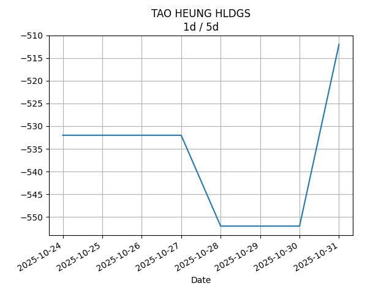

## Net Profit [📉]:
### $-2470.00
|type|graph|data|
|:---:|:---:|:---:|
|30m / 1d|||
|1d / 5d||<table border="1" class="dataframe"> <thead> <tr style="text-align: center;"> <th>Date</th> <th>profit</th> </tr> </thead> <tbody> <tr> <td>2025-07-28</td> <td>-2857.0</td> </tr> <tr> <td>2025-07-29</td> <td>-2837.0</td> </tr> <tr> <td>2025-07-30</td> <td>-2927.0</td> </tr> <tr> <td>2025-07-31</td> <td>-3142.0</td> </tr> <tr> <td>2025-08-01</td> <td>-3142.0</td> </tr> </tbody></table>|
|1wk / 1mo||<table border="1" class="dataframe"> <thead> <tr style="text-align: center;"> <th>Date</th> <th>profit</th> </tr> </thead> <tbody> <tr> <td>2025-06-30</td> <td>-3367.0</td> </tr> <tr> <td>2025-07-07</td> <td>-2962.0</td> </tr> <tr> <td>2025-07-14</td> <td>-3257.0</td> </tr> <tr> <td>2025-07-21</td> <td>-2932.0</td> </tr> <tr> <td>2025-07-28</td> <td>-3162.0</td> </tr> </tbody></table>|
---
## 0573.HK [📈] [$0.00] [0.00%]:
#### TAO HEUNG HLDGS
|price|profit|data|
|:---:|:---:|:---:|
|||<table border="1" class="dataframe"> <thead> <tr style="text-align: center;"> <th>index</th> <th>profit</th> </tr> </thead> <tbody> <tr> <td>00:00</td> <td>0</td> </tr> </tbody></table>|
|||<table border="1" class="dataframe"> <thead> <tr style="text-align: center;"> <th>Date</th> <th>profit</th> </tr> </thead> <tbody> <tr> <td>2025-07-28</td> <td>-652.0</td> </tr> <tr> <td>2025-07-29</td> <td>-652.0</td> </tr> <tr> <td>2025-07-30</td> <td>-672.0</td> </tr> <tr> <td>2025-07-31</td> <td>-692.0</td> </tr> </tbody></table>|
|||<table border="1" class="dataframe"> <thead> <tr style="text-align: center;"> <th>Date</th> <th>profit</th> </tr> </thead> <tbody> <tr> <td>2025-06-30</td> <td>-672.0</td> </tr> <tr> <td>2025-07-07</td> <td>-672.0</td> </tr> <tr> <td>2025-07-14</td> <td>-692.0</td> </tr> <tr> <td>2025-07-21</td> <td>-632.0</td> </tr> <tr> <td>2025-07-28</td> <td>-692.0</td> </tr> </tbody></table>|
---
## 0560.HK [📉] [$-96.00] [-2.99%]:
#### CHU KONG SHIP
|price|profit|data|
|:---:|:---:|:---:|
|||<table border="1" class="dataframe"> <thead> <tr style="text-align: center;"> <th>Datetime</th> <th>profit</th> </tr> </thead> <tbody> <tr> <td>10:00</td> <td>-96.0</td> </tr> <tr> <td>10:30</td> <td>-96.0</td> </tr> </tbody></table>|
|||<table border="1" class="dataframe"> <thead> <tr style="text-align: center;"> <th>Date</th> <th>profit</th> </tr> </thead> <tbody> <tr> <td>2025-07-28</td> <td>-56.0</td> </tr> <tr> <td>2025-07-29</td> <td>-16.0</td> </tr> <tr> <td>2025-07-30</td> <td>-56.0</td> </tr> <tr> <td>2025-07-31</td> <td>-96.0</td> </tr> <tr> <td>2025-08-01</td> <td>-96.0</td> </tr> </tbody></table>|
|||<table border="1" class="dataframe"> <thead> <tr style="text-align: center;"> <th>Date</th> <th>profit</th> </tr> </thead> <tbody> <tr> <td>2025-06-30</td> <td>104.0</td> </tr> <tr> <td>2025-07-07</td> <td>184.0</td> </tr> <tr> <td>2025-07-14</td> <td>-136.0</td> </tr> <tr> <td>2025-07-21</td> <td>-56.0</td> </tr> <tr> <td>2025-07-28</td> <td>-96.0</td> </tr> </tbody></table>|
---
## 0709.HK [📉] [$-1216.00] [-29.12%]:
#### GIORDANO INT'L
|price|profit|data|
|:---:|:---:|:---:|
|||<table border="1" class="dataframe"> <thead> <tr style="text-align: center;"> <th>Datetime</th> <th>profit</th> </tr> </thead> <tbody> <tr> <td>09:30</td> <td>-1196.0</td> </tr> <tr> <td>10:00</td> <td>-1216.0</td> </tr> <tr> <td>10:30</td> <td>-1216.0</td> </tr> <tr> <td>11:00</td> <td>-1216.0</td> </tr> </tbody></table>|
|||<table border="1" class="dataframe"> <thead> <tr style="text-align: center;"> <th>Date</th> <th>profit</th> </tr> </thead> <tbody> <tr> <td>2025-07-28</td> <td>-1116.0</td> </tr> <tr> <td>2025-07-29</td> <td>-1136.0</td> </tr> <tr> <td>2025-07-30</td> <td>-1096.0</td> </tr> <tr> <td>2025-07-31</td> <td>-1196.0</td> </tr> <tr> <td>2025-08-01</td> <td>-1216.0</td> </tr> </tbody></table>|
|||<table border="1" class="dataframe"> <thead> <tr style="text-align: center;"> <th>Date</th> <th>profit</th> </tr> </thead> <tbody> <tr> <td>2025-06-30</td> <td>-1336.0</td> </tr> <tr> <td>2025-07-07</td> <td>-1336.0</td> </tr> <tr> <td>2025-07-14</td> <td>-1276.0</td> </tr> <tr> <td>2025-07-21</td> <td>-1136.0</td> </tr> <tr> <td>2025-07-28</td> <td>-1216.0</td> </tr> </tbody></table>|
---
## 1310.HK [📉] [$-424.00] [-14.53%]:
#### HKBN
|price|profit|data|
|:---:|:---:|:---:|
|||<table border="1" class="dataframe"> <thead> <tr style="text-align: center;"> <th>Datetime</th> <th>profit</th> </tr> </thead> <tbody> <tr> <td>09:30</td> <td>-419.0</td> </tr> <tr> <td>10:00</td> <td>-419.0</td> </tr> <tr> <td>10:30</td> <td>-419.0</td> </tr> <tr> <td>11:00</td> <td>-424.0</td> </tr> </tbody></table>|
|||<table border="1" class="dataframe"> <thead> <tr style="text-align: center;"> <th>Date</th> <th>profit</th> </tr> </thead> <tbody> <tr> <td>2025-07-28</td> <td>-419.0</td> </tr> <tr> <td>2025-07-29</td> <td>-419.0</td> </tr> <tr> <td>2025-07-30</td> <td>-419.0</td> </tr> <tr> <td>2025-07-31</td> <td>-424.0</td> </tr> <tr> <td>2025-08-01</td> <td>-424.0</td> </tr> </tbody></table>|
|||<table border="1" class="dataframe"> <thead> <tr style="text-align: center;"> <th>Date</th> <th>profit</th> </tr> </thead> <tbody> <tr> <td>2025-06-30</td> <td>-404.0</td> </tr> <tr> <td>2025-07-07</td> <td>-414.0</td> </tr> <tr> <td>2025-07-14</td> <td>-419.0</td> </tr> <tr> <td>2025-07-21</td> <td>-419.0</td> </tr> <tr> <td>2025-07-28</td> <td>-424.0</td> </tr> </tbody></table>|
---
## 2638.HK [📈] [$211.00] [7.41%]:
#### HK Electric Investments and HK Electric Investments Limited
|price|profit|data|
|:---:|:---:|:---:|
|||<table border="1" class="dataframe"> <thead> <tr style="text-align: center;"> <th>Datetime</th> <th>profit</th> </tr> </thead> <tbody> <tr> <td>09:30</td> <td>211.0</td> </tr> <tr> <td>10:00</td> <td>216.0</td> </tr> <tr> <td>10:30</td> <td>211.0</td> </tr> <tr> <td>11:00</td> <td>211.0</td> </tr> </tbody></table>|
|||<table border="1" class="dataframe"> <thead> <tr style="text-align: center;"> <th>Date</th> <th>profit</th> </tr> </thead> <tbody> <tr> <td>2025-07-28</td> <td>241.0</td> </tr> <tr> <td>2025-07-29</td> <td>241.0</td> </tr> <tr> <td>2025-07-30</td> <td>231.0</td> </tr> <tr> <td>2025-07-31</td> <td>211.0</td> </tr> <tr> <td>2025-08-01</td> <td>211.0</td> </tr> </tbody></table>|
|||<table border="1" class="dataframe"> <thead> <tr style="text-align: center;"> <th>Date</th> <th>profit</th> </tr> </thead> <tbody> <tr> <td>2025-06-30</td> <td>66.0</td> </tr> <tr> <td>2025-07-07</td> <td>161.0</td> </tr> <tr> <td>2025-07-14</td> <td>181.0</td> </tr> <tr> <td>2025-07-21</td> <td>196.0</td> </tr> <tr> <td>2025-07-28</td> <td>211.0</td> </tr> </tbody></table>|
---
## 0533.HK [📉] [$-945.00] [-23.77%]:
#### GOLDLION HOLD
|price|profit|data|
|:---:|:---:|:---:|
|||<table border="1" class="dataframe"> <thead> <tr style="text-align: center;"> <th>Datetime</th> <th>profit</th> </tr> </thead> <tbody> <tr> <td>10:30</td> <td>-945.0</td> </tr> </tbody></table>|
|||<table border="1" class="dataframe"> <thead> <tr style="text-align: center;"> <th>Date</th> <th>profit</th> </tr> </thead> <tbody> <tr> <td>2025-07-28</td> <td>-855.0</td> </tr> <tr> <td>2025-07-29</td> <td>-855.0</td> </tr> <tr> <td>2025-07-30</td> <td>-915.0</td> </tr> <tr> <td>2025-07-31</td> <td>-945.0</td> </tr> <tr> <td>2025-08-01</td> <td>-945.0</td> </tr> </tbody></table>|
|||<table border="1" class="dataframe"> <thead> <tr style="text-align: center;"> <th>Date</th> <th>profit</th> </tr> </thead> <tbody> <tr> <td>2025-06-30</td> <td>-1125.0</td> </tr> <tr> <td>2025-07-07</td> <td>-885.0</td> </tr> <tr> <td>2025-07-14</td> <td>-915.0</td> </tr> <tr> <td>2025-07-21</td> <td>-885.0</td> </tr> <tr> <td>2025-07-28</td> <td>-945.0</td> </tr> </tbody></table>|
---
