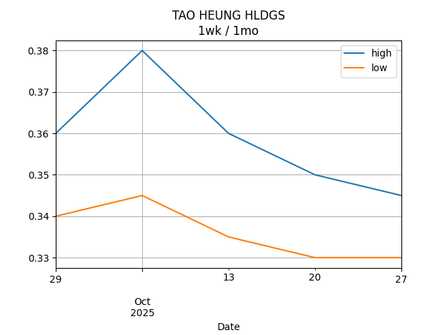

## Net Profit [📉]:
### $-1937.00
|type|graph|data|
|:---:|:---:|:---:|
|30m / 1d||<table border="1" class="dataframe"> <thead> <tr style="text-align: center;"> <th>Datetime</th> <th>profit</th> </tr> </thead> <tbody> <tr> <td>09:30</td> <td>NaN</td> </tr> <tr> <td>10:00</td> <td>NaN</td> </tr> <tr> <td>10:30</td> <td>NaN</td> </tr> <tr> <td>11:00</td> <td>NaN</td> </tr> <tr> <td>11:30</td> <td>NaN</td> </tr> <tr> <td>13:00</td> <td>NaN</td> </tr> <tr> <td>13:30</td> <td>NaN</td> </tr> <tr> <td>14:00</td> <td>NaN</td> </tr> <tr> <td>14:30</td> <td>NaN</td> </tr> <tr> <td>15:00</td> <td>NaN</td> </tr> <tr> <td>15:30</td> <td>NaN</td> </tr> </tbody></table>|
|1d / 5d||<table border="1" class="dataframe"> <thead> <tr style="text-align: center;"> <th>Date</th> <th>profit</th> </tr> </thead> <tbody> <tr> <td>2026-02-11</td> <td>-1822.0</td> </tr> <tr> <td>2026-02-12</td> <td>-1767.0</td> </tr> <tr> <td>2026-02-13</td> <td>-1837.0</td> </tr> <tr> <td>2026-02-16</td> <td>-1827.0</td> </tr> <tr> <td>2026-02-20</td> <td>-1937.0</td> </tr> </tbody></table>|
|1wk / 1mo||<table border="1" class="dataframe"> <thead> <tr style="text-align: center;"> <th>Date</th> <th>profit</th> </tr> </thead> <tbody> <tr> <td>2026-01-19</td> <td>-2297.0</td> </tr> <tr> <td>2026-01-26</td> <td>-2092.0</td> </tr> <tr> <td>2026-02-02</td> <td>-2002.0</td> </tr> <tr> <td>2026-02-09</td> <td>-1837.0</td> </tr> <tr> <td>2026-02-16</td> <td>-1937.0</td> </tr> </tbody></table>|
---
## 0573.HK [📉] [$-612.00] [-32.69%]:
#### Tao Heung Holdings Limited
|price|profit|data|
|:---:|:---:|:---:|
|||<table border="1" class="dataframe"> <thead> <tr style="text-align: center;"> <th>Datetime</th> <th>profit</th> </tr> </thead> <tbody> <tr> <td>11:00</td> <td>-552.0</td> </tr> <tr> <td>14:00</td> <td>-612.0</td> </tr> </tbody></table>|
|||<table border="1" class="dataframe"> <thead> <tr style="text-align: center;"> <th>Date</th> <th>profit</th> </tr> </thead> <tbody> <tr> <td>2026-02-11</td> <td>-492.0</td> </tr> <tr> <td>2026-02-12</td> <td>-492.0</td> </tr> <tr> <td>2026-02-13</td> <td>-492.0</td> </tr> <tr> <td>2026-02-16</td> <td>-492.0</td> </tr> <tr> <td>2026-02-20</td> <td>-612.0</td> </tr> </tbody></table>|
|||<table border="1" class="dataframe"> <thead> <tr style="text-align: center;"> <th>Date</th> <th>profit</th> </tr> </thead> <tbody> <tr> <td>2026-01-19</td> <td>-572.0</td> </tr> <tr> <td>2026-01-26</td> <td>-612.0</td> </tr> <tr> <td>2026-02-02</td> <td>-612.0</td> </tr> <tr> <td>2026-02-09</td> <td>-492.0</td> </tr> <tr> <td>2026-02-16</td> <td>-612.0</td> </tr> </tbody></table>|
---
## 0560.HK [📉] [$-256.00] [-7.96%]:
#### Chu Kong Shipping Enterprises (Group) Company Limited
|price|profit|data|
|:---:|:---:|:---:|
|||<table border="1" class="dataframe"> <thead> <tr style="text-align: center;"> <th>Datetime</th> <th>profit</th> </tr> </thead> <tbody> <tr> <td>09:30</td> <td>-296.0</td> </tr> <tr> <td>10:00</td> <td>-256.0</td> </tr> <tr> <td>10:30</td> <td>-216.0</td> </tr> <tr> <td>11:30</td> <td>-216.0</td> </tr> <tr> <td>15:30</td> <td>-256.0</td> </tr> </tbody></table>|
|||<table border="1" class="dataframe"> <thead> <tr style="text-align: center;"> <th>Date</th> <th>profit</th> </tr> </thead> <tbody> <tr> <td>2026-02-11</td> <td>-216.0</td> </tr> <tr> <td>2026-02-12</td> <td>-216.0</td> </tr> <tr> <td>2026-02-13</td> <td>-256.0</td> </tr> <tr> <td>2026-02-16</td> <td>-256.0</td> </tr> <tr> <td>2026-02-20</td> <td>-256.0</td> </tr> </tbody></table>|
|||<table border="1" class="dataframe"> <thead> <tr style="text-align: center;"> <th>Date</th> <th>profit</th> </tr> </thead> <tbody> <tr> <td>2026-01-19</td> <td>-216.0</td> </tr> <tr> <td>2026-01-26</td> <td>-216.0</td> </tr> <tr> <td>2026-02-02</td> <td>-216.0</td> </tr> <tr> <td>2026-02-09</td> <td>-256.0</td> </tr> <tr> <td>2026-02-16</td> <td>-256.0</td> </tr> </tbody></table>|
---
## 0709.HK [📉] [$-1156.00] [-27.68%]:
#### Giordano International Limited
|price|profit|data|
|:---:|:---:|:---:|
|||<table border="1" class="dataframe"> <thead> <tr style="text-align: center;"> <th>Datetime</th> <th>profit</th> </tr> </thead> <tbody> <tr> <td>09:30</td> <td>-1156.0</td> </tr> <tr> <td>10:00</td> <td>-1176.0</td> </tr> <tr> <td>10:30</td> <td>-1156.0</td> </tr> <tr> <td>11:00</td> <td>-1156.0</td> </tr> <tr> <td>11:30</td> <td>-1136.0</td> </tr> <tr> <td>13:00</td> <td>-1156.0</td> </tr> <tr> <td>13:30</td> <td>-1136.0</td> </tr> <tr> <td>14:00</td> <td>-1156.0</td> </tr> <tr> <td>14:30</td> <td>-1156.0</td> </tr> <tr> <td>15:00</td> <td>-1136.0</td> </tr> <tr> <td>15:30</td> <td>-1156.0</td> </tr> </tbody></table>|
|||<table border="1" class="dataframe"> <thead> <tr style="text-align: center;"> <th>Date</th> <th>profit</th> </tr> </thead> <tbody> <tr> <td>2026-02-11</td> <td>-1156.0</td> </tr> <tr> <td>2026-02-12</td> <td>-1156.0</td> </tr> <tr> <td>2026-02-13</td> <td>-1176.0</td> </tr> <tr> <td>2026-02-16</td> <td>-1156.0</td> </tr> <tr> <td>2026-02-20</td> <td>-1156.0</td> </tr> </tbody></table>|
|||<table border="1" class="dataframe"> <thead> <tr style="text-align: center;"> <th>Date</th> <th>profit</th> </tr> </thead> <tbody> <tr> <td>2026-01-19</td> <td>-1316.0</td> </tr> <tr> <td>2026-01-26</td> <td>-1236.0</td> </tr> <tr> <td>2026-02-02</td> <td>-1156.0</td> </tr> <tr> <td>2026-02-09</td> <td>-1176.0</td> </tr> <tr> <td>2026-02-16</td> <td>-1156.0</td> </tr> </tbody></table>|
---
## 1310.HK [📈] [$541.00] [18.53%]:
#### HKBN Ltd.
|price|profit|data|
|:---:|:---:|:---:|
|||<table border="1" class="dataframe"> <thead> <tr style="text-align: center;"> <th>Datetime</th> <th>profit</th> </tr> </thead> <tbody> <tr> <td>09:30</td> <td>531.0</td> </tr> <tr> <td>10:00</td> <td>546.0</td> </tr> <tr> <td>10:30</td> <td>551.0</td> </tr> <tr> <td>11:00</td> <td>546.0</td> </tr> <tr> <td>11:30</td> <td>536.0</td> </tr> <tr> <td>13:00</td> <td>531.0</td> </tr> <tr> <td>13:30</td> <td>531.0</td> </tr> <tr> <td>14:00</td> <td>536.0</td> </tr> <tr> <td>14:30</td> <td>531.0</td> </tr> <tr> <td>15:00</td> <td>531.0</td> </tr> <tr> <td>15:30</td> <td>541.0</td> </tr> </tbody></table>|
|||<table border="1" class="dataframe"> <thead> <tr style="text-align: center;"> <th>Date</th> <th>profit</th> </tr> </thead> <tbody> <tr> <td>2026-02-11</td> <td>511.0</td> </tr> <tr> <td>2026-02-12</td> <td>521.0</td> </tr> <tr> <td>2026-02-13</td> <td>531.0</td> </tr> <tr> <td>2026-02-16</td> <td>526.0</td> </tr> <tr> <td>2026-02-20</td> <td>541.0</td> </tr> </tbody></table>|
|||<table border="1" class="dataframe"> <thead> <tr style="text-align: center;"> <th>Date</th> <th>profit</th> </tr> </thead> <tbody> <tr> <td>2026-01-19</td> <td>386.0</td> </tr> <tr> <td>2026-01-26</td> <td>576.0</td> </tr> <tr> <td>2026-02-02</td> <td>511.0</td> </tr> <tr> <td>2026-02-09</td> <td>531.0</td> </tr> <tr> <td>2026-02-16</td> <td>541.0</td> </tr> </tbody></table>|
---
## 2638.HK [📈] [$641.00] [22.50%]:
#### HK Electric Investments and HK Electric Investments Limited
|price|profit|data|
|:---:|:---:|:---:|
|||<table border="1" class="dataframe"> <thead> <tr style="text-align: center;"> <th>Datetime</th> <th>profit</th> </tr> </thead> <tbody> <tr> <td>09:30</td> <td>636.0</td> </tr> <tr> <td>10:00</td> <td>636.0</td> </tr> <tr> <td>10:30</td> <td>636.0</td> </tr> <tr> <td>11:00</td> <td>636.0</td> </tr> <tr> <td>11:30</td> <td>636.0</td> </tr> <tr> <td>13:00</td> <td>641.0</td> </tr> <tr> <td>13:30</td> <td>641.0</td> </tr> <tr> <td>14:00</td> <td>646.0</td> </tr> <tr> <td>14:30</td> <td>646.0</td> </tr> <tr> <td>15:00</td> <td>646.0</td> </tr> <tr> <td>15:30</td> <td>641.0</td> </tr> </tbody></table>|
|||<table border="1" class="dataframe"> <thead> <tr style="text-align: center;"> <th>Date</th> <th>profit</th> </tr> </thead> <tbody> <tr> <td>2026-02-11</td> <td>626.0</td> </tr> <tr> <td>2026-02-12</td> <td>641.0</td> </tr> <tr> <td>2026-02-13</td> <td>651.0</td> </tr> <tr> <td>2026-02-16</td> <td>646.0</td> </tr> <tr> <td>2026-02-20</td> <td>641.0</td> </tr> </tbody></table>|
|||<table border="1" class="dataframe"> <thead> <tr style="text-align: center;"> <th>Date</th> <th>profit</th> </tr> </thead> <tbody> <tr> <td>2026-01-19</td> <td>486.0</td> </tr> <tr> <td>2026-01-26</td> <td>491.0</td> </tr> <tr> <td>2026-02-02</td> <td>566.0</td> </tr> <tr> <td>2026-02-09</td> <td>651.0</td> </tr> <tr> <td>2026-02-16</td> <td>641.0</td> </tr> </tbody></table>|
---
## 0533.HK [📉] [$-1095.00] [-27.55%]:
#### Goldlion Holdings Limited
|price|profit|data|
|:---:|:---:|:---:|
|||<table border="1" class="dataframe"> <thead> <tr style="text-align: center;"> <th>Datetime</th> <th>profit</th> </tr> </thead> <tbody> <tr> <td>15:30</td> <td>-1095.0</td> </tr> </tbody></table>|
|||<table border="1" class="dataframe"> <thead> <tr style="text-align: center;"> <th>Date</th> <th>profit</th> </tr> </thead> <tbody> <tr> <td>2026-02-11</td> <td>-1095.0</td> </tr> <tr> <td>2026-02-12</td> <td>-1065.0</td> </tr> <tr> <td>2026-02-13</td> <td>-1095.0</td> </tr> <tr> <td>2026-02-16</td> <td>-1095.0</td> </tr> <tr> <td>2026-02-20</td> <td>-1095.0</td> </tr> </tbody></table>|
|||<table border="1" class="dataframe"> <thead> <tr style="text-align: center;"> <th>Date</th> <th>profit</th> </tr> </thead> <tbody> <tr> <td>2026-01-19</td> <td>-1065.0</td> </tr> <tr> <td>2026-01-26</td> <td>-1095.0</td> </tr> <tr> <td>2026-02-02</td> <td>-1095.0</td> </tr> <tr> <td>2026-02-09</td> <td>-1095.0</td> </tr> <tr> <td>2026-02-16</td> <td>-1095.0</td> </tr> </tbody></table>|
---
