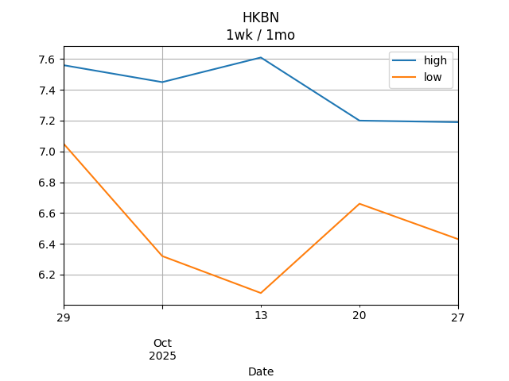
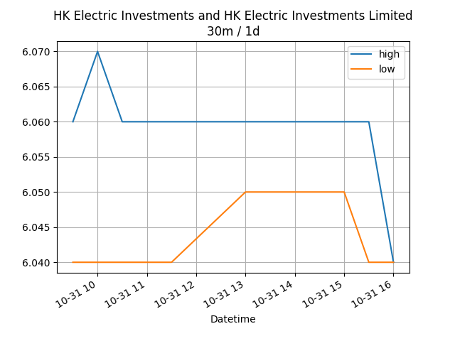

## Net Profit [📉]:
### $-877.00
|type|graph|data|
|:---:|:---:|:---:|
|30m / 1d||<table border="1" class="dataframe"> <thead> <tr style="text-align: center;"> <th>Datetime</th> <th>profit</th> </tr> </thead> <tbody> <tr> <td>09:30</td> <td>-1712.0</td> </tr> <tr> <td>10:00</td> <td>-1712.0</td> </tr> </tbody></table>|
|1d / 5d||<table border="1" class="dataframe"> <thead> <tr style="text-align: center;"> <th>Date</th> <th>profit</th> </tr> </thead> <tbody> <tr> <td>2025-09-12</td> <td>-2906.09</td> </tr> <tr> <td>2025-09-15</td> <td>-2887.00</td> </tr> <tr> <td>2025-09-16</td> <td>-2947.00</td> </tr> <tr> <td>2025-09-17</td> <td>-2697.00</td> </tr> <tr> <td>2025-09-18</td> <td>-967.00</td> </tr> </tbody></table>|
|1wk / 1mo||<table border="1" class="dataframe"> <thead> <tr style="text-align: center;"> <th>Date</th> <th>profit</th> </tr> </thead> <tbody> <tr> <td>2025-08-18</td> <td>-3269.28</td> </tr> <tr> <td>2025-08-25</td> <td>-3350.45</td> </tr> <tr> <td>2025-09-01</td> <td>-3074.57</td> </tr> <tr> <td>2025-09-08</td> <td>-2906.09</td> </tr> <tr> <td>2025-09-15</td> <td>-1097.00</td> </tr> </tbody></table>|
---
## 0573.HK [📉] [$-472.00] [-25.21%]:
#### TAO HEUNG HLDGS
|price|profit|data|
|:---:|:---:|:---:|
|||<table border="1" class="dataframe"> <thead> <tr style="text-align: center;"> <th>Datetime</th> <th>profit</th> </tr> </thead> <tbody> <tr> <td>09:30</td> <td>-472.0</td> </tr> <tr> <td>10:00</td> <td>-472.0</td> </tr> </tbody></table>|
|||<table border="1" class="dataframe"> <thead> <tr style="text-align: center;"> <th>Date</th> <th>profit</th> </tr> </thead> <tbody> <tr> <td>2025-09-12</td> <td>-552.0</td> </tr> <tr> <td>2025-09-15</td> <td>-512.0</td> </tr> <tr> <td>2025-09-16</td> <td>-492.0</td> </tr> <tr> <td>2025-09-17</td> <td>-412.0</td> </tr> <tr> <td>2025-09-18</td> <td>-472.0</td> </tr> </tbody></table>|
|||<table border="1" class="dataframe"> <thead> <tr style="text-align: center;"> <th>Date</th> <th>profit</th> </tr> </thead> <tbody> <tr> <td>2025-08-18</td> <td>-692.0</td> </tr> <tr> <td>2025-08-25</td> <td>-672.0</td> </tr> <tr> <td>2025-09-01</td> <td>-532.0</td> </tr> <tr> <td>2025-09-08</td> <td>-552.0</td> </tr> <tr> <td>2025-09-15</td> <td>-472.0</td> </tr> </tbody></table>|
---
## 0560.HK [📉] [$-16.00] [-0.50%]:
#### CHU KONG SHIP
|price|profit|data|
|:---:|:---:|:---:|
|||<table border="1" class="dataframe"> <thead> <tr style="text-align: center;"> <th>Datetime</th> <th>profit</th> </tr> </thead> <tbody> <tr> <td>09:30</td> <td>-16.0</td> </tr> </tbody></table>|
|||<table border="1" class="dataframe"> <thead> <tr style="text-align: center;"> <th>Date</th> <th>profit</th> </tr> </thead> <tbody> <tr> <td>2025-09-12</td> <td>-56.0</td> </tr> <tr> <td>2025-09-15</td> <td>-96.0</td> </tr> <tr> <td>2025-09-16</td> <td>-136.0</td> </tr> <tr> <td>2025-09-17</td> <td>-96.0</td> </tr> <tr> <td>2025-09-18</td> <td>-16.0</td> </tr> </tbody></table>|
|||<table border="1" class="dataframe"> <thead> <tr style="text-align: center;"> <th>Date</th> <th>profit</th> </tr> </thead> <tbody> <tr> <td>2025-08-18</td> <td>-56.0</td> </tr> <tr> <td>2025-08-25</td> <td>-96.0</td> </tr> <tr> <td>2025-09-01</td> <td>-136.0</td> </tr> <tr> <td>2025-09-08</td> <td>-56.0</td> </tr> <tr> <td>2025-09-15</td> <td>-16.0</td> </tr> </tbody></table>|
---
## 0709.HK [📉] [$-936.00] [-22.41%]:
#### GIORDANO INT'L
|price|profit|data|
|:---:|:---:|:---:|
|||<table border="1" class="dataframe"> <thead> <tr style="text-align: center;"> <th>Datetime</th> <th>profit</th> </tr> </thead> <tbody> <tr> <td>09:30</td> <td>-956.0</td> </tr> <tr> <td>10:00</td> <td>-936.0</td> </tr> </tbody></table>|
|||<table border="1" class="dataframe"> <thead> <tr style="text-align: center;"> <th>Date</th> <th>profit</th> </tr> </thead> <tbody> <tr> <td>2025-09-12</td> <td>-1045.09</td> </tr> <tr> <td>2025-09-15</td> <td>-1026.00</td> </tr> <tr> <td>2025-09-16</td> <td>-1056.00</td> </tr> <tr> <td>2025-09-17</td> <td>-976.00</td> </tr> <tr> <td>2025-09-18</td> <td>-936.00</td> </tr> </tbody></table>|
|||<table border="1" class="dataframe"> <thead> <tr style="text-align: center;"> <th>Date</th> <th>profit</th> </tr> </thead> <tbody> <tr> <td>2025-08-18</td> <td>-1293.27</td> </tr> <tr> <td>2025-08-25</td> <td>-1197.82</td> </tr> <tr> <td>2025-09-01</td> <td>-1064.18</td> </tr> <tr> <td>2025-09-08</td> <td>-1045.09</td> </tr> <tr> <td>2025-09-15</td> <td>-936.00</td> </tr> </tbody></table>|
---
## 1310.HK [📈] [$1411.00] [48.34%]:
#### HKBN
|price|profit|data|
|:---:|:---:|:---:|
|||<table border="1" class="dataframe"> <thead> <tr style="text-align: center;"> <th>Datetime</th> <th>profit</th> </tr> </thead> <tbody> <tr> <td>09:30</td> <td>596.0</td> </tr> <tr> <td>10:00</td> <td>1411.0</td> </tr> </tbody></table>|
|||<table border="1" class="dataframe"> <thead> <tr style="text-align: center;"> <th>Date</th> <th>profit</th> </tr> </thead> <tbody> <tr> <td>2025-09-12</td> <td>-379.0</td> </tr> <tr> <td>2025-09-15</td> <td>-379.0</td> </tr> <tr> <td>2025-09-16</td> <td>-384.0</td> </tr> <tr> <td>2025-09-17</td> <td>-359.0</td> </tr> <tr> <td>2025-09-18</td> <td>1331.0</td> </tr> </tbody></table>|
|||<table border="1" class="dataframe"> <thead> <tr style="text-align: center;"> <th>Date</th> <th>profit</th> </tr> </thead> <tbody> <tr> <td>2025-08-18</td> <td>-384.0</td> </tr> <tr> <td>2025-08-25</td> <td>-394.0</td> </tr> <tr> <td>2025-09-01</td> <td>-369.0</td> </tr> <tr> <td>2025-09-08</td> <td>-379.0</td> </tr> <tr> <td>2025-09-15</td> <td>1201.0</td> </tr> </tbody></table>|
---
## 2638.HK [📈] [$201.00] [7.06%]:
#### HK Electric Investments and HK Electric Investments Limited
|price|profit|data|
|:---:|:---:|:---:|
|||<table border="1" class="dataframe"> <thead> <tr style="text-align: center;"> <th>Datetime</th> <th>profit</th> </tr> </thead> <tbody> <tr> <td>09:30</td> <td>201.0</td> </tr> <tr> <td>10:00</td> <td>201.0</td> </tr> </tbody></table>|
|||<table border="1" class="dataframe"> <thead> <tr style="text-align: center;"> <th>Date</th> <th>profit</th> </tr> </thead> <tbody> <tr> <td>2025-09-12</td> <td>221.0</td> </tr> <tr> <td>2025-09-15</td> <td>221.0</td> </tr> <tr> <td>2025-09-16</td> <td>216.0</td> </tr> <tr> <td>2025-09-17</td> <td>211.0</td> </tr> <tr> <td>2025-09-18</td> <td>191.0</td> </tr> </tbody></table>|
|||<table border="1" class="dataframe"> <thead> <tr style="text-align: center;"> <th>Date</th> <th>profit</th> </tr> </thead> <tbody> <tr> <td>2025-08-18</td> <td>191.30</td> </tr> <tr> <td>2025-08-25</td> <td>74.37</td> </tr> <tr> <td>2025-09-01</td> <td>151.00</td> </tr> <tr> <td>2025-09-08</td> <td>221.00</td> </tr> <tr> <td>2025-09-15</td> <td>191.00</td> </tr> </tbody></table>|
---
## 0533.HK [📉] [$-1065.00] [-26.79%]:
#### GOLDLION HOLD
|price|profit|data|
|:---:|:---:|:---:|
|||<table border="1" class="dataframe"> <thead> <tr style="text-align: center;"> <th>Datetime</th> <th>profit</th> </tr> </thead> <tbody> <tr> <td>09:30</td> <td>-1065.0</td> </tr> </tbody></table>|
|||<table border="1" class="dataframe"> <thead> <tr style="text-align: center;"> <th>Date</th> <th>profit</th> </tr> </thead> <tbody> <tr> <td>2025-09-12</td> <td>-1095.0</td> </tr> <tr> <td>2025-09-15</td> <td>-1095.0</td> </tr> <tr> <td>2025-09-16</td> <td>-1095.0</td> </tr> <tr> <td>2025-09-17</td> <td>-1065.0</td> </tr> <tr> <td>2025-09-18</td> <td>-1065.0</td> </tr> </tbody></table>|
|||<table border="1" class="dataframe"> <thead> <tr style="text-align: center;"> <th>Date</th> <th>profit</th> </tr> </thead> <tbody> <tr> <td>2025-08-18</td> <td>-1035.31</td> </tr> <tr> <td>2025-08-25</td> <td>-1065.00</td> </tr> <tr> <td>2025-09-01</td> <td>-1124.39</td> </tr> <tr> <td>2025-09-08</td> <td>-1095.00</td> </tr> <tr> <td>2025-09-15</td> <td>-1065.00</td> </tr> </tbody></table>|
---
