## Net Profit [📈]:
### $4256.60
|type|graph|data|
|:---:|:---:|:---:|
|30m / 1d|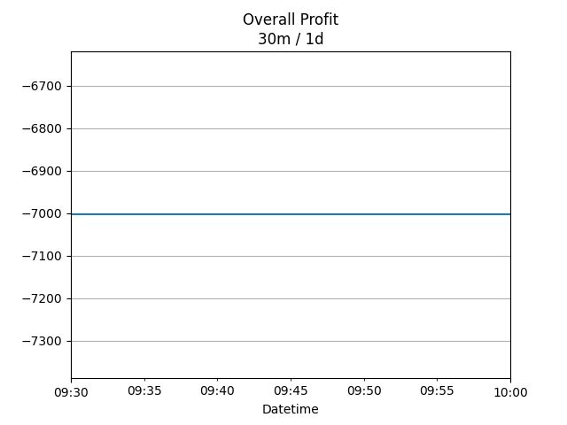|<table border="1" class="dataframe"> <thead> <tr style="text-align: center;"> <th>Datetime</th> <th>profit</th> </tr> </thead> <tbody> <tr> <td>01:30</td> <td>4056.6</td> </tr> <tr> <td>02:00</td> <td>4296.6</td> </tr> <tr> <td>02:30</td> <td>4170.6</td> </tr> <tr> <td>03:00</td> <td>4070.6</td> </tr> <tr> <td>03:30</td> <td>4132.6</td> </tr> <tr> <td>04:00</td> <td>4132.6</td> </tr> <tr> <td>04:30</td> <td>4132.6</td> </tr> <tr> <td>05:00</td> <td>4004.6</td> </tr> <tr> <td>05:30</td> <td>4156.6</td> </tr> <tr> <td>06:00</td> <td>4256.6</td> </tr> </tbody></table>|
|1d / 5d|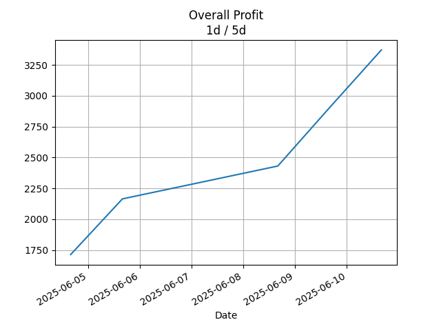|<table border="1" class="dataframe"> <thead> <tr style="text-align: center;"> <th>Date</th> <th>profit</th> </tr> </thead> <tbody> <tr> <td>2025-09-21</td> <td>4468.6</td> </tr> <tr> <td>2025-09-22</td> <td>4028.6</td> </tr> <tr> <td>2025-09-23</td> <td>5050.6</td> </tr> <tr> <td>2025-09-24</td> <td>4156.6</td> </tr> <tr> <td>2025-09-25</td> <td>4256.6</td> </tr> </tbody></table>|
|1wk / 1mo|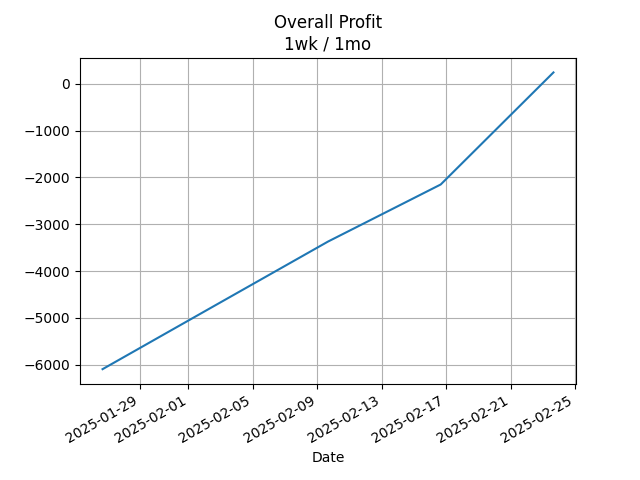|<table border="1" class="dataframe"> <thead> <tr style="text-align: center;"> <th>Date</th> <th>profit</th> </tr> </thead> <tbody> <tr> <td>2025-08-24</td> <td>-426.28</td> </tr> <tr> <td>2025-08-31</td> <td>722.60</td> </tr> <tr> <td>2025-09-07</td> <td>4062.60</td> </tr> <tr> <td>2025-09-14</td> <td>5524.60</td> </tr> <tr> <td>2025-09-21</td> <td>4256.60</td> </tr> </tbody></table>|
---
## 002100.SZ [📉] [$-1493.40] [-4.94%]:
#### TECON BIOLOGY Co.LTD
|price|profit|data|
|:---:|:---:|:---:|
|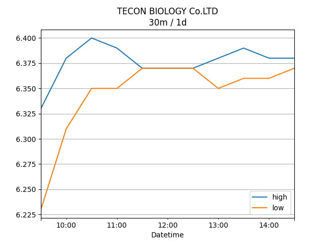|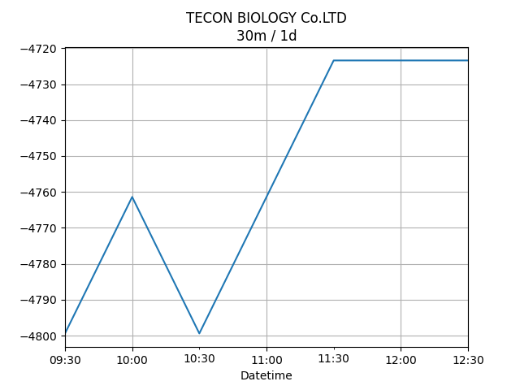|<table border="1" class="dataframe"> <thead> <tr style="text-align: center;"> <th>Datetime</th> <th>profit</th> </tr> </thead> <tbody> <tr> <td>09:30</td> <td>-1493.4</td> </tr> <tr> <td>10:00</td> <td>-1303.4</td> </tr> <tr> <td>10:30</td> <td>-1379.4</td> </tr> <tr> <td>11:00</td> <td>-1379.4</td> </tr> <tr> <td>11:30</td> <td>-1417.4</td> </tr> <tr> <td>12:00</td> <td>-1417.4</td> </tr> <tr> <td>12:30</td> <td>-1417.4</td> </tr> <tr> <td>13:00</td> <td>-1645.4</td> </tr> <tr> <td>13:30</td> <td>-1493.4</td> </tr> <tr> <td>14:00</td> <td>-1493.4</td> </tr> </tbody></table>|
|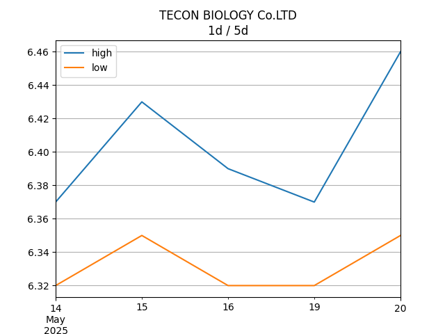|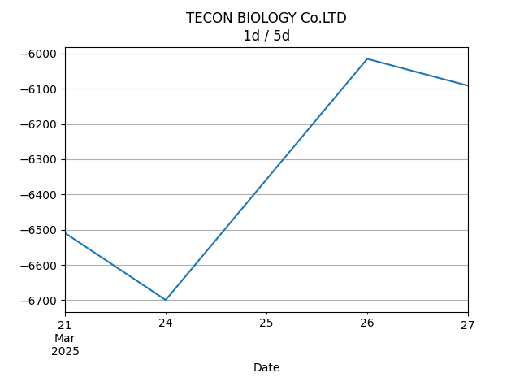|<table border="1" class="dataframe"> <thead> <tr style="text-align: center;"> <th>Date</th> <th>profit</th> </tr> </thead> <tbody> <tr> <td>2025-09-22</td> <td>-1531.4</td> </tr> <tr> <td>2025-09-23</td> <td>-1721.4</td> </tr> <tr> <td>2025-09-24</td> <td>-999.4</td> </tr> <tr> <td>2025-09-25</td> <td>-1493.4</td> </tr> <tr> <td>2025-09-26</td> <td>-1493.4</td> </tr> </tbody></table>|
|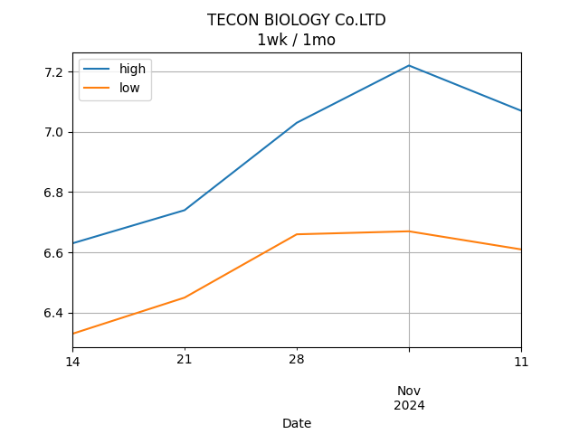|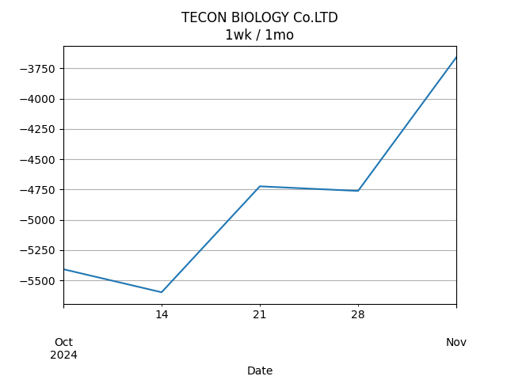|<table border="1" class="dataframe"> <thead> <tr style="text-align: center;"> <th>Date</th> <th>profit</th> </tr> </thead> <tbody> <tr> <td>2025-08-25</td> <td>-5065.4</td> </tr> <tr> <td>2025-09-01</td> <td>-5027.4</td> </tr> <tr> <td>2025-09-08</td> <td>-1987.4</td> </tr> <tr> <td>2025-09-15</td> <td>-1075.4</td> </tr> <tr> <td>2025-09-22</td> <td>-1493.4</td> </tr> </tbody></table>|
---
## 0066.HK [📈] [$5750.00] [9.54%]:
#### MTR CORPORATION
|price|profit|data|
|:---:|:---:|:---:|
|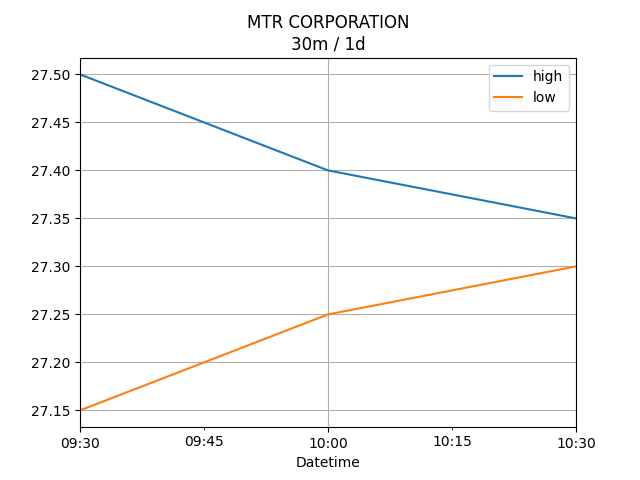|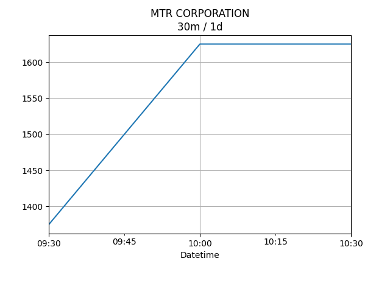|<table border="1" class="dataframe"> <thead> <tr style="text-align: center;"> <th>Datetime</th> <th>profit</th> </tr> </thead> <tbody> <tr> <td>09:30</td> <td>5550.0</td> </tr> <tr> <td>10:00</td> <td>5600.0</td> </tr> <tr> <td>10:30</td> <td>5550.0</td> </tr> <tr> <td>11:00</td> <td>5450.0</td> </tr> <tr> <td>11:30</td> <td>5550.0</td> </tr> <tr> <td>13:00</td> <td>5650.0</td> </tr> <tr> <td>13:30</td> <td>5650.0</td> </tr> <tr> <td>14:00</td> <td>5750.0</td> </tr> </tbody></table>|
|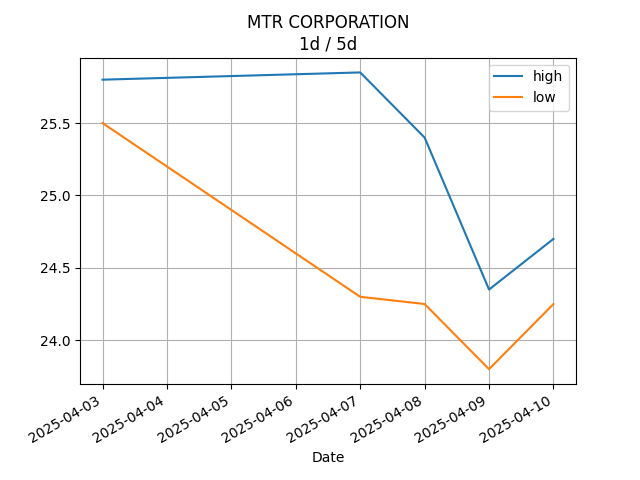||<table border="1" class="dataframe"> <thead> <tr style="text-align: center;"> <th>Date</th> <th>profit</th> </tr> </thead> <tbody> <tr> <td>2025-09-22</td> <td>6000.0</td> </tr> <tr> <td>2025-09-23</td> <td>5750.0</td> </tr> <tr> <td>2025-09-24</td> <td>6050.0</td> </tr> <tr> <td>2025-09-25</td> <td>5650.0</td> </tr> <tr> <td>2025-09-26</td> <td>5750.0</td> </tr> </tbody></table>|
|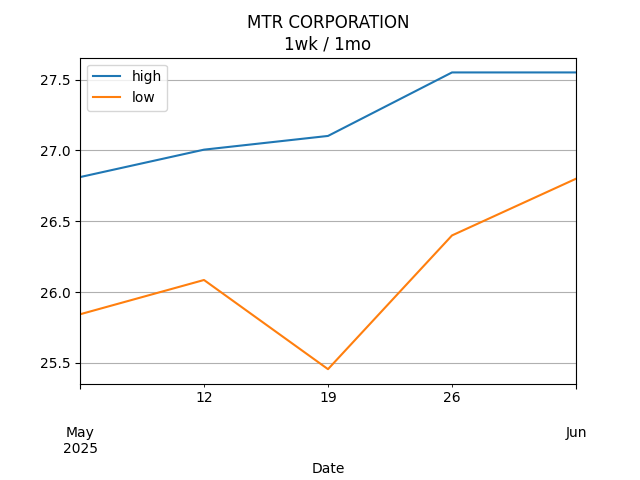|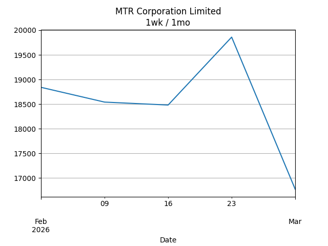|<table border="1" class="dataframe"> <thead> <tr style="text-align: center;"> <th>Date</th> <th>profit</th> </tr> </thead> <tbody> <tr> <td>2025-08-25</td> <td>4639.12</td> </tr> <tr> <td>2025-09-01</td> <td>5750.00</td> </tr> <tr> <td>2025-09-08</td> <td>6050.00</td> </tr> <tr> <td>2025-09-15</td> <td>6600.00</td> </tr> <tr> <td>2025-09-22</td> <td>5750.00</td> </tr> </tbody></table>|
---
