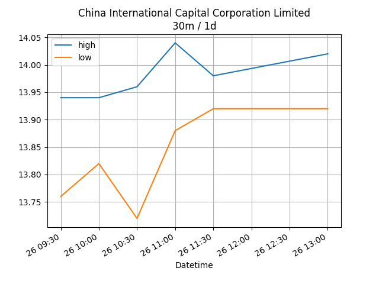
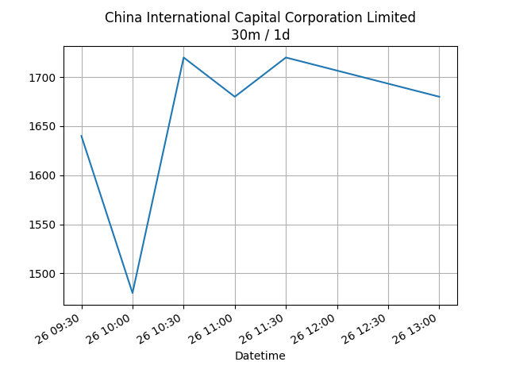
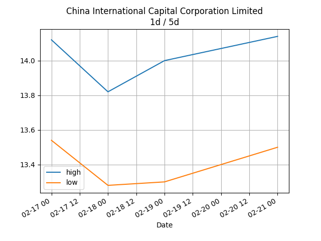
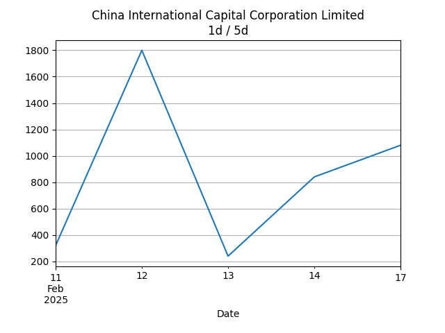
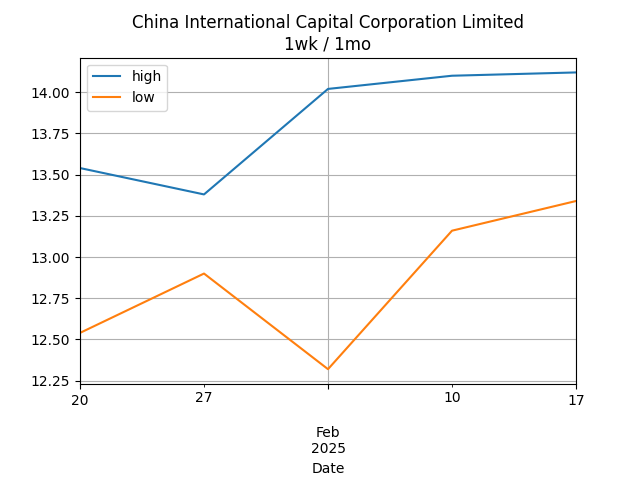
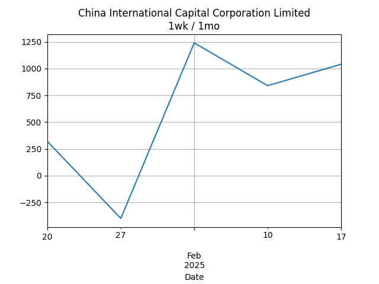

## Net Profit [📉]:
### $-3860.40
|type|graph|data|
|:---:|:---:|:---:|
|30m / 1d||<table border="1" class="dataframe"> <thead> <tr style="text-align: center;"> <th>Datetime</th> <th>profit</th> </tr> </thead> <tbody> <tr> <td>01:30</td> <td>-4191.4</td> </tr> <tr> <td>02:00</td> <td>-4267.4</td> </tr> <tr> <td>02:30</td> <td>-4018.4</td> </tr> <tr> <td>03:00</td> <td>-3735.4</td> </tr> <tr> <td>03:30</td> <td>-3735.4</td> </tr> <tr> <td>04:00</td> <td>-3735.4</td> </tr> <tr> <td>04:30</td> <td>-3735.4</td> </tr> <tr> <td>05:00</td> <td>-3735.4</td> </tr> <tr> <td>05:30</td> <td>-4350.4</td> </tr> <tr> <td>06:00</td> <td>-3978.4</td> </tr> <tr> <td>06:30</td> <td>-3940.4</td> </tr> <tr> <td>07:00</td> <td>-3940.4</td> </tr> </tbody></table>|
|1d / 5d||<table border="1" class="dataframe"> <thead> <tr style="text-align: center;"> <th>Date</th> <th>profit</th> </tr> </thead> <tbody> <tr> <td>2025-02-09</td> <td>-4297.4</td> </tr> <tr> <td>2025-02-10</td> <td>-5993.4</td> </tr> <tr> <td>2025-02-11</td> <td>-3475.4</td> </tr> <tr> <td>2025-02-12</td> <td>-4693.4</td> </tr> <tr> <td>2025-02-13</td> <td>-3860.4</td> </tr> </tbody></table>|
|1wk / 1mo||<table border="1" class="dataframe"> <thead> <tr style="text-align: center;"> <th>Date</th> <th>profit</th> </tr> </thead> <tbody> <tr> <td>2025-01-12</td> <td>-7563.4</td> </tr> <tr> <td>2025-01-19</td> <td>-5912.4</td> </tr> <tr> <td>2025-01-26</td> <td>-6094.4</td> </tr> <tr> <td>2025-02-02</td> <td>-4731.4</td> </tr> <tr> <td>2025-02-09</td> <td>-3860.4</td> </tr> </tbody></table>|
---
## 002100.SZ [📉] [$-6585.40] [-21.76%]:
#### TECON BIOLOGY Co.LTD
|price|profit|data|
|:---:|:---:|:---:|
|||<table border="1" class="dataframe"> <thead> <tr style="text-align: center;"> <th>Datetime</th> <th>profit</th> </tr> </thead> <tbody> <tr> <td>09:30</td> <td>-6471.4</td> </tr> <tr> <td>10:00</td> <td>-6547.4</td> </tr> <tr> <td>10:30</td> <td>-6623.4</td> </tr> <tr> <td>11:00</td> <td>-6585.4</td> </tr> <tr> <td>11:30</td> <td>-6585.4</td> </tr> <tr> <td>12:00</td> <td>-6585.4</td> </tr> <tr> <td>12:30</td> <td>-6585.4</td> </tr> <tr> <td>13:00</td> <td>-6585.4</td> </tr> <tr> <td>13:30</td> <td>-6585.4</td> </tr> <tr> <td>14:00</td> <td>-6623.4</td> </tr> <tr> <td>14:30</td> <td>-6585.4</td> </tr> </tbody></table>|
|||<table border="1" class="dataframe"> <thead> <tr style="text-align: center;"> <th>Date</th> <th>profit</th> </tr> </thead> <tbody> <tr> <td>2025-02-10</td> <td>-6547.4</td> </tr> <tr> <td>2025-02-11</td> <td>-6813.4</td> </tr> <tr> <td>2025-02-12</td> <td>-6775.4</td> </tr> <tr> <td>2025-02-13</td> <td>-6433.4</td> </tr> <tr> <td>2025-02-14</td> <td>-6585.4</td> </tr> </tbody></table>|
|||<table border="1" class="dataframe"> <thead> <tr style="text-align: center;"> <th>Date</th> <th>profit</th> </tr> </thead> <tbody> <tr> <td>2025-01-13</td> <td>-6623.4</td> </tr> <tr> <td>2025-01-20</td> <td>-6357.4</td> </tr> <tr> <td>2025-01-27</td> <td>-6319.4</td> </tr> <tr> <td>2025-02-03</td> <td>-6471.4</td> </tr> <tr> <td>2025-02-10</td> <td>-6585.4</td> </tr> </tbody></table>|
---
## 0066.HK [📈] [$2125.00] [3.53%]:
#### MTR CORPORATION
|price|profit|data|
|:---:|:---:|:---:|
|||<table border="1" class="dataframe"> <thead> <tr style="text-align: center;"> <th>Datetime</th> <th>profit</th> </tr> </thead> <tbody> <tr> <td>09:30</td> <td>2000.0</td> </tr> <tr> <td>10:00</td> <td>2000.0</td> </tr> <tr> <td>10:30</td> <td>2125.0</td> </tr> <tr> <td>11:00</td> <td>2250.0</td> </tr> <tr> <td>11:30</td> <td>2250.0</td> </tr> <tr> <td>13:00</td> <td>2250.0</td> </tr> <tr> <td>13:30</td> <td>1875.0</td> </tr> <tr> <td>14:00</td> <td>2125.0</td> </tr> <tr> <td>14:30</td> <td>2125.0</td> </tr> <tr> <td>15:00</td> <td>2125.0</td> </tr> </tbody></table>|
|||<table border="1" class="dataframe"> <thead> <tr style="text-align: center;"> <th>Date</th> <th>profit</th> </tr> </thead> <tbody> <tr> <td>2025-02-10</td> <td>1250.0</td> </tr> <tr> <td>2025-02-11</td> <td>500.0</td> </tr> <tr> <td>2025-02-12</td> <td>1500.0</td> </tr> <tr> <td>2025-02-13</td> <td>1500.0</td> </tr> <tr> <td>2025-02-14</td> <td>2125.0</td> </tr> </tbody></table>|
|||<table border="1" class="dataframe"> <thead> <tr style="text-align: center;"> <th>Date</th> <th>profit</th> </tr> </thead> <tbody> <tr> <td>2025-01-13</td> <td>500.0</td> </tr> <tr> <td>2025-01-20</td> <td>125.0</td> </tr> <tr> <td>2025-01-27</td> <td>625.0</td> </tr> <tr> <td>2025-02-03</td> <td>500.0</td> </tr> <tr> <td>2025-02-10</td> <td>2125.0</td> </tr> </tbody></table>|
---
## 3908.HK [📈] [$600.00] [2.29%]:
#### China International Capital Corporation Limited
|price|profit|data|
|:---:|:---:|:---:|
|||<table border="1" class="dataframe"> <thead> <tr style="text-align: center;"> <th>Datetime</th> <th>profit</th> </tr> </thead> <tbody> <tr> <td>09:30</td> <td>280.0</td> </tr> <tr> <td>10:00</td> <td>280.0</td> </tr> <tr> <td>10:30</td> <td>480.0</td> </tr> <tr> <td>11:00</td> <td>600.0</td> </tr> <tr> <td>11:30</td> <td>600.0</td> </tr> <tr> <td>13:00</td> <td>600.0</td> </tr> <tr> <td>13:30</td> <td>360.0</td> </tr> <tr> <td>14:00</td> <td>520.0</td> </tr> <tr> <td>14:30</td> <td>520.0</td> </tr> <tr> <td>15:00</td> <td>600.0</td> </tr> </tbody></table>|
|||<table border="1" class="dataframe"> <thead> <tr style="text-align: center;"> <th>Date</th> <th>profit</th> </tr> </thead> <tbody> <tr> <td>2025-02-10</td> <td>1000.0</td> </tr> <tr> <td>2025-02-11</td> <td>320.0</td> </tr> <tr> <td>2025-02-12</td> <td>1800.0</td> </tr> <tr> <td>2025-02-13</td> <td>240.0</td> </tr> <tr> <td>2025-02-14</td> <td>600.0</td> </tr> </tbody></table>|
|||<table border="1" class="dataframe"> <thead> <tr style="text-align: center;"> <th>Date</th> <th>profit</th> </tr> </thead> <tbody> <tr> <td>2025-01-13</td> <td>-1440.0</td> </tr> <tr> <td>2025-01-20</td> <td>320.0</td> </tr> <tr> <td>2025-01-27</td> <td>-400.0</td> </tr> <tr> <td>2025-02-03</td> <td>1240.0</td> </tr> <tr> <td>2025-02-10</td> <td>600.0</td> </tr> </tbody></table>|
---
