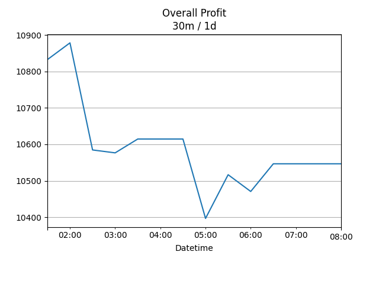
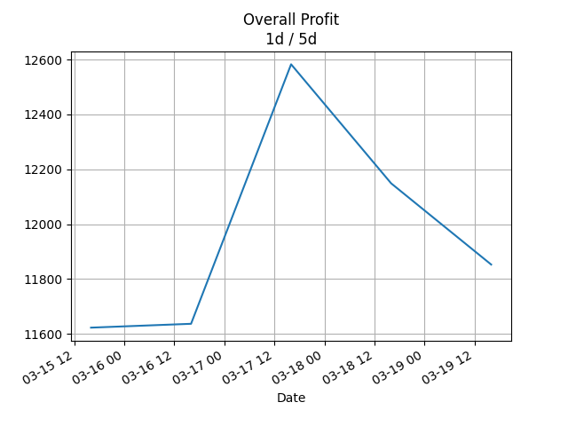
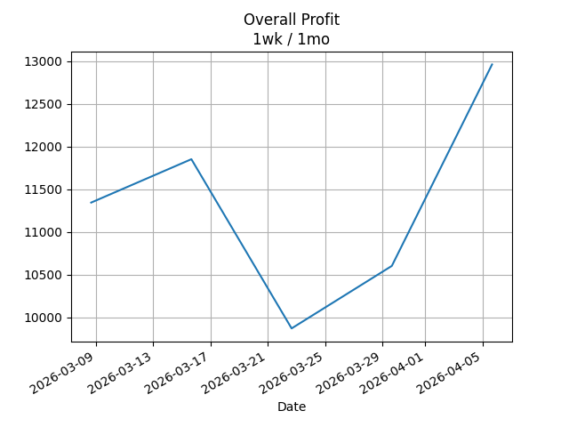
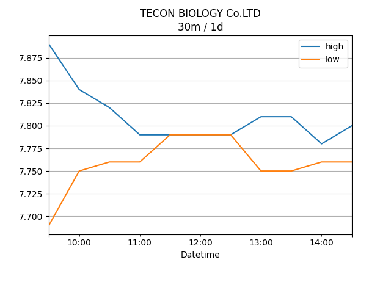
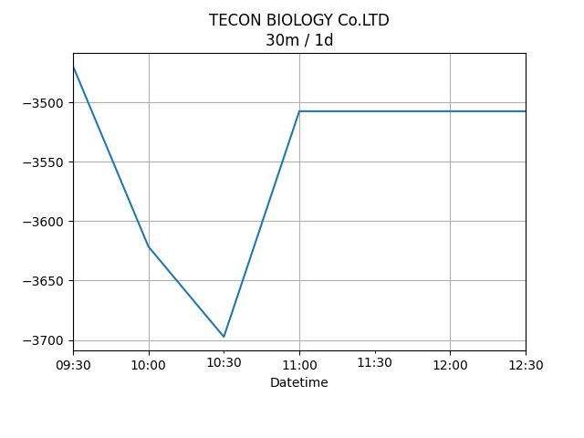
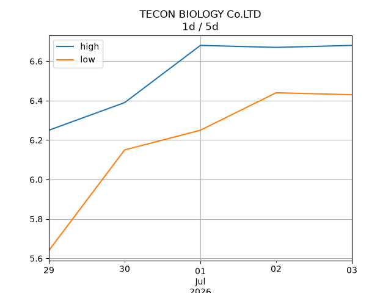
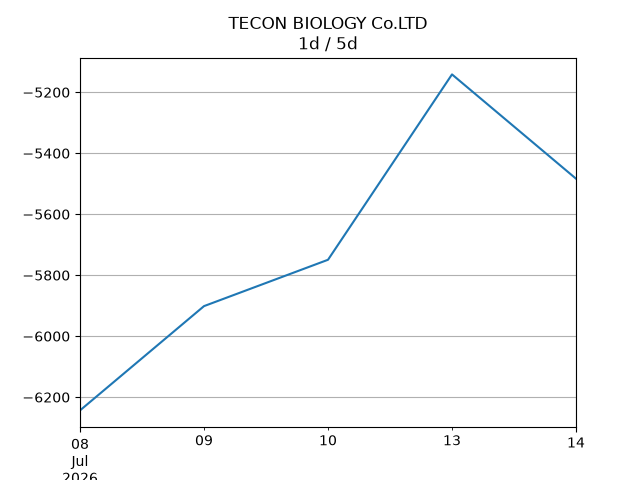
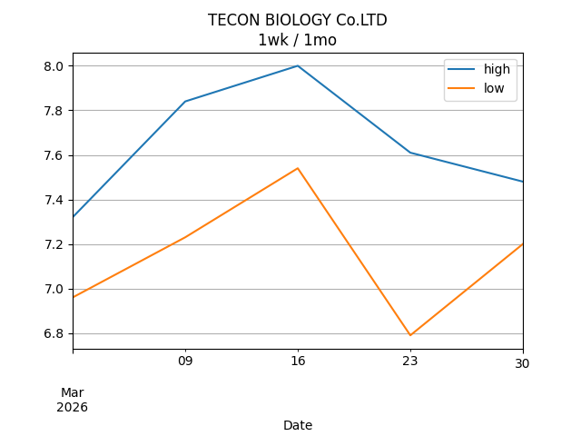
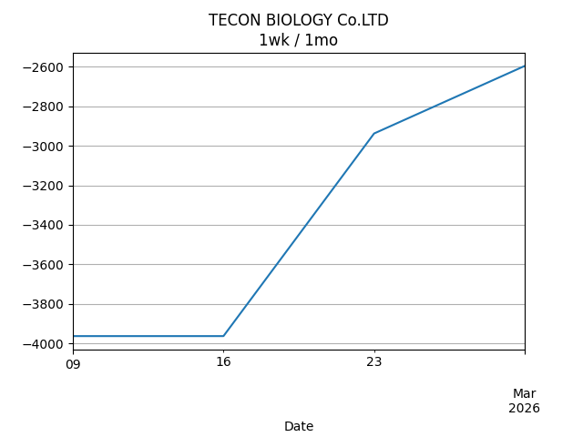

## Net Profit [📉]:
### $-5293.40
|type|graph|data|
|:---:|:---:|:---:|
|30m / 1d||<table border="1" class="dataframe"> <thead> <tr style="text-align: center;"> <th>Datetime</th> <th>profit</th> </tr> </thead> <tbody> <tr> <td>09:30</td> <td>-5293.4</td> </tr> </tbody></table>|
|1d / 5d||<table border="1" class="dataframe"> <thead> <tr style="text-align: center;"> <th>Date</th> <th>profit</th> </tr> </thead> <tbody> <tr> <td>2024-08-13</td> <td>-4267.4</td> </tr> <tr> <td>2024-08-14</td> <td>-4723.4</td> </tr> <tr> <td>2024-08-15</td> <td>-4761.4</td> </tr> <tr> <td>2024-08-16</td> <td>-5331.4</td> </tr> <tr> <td>2024-08-19</td> <td>-5331.4</td> </tr> </tbody></table>|
|1wk / 1mo||<table border="1" class="dataframe"> <thead> <tr style="text-align: center;"> <th>Date</th> <th>profit</th> </tr> </thead> <tbody> <tr> <td>2024-07-15</td> <td>-2975.4</td> </tr> <tr> <td>2024-07-22</td> <td>-5179.4</td> </tr> <tr> <td>2024-07-29</td> <td>-3393.4</td> </tr> <tr> <td>2024-08-05</td> <td>-4799.4</td> </tr> <tr> <td>2024-08-12</td> <td>-5331.4</td> </tr> <tr> <td>2024-08-19</td> <td>-5331.4</td> </tr> </tbody></table>|
---
## 002100.SZ [📉] [$-5293.40] [-17.49%]:
#### TECON BIOLOGY Co.LTD
|price|profit|data|
|:---:|:---:|:---:|
|||<table border="1" class="dataframe"> <thead> <tr style="text-align: center;"> <th>Datetime</th> <th>profit</th> </tr> </thead> <tbody> <tr> <td>09:30</td> <td>-5293.4</td> </tr> </tbody></table>|
|||<table border="1" class="dataframe"> <thead> <tr style="text-align: center;"> <th>Date</th> <th>profit</th> </tr> </thead> <tbody> <tr> <td>2024-08-13</td> <td>-4267.4</td> </tr> <tr> <td>2024-08-14</td> <td>-4723.4</td> </tr> <tr> <td>2024-08-15</td> <td>-4761.4</td> </tr> <tr> <td>2024-08-16</td> <td>-5331.4</td> </tr> <tr> <td>2024-08-19</td> <td>-5331.4</td> </tr> </tbody></table>|
|||<table border="1" class="dataframe"> <thead> <tr style="text-align: center;"> <th>Date</th> <th>profit</th> </tr> </thead> <tbody> <tr> <td>2024-07-15</td> <td>-2975.4</td> </tr> <tr> <td>2024-07-22</td> <td>-5179.4</td> </tr> <tr> <td>2024-07-29</td> <td>-3393.4</td> </tr> <tr> <td>2024-08-05</td> <td>-4799.4</td> </tr> <tr> <td>2024-08-12</td> <td>-5331.4</td> </tr> <tr> <td>2024-08-19</td> <td>-5331.4</td> </tr> </tbody></table>|
---
