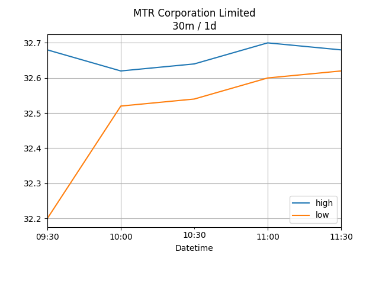
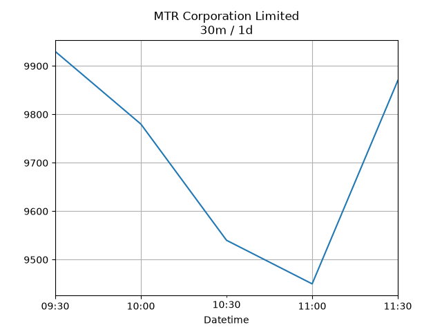
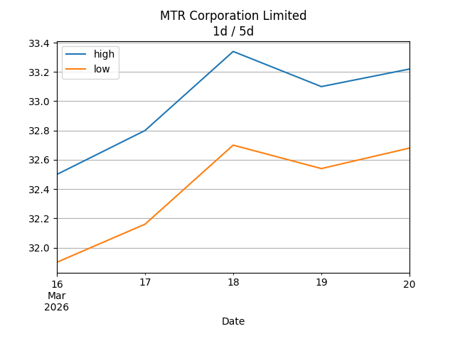
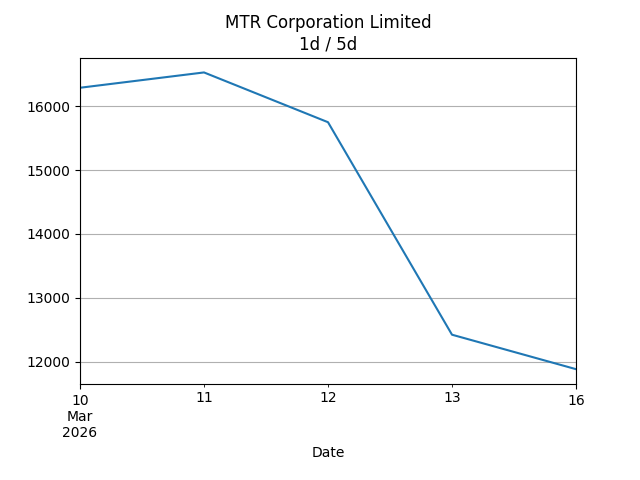
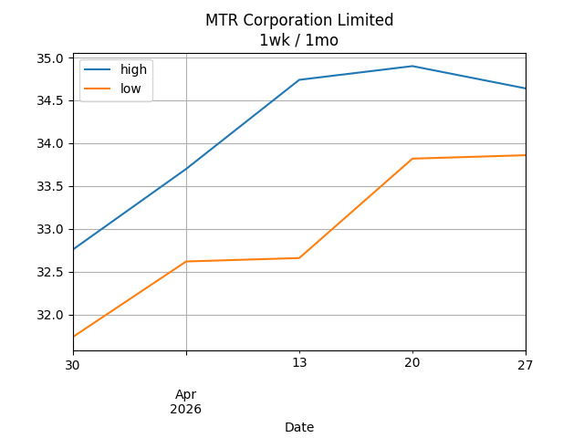
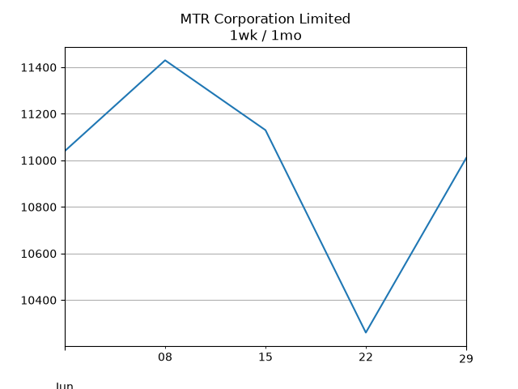

## Net Profit [📉]:
### $-4417.40
|type|graph|data|
|:---:|:---:|:---:|
|30m / 1d||<table border="1" class="dataframe"> <thead> <tr style="text-align: center;"> <th>Datetime</th> <th>profit</th> </tr> </thead> <tbody> <tr> <td>01:30</td> <td>-4080.4</td> </tr> <tr> <td>02:00</td> <td>-4417.4</td> </tr> </tbody></table>|
|1d / 5d||<table border="1" class="dataframe"> <thead> <tr style="text-align: center;"> <th>Date</th> <th>profit</th> </tr> </thead> <tbody> <tr> <td>2025-03-31</td> <td>-2558.4</td> </tr> <tr> <td>2025-04-01</td> <td>-1759.4</td> </tr> <tr> <td>2025-04-02</td> <td>-2015.4</td> </tr> <tr> <td>2025-04-06</td> <td>-4226.4</td> </tr> <tr> <td>2025-04-07</td> <td>-4417.4</td> </tr> </tbody></table>|
|1wk / 1mo||<table border="1" class="dataframe"> <thead> <tr style="text-align: center;"> <th>Date</th> <th>profit</th> </tr> </thead> <tbody> <tr> <td>2025-03-09</td> <td>-819.4</td> </tr> <tr> <td>2025-03-16</td> <td>-1009.4</td> </tr> <tr> <td>2025-03-23</td> <td>-1281.4</td> </tr> <tr> <td>2025-03-30</td> <td>-2015.4</td> </tr> <tr> <td>2025-04-06</td> <td>-4417.4</td> </tr> </tbody></table>|
---
## 002100.SZ [📉] [$-6167.40] [-20.38%]:
#### TECON BIOLOGY Co.LTD
|price|profit|data|
|:---:|:---:|:---:|
|||<table border="1" class="dataframe"> <thead> <tr style="text-align: center;"> <th>Datetime</th> <th>profit</th> </tr> </thead> <tbody> <tr> <td>09:30</td> <td>-6205.4</td> </tr> <tr> <td>10:00</td> <td>-6167.4</td> </tr> </tbody></table>|
|||<table border="1" class="dataframe"> <thead> <tr style="text-align: center;"> <th>Date</th> <th>profit</th> </tr> </thead> <tbody> <tr> <td>2025-04-01</td> <td>-6433.4</td> </tr> <tr> <td>2025-04-02</td> <td>-6509.4</td> </tr> <tr> <td>2025-04-03</td> <td>-6015.4</td> </tr> <tr> <td>2025-04-07</td> <td>-6851.4</td> </tr> <tr> <td>2025-04-08</td> <td>-6167.4</td> </tr> </tbody></table>|
|||<table border="1" class="dataframe"> <thead> <tr style="text-align: center;"> <th>Date</th> <th>profit</th> </tr> </thead> <tbody> <tr> <td>2025-03-10</td> <td>-6319.4</td> </tr> <tr> <td>2025-03-17</td> <td>-6509.4</td> </tr> <tr> <td>2025-03-24</td> <td>-6281.4</td> </tr> <tr> <td>2025-03-31</td> <td>-6015.4</td> </tr> <tr> <td>2025-04-07</td> <td>-6167.4</td> </tr> </tbody></table>|
---
## 0066.HK [📈] [$1750.00] [2.90%]:
#### MTR CORPORATION
|price|profit|data|
|:---:|:---:|:---:|
|||<table border="1" class="dataframe"> <thead> <tr style="text-align: center;"> <th>Datetime</th> <th>profit</th> </tr> </thead> <tbody> <tr> <td>09:30</td> <td>2125.0</td> </tr> <tr> <td>10:00</td> <td>1750.0</td> </tr> </tbody></table>|
|||<table border="1" class="dataframe"> <thead> <tr style="text-align: center;"> <th>Date</th> <th>profit</th> </tr> </thead> <tbody> <tr> <td>2025-04-01</td> <td>3875.0</td> </tr> <tr> <td>2025-04-02</td> <td>4750.0</td> </tr> <tr> <td>2025-04-03</td> <td>4000.0</td> </tr> <tr> <td>2025-04-07</td> <td>2625.0</td> </tr> <tr> <td>2025-04-08</td> <td>1750.0</td> </tr> </tbody></table>|
|||<table border="1" class="dataframe"> <thead> <tr style="text-align: center;"> <th>Date</th> <th>profit</th> </tr> </thead> <tbody> <tr> <td>2025-03-10</td> <td>5500.0</td> </tr> <tr> <td>2025-03-17</td> <td>5500.0</td> </tr> <tr> <td>2025-03-24</td> <td>5000.0</td> </tr> <tr> <td>2025-03-31</td> <td>4000.0</td> </tr> <tr> <td>2025-04-07</td> <td>1750.0</td> </tr> </tbody></table>|
---
