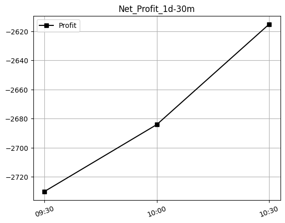
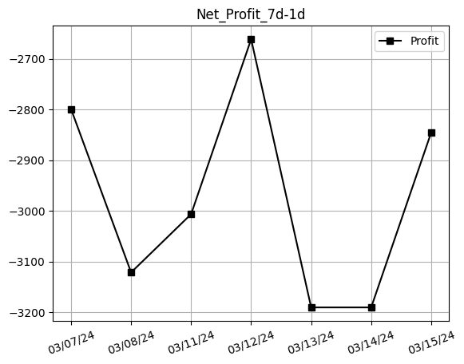
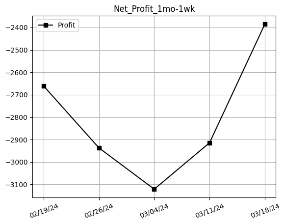
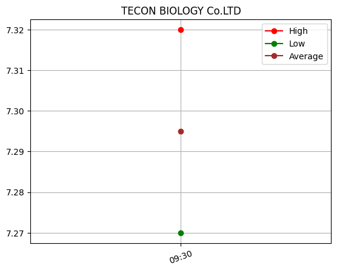
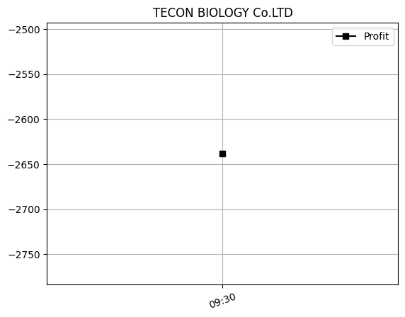
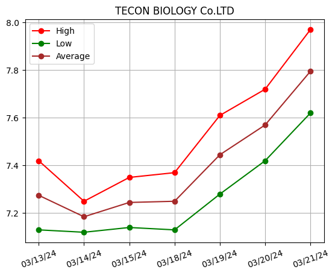
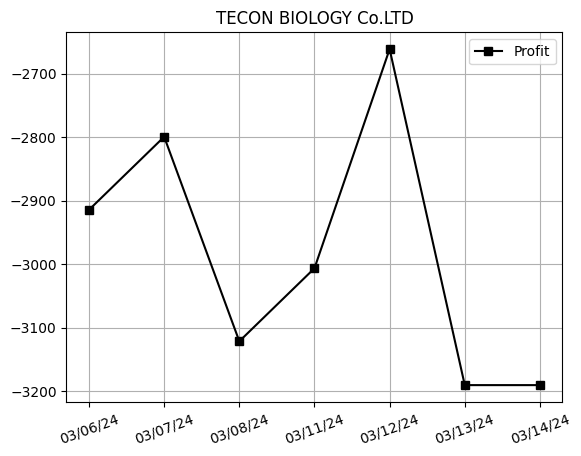
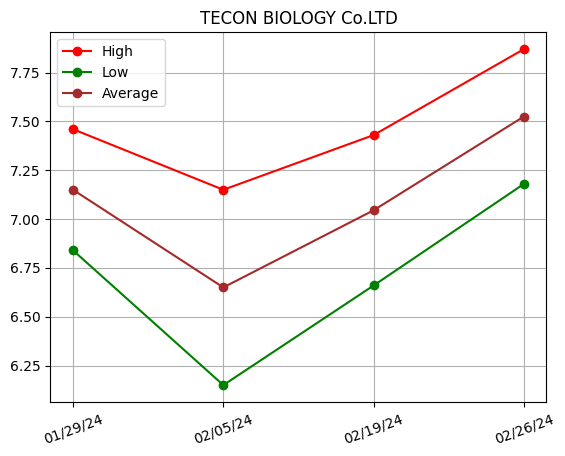
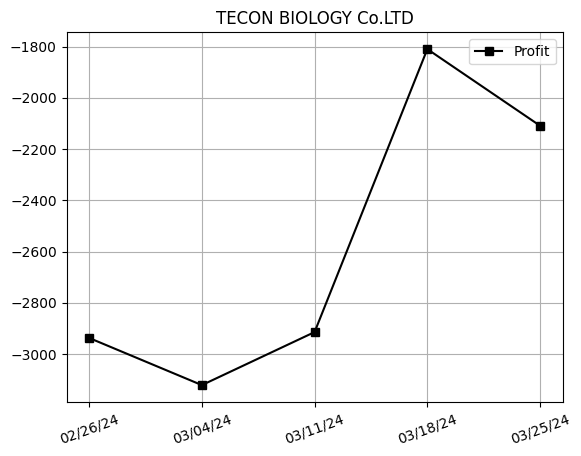

## Net Profit [📉]:
### $-2845.10
|type|graph|data|
|:---:|:---:|:---:|
|1d / 30m||<table border="1" class="dataframe"> <thead> <tr style="text-align: right;"> <th>Datetime</th> <th>Profit</th> </tr> </thead> <tbody> <tr> <td>09:30</td> <td>-3190.10</td> </tr> <tr> <td>10:00</td> <td>-3236.10</td> </tr> <tr> <td>10:30</td> <td>-3213.10</td> </tr> <tr> <td>11:00</td> <td>-2868.10</td> </tr> <tr> <td>11:30</td> <td>-2845.10</td> </tr> <tr> <td>12:00</td> <td>-2845.10</td> </tr> <tr> <td>12:30</td> <td>-2845.10</td> </tr> </tbody></table>
|7d / 1d||<table border="1" class="dataframe"> <thead> <tr style="text-align: right;"> <th>Date</th> <th>Profit</th> </tr> </thead> <tbody> <tr> <td>03/08/24</td> <td>-3121.10</td> </tr> <tr> <td>03/11/24</td> <td>-3006.10</td> </tr> <tr> <td>03/12/24</td> <td>-2661.10</td> </tr> <tr> <td>03/13/24</td> <td>-3190.10</td> </tr> <tr> <td>03/14/24</td> <td>-3190.10</td> </tr> <tr> <td>03/15/24</td> <td>-2914.10</td> </tr> <tr> <td>03/18/24</td> <td>-2845.10</td> </tr> </tbody></table>
|1mo / 1wk||<table border="1" class="dataframe"> <thead> <tr style="text-align: right;"> <th>Date</th> <th>Profit</th> </tr> </thead> <tbody> <tr> <td>02/19/24</td> <td>-2661.10</td> </tr> <tr> <td>02/26/24</td> <td>-2937.10</td> </tr> <tr> <td>03/04/24</td> <td>-3121.10</td> </tr> <tr> <td>03/11/24</td> <td>-2914.10</td> </tr> <tr> <td>03/18/24</td> <td>-2845.10</td> </tr> </tbody></table>
---
## 002100.SZ [📉] [$-2845.10] [-14.46%]:
#### TECON BIOLOGY Co.LTD
|price|profit|data|
|:---:|:---:|:---:|
|||<table border="1" class="dataframe"> <thead> <tr style="text-align: right;"> <th>Datetime</th> <th>Profit</th> </tr> </thead> <tbody> <tr> <td>09:30</td> <td>-3190.10</td> </tr> <tr> <td>10:00</td> <td>-3236.10</td> </tr> <tr> <td>10:30</td> <td>-3213.10</td> </tr> <tr> <td>11:00</td> <td>-2868.10</td> </tr> <tr> <td>11:30</td> <td>-2845.10</td> </tr> <tr> <td>12:00</td> <td>-2845.10</td> </tr> <tr> <td>12:30</td> <td>-2845.10</td> </tr> </tbody></table>|
||<table border="1" class="dataframe"> <thead> <tr style="text-align: right;"> <th>Date</th> <th>Profit</th> </tr> </thead> <tbody> <tr> <td>03/08/24</td> <td>-3121.10</td> </tr> <tr> <td>03/11/24</td> <td>-3006.10</td> </tr> <tr> <td>03/12/24</td> <td>-2661.10</td> </tr> <tr> <td>03/13/24</td> <td>-3190.10</td> </tr> <tr> <td>03/14/24</td> <td>-3190.10</td> </tr> <tr> <td>03/15/24</td> <td>-2914.10</td> </tr> <tr> <td>03/18/24</td> <td>-2845.10</td> </tr> </tbody></table>|
||<table border="1" class="dataframe"> <thead> <tr style="text-align: right;"> <th>Date</th> <th>Profit</th> </tr> </thead> <tbody> <tr> <td>02/19/24</td> <td>-2661.10</td> </tr> <tr> <td>02/26/24</td> <td>-2937.10</td> </tr> <tr> <td>03/04/24</td> <td>-3121.10</td> </tr> <tr> <td>03/11/24</td> <td>-2914.10</td> </tr> <tr> <td>03/18/24</td> <td>-2845.10</td> </tr> </tbody></table>|
---
