## Net Profit [📈]:
### $9842.60
|type|graph|data|
|:---:|:---:|:---:|
|30m / 1d|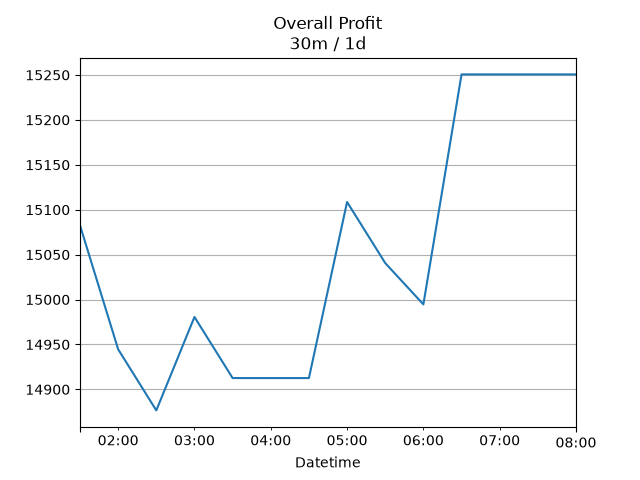|<table border="1" class="dataframe"> <thead> <tr style="text-align: center;"> <th>Datetime</th> <th>profit</th> </tr> </thead> <tbody> <tr> <td>01:30</td> <td>10612.6</td> </tr> <tr> <td>02:00</td> <td>10050.6</td> </tr> <tr> <td>02:30</td> <td>10070.6</td> </tr> <tr> <td>03:00</td> <td>10146.6</td> </tr> <tr> <td>03:30</td> <td>10146.6</td> </tr> <tr> <td>04:00</td> <td>10146.6</td> </tr> <tr> <td>04:30</td> <td>10146.6</td> </tr> <tr> <td>05:00</td> <td>9918.6</td> </tr> <tr> <td>05:30</td> <td>9940.6</td> </tr> <tr> <td>06:00</td> <td>9918.6</td> </tr> <tr> <td>06:30</td> <td>9812.6</td> </tr> <tr> <td>07:00</td> <td>9812.6</td> </tr> </tbody></table>|
|1d / 5d|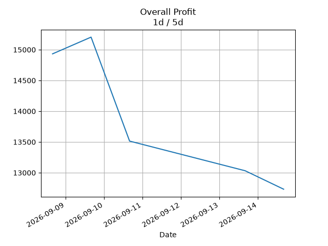|<table border="1" class="dataframe"> <thead> <tr style="text-align: center;"> <th>Date</th> <th>profit</th> </tr> </thead> <tbody> <tr> <td>2026-08-04</td> <td>8680.6</td> </tr> <tr> <td>2026-08-05</td> <td>8814.6</td> </tr> <tr> <td>2026-08-06</td> <td>8344.6</td> </tr> <tr> <td>2026-08-09</td> <td>10424.6</td> </tr> <tr> <td>2026-08-10</td> <td>9804.6</td> </tr> </tbody></table>|
|1wk / 1mo|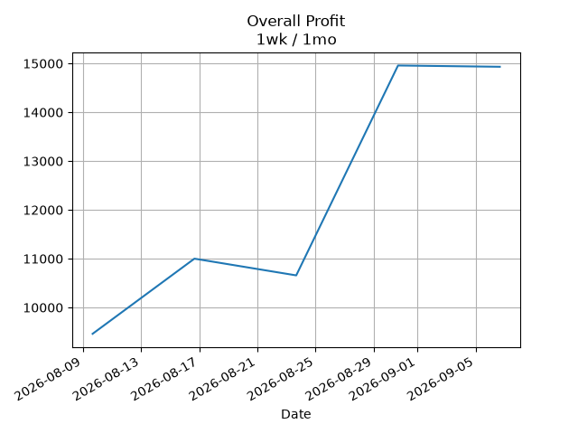|<table border="1" class="dataframe"> <thead> <tr style="text-align: center;"> <th>Date</th> <th>profit</th> </tr> </thead> <tbody> <tr> <td>2026-07-12</td> <td>9388.6</td> </tr> <tr> <td>2026-07-19</td> <td>8444.6</td> </tr> <tr> <td>2026-07-26</td> <td>10934.6</td> </tr> <tr> <td>2026-08-02</td> <td>8344.6</td> </tr> <tr> <td>2026-08-09</td> <td>9804.6</td> </tr> </tbody></table>|
---
## 002100.SZ [📉] [$-2937.40] [-9.71%]:
#### TECON BIOLOGY Co.LTD
|price|profit|data|
|:---:|:---:|:---:|
|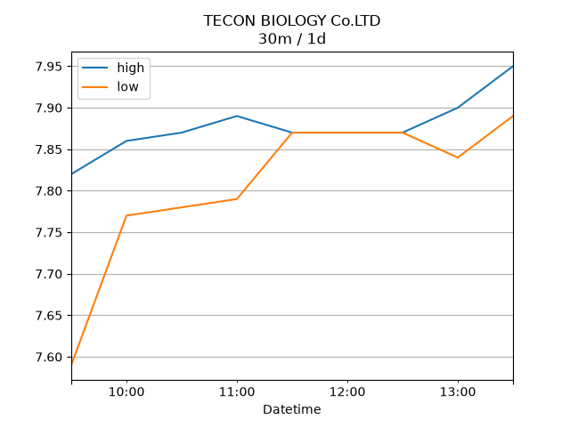|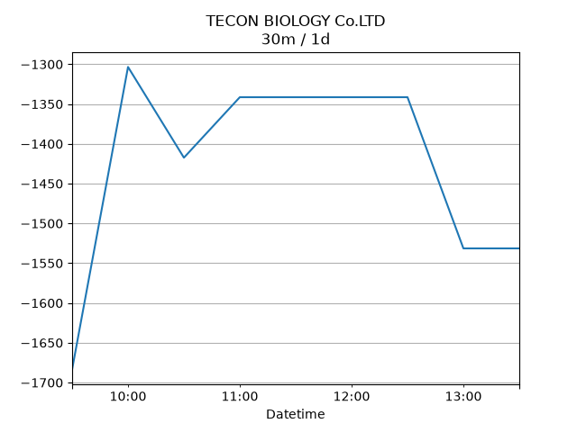|<table border="1" class="dataframe"> <thead> <tr style="text-align: center;"> <th>Datetime</th> <th>profit</th> </tr> </thead> <tbody> <tr> <td>09:30</td> <td>-1987.4</td> </tr> <tr> <td>10:00</td> <td>-2519.4</td> </tr> <tr> <td>10:30</td> <td>-2709.4</td> </tr> <tr> <td>11:00</td> <td>-2633.4</td> </tr> <tr> <td>11:30</td> <td>-2633.4</td> </tr> <tr> <td>12:00</td> <td>-2633.4</td> </tr> <tr> <td>12:30</td> <td>-2633.4</td> </tr> <tr> <td>13:00</td> <td>-2861.4</td> </tr> <tr> <td>13:30</td> <td>-2899.4</td> </tr> <tr> <td>14:00</td> <td>-2861.4</td> </tr> <tr> <td>14:30</td> <td>-2937.4</td> </tr> </tbody></table>|
|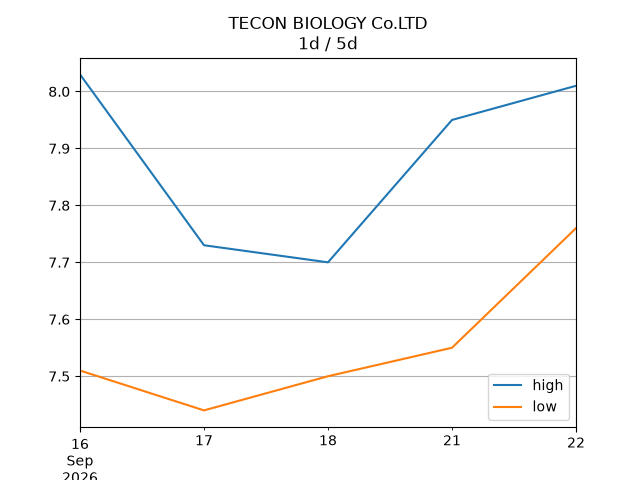|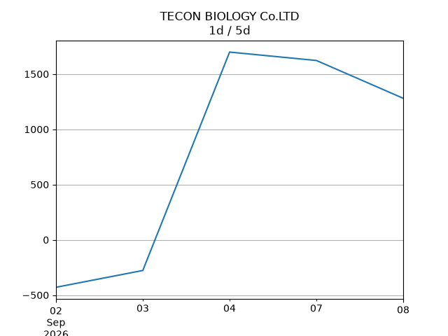|<table border="1" class="dataframe"> <thead> <tr style="text-align: center;"> <th>Date</th> <th>profit</th> </tr> </thead> <tbody> <tr> <td>2026-08-05</td> <td>-3469.4</td> </tr> <tr> <td>2026-08-06</td> <td>-3545.4</td> </tr> <tr> <td>2026-08-07</td> <td>-3355.4</td> </tr> <tr> <td>2026-08-10</td> <td>-2595.4</td> </tr> <tr> <td>2026-08-11</td> <td>-2975.4</td> </tr> </tbody></table>|
|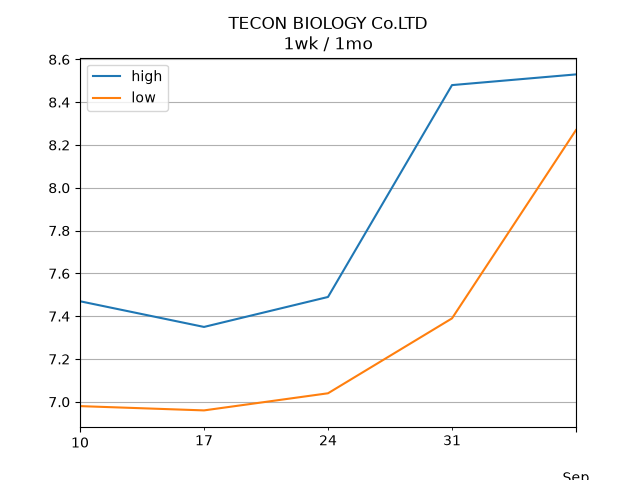|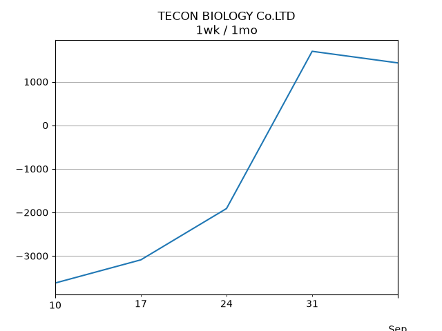|<table border="1" class="dataframe"> <thead> <tr style="text-align: center;"> <th>Date</th> <th>profit</th> </tr> </thead> <tbody> <tr> <td>2026-07-13</td> <td>-3241.4</td> </tr> <tr> <td>2026-07-20</td> <td>-3735.4</td> </tr> <tr> <td>2026-07-27</td> <td>-2595.4</td> </tr> <tr> <td>2026-08-03</td> <td>-3355.4</td> </tr> <tr> <td>2026-08-10</td> <td>-2975.4</td> </tr> </tbody></table>|
---
## 0066.HK [📈] [$12780.00] [35.35%]:
#### MTR Corporation Limited
|price|profit|data|
|:---:|:---:|:---:|
|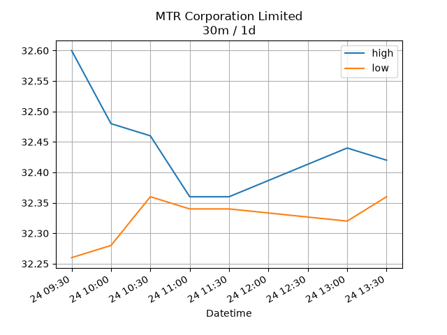|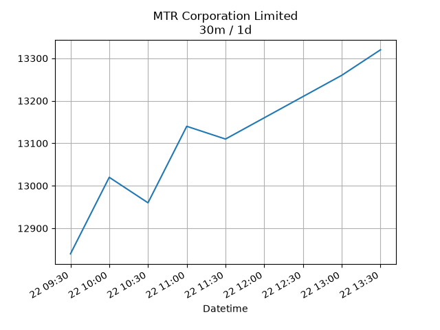|<table border="1" class="dataframe"> <thead> <tr style="text-align: center;"> <th>Datetime</th> <th>profit</th> </tr> </thead> <tbody> <tr> <td>09:30</td> <td>12600.0</td> </tr> <tr> <td>10:00</td> <td>12570.0</td> </tr> <tr> <td>10:30</td> <td>12780.0</td> </tr> <tr> <td>11:00</td> <td>12780.0</td> </tr> <tr> <td>11:30</td> <td>12780.0</td> </tr> <tr> <td>13:00</td> <td>12780.0</td> </tr> <tr> <td>13:30</td> <td>12840.0</td> </tr> <tr> <td>14:00</td> <td>12780.0</td> </tr> <tr> <td>14:30</td> <td>12750.0</td> </tr> <tr> <td>15:00</td> <td>12780.0</td> </tr> </tbody></table>|
|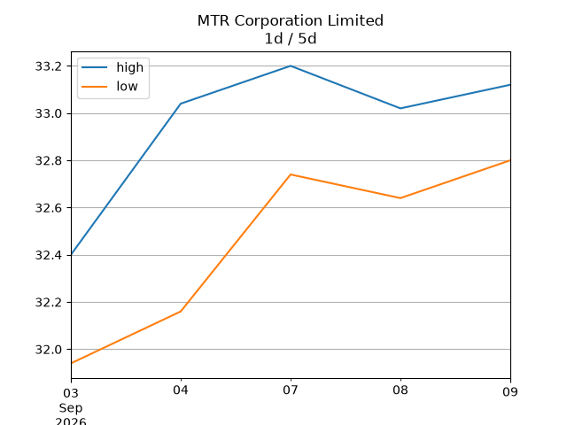|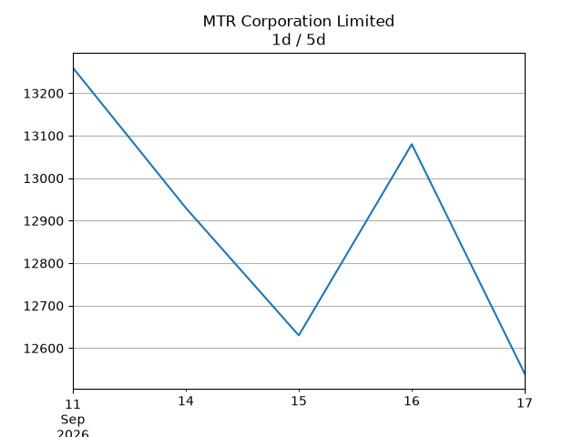|<table border="1" class="dataframe"> <thead> <tr style="text-align: center;"> <th>Date</th> <th>profit</th> </tr> </thead> <tbody> <tr> <td>2026-08-05</td> <td>12150.0</td> </tr> <tr> <td>2026-08-06</td> <td>12360.0</td> </tr> <tr> <td>2026-08-07</td> <td>11700.0</td> </tr> <tr> <td>2026-08-10</td> <td>13020.0</td> </tr> <tr> <td>2026-08-11</td> <td>12780.0</td> </tr> </tbody></table>|
|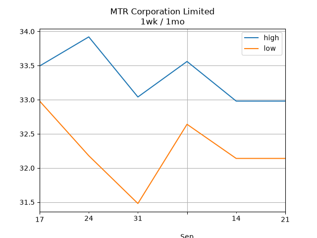|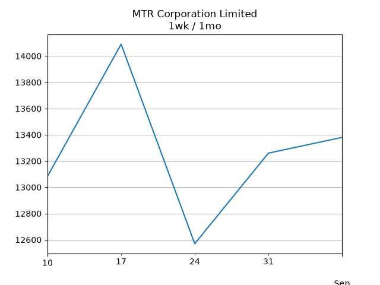|<table border="1" class="dataframe"> <thead> <tr style="text-align: center;"> <th>Date</th> <th>profit</th> </tr> </thead> <tbody> <tr> <td>2026-07-13</td> <td>12630.0</td> </tr> <tr> <td>2026-07-20</td> <td>12180.0</td> </tr> <tr> <td>2026-07-27</td> <td>13530.0</td> </tr> <tr> <td>2026-08-03</td> <td>11700.0</td> </tr> <tr> <td>2026-08-10</td> <td>12780.0</td> </tr> </tbody></table>|
---
