## Net Profit [📈]:
### $12180.60
|type|graph|data|
|:---:|:---:|:---:|
|30m / 1d|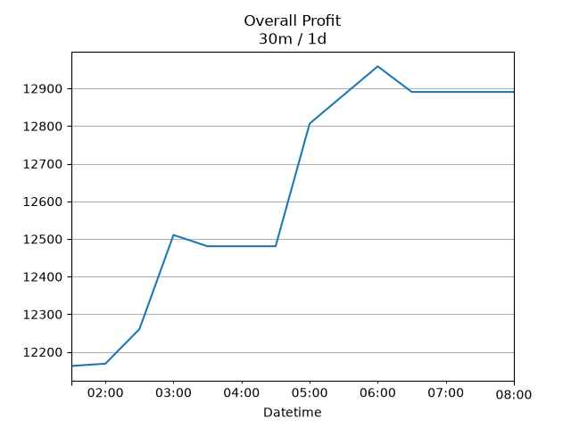|<table border="1" class="dataframe"> <thead> <tr style="text-align: center;"> <th>Datetime</th> <th>profit</th> </tr> </thead> <tbody> <tr> <td>01:30</td> <td>12206.6</td> </tr> <tr> <td>02:00</td> <td>12272.6</td> </tr> <tr> <td>02:30</td> <td>12256.6</td> </tr> <tr> <td>03:00</td> <td>12324.6</td> </tr> <tr> <td>03:30</td> <td>12226.6</td> </tr> <tr> <td>04:00</td> <td>12226.6</td> </tr> <tr> <td>04:30</td> <td>12226.6</td> </tr> <tr> <td>05:00</td> <td>12172.6</td> </tr> <tr> <td>05:30</td> <td>12180.6</td> </tr> <tr> <td>06:00</td> <td>12180.6</td> </tr> </tbody></table>|
|1d / 5d|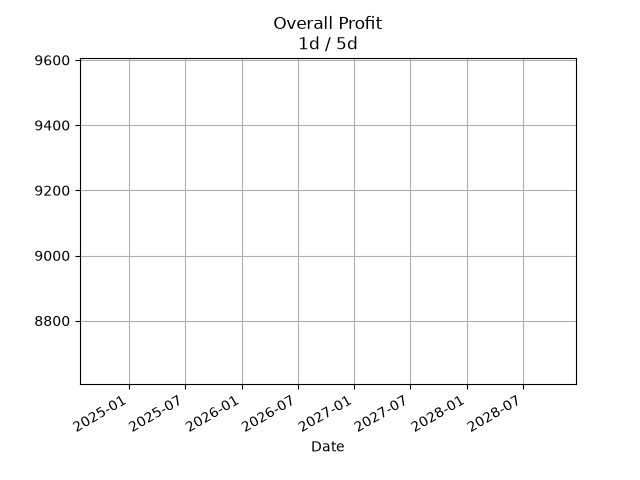|<table border="1" class="dataframe"> <thead> <tr style="text-align: center;"> <th>Date</th> <th>profit</th> </tr> </thead> <tbody> <tr> <td>2026-09-22</td> <td>NaN</td> </tr> <tr> <td>2026-09-23</td> <td>11264.6</td> </tr> <tr> <td>2026-09-24</td> <td>11264.6</td> </tr> <tr> <td>2026-09-27</td> <td>12868.6</td> </tr> <tr> <td>2026-09-28</td> <td>12186.6</td> </tr> <tr> <td>2026-09-29</td> <td>12180.6</td> </tr> </tbody></table>|
|1wk / 1mo|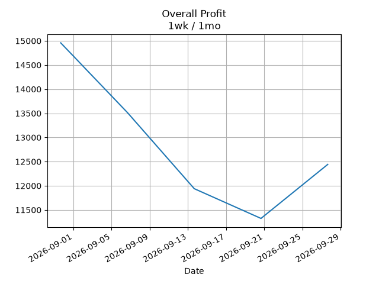|<table border="1" class="dataframe"> <thead> <tr style="text-align: center;"> <th>Date</th> <th>profit</th> </tr> </thead> <tbody> <tr> <td>2026-08-30</td> <td>14958.6</td> </tr> <tr> <td>2026-09-06</td> <td>13514.6</td> </tr> <tr> <td>2026-09-13</td> <td>11940.6</td> </tr> <tr> <td>2026-09-20</td> <td>11324.6</td> </tr> <tr> <td>2026-09-27</td> <td>12180.6</td> </tr> </tbody></table>|
---
## 002100.SZ [📉] [$-239.40] [-0.79%]:
#### TECON BIOLOGY Co.LTD
|price|profit|data|
|:---:|:---:|:---:|
|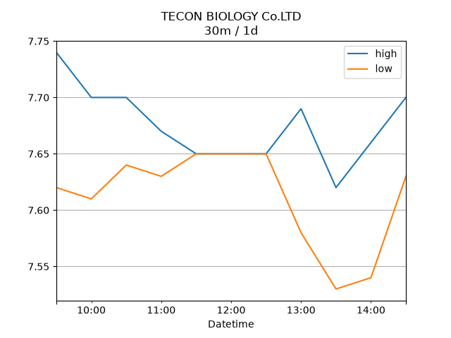|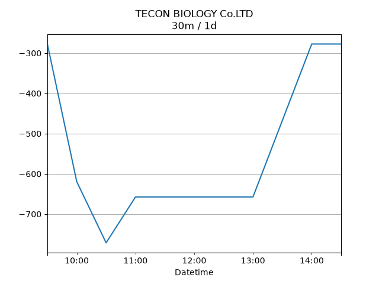|<table border="1" class="dataframe"> <thead> <tr style="text-align: center;"> <th>Datetime</th> <th>profit</th> </tr> </thead> <tbody> <tr> <td>09:30</td> <td>26.6</td> </tr> <tr> <td>10:00</td> <td>-87.4</td> </tr> <tr> <td>10:30</td> <td>-163.4</td> </tr> <tr> <td>11:00</td> <td>-125.4</td> </tr> <tr> <td>11:30</td> <td>-163.4</td> </tr> <tr> <td>12:00</td> <td>-163.4</td> </tr> <tr> <td>12:30</td> <td>-163.4</td> </tr> <tr> <td>13:00</td> <td>-277.4</td> </tr> <tr> <td>13:30</td> <td>-239.4</td> </tr> <tr> <td>14:00</td> <td>-239.4</td> </tr> </tbody></table>|
|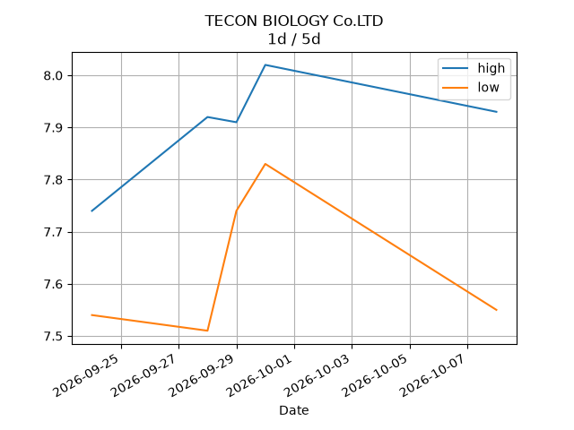|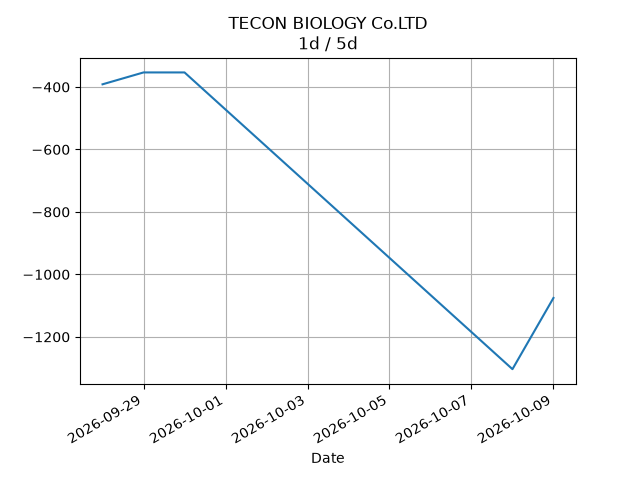|<table border="1" class="dataframe"> <thead> <tr style="text-align: center;"> <th>Date</th> <th>profit</th> </tr> </thead> <tbody> <tr> <td>2026-09-23</td> <td>-847.4</td> </tr> <tr> <td>2026-09-24</td> <td>-1455.4</td> </tr> <tr> <td>2026-09-28</td> <td>-391.4</td> </tr> <tr> <td>2026-09-29</td> <td>-353.4</td> </tr> <tr> <td>2026-09-30</td> <td>-239.4</td> </tr> </tbody></table>|
|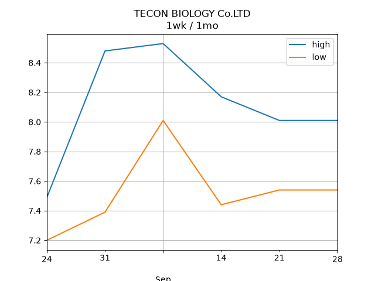|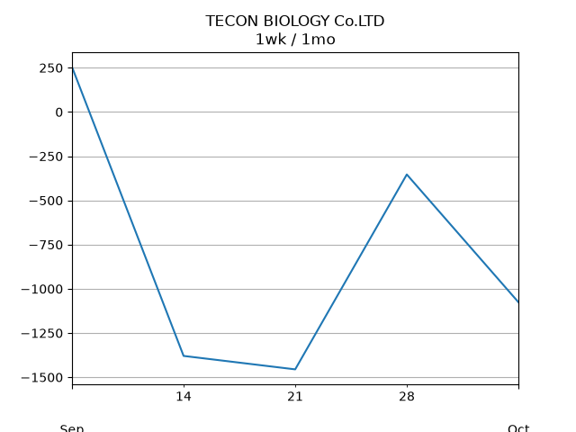|<table border="1" class="dataframe"> <thead> <tr style="text-align: center;"> <th>Date</th> <th>profit</th> </tr> </thead> <tbody> <tr> <td>2026-08-31</td> <td>1698.6</td> </tr> <tr> <td>2026-09-07</td> <td>254.6</td> </tr> <tr> <td>2026-09-14</td> <td>-1379.4</td> </tr> <tr> <td>2026-09-21</td> <td>-1455.4</td> </tr> <tr> <td>2026-09-28</td> <td>-239.4</td> </tr> </tbody></table>|
---
## 0066.HK [📈] [$12420.00] [34.36%]:
#### MTR Corporation Limited
|price|profit|data|
|:---:|:---:|:---:|
|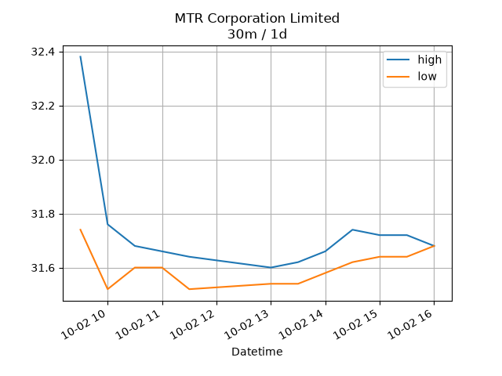|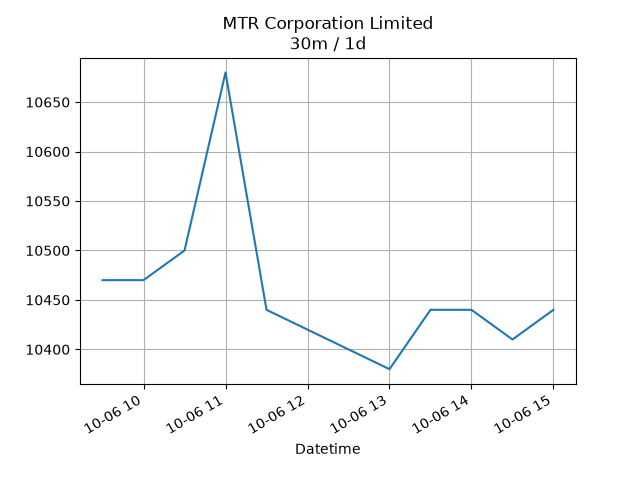|<table border="1" class="dataframe"> <thead> <tr style="text-align: center;"> <th>Datetime</th> <th>profit</th> </tr> </thead> <tbody> <tr> <td>09:30</td> <td>12180.0</td> </tr> <tr> <td>10:00</td> <td>12360.0</td> </tr> <tr> <td>10:30</td> <td>12420.0</td> </tr> <tr> <td>11:00</td> <td>12450.0</td> </tr> <tr> <td>11:30</td> <td>12390.0</td> </tr> <tr> <td>13:00</td> <td>12450.0</td> </tr> <tr> <td>13:30</td> <td>12420.0</td> </tr> <tr> <td>14:00</td> <td>12420.0</td> </tr> </tbody></table>|
|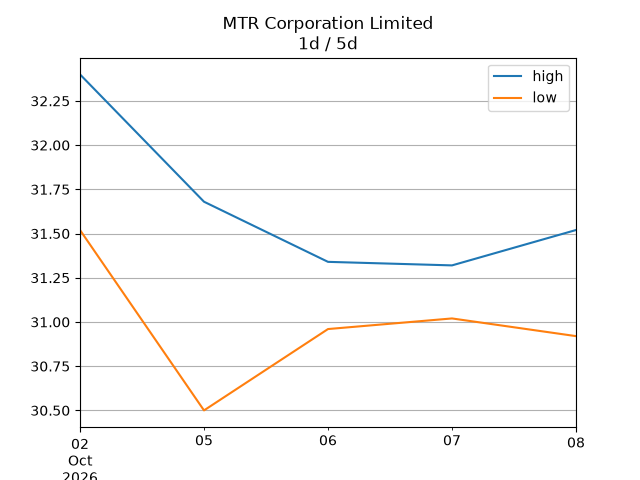|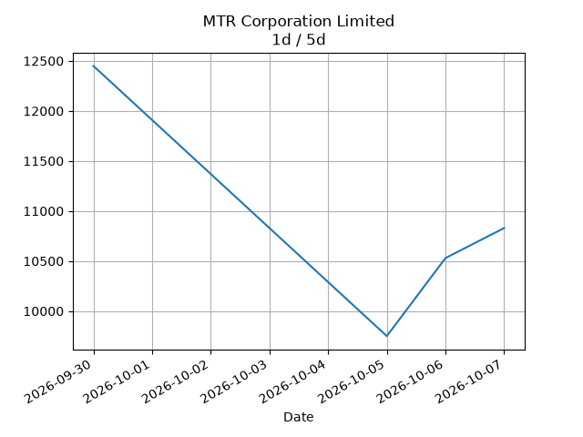|<table border="1" class="dataframe"> <thead> <tr style="text-align: center;"> <th>Date</th> <th>profit</th> </tr> </thead> <tbody> <tr> <td>2026-09-24</td> <td>12720.0</td> </tr> <tr> <td>2026-09-25</td> <td>12780.0</td> </tr> <tr> <td>2026-09-28</td> <td>13260.0</td> </tr> <tr> <td>2026-09-29</td> <td>12540.0</td> </tr> <tr> <td>2026-09-30</td> <td>12420.0</td> </tr> </tbody></table>|
|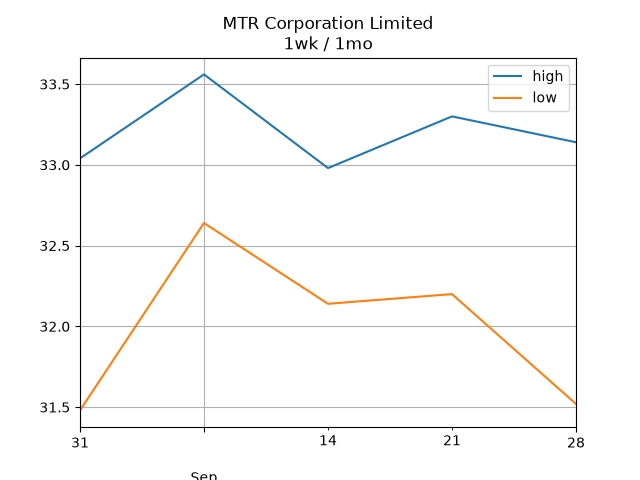|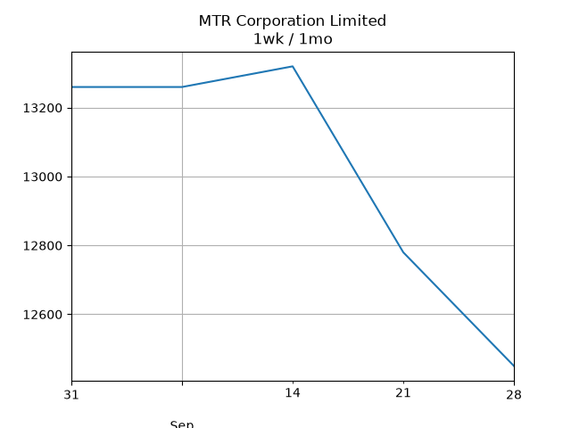|<table border="1" class="dataframe"> <thead> <tr style="text-align: center;"> <th>Date</th> <th>profit</th> </tr> </thead> <tbody> <tr> <td>2026-08-31</td> <td>13260.0</td> </tr> <tr> <td>2026-09-07</td> <td>13260.0</td> </tr> <tr> <td>2026-09-14</td> <td>13320.0</td> </tr> <tr> <td>2026-09-21</td> <td>12780.0</td> </tr> <tr> <td>2026-09-28</td> <td>12420.0</td> </tr> </tbody></table>|
---
