## Net Profit [📈]:
### $12420.60
|type|graph|data|
|:---:|:---:|:---:|
|30m / 1d|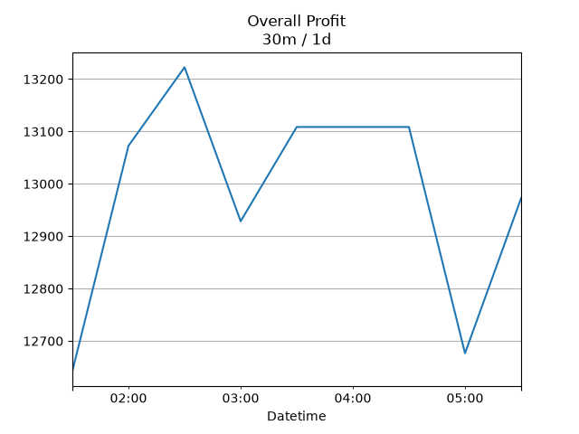|<table border="1" class="dataframe"> <thead> <tr style="text-align: center;"> <th>Datetime</th> <th>profit</th> </tr> </thead> <tbody> <tr> <td>01:30</td> <td>12278.6</td> </tr> <tr> <td>02:00</td> <td>12446.6</td> </tr> <tr> <td>02:30</td> <td>12490.6</td> </tr> <tr> <td>03:00</td> <td>12558.6</td> </tr> <tr> <td>03:30</td> <td>12588.6</td> </tr> <tr> <td>04:00</td> <td>12588.6</td> </tr> <tr> <td>04:30</td> <td>12588.6</td> </tr> <tr> <td>05:00</td> <td>12482.6</td> </tr> <tr> <td>05:30</td> <td>12360.6</td> </tr> <tr> <td>06:00</td> <td>12238.6</td> </tr> <tr> <td>06:30</td> <td>12420.6</td> </tr> </tbody></table>|
|1d / 5d|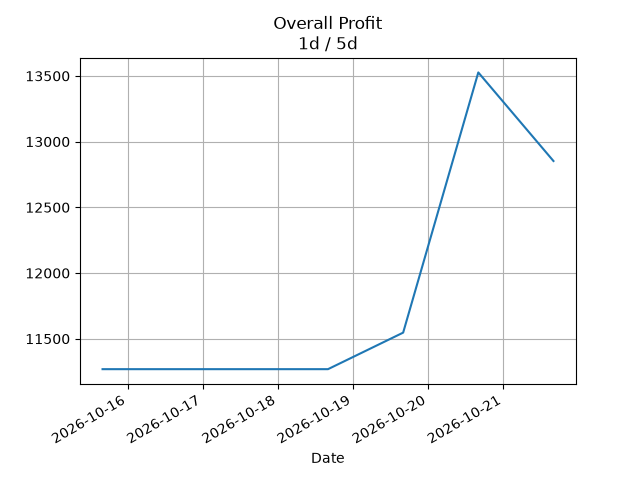|<table border="1" class="dataframe"> <thead> <tr style="text-align: center;"> <th>Date</th> <th>profit</th> </tr> </thead> <tbody> <tr> <td>2026-10-25</td> <td>13094.6</td> </tr> <tr> <td>2026-10-26</td> <td>13432.6</td> </tr> <tr> <td>2026-10-27</td> <td>12464.6</td> </tr> <tr> <td>2026-10-28</td> <td>12288.6</td> </tr> <tr> <td>2026-10-29</td> <td>12458.6</td> </tr> </tbody></table>|
|1wk / 1mo|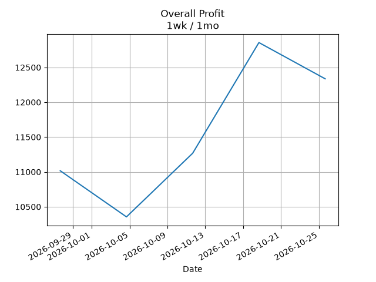|<table border="1" class="dataframe"> <thead> <tr style="text-align: center;"> <th>Date</th> <th>profit</th> </tr> </thead> <tbody> <tr> <td>2026-09-27</td> <td>11016.6</td> </tr> <tr> <td>2026-10-04</td> <td>10354.6</td> </tr> <tr> <td>2026-10-11</td> <td>11268.6</td> </tr> <tr> <td>2026-10-18</td> <td>12856.6</td> </tr> <tr> <td>2026-10-25</td> <td>12458.6</td> </tr> </tbody></table>|
---
## 002100.SZ [📉] [$-1379.40] [-4.56%]:
#### TECON BIOLOGY Co.LTD
|price|profit|data|
|:---:|:---:|:---:|
|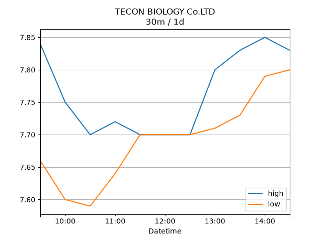|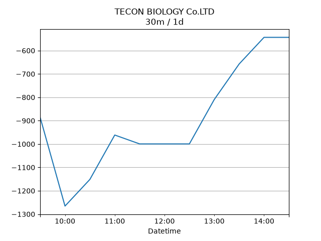|<table border="1" class="dataframe"> <thead> <tr style="text-align: center;"> <th>Datetime</th> <th>profit</th> </tr> </thead> <tbody> <tr> <td>09:30</td> <td>-1341.4</td> </tr> <tr> <td>10:00</td> <td>-1113.4</td> </tr> <tr> <td>10:30</td> <td>-1189.4</td> </tr> <tr> <td>11:00</td> <td>-1151.4</td> </tr> <tr> <td>11:30</td> <td>-1151.4</td> </tr> <tr> <td>12:00</td> <td>-1151.4</td> </tr> <tr> <td>12:30</td> <td>-1151.4</td> </tr> <tr> <td>13:00</td> <td>-1227.4</td> </tr> <tr> <td>13:30</td> <td>-1379.4</td> </tr> <tr> <td>14:00</td> <td>-1531.4</td> </tr> <tr> <td>14:30</td> <td>-1379.4</td> </tr> </tbody></table>|
|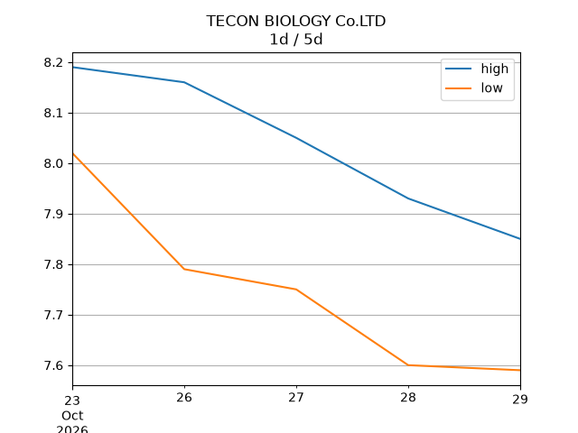|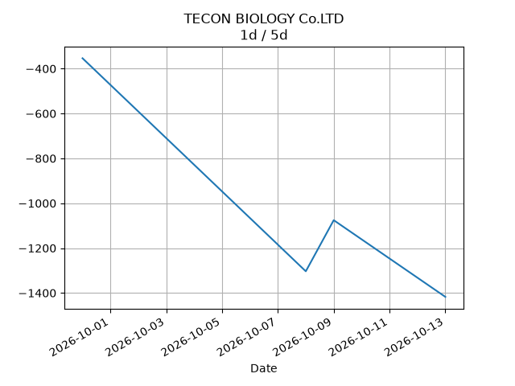|<table border="1" class="dataframe"> <thead> <tr style="text-align: center;"> <th>Date</th> <th>profit</th> </tr> </thead> <tbody> <tr> <td>2026-10-26</td> <td>-315.4</td> </tr> <tr> <td>2026-10-27</td> <td>-277.4</td> </tr> <tr> <td>2026-10-28</td> <td>-885.4</td> </tr> <tr> <td>2026-10-29</td> <td>-581.4</td> </tr> <tr> <td>2026-10-30</td> <td>-1341.4</td> </tr> </tbody></table>|
|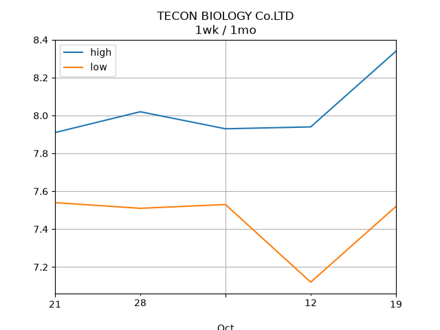|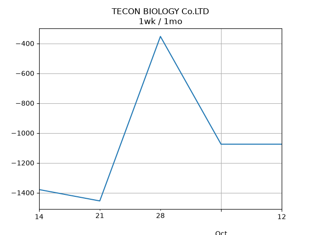|<table border="1" class="dataframe"> <thead> <tr style="text-align: center;"> <th>Date</th> <th>profit</th> </tr> </thead> <tbody> <tr> <td>2026-09-28</td> <td>-353.4</td> </tr> <tr> <td>2026-10-05</td> <td>-1075.4</td> </tr> <tr> <td>2026-10-12</td> <td>-1151.4</td> </tr> <tr> <td>2026-10-19</td> <td>406.6</td> </tr> <tr> <td>2026-10-26</td> <td>-1341.4</td> </tr> </tbody></table>|
---
## 0066.HK [📈] [$13800.00] [38.17%]:
#### MTR Corporation Limited
|price|profit|data|
|:---:|:---:|:---:|
|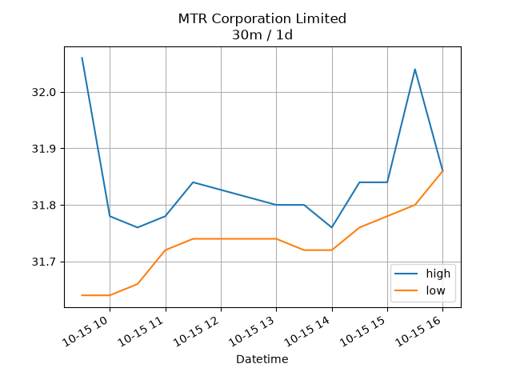|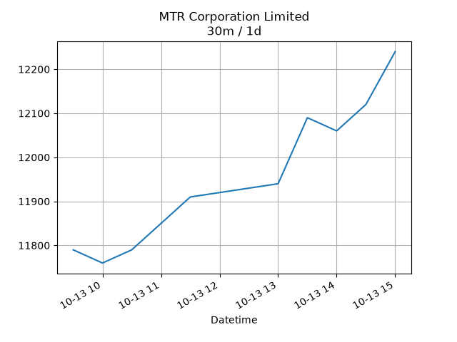|<table border="1" class="dataframe"> <thead> <tr style="text-align: center;"> <th>Datetime</th> <th>profit</th> </tr> </thead> <tbody> <tr> <td>09:30</td> <td>13620.0</td> </tr> <tr> <td>10:00</td> <td>13560.0</td> </tr> <tr> <td>10:30</td> <td>13680.0</td> </tr> <tr> <td>11:00</td> <td>13710.0</td> </tr> <tr> <td>11:30</td> <td>13740.0</td> </tr> <tr> <td>13:00</td> <td>13710.0</td> </tr> <tr> <td>13:30</td> <td>13740.0</td> </tr> <tr> <td>14:00</td> <td>13770.0</td> </tr> <tr> <td>14:30</td> <td>13800.0</td> </tr> </tbody></table>|
|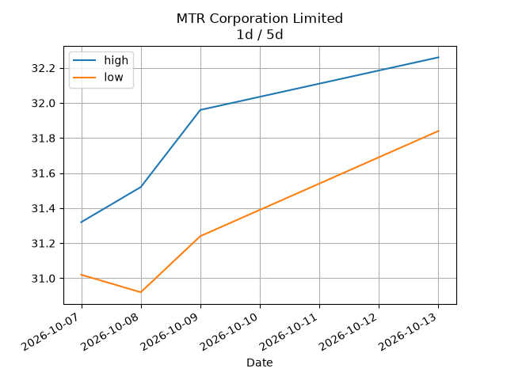|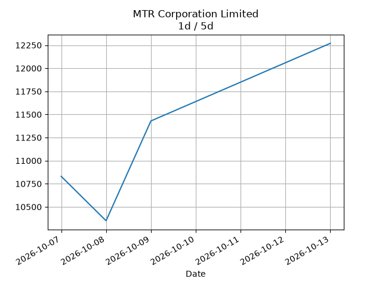|<table border="1" class="dataframe"> <thead> <tr style="text-align: center;"> <th>Date</th> <th>profit</th> </tr> </thead> <tbody> <tr> <td>2026-10-26</td> <td>13410.0</td> </tr> <tr> <td>2026-10-27</td> <td>13710.0</td> </tr> <tr> <td>2026-10-28</td> <td>13350.0</td> </tr> <tr> <td>2026-10-29</td> <td>12870.0</td> </tr> <tr> <td>2026-10-30</td> <td>13800.0</td> </tr> </tbody></table>|
|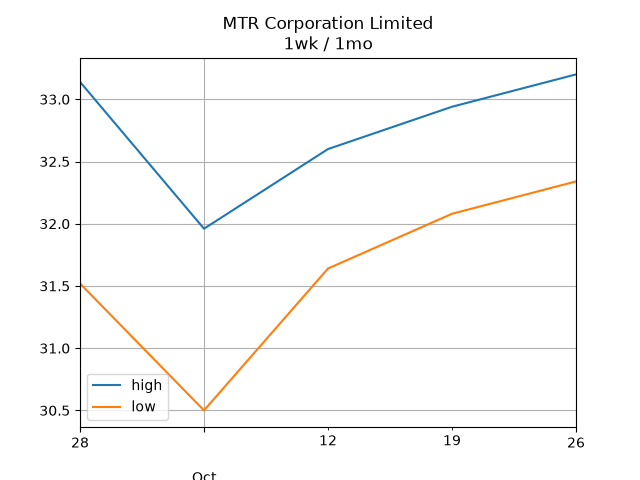|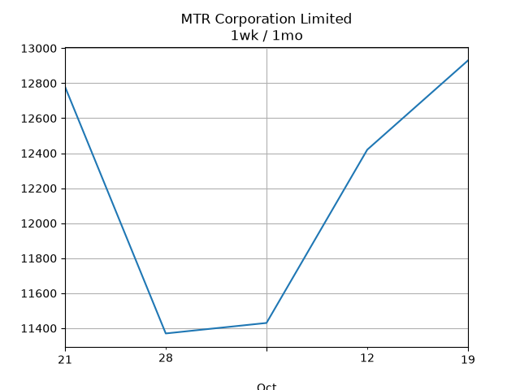|<table border="1" class="dataframe"> <thead> <tr style="text-align: center;"> <th>Date</th> <th>profit</th> </tr> </thead> <tbody> <tr> <td>2026-09-28</td> <td>11370.0</td> </tr> <tr> <td>2026-10-05</td> <td>11430.0</td> </tr> <tr> <td>2026-10-12</td> <td>12420.0</td> </tr> <tr> <td>2026-10-19</td> <td>12450.0</td> </tr> <tr> <td>2026-10-26</td> <td>13800.0</td> </tr> </tbody></table>|
---
