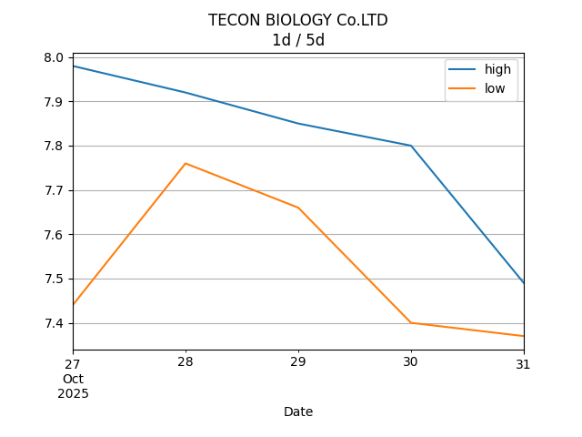

## Net Profit [📈]:
### $13184.60
|type|graph|data|
|:---:|:---:|:---:|
|30m / 1d||<table border="1" class="dataframe"> <thead> <tr style="text-align: center;"> <th>Datetime</th> <th>profit</th> </tr> </thead> <tbody> <tr> <td>01:30</td> <td>13610.6</td> </tr> <tr> <td>02:00</td> <td>13118.6</td> </tr> <tr> <td>02:30</td> <td>13124.6</td> </tr> <tr> <td>03:00</td> <td>13184.6</td> </tr> </tbody></table>|
|1d / 5d||<table border="1" class="dataframe"> <thead> <tr style="text-align: center;"> <th>Date</th> <th>profit</th> </tr> </thead> <tbody> <tr> <td>2026-01-25</td> <td>11724.6</td> </tr> <tr> <td>2026-01-26</td> <td>11610.6</td> </tr> <tr> <td>2026-01-27</td> <td>12934.6</td> </tr> <tr> <td>2026-01-28</td> <td>13544.6</td> </tr> <tr> <td>2026-01-29</td> <td>13184.6</td> </tr> </tbody></table>|
|1wk / 1mo||<table border="1" class="dataframe"> <thead> <tr style="text-align: center;"> <th>Date</th> <th>profit</th> </tr> </thead> <tbody> <tr> <td>2025-12-28</td> <td>6956.6</td> </tr> <tr> <td>2026-01-04</td> <td>6578.6</td> </tr> <tr> <td>2026-01-11</td> <td>7016.6</td> </tr> <tr> <td>2026-01-18</td> <td>11042.6</td> </tr> <tr> <td>2026-01-25</td> <td>13184.6</td> </tr> </tbody></table>|
---
## 002100.SZ [📉] [$-2595.40] [-8.58%]:
#### TECON BIOLOGY Co.LTD
|price|profit|data|
|:---:|:---:|:---:|
|||<table border="1" class="dataframe"> <thead> <tr style="text-align: center;"> <th>Datetime</th> <th>profit</th> </tr> </thead> <tbody> <tr> <td>09:30</td> <td>-2139.4</td> </tr> <tr> <td>10:00</td> <td>-2481.4</td> </tr> <tr> <td>10:30</td> <td>-2595.4</td> </tr> <tr> <td>11:00</td> <td>-2595.4</td> </tr> </tbody></table>|
|||<table border="1" class="dataframe"> <thead> <tr style="text-align: center;"> <th>Date</th> <th>profit</th> </tr> </thead> <tbody> <tr> <td>2026-01-26</td> <td>-2975.4</td> </tr> <tr> <td>2026-01-27</td> <td>-3089.4</td> </tr> <tr> <td>2026-01-28</td> <td>-2785.4</td> </tr> <tr> <td>2026-01-29</td> <td>-2595.4</td> </tr> <tr> <td>2026-01-30</td> <td>-2595.4</td> </tr> </tbody></table>|
|||<table border="1" class="dataframe"> <thead> <tr style="text-align: center;"> <th>Date</th> <th>profit</th> </tr> </thead> <tbody> <tr> <td>2025-12-29</td> <td>-2253.4</td> </tr> <tr> <td>2026-01-05</td> <td>-2481.4</td> </tr> <tr> <td>2026-01-12</td> <td>-3393.4</td> </tr> <tr> <td>2026-01-19</td> <td>-3507.4</td> </tr> <tr> <td>2026-01-26</td> <td>-2595.4</td> </tr> </tbody></table>|
---
## 0066.HK [📈] [$15780.00] [43.65%]:
#### MTR Corporation Limited
|price|profit|data|
|:---:|:---:|:---:|
|||<table border="1" class="dataframe"> <thead> <tr style="text-align: center;"> <th>Datetime</th> <th>profit</th> </tr> </thead> <tbody> <tr> <td>09:30</td> <td>15750.0</td> </tr> <tr> <td>10:00</td> <td>15600.0</td> </tr> <tr> <td>10:30</td> <td>15720.0</td> </tr> <tr> <td>11:00</td> <td>15780.0</td> </tr> </tbody></table>|
|||<table border="1" class="dataframe"> <thead> <tr style="text-align: center;"> <th>Date</th> <th>profit</th> </tr> </thead> <tbody> <tr> <td>2026-01-26</td> <td>14700.0</td> </tr> <tr> <td>2026-01-27</td> <td>14700.0</td> </tr> <tr> <td>2026-01-28</td> <td>15720.0</td> </tr> <tr> <td>2026-01-29</td> <td>16140.0</td> </tr> <tr> <td>2026-01-30</td> <td>15780.0</td> </tr> </tbody></table>|
|||<table border="1" class="dataframe"> <thead> <tr style="text-align: center;"> <th>Date</th> <th>profit</th> </tr> </thead> <tbody> <tr> <td>2025-12-29</td> <td>9210.0</td> </tr> <tr> <td>2026-01-05</td> <td>9060.0</td> </tr> <tr> <td>2026-01-12</td> <td>10410.0</td> </tr> <tr> <td>2026-01-19</td> <td>14550.0</td> </tr> <tr> <td>2026-01-26</td> <td>15780.0</td> </tr> </tbody></table>|
---
