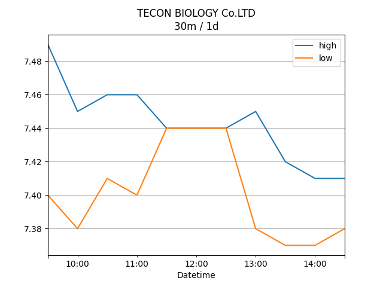

## Net Profit [📈]:
### $7904.60
|type|graph|data|
|:---:|:---:|:---:|
|30m / 1d||<table border="1" class="dataframe"> <thead> <tr style="text-align: center;"> <th>Datetime</th> <th>profit</th> </tr> </thead> <tbody> <tr> <td>01:30</td> <td>7102.6</td> </tr> <tr> <td>02:00</td> <td>7298.6</td> </tr> <tr> <td>02:30</td> <td>7410.6</td> </tr> <tr> <td>03:00</td> <td>7296.6</td> </tr> <tr> <td>03:30</td> <td>7326.6</td> </tr> <tr> <td>04:00</td> <td>7326.6</td> </tr> <tr> <td>04:30</td> <td>7326.6</td> </tr> <tr> <td>05:00</td> <td>7560.6</td> </tr> <tr> <td>05:30</td> <td>7506.6</td> </tr> <tr> <td>06:00</td> <td>7476.6</td> </tr> <tr> <td>06:30</td> <td>7604.6</td> </tr> <tr> <td>07:00</td> <td>7604.6</td> </tr> <tr> <td>07:30</td> <td>7604.6</td> </tr> <tr> <td>08:00</td> <td>7604.6</td> </tr> </tbody></table>|
|1d / 5d||<table border="1" class="dataframe"> <thead> <tr style="text-align: center;"> <th>Date</th> <th>profit</th> </tr> </thead> <tbody> <tr> <td>2026-01-12</td> <td>6742.6</td> </tr> <tr> <td>2026-01-13</td> <td>7238.6</td> </tr> <tr> <td>2026-01-14</td> <td>7328.6</td> </tr> <tr> <td>2026-01-15</td> <td>7016.6</td> </tr> <tr> <td>2026-01-18</td> <td>7942.6</td> </tr> </tbody></table>|
|1wk / 1mo||<table border="1" class="dataframe"> <thead> <tr style="text-align: center;"> <th>Date</th> <th>profit</th> </tr> </thead> <tbody> <tr> <td>2025-12-14</td> <td>6740.6</td> </tr> <tr> <td>2025-12-21</td> <td>6124.6</td> </tr> <tr> <td>2025-12-28</td> <td>6956.6</td> </tr> <tr> <td>2026-01-04</td> <td>6578.6</td> </tr> <tr> <td>2026-01-11</td> <td>7016.6</td> </tr> </tbody></table>|
---
## 002100.SZ [📉] [$-3165.40] [-10.46%]:
#### TECON BIOLOGY Co.LTD
|price|profit|data|
|:---:|:---:|:---:|
|||<table border="1" class="dataframe"> <thead> <tr style="text-align: center;"> <th>Datetime</th> <th>profit</th> </tr> </thead> <tbody> <tr> <td>09:30</td> <td>-3127.4</td> </tr> <tr> <td>10:00</td> <td>-3051.4</td> </tr> <tr> <td>10:30</td> <td>-3089.4</td> </tr> <tr> <td>11:00</td> <td>-3203.4</td> </tr> <tr> <td>11:30</td> <td>-3203.4</td> </tr> <tr> <td>12:00</td> <td>-3203.4</td> </tr> <tr> <td>12:30</td> <td>-3203.4</td> </tr> <tr> <td>13:00</td> <td>-3089.4</td> </tr> <tr> <td>13:30</td> <td>-3203.4</td> </tr> <tr> <td>14:00</td> <td>-3203.4</td> </tr> <tr> <td>14:30</td> <td>-3165.4</td> </tr> </tbody></table>|
|||<table border="1" class="dataframe"> <thead> <tr style="text-align: center;"> <th>Date</th> <th>profit</th> </tr> </thead> <tbody> <tr> <td>2026-01-13</td> <td>-3127.4</td> </tr> <tr> <td>2026-01-14</td> <td>-3051.4</td> </tr> <tr> <td>2026-01-15</td> <td>-3051.4</td> </tr> <tr> <td>2026-01-16</td> <td>-3393.4</td> </tr> <tr> <td>2026-01-19</td> <td>-3127.4</td> </tr> </tbody></table>|
|||<table border="1" class="dataframe"> <thead> <tr style="text-align: center;"> <th>Date</th> <th>profit</th> </tr> </thead> <tbody> <tr> <td>2025-12-15</td> <td>-2139.4</td> </tr> <tr> <td>2025-12-22</td> <td>-2785.4</td> </tr> <tr> <td>2025-12-29</td> <td>-2253.4</td> </tr> <tr> <td>2026-01-05</td> <td>-2481.4</td> </tr> <tr> <td>2026-01-12</td> <td>-3393.4</td> </tr> </tbody></table>|
---
## 0066.HK [📈] [$11070.00] [30.62%]:
#### MTR Corporation Limited
|price|profit|data|
|:---:|:---:|:---:|
|||<table border="1" class="dataframe"> <thead> <tr style="text-align: center;"> <th>Datetime</th> <th>profit</th> </tr> </thead> <tbody> <tr> <td>09:30</td> <td>10230.0</td> </tr> <tr> <td>10:00</td> <td>10350.0</td> </tr> <tr> <td>10:30</td> <td>10500.0</td> </tr> <tr> <td>11:00</td> <td>10500.0</td> </tr> <tr> <td>11:30</td> <td>10530.0</td> </tr> <tr> <td>13:00</td> <td>10650.0</td> </tr> <tr> <td>13:30</td> <td>10710.0</td> </tr> <tr> <td>14:00</td> <td>10680.0</td> </tr> <tr> <td>14:30</td> <td>10770.0</td> </tr> <tr> <td>15:00</td> <td>10890.0</td> </tr> <tr> <td>15:30</td> <td>11070.0</td> </tr> <tr> <td>16:00</td> <td>11070.0</td> </tr> </tbody></table>|
|||<table border="1" class="dataframe"> <thead> <tr style="text-align: center;"> <th>Date</th> <th>profit</th> </tr> </thead> <tbody> <tr> <td>2026-01-13</td> <td>9870.0</td> </tr> <tr> <td>2026-01-14</td> <td>10290.0</td> </tr> <tr> <td>2026-01-15</td> <td>10380.0</td> </tr> <tr> <td>2026-01-16</td> <td>10410.0</td> </tr> <tr> <td>2026-01-19</td> <td>11070.0</td> </tr> </tbody></table>|
|||<table border="1" class="dataframe"> <thead> <tr style="text-align: center;"> <th>Date</th> <th>profit</th> </tr> </thead> <tbody> <tr> <td>2025-12-15</td> <td>8880.0</td> </tr> <tr> <td>2025-12-22</td> <td>8910.0</td> </tr> <tr> <td>2025-12-29</td> <td>9210.0</td> </tr> <tr> <td>2026-01-05</td> <td>9060.0</td> </tr> <tr> <td>2026-01-12</td> <td>10410.0</td> </tr> </tbody></table>|
---
