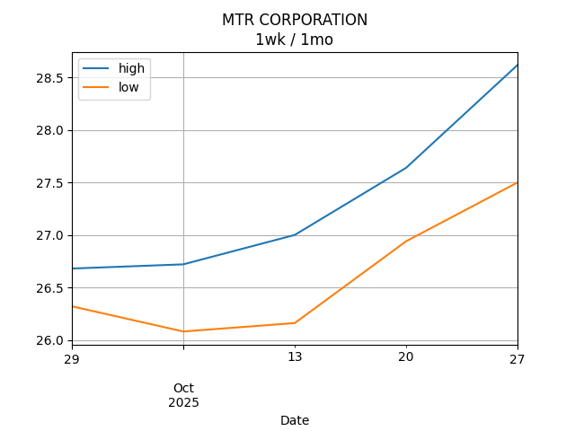

## Net Profit [📈]:
### $5424.60
|type|graph|data|
|:---:|:---:|:---:|
|30m / 1d||<table border="1" class="dataframe"> <thead> <tr style="text-align: center;"> <th>Datetime</th> <th>profit</th> </tr> </thead> <tbody> <tr> <td>01:30</td> <td>4414.6</td> </tr> <tr> <td>02:00</td> <td>4402.6</td> </tr> <tr> <td>02:30</td> <td>4968.6</td> </tr> <tr> <td>03:00</td> <td>5512.6</td> </tr> <tr> <td>03:30</td> <td>5524.6</td> </tr> <tr> <td>04:00</td> <td>5524.6</td> </tr> <tr> <td>04:30</td> <td>5524.6</td> </tr> <tr> <td>05:00</td> <td>5158.6</td> </tr> <tr> <td>05:30</td> <td>5146.6</td> </tr> <tr> <td>06:00</td> <td>5298.6</td> </tr> <tr> <td>06:30</td> <td>5374.6</td> </tr> <tr> <td>07:00</td> <td>5374.6</td> </tr> <tr> <td>07:30</td> <td>5374.6</td> </tr> </tbody></table>|
|1d / 5d||<table border="1" class="dataframe"> <thead> <tr style="text-align: center;"> <th>Date</th> <th>profit</th> </tr> </thead> <tbody> <tr> <td>2025-09-14</td> <td>6930.6</td> </tr> <tr> <td>2025-09-15</td> <td>6892.6</td> </tr> <tr> <td>2025-09-16</td> <td>6626.6</td> </tr> <tr> <td>2025-09-17</td> <td>4692.6</td> </tr> <tr> <td>2025-09-18</td> <td>5524.6</td> </tr> </tbody></table>|
|1wk / 1mo||<table border="1" class="dataframe"> <thead> <tr style="text-align: center;"> <th>Date</th> <th>profit</th> </tr> </thead> <tbody> <tr> <td>2025-08-17</td> <td>1872.14</td> </tr> <tr> <td>2025-08-24</td> <td>-426.28</td> </tr> <tr> <td>2025-08-31</td> <td>722.60</td> </tr> <tr> <td>2025-09-07</td> <td>4062.60</td> </tr> <tr> <td>2025-09-14</td> <td>5524.60</td> </tr> </tbody></table>|
---
## 002100.SZ [📉] [$-1075.40] [-3.55%]:
#### TECON BIO
|price|profit|data|
|:---:|:---:|:---:|
|||<table border="1" class="dataframe"> <thead> <tr style="text-align: center;"> <th>Datetime</th> <th>profit</th> </tr> </thead> <tbody> <tr> <td>09:30</td> <td>-1835.4</td> </tr> <tr> <td>10:00</td> <td>-1797.4</td> </tr> <tr> <td>10:30</td> <td>-1531.4</td> </tr> <tr> <td>11:00</td> <td>-1037.4</td> </tr> <tr> <td>11:30</td> <td>-1075.4</td> </tr> <tr> <td>12:00</td> <td>-1075.4</td> </tr> <tr> <td>12:30</td> <td>-1075.4</td> </tr> <tr> <td>13:00</td> <td>-1341.4</td> </tr> <tr> <td>13:30</td> <td>-1303.4</td> </tr> <tr> <td>14:00</td> <td>-1151.4</td> </tr> <tr> <td>14:30</td> <td>-1075.4</td> </tr> </tbody></table>|
|||<table border="1" class="dataframe"> <thead> <tr style="text-align: center;"> <th>Date</th> <th>profit</th> </tr> </thead> <tbody> <tr> <td>2025-09-15</td> <td>330.6</td> </tr> <tr> <td>2025-09-16</td> <td>292.6</td> </tr> <tr> <td>2025-09-17</td> <td>26.6</td> </tr> <tr> <td>2025-09-18</td> <td>-1607.4</td> </tr> <tr> <td>2025-09-19</td> <td>-1075.4</td> </tr> </tbody></table>|
|||<table border="1" class="dataframe"> <thead> <tr style="text-align: center;"> <th>Date</th> <th>profit</th> </tr> </thead> <tbody> <tr> <td>2025-08-18</td> <td>-5179.4</td> </tr> <tr> <td>2025-08-25</td> <td>-5065.4</td> </tr> <tr> <td>2025-09-01</td> <td>-5027.4</td> </tr> <tr> <td>2025-09-08</td> <td>-1987.4</td> </tr> <tr> <td>2025-09-15</td> <td>-1075.4</td> </tr> </tbody></table>|
---
## 0066.HK [📈] [$6500.00] [10.79%]:
#### MTR CORPORATION
|price|profit|data|
|:---:|:---:|:---:|
|||<table border="1" class="dataframe"> <thead> <tr style="text-align: center;"> <th>Datetime</th> <th>profit</th> </tr> </thead> <tbody> <tr> <td>09:30</td> <td>6250.0</td> </tr> <tr> <td>10:00</td> <td>6200.0</td> </tr> <tr> <td>10:30</td> <td>6500.0</td> </tr> <tr> <td>11:00</td> <td>6550.0</td> </tr> <tr> <td>11:30</td> <td>6600.0</td> </tr> <tr> <td>13:00</td> <td>6500.0</td> </tr> <tr> <td>13:30</td> <td>6450.0</td> </tr> <tr> <td>14:00</td> <td>6450.0</td> </tr> <tr> <td>14:30</td> <td>6450.0</td> </tr> <tr> <td>15:00</td> <td>6400.0</td> </tr> <tr> <td>15:30</td> <td>6500.0</td> </tr> </tbody></table>|
|||<table border="1" class="dataframe"> <thead> <tr style="text-align: center;"> <th>Date</th> <th>profit</th> </tr> </thead> <tbody> <tr> <td>2025-09-15</td> <td>6600.0</td> </tr> <tr> <td>2025-09-16</td> <td>6600.0</td> </tr> <tr> <td>2025-09-17</td> <td>6600.0</td> </tr> <tr> <td>2025-09-18</td> <td>6300.0</td> </tr> <tr> <td>2025-09-19</td> <td>6600.0</td> </tr> </tbody></table>|
|||<table border="1" class="dataframe"> <thead> <tr style="text-align: center;"> <th>Date</th> <th>profit</th> </tr> </thead> <tbody> <tr> <td>2025-08-18</td> <td>7051.54</td> </tr> <tr> <td>2025-08-25</td> <td>4639.12</td> </tr> <tr> <td>2025-09-01</td> <td>5750.00</td> </tr> <tr> <td>2025-09-08</td> <td>6050.00</td> </tr> <tr> <td>2025-09-15</td> <td>6600.00</td> </tr> </tbody></table>|
---
