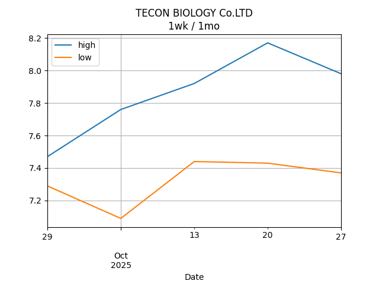
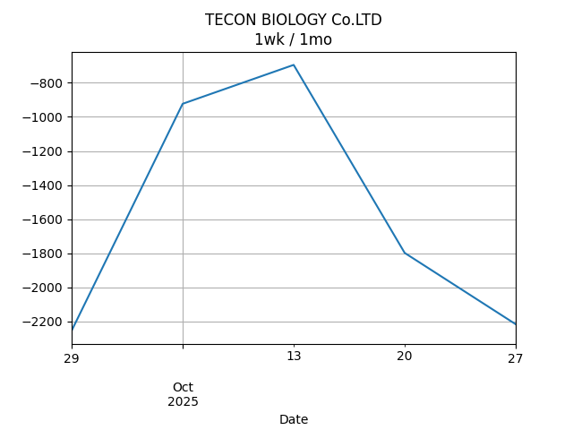

## Net Profit [📈]:
### $3358.60
|type|graph|data|
|:---:|:---:|:---:|
|30m / 1d||<table border="1" class="dataframe"> <thead> <tr style="text-align: center;"> <th>Datetime</th> <th>profit</th> </tr> </thead> <tbody> <tr> <td>01:30</td> <td>3432.6</td> </tr> <tr> <td>02:00</td> <td>3446.6</td> </tr> <tr> <td>02:30</td> <td>3496.6</td> </tr> <tr> <td>03:00</td> <td>3346.6</td> </tr> <tr> <td>03:30</td> <td>3358.6</td> </tr> </tbody></table>|
|1d / 5d||<table border="1" class="dataframe"> <thead> <tr style="text-align: center;"> <th>Date</th> <th>profit</th> </tr> </thead> <tbody> <tr> <td>2025-09-23</td> <td>5050.6</td> </tr> <tr> <td>2025-09-24</td> <td>4156.6</td> </tr> <tr> <td>2025-09-25</td> <td>3992.6</td> </tr> <tr> <td>2025-09-29</td> <td>3358.6</td> </tr> </tbody></table>|
|1wk / 1mo||<table border="1" class="dataframe"> <thead> <tr style="text-align: center;"> <th>Date</th> <th>profit</th> </tr> </thead> <tbody> <tr> <td>2025-08-31</td> <td>722.6</td> </tr> <tr> <td>2025-09-07</td> <td>4062.6</td> </tr> <tr> <td>2025-09-14</td> <td>5524.6</td> </tr> <tr> <td>2025-09-21</td> <td>3992.6</td> </tr> <tr> <td>2025-09-28</td> <td>3358.6</td> </tr> </tbody></table>|
---
## 002100.SZ [📉] [$-2291.40] [-7.57%]:
#### TECON BIOLOGY Co.LTD
|price|profit|data|
|:---:|:---:|:---:|
|||<table border="1" class="dataframe"> <thead> <tr style="text-align: center;"> <th>Datetime</th> <th>profit</th> </tr> </thead> <tbody> <tr> <td>09:30</td> <td>-2367.4</td> </tr> <tr> <td>10:00</td> <td>-2253.4</td> </tr> <tr> <td>10:30</td> <td>-2253.4</td> </tr> <tr> <td>11:00</td> <td>-2253.4</td> </tr> <tr> <td>11:30</td> <td>-2291.4</td> </tr> </tbody></table>|
|||<table border="1" class="dataframe"> <thead> <tr style="text-align: center;"> <th>Date</th> <th>profit</th> </tr> </thead> <tbody> <tr> <td>2025-09-24</td> <td>-999.4</td> </tr> <tr> <td>2025-09-25</td> <td>-1493.4</td> </tr> <tr> <td>2025-09-26</td> <td>-1607.4</td> </tr> <tr> <td>2025-09-30</td> <td>-2291.4</td> </tr> </tbody></table>|
|||<table border="1" class="dataframe"> <thead> <tr style="text-align: center;"> <th>Date</th> <th>profit</th> </tr> </thead> <tbody> <tr> <td>2025-09-01</td> <td>-5027.4</td> </tr> <tr> <td>2025-09-08</td> <td>-1987.4</td> </tr> <tr> <td>2025-09-15</td> <td>-1075.4</td> </tr> <tr> <td>2025-09-22</td> <td>-1607.4</td> </tr> <tr> <td>2025-09-29</td> <td>-2291.4</td> </tr> </tbody></table>|
---
## 0066.HK [📈] [$5650.00] [9.38%]:
#### MTR CORPORATION
|price|profit|data|
|:---:|:---:|:---:|
|||<table border="1" class="dataframe"> <thead> <tr style="text-align: center;"> <th>Datetime</th> <th>profit</th> </tr> </thead> <tbody> <tr> <td>09:30</td> <td>5800.0</td> </tr> <tr> <td>10:00</td> <td>5700.0</td> </tr> <tr> <td>10:30</td> <td>5750.0</td> </tr> <tr> <td>11:00</td> <td>5600.0</td> </tr> <tr> <td>11:30</td> <td>5650.0</td> </tr> </tbody></table>|
|||<table border="1" class="dataframe"> <thead> <tr style="text-align: center;"> <th>Date</th> <th>profit</th> </tr> </thead> <tbody> <tr> <td>2025-09-24</td> <td>6050.0</td> </tr> <tr> <td>2025-09-25</td> <td>5650.0</td> </tr> <tr> <td>2025-09-26</td> <td>5600.0</td> </tr> <tr> <td>2025-09-30</td> <td>5650.0</td> </tr> </tbody></table>|
|||<table border="1" class="dataframe"> <thead> <tr style="text-align: center;"> <th>Date</th> <th>profit</th> </tr> </thead> <tbody> <tr> <td>2025-09-01</td> <td>5750.0</td> </tr> <tr> <td>2025-09-08</td> <td>6050.0</td> </tr> <tr> <td>2025-09-15</td> <td>6600.0</td> </tr> <tr> <td>2025-09-22</td> <td>5600.0</td> </tr> <tr> <td>2025-09-29</td> <td>5650.0</td> </tr> </tbody></table>|
---
