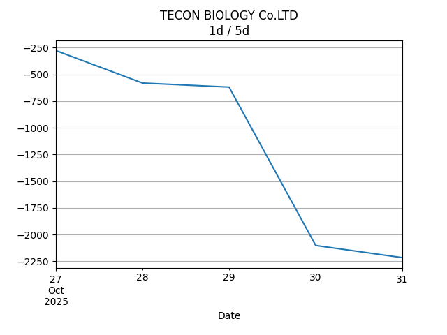

## Net Profit [📈]:
### $2368.60
|type|graph|data|
|:---:|:---:|:---:|
|30m / 1d||<table border="1" class="dataframe"> <thead> <tr style="text-align: center;"> <th>Datetime</th> <th>profit</th> </tr> </thead> <tbody> <tr> <td>01:30</td> <td>2958.6</td> </tr> <tr> <td>02:00</td> <td>2608.6</td> </tr> <tr> <td>02:30</td> <td>2646.6</td> </tr> <tr> <td>03:00</td> <td>2444.6</td> </tr> <tr> <td>03:30</td> <td>2444.6</td> </tr> <tr> <td>04:00</td> <td>2444.6</td> </tr> <tr> <td>04:30</td> <td>2444.6</td> </tr> <tr> <td>05:00</td> <td>2368.6</td> </tr> </tbody></table>|
|1d / 5d||<table border="1" class="dataframe"> <thead> <tr style="text-align: center;"> <th>Date</th> <th>profit</th> </tr> </thead> <tbody> <tr> <td>2025-08-20</td> <td>1675.20</td> </tr> <tr> <td>2025-08-21</td> <td>1872.14</td> </tr> <tr> <td>2025-08-24</td> <td>2145.06</td> </tr> <tr> <td>2025-08-25</td> <td>3376.60</td> </tr> <tr> <td>2025-08-26</td> <td>2368.60</td> </tr> </tbody></table>|
|1wk / 1mo||<table border="1" class="dataframe"> <thead> <tr style="text-align: center;"> <th>Date</th> <th>profit</th> </tr> </thead> <tbody> <tr> <td>2025-07-27</td> <td>3343.15</td> </tr> <tr> <td>2025-08-03</td> <td>3666.99</td> </tr> <tr> <td>2025-08-10</td> <td>1472.30</td> </tr> <tr> <td>2025-08-17</td> <td>1872.14</td> </tr> <tr> <td>2025-08-24</td> <td>2368.60</td> </tr> </tbody></table>|
---
## 002100.SZ [📉] [$-4381.40] [-14.48%]:
#### TECON BIOLOGY Co.LTD
|price|profit|data|
|:---:|:---:|:---:|
|||<table border="1" class="dataframe"> <thead> <tr style="text-align: center;"> <th>Datetime</th> <th>profit</th> </tr> </thead> <tbody> <tr> <td>09:30</td> <td>-4191.4</td> </tr> <tr> <td>10:00</td> <td>-4191.4</td> </tr> <tr> <td>10:30</td> <td>-4153.4</td> </tr> <tr> <td>11:00</td> <td>-4305.4</td> </tr> <tr> <td>11:30</td> <td>-4305.4</td> </tr> <tr> <td>12:00</td> <td>-4305.4</td> </tr> <tr> <td>12:30</td> <td>-4305.4</td> </tr> <tr> <td>13:00</td> <td>-4381.4</td> </tr> </tbody></table>|
|||<table border="1" class="dataframe"> <thead> <tr style="text-align: center;"> <th>Date</th> <th>profit</th> </tr> </thead> <tbody> <tr> <td>2025-08-21</td> <td>-5179.4</td> </tr> <tr> <td>2025-08-22</td> <td>-5179.4</td> </tr> <tr> <td>2025-08-25</td> <td>-5103.4</td> </tr> <tr> <td>2025-08-26</td> <td>-3773.4</td> </tr> <tr> <td>2025-08-27</td> <td>-4381.4</td> </tr> </tbody></table>|
|||<table border="1" class="dataframe"> <thead> <tr style="text-align: center;"> <th>Date</th> <th>profit</th> </tr> </thead> <tbody> <tr> <td>2025-07-28</td> <td>-5825.4</td> </tr> <tr> <td>2025-08-04</td> <td>-5255.4</td> </tr> <tr> <td>2025-08-11</td> <td>-5825.4</td> </tr> <tr> <td>2025-08-18</td> <td>-5179.4</td> </tr> <tr> <td>2025-08-25</td> <td>-4381.4</td> </tr> </tbody></table>|
---
## 0066.HK [📈] [$6750.00] [11.20%]:
#### MTR CORPORATION
|price|profit|data|
|:---:|:---:|:---:|
|||<table border="1" class="dataframe"> <thead> <tr style="text-align: center;"> <th>Datetime</th> <th>profit</th> </tr> </thead> <tbody> <tr> <td>09:30</td> <td>7150.0</td> </tr> <tr> <td>10:00</td> <td>6800.0</td> </tr> <tr> <td>10:30</td> <td>6800.0</td> </tr> <tr> <td>11:00</td> <td>6750.0</td> </tr> <tr> <td>11:30</td> <td>6750.0</td> </tr> <tr> <td>13:00</td> <td>6750.0</td> </tr> </tbody></table>|
|||<table border="1" class="dataframe"> <thead> <tr style="text-align: center;"> <th>Date</th> <th>profit</th> </tr> </thead> <tbody> <tr> <td>2025-08-21</td> <td>6854.60</td> </tr> <tr> <td>2025-08-22</td> <td>7051.54</td> </tr> <tr> <td>2025-08-25</td> <td>7248.46</td> </tr> <tr> <td>2025-08-26</td> <td>7150.00</td> </tr> <tr> <td>2025-08-27</td> <td>6750.00</td> </tr> </tbody></table>|
|||<table border="1" class="dataframe"> <thead> <tr style="text-align: center;"> <th>Date</th> <th>profit</th> </tr> </thead> <tbody> <tr> <td>2025-07-28</td> <td>9168.55</td> </tr> <tr> <td>2025-08-04</td> <td>8922.39</td> </tr> <tr> <td>2025-08-11</td> <td>7297.70</td> </tr> <tr> <td>2025-08-18</td> <td>7051.54</td> </tr> <tr> <td>2025-08-25</td> <td>6750.00</td> </tr> </tbody></table>|
---
