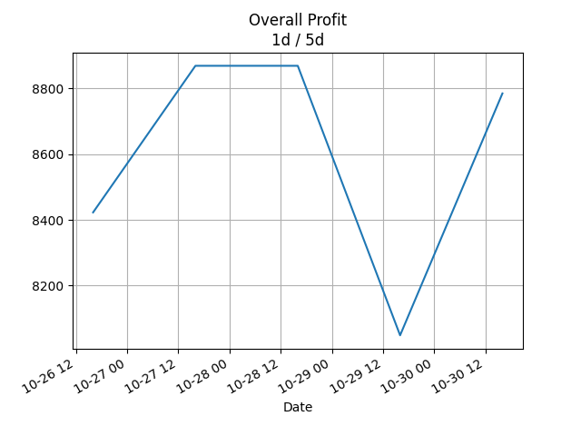
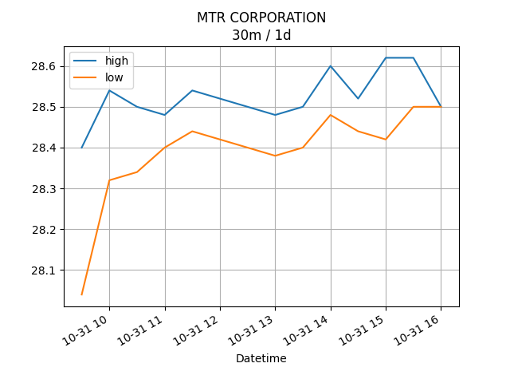

## Net Profit [📈]:
### $909.60
|type|graph|data|
|:---:|:---:|:---:|
|30m / 1d||<table border="1" class="dataframe"> <thead> <tr style="text-align: center;"> <th>Datetime</th> <th>profit</th> </tr> </thead> <tbody> <tr> <td>01:30</td> <td>1349.6</td> </tr> <tr> <td>02:00</td> <td>1474.6</td> </tr> <tr> <td>02:30</td> <td>1235.6</td> </tr> <tr> <td>03:00</td> <td>784.6</td> </tr> <tr> <td>03:30</td> <td>909.6</td> </tr> </tbody></table>|
|1d / 5d||<table border="1" class="dataframe"> <thead> <tr style="text-align: center;"> <th>Date</th> <th>profit</th> </tr> </thead> <tbody> <tr> <td>2025-06-12</td> <td>3354.6</td> </tr> <tr> <td>2025-06-15</td> <td>3126.6</td> </tr> <tr> <td>2025-06-16</td> <td>2653.6</td> </tr> <tr> <td>2025-06-17</td> <td>1963.6</td> </tr> <tr> <td>2025-06-18</td> <td>909.6</td> </tr> </tbody></table>|
|1wk / 1mo||<table border="1" class="dataframe"> <thead> <tr style="text-align: center;"> <th>Date</th> <th>profit</th> </tr> </thead> <tbody> <tr> <td>2025-05-18</td> <td>-3637.14</td> </tr> <tr> <td>2025-05-25</td> <td>1824.26</td> </tr> <tr> <td>2025-06-01</td> <td>1369.44</td> </tr> <tr> <td>2025-06-08</td> <td>3354.60</td> </tr> <tr> <td>2025-06-15</td> <td>909.60</td> </tr> </tbody></table>|
---
## 002100.SZ [📉] [$-6965.40] [-23.02%]:
#### TECON BIOLOGY Co.LTD
|price|profit|data|
|:---:|:---:|:---:|
|||<table border="1" class="dataframe"> <thead> <tr style="text-align: center;"> <th>Datetime</th> <th>profit</th> </tr> </thead> <tbody> <tr> <td>09:30</td> <td>-6775.4</td> </tr> <tr> <td>10:00</td> <td>-6775.4</td> </tr> <tr> <td>10:30</td> <td>-6889.4</td> </tr> <tr> <td>11:00</td> <td>-6965.4</td> </tr> <tr> <td>11:30</td> <td>-6965.4</td> </tr> </tbody></table>|
|||<table border="1" class="dataframe"> <thead> <tr style="text-align: center;"> <th>Date</th> <th>profit</th> </tr> </thead> <tbody> <tr> <td>2025-06-13</td> <td>-6395.4</td> </tr> <tr> <td>2025-06-16</td> <td>-6623.4</td> </tr> <tr> <td>2025-06-17</td> <td>-6471.4</td> </tr> <tr> <td>2025-06-18</td> <td>-6661.4</td> </tr> <tr> <td>2025-06-19</td> <td>-6965.4</td> </tr> </tbody></table>|
|||<table border="1" class="dataframe"> <thead> <tr style="text-align: center;"> <th>Date</th> <th>profit</th> </tr> </thead> <tbody> <tr> <td>2025-05-19</td> <td>-7270.39</td> </tr> <tr> <td>2025-05-26</td> <td>-6425.74</td> </tr> <tr> <td>2025-06-02</td> <td>-7380.56</td> </tr> <tr> <td>2025-06-09</td> <td>-6395.40</td> </tr> <tr> <td>2025-06-16</td> <td>-6965.40</td> </tr> </tbody></table>|
---
## 0066.HK [📈] [$7875.00] [13.07%]:
#### MTR CORPORATION
|price|profit|data|
|:---:|:---:|:---:|
|||<table border="1" class="dataframe"> <thead> <tr style="text-align: center;"> <th>Datetime</th> <th>profit</th> </tr> </thead> <tbody> <tr> <td>09:30</td> <td>8125.0</td> </tr> <tr> <td>10:00</td> <td>8250.0</td> </tr> <tr> <td>10:30</td> <td>8125.0</td> </tr> <tr> <td>11:00</td> <td>7750.0</td> </tr> <tr> <td>11:30</td> <td>7875.0</td> </tr> </tbody></table>|
|||<table border="1" class="dataframe"> <thead> <tr style="text-align: center;"> <th>Date</th> <th>profit</th> </tr> </thead> <tbody> <tr> <td>2025-06-13</td> <td>9750.0</td> </tr> <tr> <td>2025-06-16</td> <td>9750.0</td> </tr> <tr> <td>2025-06-17</td> <td>9125.0</td> </tr> <tr> <td>2025-06-18</td> <td>8625.0</td> </tr> <tr> <td>2025-06-19</td> <td>7875.0</td> </tr> </tbody></table>|
|||<table border="1" class="dataframe"> <thead> <tr style="text-align: center;"> <th>Date</th> <th>profit</th> </tr> </thead> <tbody> <tr> <td>2025-05-19</td> <td>3633.24</td> </tr> <tr> <td>2025-05-26</td> <td>8250.00</td> </tr> <tr> <td>2025-06-02</td> <td>8750.00</td> </tr> <tr> <td>2025-06-09</td> <td>9750.00</td> </tr> <tr> <td>2025-06-16</td> <td>7875.00</td> </tr> </tbody></table>|
---
