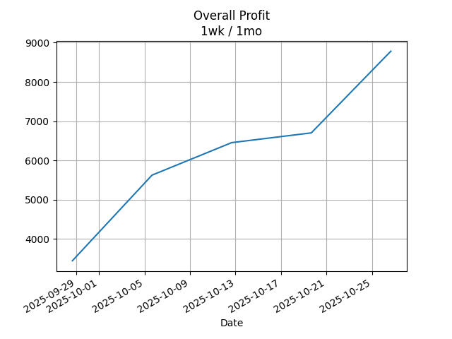

## Net Profit [📈]:
### $8448.60
|type|graph|data|
|:---:|:---:|:---:|
|30m / 1d||<table border="1" class="dataframe"> <thead> <tr style="text-align: center;"> <th>Datetime</th> <th>profit</th> </tr> </thead> <tbody> <tr> <td>01:30</td> <td>7080.6</td> </tr> <tr> <td>02:00</td> <td>7498.6</td> </tr> <tr> <td>02:30</td> <td>7740.6</td> </tr> <tr> <td>03:00</td> <td>8184.6</td> </tr> <tr> <td>03:30</td> <td>8184.6</td> </tr> <tr> <td>04:00</td> <td>8184.6</td> </tr> <tr> <td>04:30</td> <td>8184.6</td> </tr> <tr> <td>05:00</td> <td>8348.6</td> </tr> <tr> <td>05:30</td> <td>7980.6</td> </tr> <tr> <td>06:00</td> <td>8460.6</td> </tr> <tr> <td>06:30</td> <td>8598.6</td> </tr> <tr> <td>07:00</td> <td>8598.6</td> </tr> <tr> <td>07:30</td> <td>8598.6</td> </tr> </tbody></table>|
|1d / 5d||<table border="1" class="dataframe"> <thead> <tr style="text-align: center;"> <th>Date</th> <th>profit</th> </tr> </thead> <tbody> <tr> <td>2025-10-20</td> <td>7468.6</td> </tr> <tr> <td>2025-10-21</td> <td>6468.6</td> </tr> <tr> <td>2025-10-22</td> <td>6616.6</td> </tr> <tr> <td>2025-10-23</td> <td>6702.6</td> </tr> <tr> <td>2025-10-26</td> <td>8422.6</td> </tr> </tbody></table>|
|1wk / 1mo||<table border="1" class="dataframe"> <thead> <tr style="text-align: center;"> <th>Date</th> <th>profit</th> </tr> </thead> <tbody> <tr> <td>2025-09-28</td> <td>3446.6</td> </tr> <tr> <td>2025-10-05</td> <td>5626.6</td> </tr> <tr> <td>2025-10-12</td> <td>6454.6</td> </tr> <tr> <td>2025-10-19</td> <td>6702.6</td> </tr> </tbody></table>|
---
## 002100.SZ [📉] [$-201.40] [-0.67%]:
#### TECON BIOLOGY Co.LTD
|price|profit|data|
|:---:|:---:|:---:|
|||<table border="1" class="dataframe"> <thead> <tr style="text-align: center;"> <th>Datetime</th> <th>profit</th> </tr> </thead> <tbody> <tr> <td>09:30</td> <td>-1569.4</td> </tr> <tr> <td>10:00</td> <td>-1151.4</td> </tr> <tr> <td>10:30</td> <td>-809.4</td> </tr> <tr> <td>11:00</td> <td>-315.4</td> </tr> <tr> <td>11:30</td> <td>-315.4</td> </tr> <tr> <td>12:00</td> <td>-315.4</td> </tr> <tr> <td>12:30</td> <td>-315.4</td> </tr> <tr> <td>13:00</td> <td>-201.4</td> </tr> <tr> <td>13:30</td> <td>-619.4</td> </tr> <tr> <td>14:00</td> <td>-239.4</td> </tr> <tr> <td>14:30</td> <td>-201.4</td> </tr> </tbody></table>|
|||<table border="1" class="dataframe"> <thead> <tr style="text-align: center;"> <th>Date</th> <th>profit</th> </tr> </thead> <tbody> <tr> <td>2025-10-21</td> <td>-581.4</td> </tr> <tr> <td>2025-10-22</td> <td>-1531.4</td> </tr> <tr> <td>2025-10-23</td> <td>-1683.4</td> </tr> <tr> <td>2025-10-24</td> <td>-1797.4</td> </tr> <tr> <td>2025-10-27</td> <td>-277.4</td> </tr> </tbody></table>|
|||<table border="1" class="dataframe"> <thead> <tr style="text-align: center;"> <th>Date</th> <th>profit</th> </tr> </thead> <tbody> <tr> <td>2025-09-29</td> <td>-2253.4</td> </tr> <tr> <td>2025-10-06</td> <td>-923.4</td> </tr> <tr> <td>2025-10-13</td> <td>-695.4</td> </tr> <tr> <td>2025-10-20</td> <td>-1797.4</td> </tr> </tbody></table>|
---
## 0066.HK [📈] [$8650.00] [14.36%]:
#### MTR CORPORATION
|price|profit|data|
|:---:|:---:|:---:|
|||<table border="1" class="dataframe"> <thead> <tr style="text-align: center;"> <th>Datetime</th> <th>profit</th> </tr> </thead> <tbody> <tr> <td>09:30</td> <td>8650.0</td> </tr> <tr> <td>10:00</td> <td>8650.0</td> </tr> <tr> <td>10:30</td> <td>8550.0</td> </tr> <tr> <td>11:00</td> <td>8500.0</td> </tr> <tr> <td>11:30</td> <td>8500.0</td> </tr> <tr> <td>13:00</td> <td>8550.0</td> </tr> <tr> <td>13:30</td> <td>8600.0</td> </tr> <tr> <td>14:00</td> <td>8700.0</td> </tr> <tr> <td>14:30</td> <td>8800.0</td> </tr> <tr> <td>15:00</td> <td>8650.0</td> </tr> <tr> <td>15:30</td> <td>8650.0</td> </tr> </tbody></table>|
|||<table border="1" class="dataframe"> <thead> <tr style="text-align: center;"> <th>Date</th> <th>profit</th> </tr> </thead> <tbody> <tr> <td>2025-10-21</td> <td>8050.0</td> </tr> <tr> <td>2025-10-22</td> <td>8000.0</td> </tr> <tr> <td>2025-10-23</td> <td>8300.0</td> </tr> <tr> <td>2025-10-24</td> <td>8500.0</td> </tr> <tr> <td>2025-10-27</td> <td>8700.0</td> </tr> </tbody></table>|
|||<table border="1" class="dataframe"> <thead> <tr style="text-align: center;"> <th>Date</th> <th>profit</th> </tr> </thead> <tbody> <tr> <td>2025-09-29</td> <td>5700.0</td> </tr> <tr> <td>2025-10-06</td> <td>6550.0</td> </tr> <tr> <td>2025-10-13</td> <td>7150.0</td> </tr> <tr> <td>2025-10-20</td> <td>8500.0</td> </tr> </tbody></table>|
---
